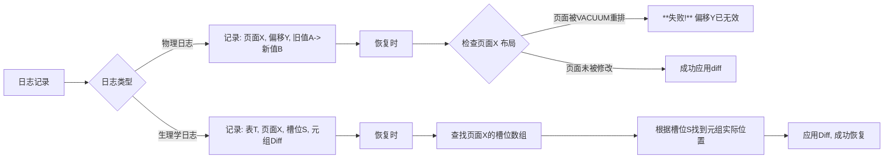

# CMU_15-445_p19


## 第 1 部分

好的，这是对讲义第1部分内容的总结笔记。

### 课程进度与重要告知

*   **课程调整**：上次课程中关于 **MVCC** 的部分已提前结束。这部分内容不会包含在考试中，因此无需深入钻研。
*   **今日主题**：课程将正式进入核心内容——**数据库日志（Database Logging）**。

### 课程与作业安排

*   **作业与项目截止日期**：
    *   **项目三 (Project 3)**：截止日期已延长 **3天**，现为 **11月16日**。
    *   **作业三 (Homework 3)**：截止日期为 **11月13日**。
*   **重要会议日期**：
    *   **11月6日**：关于 Snowflake 的专题讲座。
    *   **11月8日**：现场答疑课（Live Lecture）以及 **期末考试复习**。

### 行业动态与额外资源

*   **数据库讲座**：CMU 安排了一系列数据库相关的讲座，提供了了解行业前沿动向的机会，具体包括：
    *   **今天**：由一位 CMU 校友分享关于 **SDB** 的内容。这是一种尝试替代关系模型的方案，但其底层仍使用 PostgreSQL，主讲人对此持保留态度。
    *   **下周一**：介绍 **Gaia 系统**。这是一个为 **家庭机器人（Thomas Robots）** 构建的数据库。其构建者是数据库领域的顶尖专家，曾担任 **Amazon Aurora** 和 **Redshift** 的首席架构师。

---


## 第 2 部分

### 数据库持久性与崩溃恢复核心机制

#### **核心问题：确保已提交事务的持久性**
- **关键概念**：当数据库系统返回“事务已提交”时，必须保证即使发生系统崩溃，数据也不会丢失。
- **与隔离性的区别**：
  - 之前讨论的**两阶段锁协议**解决的是**隔离性**（防止并发冲突/异常）。
  - 本讲聚焦**持久性**：如何确保崩溃后重启时，已提交事务的修改依然存在。

#### **简单示例：事务T1对数据项A的操作流程**

1. **初始状态**：缓冲区池完全为空，所有数据都在磁盘上。
2. **事务开始**：
   - 读取A → **缺页**，必须从**磁盘**将包含A的**页面**加载到缓冲区池。
3. **写入操作**：
   - 对A的写入实际上是**直接修改缓冲区池中对应的内存页面**（而非立即写入磁盘）。
   - ⚠️ **关键风险**：此时数据仅存在于易失性内存中，崩溃将导致修改丢失。

#### **持久化挑战：脏页与刷盘时机**

- **脏页定义**：缓冲区池中被修改过、但与磁盘版本不一致的页面。
- **自然选择**：事务提交后立即将所有脏页刷回磁盘。
  - **问题**：随机写入（页面分散）性能极差；且若提交后立即崩溃但刷盘未完成，数据仍可能丢失。
- **核心权衡**：既要**保证提交后数据不丢**，又要**维持高性能的随机写入**。

#### **解决方案：预写日志**

- **核心思想**：在**修改实际数据页之前**，先将修改操作记录到日志中。
- **日志写入顺序**：必须确保**日志先于数据页写入磁盘**。
- **崩溃恢复流程**：
  1. 重启数据库。
  2. 扫描日志，找出所有已提交但尚未写入磁盘的事务。
  3. **重做**这些事务的修改，确保数据最终一致。

#### **日志记录格式规范**

每条日志记录包含以下字段：
- **事务ID**：标识所属事务。
- **页面ID**：被修改的数据页。
- **偏移量**：在页面内的修改位置。
- **旧值**：修改前的数据（用于撤销/回滚）。
- **新值**：修改后的数据。

---

### **总结：持久性保障路线图**

```
事务提交 → 写入日志（强制刷盘） → 写入数据页（可延迟） → 崩溃时：
  1. 检查日志中已提交事务。
  2. 重放修改到数据页。
→ 保证数据不丢失。

---


## 第 3 部分

### 崩溃恢复（Crash Recovery）的核心挑战与应对策略

#### 核心问题：已提交事务的持久性保障

- **“已提交”不等于“已落盘”**  
  在数据库管理系统中，事务的**提交（Commit）** 操作仅仅是告诉外部世界“事务已完成”。但在内部，修改可能只作用在**缓冲池（Buffer Pool）** 的内存页上，尚未写入磁盘。

- **灾难场景模拟**  
  假设在事务提交后、数据真正写入磁盘之前，发生了**断电（Power Loss）** 或**系统崩溃**：  
  - **内存丢失**：缓冲池中的所有脏页（Dirty Pages）全部消失。  
  - **虚假承诺**：系统曾向外界保证事务已提交（持久性），但重启后，修改并未实际存在。  
  - **违反ACID中的D（Durability，持久性）**：这是不可接受的。

- **根本矛盾**  
  数据库需要在**性能**（延迟落盘，批量写入）与**一致性**（立即落盘，保证持久）之间找到平衡。崩溃恢复算法正是为了解决这个矛盾而设计。

---

### 恢复算法的两大部分（Two Parts of Recovery Algorithm）

崩溃恢复并非单一技术，而是由**运行时策略**和**启动时处理**共同构成的完整体系。

#### 1. 运行时（Runtime / Normal Operations）—— 预写准备

- **目标**：在正常处理事务时，提前在磁盘上记录**额外的元数据（Metadata）** 和**冗余信息（Redundant Information）**。
- **具体操作**：  
  - 记录事务的**修改历史**（如Write-Ahead Log，WAL）。  
  - 记录**检查点（Checkpoint）**，标记哪些数据已经安全落盘。  
  - 确保 **“日志先行”**：在数据页写入磁盘之前，事务的修改日志必须先写入稳定的存储。  
- **作用**：为未来的崩溃恢复提供“指导手册”，使得恢复算法知道哪些修改已生效、哪些需要回滚、哪些需要重做。

#### 2. 恢复时（Upon Restart / After Crash）—— 状态重建

- **目标**：利用运行时记录的日志与元数据，将数据库恢复到**最后一个一致状态**。
- **具体操作**：  
  - **重做（Redo）**：对已提交但未落盘的事务，重新应用其修改。  
  - **撤销（Undo）**：对未提交事务的修改，进行回滚，消除其影响。  
- **关键保证**：不丢失任何已提交事务的数据，不保留任何未提交事务的脏数据。

---

### 关键概念与术语

| 术语 | 解释 |
|------|------|
| **Buffer Pool** | 内存中的缓存区域，用于暂存磁盘页，提升读写性能。 |
| **Dirty Page** | 在内存中被修改过、但尚未写回磁盘的页面。 |
| **Write-Ahead Log (WAL)** | 预写日志，保证日志先于数据落盘，是崩溃恢复的核心支柱。 |
| **Checkpoint** | 定期记录的同步点，标记所有之前的数据都已安全写入磁盘，从而减少恢复时的工作量。 |
| **Durability** | 持久性，ACID中的D，要求已提交事务的修改必须永久保存。 |

---

### 核心公式（隐含逻辑）

- **恢复正确性条件**：  
  \[
  \text{已提交事务的修改} = \text{重做（Redo）} \quad \text{未提交事务的修改} = \text{撤销（Undo）}
  \]
- **日志写入顺序**：  
  \[
  \text{日志落盘} \Rightarrow \text{数据落盘}
  \]
  只有保证此顺序，才能在崩溃后通过日志重建数据。

---

### 小结与思维导图

```
崩溃恢复 (Crash Recovery)
│
├─ 1. 运行时 (Normal Operations)
│   ├─ 预写日志 (WAL)
│   ├─ 记录检查点 (Checkpoint)
│   └─ 维护事务修改元数据
│
└─ 2. 恢复时 (After Restart)
    ├─ 重做 (Redo)：已提交但未落盘的修改
    └─ 撤销 (Undo)：未提交事务的修改

核心矛盾：性能 vs. 持久性
核心理念：日志先行 (Log Before Data)
```

---


## 第 4 部分

好的，这是对您提供的讲座内容的总结笔记。

### 数据库系统故障恢复：运行时与崩溃恢复概览

#### 1. 故障类型与恢复能力

- **核心概念**：区分数据库系统可能遇到的**故障类型**，理解哪些是可以通过恢复机制处理的。
- **关键术语**：
    - **易失性存储**：通常是 **DRAM**，如缓冲池，断电或系统崩溃后数据丢失。面临的主要风险源。
    - **非易失性存储**：通常是 **磁盘**，数据持久化存储的地方，理论上在故障后数据仍存在。
    - **事务故障**：单个事务执行失败（如违反约束）。
    - **系统崩溃**：操作系统或DBMS因软件错误、硬件问题等非预期停止。
    - **介质故障**：物理存储设备损坏（如磁盘磁头划伤）。这是最严重的故障，通常难以从内部恢复，需要借助备份。
- **恢复能力边界**：数据库的恢复机制主要针对**系统崩溃**设计。它能确保：
    - **原子性**：已提交事务的效果必须永久保存。
    - **持久性**：未提交事务的效果必须被撤销（回滚）。
    - **核心在于**：利用磁盘上对数据页和日志的备份，将数据库恢复到崩溃前的**正确状态**。

#### 2. 故障恢复的核心策略：影子分页 vs. 预写式日志

- **核心概念**：介绍两种主流的、在崩溃后恢复数据库状态的技术。
- **关键术语**：
    1.  **影子分页**：
        *   **原理**：修改数据时，不直接原地覆盖，而是创建一个“影子”副本。整个事务在提交时，通过一个指针切换，原子性地将“新”数据页集合变为当前版本。
        *   **特点**：实现相对简单，但性能开销大（需要复制整个页表，且不支持并发）。
    2.  **预写式日志**：
        *   **原理**：在将修改的数据页写入磁盘（刷新到数据文件）**之前**，必须先将描述该修改的日志记录写入到持久化的日志文件中。
        *   **条件**：任何数据刷盘操作，必须确保其对应的日志记录已经落盘。
        *   **结论**：这是现代数据库系统（如PostgreSQL, MySQL InnoDB, SQL Server）的**理想选择**和事实标准。后续内容会深入探讨原因。
        *   **核心优势**：通过顺序写入日志文件，性能远高于随机写入数据文件；支持更细粒度的恢复和更高的并发性。

#### 3. 运行时与恢复时的职责分工

- **核心概念**：讲座内容分为两部分，分别对应运行时和崩溃恢复后的操作。
- **关键术语**：
    - **运行时（正常操作）**：
        *   **目标**：为未来的快速恢复打下基础。
        *   **动作**：
            - 在内存中执行查询（`SELECT`）、插入（`INSERT`）、更新（`UPDATE`）、删除（`DELETE`）等事务。
            - 管理**缓冲池**，处理**脏数据**（被修改但尚未写回磁盘的数据页）在内存中的状态。
            - **写入日志记录**（如果是使用WAL）。
    - **崩溃恢复时（系统重启后）**：
        *   **目标**：利用之前记录的信息，将数据库还原到崩溃前的“正确”状态。
        *   **动作**：
            - 读取和分析日志，找出所有已提交但数据可能尚未落盘的事务（进行**重做**）。
            - 找出所有未提交且已经对磁盘造成修改的事务（进行**撤销**）。
            - 执行**检查点**操作，以减少恢复时需要扫描的日志量，加快恢复速度。

#### 4. 缓冲池管理与脏数据

- **核心概念**：处理事务对缓冲池中数据页的修改（产生脏页）时，内存管理的策略。
- **关键术语**：
    - **脏页**：缓冲池中，被事务修改过，但与磁盘上数据不一致的页。
    - **刷新策略**（Steal / No-Steal, Force / No-Force）：
        *   **Steal**：允许在事务提交前，将缓冲池中的脏页写回磁盘。
        *   **No-Steal**：禁止在事务提交前写回脏页。这会简化恢复，但限制缓冲池容量。
        *   **Force**：在事务提交时，强制将其修改的所有脏页写回磁盘。
        *   **No-Force**：在事务提交时，不强制写回脏页，允许它们留在缓冲池中。
    - **最佳实践**：现代数据库系统通常采用 `Steal + No-Force` 策略，以最大化吞吐量和减少提交延迟。但这依赖于 **WAL** 来保证恢复的正确性。如果采用 `No-Steal + Force` 则可以简化恢复，但性能很差。

#### 5. 后续内容预告

- **核心概念**：讲座后续会深入 **WAL** 相关的细节。
- **关键术语**：
    - **日志记录格式**：日志中具体包含哪些信息（事务ID、数据页ID、修改前后的值等）。
    - **检查点**：为了减少崩溃后恢复时重放日志的时间，定期记录一个“安全点”，标识哪些事务已经提交且其修改已经落盘。这可以大幅缩短恢复过程。
    - **下周二内容**：在WAL基础上，如何进一步优化和提升恢复算法（可能是Aries算法相关的讲解）。

---


## 第 5 部分

### 数据库中的持久性与故障处理

#### 存储层级与持久性概念

- **易失性存储 (Volatile Storage / DRAM)**：
  - **核心概念**：断电或崩溃后数据丢失。这是系统中速度最快、最常用但最不稳定的存储层。
  - **典型例子**：主存（RAM），事务执行时的所有数据操作首先发生在此处。

- **非易失性存储 (Non-volatile Storage)**：
  - **核心概念**：即使发生崩溃或断电，写入其中的数据仍能保留。
  - **典型例子**：固态硬盘（SSD）、传统硬盘（HDD）。

- **稳定存储 (Stable Storage)**：
  - **核心概念**：一个理论上的理想化概念，声称“无论发生何种灾难，写入的数据永不丢失”。
  - **现实批判**：在物理世界中**不可能真正实现**。例如，硬盘若被物理摧毁（如火烧熔化），数据必然丢失。
  - **实际实现手段**：通过**副本**（Replication）来近似达到稳定存储的效果。
    - **层级1**：单机硬盘级别的镜像（RAID）。
    - **层级2**：跨多台机器的分布式副本。

> **总结**：对于数据库工程师而言，真正需要关注和处理的是**易失性存储与非易失性存储**之间的交互。稳定存储只是一个理论模型。

---

#### 三大类故障类型

| 故障类型 | 核心焦点 | 能否处理？ |
| :--- | :--- | :--- |
| **事务故障 (Transaction Failures)** | 事务自身逻辑或内部状态异常导致必须回滚。 | ✅ **是**，标准机制。 |
| **系统故障 (System Failures)** | 操作系统/数据库进程崩溃（如断电、内核panic），但物理存储完好。 | ✅ **是**，通过日志恢复。 |
| **存储介质故障 (Storage Media Failures)** | 物理硬件损坏（硬盘坏道、芯片烧毁），导致数据不可恢复。 | ❌ **否**，只能通过副本预防。 |

---

#### 事务故障详解

这些故障正是**事务在执行中途被迫中止**的根本原因，也是最常用到的故障处理场景。

- **逻辑错误 (Logical Errors)**：
  - **核心概念**：违反**完整性约束**导致的失败。
  - **具体例子**：试图向一个设置了`UNIQUE`约束的列中插入重复值。数据库系统会**拒绝**该操作，强制中止当前事务，并触发**回滚**以撤销所有已做的更改。

- **内部状态故障 (Internal State Failures)**：
  - **核心概念**：并发控制机制介入导致的强制中止。
  - **具体例子**：使用**两阶段锁（2PL）** 协议时，若检测到**死锁**，数据库系统必须选择牺牲（Kill）一个事务来解除死锁。被牺牲的事务同样需要完全回滚。

> **核心洞察**：之所以要详细区分这些故障，是因为这些被迫中止的事务**可能已经向磁盘写入了部分数据**。恢复机制必须确保这些“脏数据”被彻底清除，保证数据库在崩溃后或事务中止后回到一致状态。

---


## 第 6 部分

## 数据库系统中的故障类型与恢复基础

### 核心概念：为什么我们需要关注故障恢复？

**事务中止**时，如果系统已经将某些数据写入了磁盘（由于各种原因，事务修改可能提前被写盘），**崩溃恢复机制**必须确保：当事务回滚后，那些已写入磁盘的修改痕迹被彻底清除。否则，系统重启后会处于不一致状态。

---

### 软件故障（Software Failures）

- **核心问题**：数据库系统软件本身存在Bug，导致系统崩溃
  - 例如：未捕获的**除零异常**导致整个数据库系统挂掉
  - 操作系统级别的**内核恐慌**（Kernel Panic）
- **后果**：所有易失性状态都会丢失
  - **缓冲池（Buffer Pool）**中的内容
  - **程序计数器**（Program Counter）和**寄存器**（Registers）值
  - 所有内存中的运行时数据

---

### 硬件故障：幂等性假设与分类

#### 关键假设：**故障-停止模型（Fail-Stop Model）**

> **核心原理**：本文课程假设系统崩溃时，**已写入非易失性存储（如磁盘）的数据不会被损坏**。

- **现实与假设的差距**：
  - 机械硬盘断电时，磁头可能刮伤盘片导致数据丢失
  - **固态硬盘（SSD）**的存储单元也可能老化坏掉
  - 实际中完全可能发生数据损坏
- **应对手段**：
  - 使用**校验和（Checksums）**来检测数据是否损坏
  - 如果检测到损坏，单靠校验和无法修复，需要**副本复制（Replication）**来恢复
  - 这种带副本保护的存储称为**稳定存储（Stable Storage）**

#### 分类一：**停电故障（Power Failure）**

- 数据库机器**突然断电**
- 所有内存数据（缓冲池、寄存器等）被**完全抹除**
- 系统必须进行重新引导（Reboot）才能恢复

#### 分类二：**灾难性硬件故障（Cataclysmic Hardware Failure）**

- **本质**：物理层面的硬件问题，数据库系统软件**完全无法自行处理**
  - 数据库不是机器人，不能自己伸手去修硬盘
  - 这是物理硬件层面的破坏
- **后果**：数据库系统**无法、无法、无法**自行修复此类故障
- **解决方案**：**必须由人类管理员介入**
  - 将数据库实例迁移到其他健康硬件上
  - 手动干预恢复过程

### 关键总结表

| 故障类型 | 影响范围 | 能否自动恢复 | 应对策略 |
|---------|---------|------------|---------|
| **软件Bug崩溃** | 内存状态全部丢失 | 通常可以（重启+恢复） | WAL日志回放 |
| **停电** | 内存数据完全清除 | 可以（重启+恢复） | 故障-停止模型 + Crash Recovery |
| **磁盘介质损坏** | 持久化数据可能损坏 | **不能** | 校验和检测 + 副本复制 |
| **灾难性硬件故障** | 物理硬件彻底失效 | **绝对不能** | 人工迁移实例 |

---


## 第 7 部分

## 数据库持久性保障：硬件故障、写入与恢复策略

### 硬件故障与系统不可恢复性

- **核心概念**：数据库系统无法处理所有硬件故障。
    - **第一类故障（可处理）**：如系统崩溃、软件错误、电力中断等，数据库系统可以通过日志、检查点等机制进行恢复。
    - **第二类故障（可处理）**：如磁盘扇区损坏、数据校验错误，部分系统可通过RAID（磁盘阵列）或其他冗余机制处理。
    - **第三类故障（不可处理）**：**物理硬件严重损坏**，如主板烧毁、硬盘物理熔化、RAID控制器彻底失效导致数据丢失。
        - **关键术语**：**物理硬件故障 (Physical Hardware Failure)**。系统无法通过软件自动修复，必须**人工介入**（如更换硬件、迁移实例到新机器）。
        - **重要说明**：数据库系统通常运行在操作系统和硬件抽象层之上，与底层RAID控制器等设备没有直接通信。因此，即使有冗余硬件，如果冗余资源耗尽或硬件彻底失效，系统也无能为力。
    - **恢复策略**：**下一讲重点：分布式数据库与复制机制 (Replication)** 是解决单点硬件故障、避免数据丢失的核心方法。

### 持久性的核心机制：内存与磁盘的交互

- **基础逻辑**：
    - **主要存储位置**：数据最终存储在**磁盘 (Disk)** 上，这是持久化的根本。
    - **性能瓶颈**：磁盘访问速度远慢于**易失性内存 (Volatile Memory)**。
    - **优化策略**：数据库系统总是将数据从磁盘加载到内存中，进行读写操作的**暂存 (Stage)**，以提升性能。
- **写入保证**：
    - **关键操作**：当事务**提交 (Commit)** 时，系统必须确保其所有变更被**写回磁盘**。
    - **写入灵活性**：变更不必写回数据原本所在的旧位置。例如，更新了第1页的A记录，可以将更新后的结果写入第2页。
        - **重要术语**：**新位置写入 (Write to a new page)**。
        - **后果**：系统需要维护**额外的元数据 (Extra Metadata)** 来跟踪：
            - 哪些页面被修改了（脏页）。
            - 是谁修改的（哪个事务）。
            - 哪个事务是否已经提交。
            - 当前磁盘上哪一页才是**正确、最新**的状态（版本调和）。
    - **持久性保证**：系统必须保证，一旦告诉外部世界“事务已提交”，即使在提交后立即发生崩溃，数据也**不会丢失**。
        - **核心公式/算法**：**WAL (Write-Ahead Logging, 预写日志)** 是保证这一点的经典算法。公式可理解为：
            - **Commit = 日志记录先落盘 (Log record flushed to disk) + 数据页可选后落盘 (Data page may or may not be flushed)**
            - 恢复时，先重放提交的日志，再回滚未提交的事务。

---


## 第 8 部分

### 数据库持久性保障：Undo 与 Redo 机制

#### 核心目标：保证数据持久性与一致性
- **关键概念**：当事务提交并告知外部世界成功后，其对数据所做的所有修改必须**持久化**地写入磁盘，确保即使系统崩溃也不会丢失。
- **需要避免的问题**：
  - **部分更新**：事务执行一半崩溃，导致只有部分修改写入磁盘
  - **撕裂写入**：一个数据项（如一个页面）的更新只写了部分字节，导致数据损坏
  - **丢失更新**：两个并发事务的修改互相覆盖，导致其中一个提交的修改丢失

---

### 实现持久性的两大工具：Undo 与 Redo
- **核心概念**：Undo 和 Redo 操作依赖**日志**（log）记录，而非直接操作数据页面。它们如同版本控制中的“差异”（diff），本质上是记录的“逆向操作”与“重做信息”。

#### Undo（撤销）
- **定义**：移除一个**未完成或已中止**事务对数据的所有影响，将数据恢复到事务开始前的状态
- **类比**：类似 MVCC（多版本并发控制）中的**增量存储**（Delta Storage），通过记录“旧值”与“新值”的差异，撤销时只需反向应用这个差异
- **触发场景**：事务执行过程中发生崩溃或被显式中止（`ABORT`）

#### Redo（重做）
- **定义**：重新应用一个**已提交**事务对数据的所有修改，确保这些修改最终反映在磁盘上
- **触发场景**：事务提交后系统崩溃，在恢复时重新执行 Redo，将数据恢复到事务提交时的最新一致状态

---

### Undo/Redo 与内存管理（Buffer Pool）的关系
- **关键依赖**：Undo 和 Redo 的具体实现方式取决于数据库系统如何管理**缓冲池**（Buffer Pool）以及何时将脏页写回磁盘
- **缓冲池策略**：
  - **Steal（偷取）策略**：允许在事务提交前，将未提交事务修改过的脏页写回磁盘
  - **No-Steal（不偷取）策略**：禁止在事务提交前写回脏页，仅允许在提交后写回
- **策略与 Undo/Redo 组合**：
  - **Steal + Redo**：需要 Undo（因为磁盘上可能有未提交事务的修改），同时需要 Redo（确保已提交事务的修改最终持久化）
  - **No-Steal + Redo**：不需要 Undo（磁盘上没有未提交事务的脏数据），但需要 Redo（确保已提交事务的修改写入磁盘）

---

### 示例：事务并发与页面操作流程
假设数据库有两个事务 **T1**（读/写 A）和 **T2**（读/写 B），数据页在初始状态全部位于磁盘（冷缓冲池）。

| 步骤 | 操作 | 缓冲池状态 | 磁盘状态 | 说明 |
|------|------|------------|----------|------|
| 1 | T1 读取 A | 未命中，从磁盘读取页到内存 | 原始页 | 缓冲池从冷到热，获得一个空闲帧 |
| 2 | T1 写入 A | 内存中的页内 A 被更新为**新值 X** | 原始值（未变） | **脏页**产生，内存与磁盘不一致 |
| 3 | T2 读取 B | 页已在内存中（可能和 A 在同一页或不同页），直接读 | 原始值 | 无需磁盘 I/O |
| 4 | T2 写入 B | 内存中的页内 B 被更新为**新值 Y** | 原始值（未变） | 另一个脏页（或同一个页） |
| 5 | T1 提交 | 必须确保 T1 的修改（新值 X）**持久化** | 需写回 | 根据策略，可能立即写回，也可能延迟 |

- **关键问题**：如果系统在 T1 提交后、T2 提交前崩溃，且磁盘上已有 T1 的修改，但 T2 的修改丢失，则需要 Redo T1（确保 T1 的 X 持久）以及可能的 Undo T2（如果 T2 未提交且磁盘上有其脏数据）。

---

### 公式化记忆

- **持久性保证**：`提交事务的修改最终必须位于磁盘`
- **事务原子性**：`中止事务的修改最终必须从磁盘移除`
- **实现工具**：
  - **Undo** = `将未提交事务的脏数据恢复为旧状态`
  - **Redo** = `将已提交事务的修改重新应用到磁盘`

---


## 第 9 部分

### **Steal 与 No-Steal 策略：缓冲池中的脏页写入策略**

在事务与缓冲池交互时，关键问题在于：**当某个事务修改了缓冲池中的页面（脏页），这些脏页何时可以写回磁盘？** 这对**事务的原子性**与**持久性**有直接影响。

#### **问题场景复现**
- **事务 T1** 修改页面中的 `A` 字段，但**尚未提交**。
- **事务 T2** 修改同一页面中的 `B` 字段，且**已经提交**。
- 如果系统在 T2 提交后**立即将整个页面写回磁盘**，则磁盘上同时包含了 T1 的未提交修改（脏数据）与 T2 的已提交修改。
- 若之后 **T1 发生回滚**（abort），磁盘上已经存在 T1 的修改，导致**原子性被破坏**（T1 的修改本应被撤销，却残留在了磁盘上）。

#### **核心问题**
- **何时允许将脏页写回磁盘？**
- **事务提交时，是否必须将其所有脏页立即写回磁盘？** 还是可以延迟？

---

### **两大策略：Steal 与 No-Steal**

这两个策略决定了缓冲池是否允许**将未提交事务修改的脏页**写回磁盘。

#### **1. Steal 策略（偷取策略）**
- **核心概念**：允许缓冲池**在事务提交之前**，将其修改的脏页写回磁盘。
- **全称**：Steal（偷取），意为“偷取”了尚未提交事务的脏页去刷盘。
- **要点**：
    - **优点**：减少缓冲池压力，需要空间时可以直接驱逐脏页。
    - **风险**：如果该事务后来回滚，磁盘上已经存在其修改，需要额外操作（如**回滚补偿**）来撤销这些修改。
- **相关操作**：如果使用 Steal 策略，必须有能力**撤销磁盘上的未提交修改**。这通常通过**日志系统**实现（如 **UNDO 日志**）。

#### **2. No-Steal 策略（不偷取策略）**
- **核心概念**：禁止缓冲池**在事务提交之前**，将其修改的脏页写回磁盘。
- **全称**：No-Steal，意味着缓冲池不会“偷取”未提交事务的脏页。
- **要点**：
    - **优点**：简化了回滚操作，因为事务回滚时，只需要**丢弃缓冲池中的脏页**即可（磁盘上没有任何未提交的修改）。
    - **缺点**：缓冲池可能需要更大空间，因为**脏页必须一直保留在内存中**，直到事务提交后才能刷盘。
    - **限制**：如果事务修改了大量页面，缓冲池可能被撑满。

---

### **事务提交时的刷盘要求**

事务提交必须保证其修改**持久化**（Durability），但这**不要求**在提交瞬间将所有脏页写回磁盘。

- **可能的情况**：
    - **强制刷盘**：提交时立即将所有脏页写入磁盘（**Force 策略**，与 Steal 无关）。
    - **延迟刷盘**：提交时仅将**日志记录**写入磁盘（Write-Ahead Logging），脏页可以后续再写回磁盘。即使系统崩溃，可以通过日志恢复数据。

#### **关键公式/规则**

- **WAL 规则（Write-Ahead Logging）**：
    - **UNDO 日志**：在脏页写回磁盘**之前**，必须先将对应的 UNDO 日志写入磁盘（可用于回滚）。
    - **REDO 日志**：在事务提交时，必须将 REDO 日志写入磁盘，但脏页可以在提交后**再写回磁盘**（用于崩溃恢复时重做已提交事务的修改）。

---

### **总结对比**

| 策略 | 是否允许提交前写脏页？ | 回滚难度 | 缓冲池压力 | 典型应用 |
|------|----------------------|--------|-----------|---------|
| **Steal** | ✅ 是 | **高**（需 UNDO 日志撤销磁盘修改） | **低**（脏页可随时驱逐） | 大多数工业级数据库（如 PostgreSQL, InnoDB） |
| **No-Steal** | ❌ 否 | **低**（只需丢弃内存脏页） | **高**（脏页必须驻留内存） | 内存数据库或特定简化实现 |

#### **最终结论**
- 数据库系统通常**同时使用 Steal + Force / No-Force 组合**，配合 **Write-Ahead Logging（WAL）** 来平衡性能与正确性。
- **Steal 策略**使得缓冲池管理更灵活，但增加了回滚恢复的复杂度；**No-Steal 策略**简化回滚，但可能导致内存溢出。
- **理解这些策略是设计支持事务的缓冲池引擎的关键**，直接决定了系统的崩溃恢复逻辑与并发控制方案。

---


## 第 10 部分

### 缓存池策略：事务感知与持久化保证

本部分深入讨论数据库系统如何通过**缓存池驱逐策略**来协调**事务并发**与**数据持久化**的需求。核心在于决定**脏页（Dirty Page）**（被未提交事务修改的页）何时能被写回磁盘。

#### 1. **Steal 策略：是否允许“偷走”未提交事务的脏页？**

此策略决定了：当一个未提交事务修改了缓存池中的某个页（将其变为脏页）时，系统是否**允许**将该脏页写回磁盘，即使该事务尚未提交。

*   **Steal (偷窃)**：**允许**。系统可以将未提交事务修改过的“脏页”写回磁盘。这是高性能系统的常见选择，因为它允许缓存池在空间紧张时驱逐任何页，无论其状态如何。
    *   **核心权衡**：提升了缓存池的内存利用率，但增加了恢复机制的复杂度。如果事务在脏页被写入磁盘后回滚，系统必须有能力撤销磁盘上已写入的修改（即 **UNDO 操作**）。
*   **No-Steal (禁止偷窃)**：**禁止**。任何被未提交事务修改的脏页**不得**离开缓存池，即不能写回磁盘。
    *   **核心权衡**：简化了事务回滚逻辑（因为磁盘上总是未修改的旧版本），但**严重限制**了缓存池的容量。如果一个大事务修改了大量页，缓存池可能被填满，导致其他事务无法运行。

#### 2. **Force 策略：是否必须在提交前“强制”刷新所有修改？**

此策略决定了：当一个事务提交时，系统是否**要求**将该事务修改过的所有脏页**立即**写入磁盘，然后才向客户端返回“提交成功”。

*   **Force (强制)**：**要求**。在提交操作返回成功之前，必须将该事务所做的所有修改（脏页）**强制刷新**（Flush）到非易失性存储（磁盘）。
    *   **核心权衡**：极大地简化了崩溃恢复逻辑（因为提交即意味着数据已在磁盘上）。然而，这是**巨大的性能瓶颈**。每次提交都需要执行昂贵的磁盘随机写操作（随机 I/O），特别是在高频事务场景下，会导致延迟激增。提问者提到的“巨大瓶颈”正是这个策略的核心痛点。
*   **No-Force (非强制)**：**不要求**。允许事务提交时，其修改的脏页仍然留在缓存池中，稍后时机成熟（如缓存驱逐或检查点）再写回磁盘。
    *   **核心权衡**：性能优秀，因为提交操作非常快（仅记录一个日志）。但崩溃恢复时，需要能够重现（REDO）这些尚未写入磁盘的修改，以确保事务的持久性。

#### 3. **策略组合与现实应用**

DBMS 的选择通常落在上述四种极端组合之间。在讲座的示例中，它们演示了 **No-Steal + Force** 的组合。

*   **No-Steal + Force 组合示例**：
    *   `T1` 读取页 `A` (从磁盘加载到缓存池)。
    *   `T1` 写入页 `A` (将 `A` 更新为 `3`)，页 `A` 变为脏页。
    *   在 `T1` **提交**之前，因为 **No-Steal**，脏页 `A` **不能**被写回磁盘。
    *   当 `T1` 提交时，因为 **Force**，系统必须将脏页 `A` **立即**写回磁盘。
    *   `T1` 提交成功通知在磁盘写入完成后才会发送。

#### 4. **核心公式与性能模型**

数据库系统的持久化与性能模型可以用一个简单的组合公式来概括：

`系统行为 = (Steal 或 No-Steal) 与 (Force 或 No-Force)`

*   **Steal + No-Force**： **最普遍、最高性能**的组合。它需要复杂的 **ARIES 恢复算法**（同时支持 UNDO 和 REDO）。
*   **No-Steal + Force**： **最简单、最慢**的组合。适用于对恢复要求极简单但吞吐量要求不高的场景。

---


## 第 11 部分

### 强制策略与事务执行的冲突：No-Steal + Force 深入解析

#### 核心困境：未提交事务的脏页不能写入磁盘

- **核心概念：No-Steal 与 Force 策略组合**
    - **No-Steal**：事务**未提交**前，其修改过的页面（脏页）**不允许被写入磁盘**。
    - **Force**：事务**提交时**，其所有修改过的页面必须**立即强制刷新**到磁盘，才能向外部宣告提交成功。
    - **组合效应**：这种策略虽然保证回滚简单，但会导致并发事务间的**严重写冲突**。

#### 场景重现：并发事务修改同一页面

- **初始状态**：磁盘上有页面 `A` 和 `B`。事务 `T1` 和 `T2` 先后修改了同一页面。
- **执行步骤**：
    1.  **T1 启动**：从磁盘读取页面 `A` 到缓冲池。
    2.  **T1 修改**：在缓冲池中将 `A` 的值更新为 `3`（**脏页产生**）。此时 `T1` 尚未提交。
    3.  **上下文切换至 T2**：`T2` 开始执行。
    4.  **T2 读取 B**：从磁盘读取页面 `B`，正常。
    5.  **T2 修改 B**：在缓冲池中修改 `B`（**脏页产生**）。
    6.  **T2 请求提交**：根据 **Force 策略**，`T2` 必须将**所有**被自己修改的脏页（即页面 `B`）写入磁盘。
    7.  **问题爆发**：假设 `T1` 和 `T2` 修改的是**同一个页面**（例如页面 `X`）。根据 **No-Steal 策略**，页面 `X` 上 `T1`（未提交事务）的修改不能写入磁盘。但 `T2` 提交时又必须写入磁盘。产生了不可调和的矛盾。

#### 解决方案：页面级分离技术 (Page-Level Shadowing / Copy-on-Write)

- **关键术语**：**Copy-on-Write (写时复制)**、**页面级副本 (Shadow Page)**
- **解决方案**：为了在 **No-Steal + Force** 下处理并发修改同一页面的场景，需要为**当前写入事务**（在本例中是 `T2`）创建一个**原始页面的副本**。
- **逻辑步骤**：
    1.  将原始页面（含有 `T1` 的未提交修改）**复制** 成一个新的页面副本。
    2.  只在新副本上**应用**当前提交事务 (`T2`) 的修改。
    3.  将这个**只包含 `T2` 修改的副本**写入磁盘。
    4.  告知外部世界 `T2` 提交成功。
    5.  当 `T1` 恢复执行时，如果后续需要**回滚**，因为其原始修改仍保留在缓冲池的原始页面上，且原始页面上有**撤销日志 (Undo Log)**，所以回滚非常简单。

#### 讨论与权衡：群组提交 (Group Commit) 的局限性

- **提议：群组提交 (Group Commit)**
    - 学生提议：能否设置一个**屏障**或**计数器**，等到修改过同一页面的**所有事务都提交**后，再将这个页面的最终结果一次性地批量刷新到磁盘？
- **致命缺陷：长事务阻塞 (Long Transaction Blocking)**
    - 假设 `T1` 是一个**长达一小时的长事务**，而 `T2` 仅需**1毫秒**就能完成并提交。
    - 如果实施群组提交，`T2` 必须**等待长达一小时**，直到 `T1` 提交后，才能将共享页面写入磁盘并返回给客户端成功结果。这在实际系统中是完全不可接受的。
- **结论**：No-Steal + Force 策略的**优势**在于回滚简单，**代价**是：
    - 在并发修改同一页面时需要进行**昂贵的页面复制**操作。
    - 在提交时需要**额外的磁盘 I/O 和写入放大**。
    - 无法通过简单的“等待所有修改者提交”来优雅解决，会导致严重的**长事务阻塞**问题。

---


## 第 12 部分

### **事务撤销与缓冲池策略：No-Steal + Force 的局限性**

#### **核心概念：No-Steal 与 Force 策略**

- **No-Steal 策略**：在事务提交**之前**，**不允许**将**脏页**（已修改但未提交的页）从缓冲池写入磁盘。
- **Force 策略**：在事务提交**时**，**强制**将所有脏页立即写入磁盘。
- **组合结果**：**No-Steal + Force** 构成了最直观但最**不实用**的事务管理方案。

#### **No-Steal + Force 的显著优势**

- **回滚极其简单**：由于脏页从未在提交前写入磁盘，**撤销事务**只需**丢弃**缓冲池中的脏副本，无需任何额外的磁盘I/O或恢复机制。
- **实现容易**：逻辑直接，代码量少，是教科书式的理想化起点。

#### **No-Steal + Force 的致命弱点**

- **性能瓶颈在提交路径**：
  - 事务提交时（`commit`），必须执行**昂贵的磁盘写入**，将所有脏页落盘。这直接位于**关键路径**上，会**阻塞**提交进程，降低系统吞吐量。

- **内存爆炸与事务失败**（最核心问题）：
  - **问题描述**：**任何事务都不能修改超过缓冲池大小的数据量**。
  - **原理**：No-Steal 策略意味着缓冲池变满后，无法淘汰任何脏页。一旦事务需要访问一个新页面，但缓冲池已满且全是该事务的脏页，系统只能**中止**该事务。
  - **后果**：例如，数据库有1 GB数据，但缓冲池只有500 MB。一个试图更新600 MB数据的事务，在更新完500 MB后将**被迫中止**，无法完成。
  - **根本限制**：**脏页数量上限 = 缓冲池容量**。事务的工作集大小不能超过物理内存。

#### **本方案的最终定位**

- **纯理论骨架**：此方案仅用于**演示设计决策的极端影响**。
- **实际零采用**：任何生产级数据库引擎都不会使用 No-Steal + Force。
- **学习价值**：通过理解其弊端，为理解最优策略 **Steal + No-Force** 铺平道路。

---


## 第 13 部分

## 无Steal/Force策略的实现与挑战

### 核心概念：无Steal/Force策略

**无Steal/Force**是一种数据库事务管理策略，它避免了崩溃恢复中复杂的回滚和重做操作。

- **无Steal**：事务提交前，不允许将未提交的脏页写出到磁盘（避免回滚）
- **Force**：事务提交时，必须将所有修改强制刷写到磁盘（确保持久性）

### 内存限制下的困境

**「无法处理超大数据集」**

- 若事务修改的数据量超过内存容量，无法将所有修改保留在内存中直到提交
- **核心瓶颈**：必须将所有脏页保存在内存，否则违背"无Steal"原则
- 对于涉及数十亿数据点的事务（如全局更新），此策略直接不可行

### 磁盘写入放大问题

**「SSD寿命杀手」**

- **现象**：多个事务连续修改同一页面，导致同一页面被反复刷写到磁盘
- **示例**：
  - T1修改页面P → 刷写到磁盘
  - T2修改同一页面P → 再次刷写到磁盘
  - 每次提交都触发完整页面写出
- **SSD写入寿命**：现代SSD的擦写次数约10万次，大量重复写入会加速损坏

### 内存缓冲池中的实际行为与矛盾

```
事务T1: 读取页面P → 修改P → 提交(Force写出P到磁盘)
事务T2: 读取页面P → 修改P → 提交(再次Force写出P到磁盘)
```

**问题**：即使T2只修改了一个字节，也必须写出整个页面（通常4KB或8KB），导致严重的写入放大。

### Shadow Paging：一种改进尝试

**实现**：基于**无Steal/Force**的变体，试图缓解上述问题

**工作原理**：
- 维护数据库的"影子副本"（shadow copy）
- 事务修改时，创建新页面的副本，而不是覆盖原页面
- 提交时，通过原子切换根指针完成事务

**优点**：
- 崩溃恢复简单（直接丢弃影子页即可）

**缺点**：
- 空间开销大（需要维护两套页面）
- 仍然存在写入放大
- 页面位置不连续，性能差
- 实际数据库系统很少使用（仅极少数实现）

### 关键结论

**无Steal/Force在实际系统中不可行**，主要因为：

1. **内存限制**：事务无法修改超过内存容量的数据
2. **写入放大**：重复写出同一页面严重损害SSD寿命
3. **性能低下**：每次提交都需要同步刷写所有脏页

**解决方案转折**：这正是为什么我们需要**Write-Ahead Logging (WAL)**——它允许"Steal"（写出未提交的脏页）同时保证原子性，通过日志实现崩溃恢复。

---


## 第 14 部分

### 影子分页（Shadow Paging）机制详解

#### 核心概念与动机
- **影子分页**是一种基于**页面级**的数据库事务管理技术，其核心思想是**维护数据库的两个版本**：
    - **当前页（Current Page）**：存放所有已提交事务的修改结果。
    - **影子页（Shadow Page）**：在事务开始时创建的快照副本，用于记录事务开始前的状态。
- **与MVCC的区别**：
    - **MVCC**（多版本并发控制）通常在**元组（Tuple）级别**管理多个版本。
    - **影子分页**在**页面（Page）级别**管理版本，粒度更大，适用于不同的系统设计场景。
- **核心目标**：解决事务提交和崩溃恢复时的原子性问题，避免“部分写入”导致的数据不一致。

#### 事务提交的原子性与崩溃恢复
- **问题背景**：
    - 当一个事务执行 `COMMIT` 后，系统需要将所有变更写入磁盘。但写入操作不是原子性的（硬件通常只保证4KB写入的原子性）。
    - 如果系统在写入部分页面后崩溃，或者提交确认消息因网络/主机崩溃而丢失，系统如何保证数据一致性？
- **数据库系统的视角**：
    - **关键判断标准**：事务是否已将**所有变更安全写入磁盘**。
    - **外部确认不可靠**：数据库无法保证应用程序一定能收到“提交成功”的网络消息。即使应用未收到确认，磁盘上的数据可能已经是提交后的正确状态。
    - **应用层的责任**：确定“我是否真的提交成功了”是**应用程序**的职责。数据库只保证：一旦数据落盘，它就是提交事务的最终结果。
- **崩溃恢复策略**：
    - 如果事务在写入部分页面后崩溃，系统必须能**识别并回滚未完成的更改**，恢复到事务开始前的状态。
    - **影子分页**通过维护两个页面版本，天然支持这种恢复：只需丢弃当前页，回退到影子页即可。

#### 影子分页的工作原理
- **主版本（Master Version）**：仅包含来自**已提交事务**的更改。
- **事务执行流程**：
    1. **事务开始时**：
        - 系统为当前事务创建一个**影子页表**，指向事务开始时的页面快照（即未修改的原始页面）。
        - 当事务需要修改某个页面时，系统**不直接覆盖原页面**，而是：
            - 分配一个新的空闲页面。
            - 将原始页面内容复制到新页面（或通过Copy-on-Write技术延迟复制）。
            - 在影子页表中更新指针，指向新页面。
    2. **事务提交时**：
        - 系统将**所有修改过的页面**（当前页）**原子地写入磁盘**。
        - 切换主页表指针，使其指向新的当前页集合。
        - 原来的影子页变为空闲页，可供后续使用。
    3. **事务回滚或崩溃时**：
        - 系统只需**丢弃当前页表**，**恢复影子页表**为主版本即可。
        - 所有未提交的修改被自动撤销，系统回到事务开始前的状态。

#### 重要特性与对比
- **原子性实现**：提交时，只需原子地切换一个**磁盘上的根指针**（指向主页表），而非写入大量日志。这提供了一个天然的原子提交点。
- **与WAL（预写式日志）的对比**：
    - **影子分页**：无需日志，通过页面级Copy-on-Write和指针切换实现原子性。恢复简单但可能有**写放大**问题（修改一个元组可能需要写入整个页面）。
    - **WAL**：记录日志，允许原地更新页面，写开销更小，但恢复需要重放日志。
- **优点**：
    - 恢复速度快，无需重放日志。
    - 天然支持非易失性存储（NVM）的字节级寻址优化。
- **缺点**：
    - 页面级Copy-on-Write导致写放大，性能开销较大。
    - 回收空闲页面和垃圾收集需要额外机制（如：空闲列表、垃圾回收扫描）。

---


## 第 15 部分

### 影子分页系统 (Shadow Paging System) 核心笔记

#### **核心概念：** **基于页面的 MVCC (Multi-Version Concurrency Control)**
- **原理：** 与元组级别的 MVCC 思想类似，影子分页将版本控制提升到了 **数据页级别**。
- **主版本 (Master Version)：** 数据库的“稳定版”，仅包含已提交事务的更改。这是系统在崩溃恢复后看到的版本。
- **影子版本 (Shadow Version)：** 一个 **临时工作区**。在修改数据页之前，先复制一份源页到影子版本中，然后在影子副本上应用更改。这类似于一个 **暂存区 (Staging Area)**。

#### **关键机制：原子指针交换 (Atomic Pointer Swap)**
- **根指针 (Root Pointer)：** 系统维护一个特殊的根指针页，它指向当前有效的版本（主版本或影子版本）。
- **提交过程：**
    1. 确保所有对影子副本的写入操作（脏页）都被 **刷新 (Flush)** 并持久化到磁盘。
    2. 确认写入持久化后，执行一个 **原子操作**（如 Compare-and-Swap），将 **根指针** 从指向“主版本” **切换** 为指向“新影子版本”。
    3. 切换完成后，影子版本瞬间成为新的主版本。
- **解决问题：** 完美避免了 **撕裂写 (Torn Writes)** 问题。因为提交时，所有更改数据都已安全落盘，原子指针交换确保了整个提交过程的原子性。

#### **工作原理示例 (读/写/崩溃恢复)**
- **初始状态：** 数据库根指针指向一个主页面表 (Master Page Table)，主页面表指向磁盘上的原始物理页。
- **新事务开始：**
    1. 创建一个新的 **影子页面表 (Shadow Page Table)**，初始时它指向与主页面表相同的物理页。
    2. 之后，所有事务的读写操作都只对影子页面表及它指向的页面进行（主版本保持只读）。
- **写操作：**
    1. 当要修改某个数据页时，系统先在磁盘上分配一个新的空页。
    2. **复制原页内容** 到新页。
    3. **更新影子页面表**，使其指向这个新的物理页。
    4. 在这新页上 **应用更改**。
    - *图示：* 修改 Page 4 -> 复制新页，影子表指向新页；修改 Page 2 -> 复制新页，影子表指向新页。
- **崩溃恢复 (Crash Recovery)：**
    - 如果系统在提交前崩溃，数据库根指针仍然指向 **主页面表**（主版本）。
    - 因此，所有在影子版本中未完成、未持久化的修改都 **不可见**，系统状态如同任何事情都未发生过。这保证了“**无强制写入 (No-Steal Force)**”策略。
- **提交 (Commit)：**
    1. 将影子版本中所有新创建的、修改过的脏页 **强制刷新 (Flush)** 到磁盘。
    2. 执行 **原子比较并交换 (Compare-and-Swap)** 操作：将磁盘上的 **数据库根指针** 更新为指向新的影子页面表。
    3. 原子操作成功后，新影子版本成为主版本。

#### **关键公式/算法：**
- **提交原子性保证：**
    - `Atomic_Swap(Root_Pointer, Shadow_Page_Table_Address)`
    - **解释：** 该操作是原子的，要么成功更新指针，要么什么也不做，从而保证提交的原子性。

---


## 第 16 部分

## Shadow Paging 提交与恢复机制

### **原子提交的核心：Compare-and-Swap 根指针**
- **核心操作**：通过 **Compare-and-Swap (CAS)** 原子操作更新磁盘上的 **根指针（Root Pointer）**，使其指向新的影子页表（Shadow Page Table）或主页表（Master Page Table）。
- **原子性保证**：对于 **4KB 页面**，硬件保证写操作是**原子的**（Atomic on Hardware）。这意味着根指针的更新要么完全成功，要么完全失败，不会出现中间状态。
- **提交逻辑**：
  - 如果 CAS 操作成功且未崩溃，新的根指针生效，事务的修改对外可见。
  - 如果 CAS 操作失败或崩溃，根指针仍指向旧的主页表，所有中间修改（如影子页表中的脏数据）从未被外界看到，事务如同从未发生。

### **关键流程：Flush 与提交顺序**
- **先刷盘，后更新根指针**：
  - 必须先将影子页表及其引用的所有修改**刷出到磁盘（Flush to Disk）**，确保数据持久化。
  - **根指针的更新是最后一步** —— 只有将目录页（Directory Page）的引用也刷出到磁盘后，才执行 CAS 修改根指针。
  - **为什么不需要原子化整个目录页？** 因为如果刷目录页时崩溃，根指针仍指向旧版本，没有任何影响。只有根指针的 CAS 是最终可见性开关。

### **崩溃恢复与回滚的简易性**

#### **崩溃恢复（Crash Recovery）**
- **零额外工作**：系统重启后，根指针始终指向**最新的主版本（Latest Master Version）**。因为只有成功提交的事务才会更新根指针，未提交的修改全部未被记录。
- **一致性保证**：恢复时无需扫描日志、重做或撤销操作。系统直接从根指针加载一致的数据快照。

#### **回滚（Rollback）**
- **简单操作**：如果事务需要回滚（非崩溃场景），只需：
  1. **丢弃影子页表**（Shadow Page Table）及其所有修改。
  2. 为下一个事务创建新的影子页表。
- **无额外清理**：旧的主页表保持不变，无需撤销已写入的脏数据。

### **碎片化问题（Fragmentation）**
- **问题承认**：影子页表会导致**大量碎片化（Fragmentation）**，因为每次修改都会创建新页面副本，旧页面变为垃圾。
- **后续解决方案**：需要引入**垃圾回收机制（Garbage Collection）**，在提交后异步清理旧的主页表和不再使用的页面。

### **数据可见性与一致性快照**
- **一致性快照**：影子页表本质上是数据库的一个**一致性快照（Consistent Snapshot）**。整个数据库的修改在一个原子提交点下全部生效，读者永远看到完整一致的视图。
- **最新主版本**：提交后的根指针指向的版本就是**最新的主版本**，任何后续事务都基于此版本开始。

---


## 第 17 部分

# 影子分页（Shadow Paging）技术详解

## 核心概念与背景

**影子分页**是IBM在1970年代为System R（首个关系型数据库研究项目）发明的技术，但**在1980年代的DB2商业版本中被废弃**，转而采用**预写日志（Write-Ahead Logging, WAL）**方法。

- **基本思想**：数据库维护两个页面表——**当前页面表**（current page table）和**影子页面表**（shadow page table）
- **原子提交机制**：
  - 事务开始时，复制当前页面表作为影子页面表
  - 事务修改时，将修改写入新页面（**写时复制，Copy-on-Write**）
  - 提交时，**原子切换**页面表指针指向新的页面表
- **关键优势**：理论上不需要重做日志（redo log），因为所有提交的修改都已写入稳定存储

## 主要问题与局限性

### 1. **复制整个页面表的开销巨大**
- 每次事务都需要复制完整的页面表，性能成本极高
- **优化方案**：使用**B+树结构或树形结构**管理页面表（如LMDB现代实现的做法）
  - 数据库根节点作为树的根
  - 修改或新建页面时，只复制树中受影响的分支
  - 但维护这些"核心屏幕版本"仍然需要大量额外工作

### 2. **提交开销非常高**
提交操作需要刷新（flush）以下内容到磁盘：
1. **所有修改过的页面**
2. **页面表本身**
3. **根节点指针**

这个**三次刷新**过程导致提交延迟显著增加。

### 3. **磁盘碎片化问题**
假设初始数据是**批量加载**（bulk loaded），页面按主键顺序连续排列，索引聚类良好。但运行事务后：

- **产生空洞**：修改数据时，旧页面位置变成空洞
- **新页面散布**：未来创建的页面会填入这些空洞，打乱数据连续性
- **顺序扫描性能下降**：
  ```
  顺序扫描时的问题：
  - 需要跳过不可见的页面（其他事务活跃中）
  - 需要跳过已废弃的空洞（中止事务导致）
  - 产生更多随机I/O读取，而不是连续读取
  ```

### 4. **垃圾回收复杂**
- 中止事务产生的页面需要特殊回收机制
- 在扫描过程中需要判断页面可见性，增加额外开销

## 影子分页 vs 预写日志（WAL）对比

| 特性 | 影子分页 | 预写日志 |
|------|---------|---------|
| **提交开销** | 高（需刷新页面+表+根） | 低（只需刷新日志记录） |
| **磁盘布局** | 碎片化严重 | 更紧凑（in-place更新） |
| **顺序扫描** | 差（需跳过空洞/不可见页面） | 好（数据连续） |
| **实现复杂度** | 复杂（页面表管理、版本控制） | 相对简单 |
| **恢复速度** | 快（无需重做已提交事务） | 需重做/撤销操作 |
| **并发控制** | 困难（需管理多个版本指针） | 较容易（通过日志序列号） |

## 遗留系统与现代应用

尽管主流数据库（如DB2、PostgreSQL、MySQL）已放弃影子分页，但**某些嵌入式数据库**仍采用类似技术：

- **LMDB（Lightning Memory-Mapped Database）**：使用基于B+树的写时复制机制管理页面，本质上是影子分页的现代演进
- 适用于**读密集、写少**的场景，因为写操作的开销可以接受

## 核心公式与算法要点

**原子提交操作**公式表示：
```
原子提交 = 
  1. flush(所有修改页面) → 确保数据持久
  2. flush(新页面表) → 确保映射持久
  3. 原子切换根指针 → 确保可见性原子
```

**写时复制（Copy-on-Write, CoW）**：
- 修改页面 $P_{old}$ 时：
  - 分配新页面 $P_{new}$
  - 将 $P_{old}$ 内容复制到 $P_{new}$
  - 在 $P_{new}$ 上应用修改
  - 页面表更新：${PageTable}[P_{old}] \rightarrow P_{new}$

**碎片化对扫描性能的影响**：
- 顺序扫描时间 $\propto$ 总磁盘块数（包括空洞）
- 实际有效数据扫描时间 $\propto$ 有效数据块数
- 碎片化导致I/O放大因子 = $\frac{\text{总读取块数}}{\text{有效数据块数}}$，通常远大于1

---


## 第 18 部分

## 影子分页（Shadow Paging）：数据库与存储系统中的一种错误恢复与并发控制机制

### 核心概念与工作原理

- **影子分页**是一种基于页面的、**无日志（No-WAL）** 的数据库崩溃恢复与事务管理技术。其核心思想是：**绝不原地修改数据页，而是创建一份“影子副本”**。
- 当需要修改一个数据页时，系统会：
    1.  分配一个新的、**空白的数据页**（称为影子页）。
    2.  将**原页面的完整内容**（修改前的状态）复制到影子页中。
    3.  在**影子页**上执行修改。
    4.  维护一个**特殊的映射表**（Map Table），记录“逻辑页号”与“物理磁盘位置”之间的对应关系。
- **提交（Commit）的关键步骤：** 直接**修改映射表**，将原本指向旧页面位置的指针，改为指向新的影子页位置。这个映射表本身的更新必须是**原子操作**（例如，一次磁盘写入）。
- **回滚（Rollback）或崩溃恢复：** 如果事务失败或系统崩溃，**直接忽略影子页**。由于映射表未被更新，系统下次启动时，所有访问请求仍然会通过映射表找到旧页面，**自动恢复到事务开始前的状态**，无需任何撤消（Undo）操作。

### 性能挑战与历史背景

- **随机I/O开销巨大（致命缺陷）：**
    - **IBM 在1980年代淘汰此技术的主要原因**：当时机械硬盘（HDD）速度极慢，**顺序扫描和随机访问之间的性能差距巨大**。
    - 影子分页导致大量的随机读和随机写（因为要创建、读取影子页，并更新映射表），性能远低于基于预写日志（WAL）的**顺序追加写入**方式。
    - 对于现代（非易失性）存储设备，此问题有所缓解，但依然是性能瓶颈。

- **并发控制受限：**
    - 原始实现**一次只支持一个写事务**。
    - **问题根源**：如果两个并发事务分别修改了**存储在不同页面上的不同对象**，但这两个对象恰好在**同一个物理页面**上，提交时会发生冲突。系统必须撤销未提交事务的更改，确保已提交事务的更改生效。这极大地限制了并发写入能力。
    - **规避方法**：可以将多个小事务**批量合并**（Batching）成一个大的写操作。但**极端场景**下（例如，一个事务执行1小时，另一个事务只执行1毫秒），批处理会导致低延迟事务被长时间阻塞，产生严重的“head-of-line blocking”问题。

### 关于内存限制的疑问解答

- **问题**：影子分页能否解决“在单个事务中修改超过系统物理内存大小的数据库”的问题？
- **答案：可以。**
- **原因**：事务过程中产生的**影子页（未提交的脏页）** 可以被**缓冲池（Buffer Pool）正常地换出（Swap Out）到磁盘**。这些影子页驻留在磁盘上，只在提交时才被激活。崩溃后，这些影子页会被当作垃圾回收，**无需撤销操作**。

### 实际应用案例与变体

- **IBM 的 LMBDV 系统**：历史实现。
- **CouchDB**：曾使用（或类似）影子分页机制。
- **SQLite（关键案例）**：
    - **2010年之前**：SQLite 的“回滚模式（Rollback Mode）”实际上是**影子分页的一个变体**。
    - **核心区别**：传统的影子分页是**复制原页面 → 在影子页上修改 → 提交时更新映射表指向影子页**。而 SQLite 早期版本的做法是：**复制原页面 → 直接修改原页面**。这意味着，它在原地修改了“主版本（Master Version）”，而保留了“影子副本”用于回滚。
    - **2010年之后**：出于性能考虑，SQLite 默认切换到了基于**预写日志（WAL）** 的恢复机制。用户仍然可以通过启用“回滚模式”来获得影子分页的功能。

---


## 第 19 部分

### SQLite 原子提交与回滚机制：基于回滚日志

#### 核心概念：回滚日志模式与事务原子性

- **存储模式的切换**：SQLite 为了性能原因，默认采用 **预写式日志 (WAL mode)**，但仍然可以通过启用 **回滚模式 (rollback mode)** 来获得经典的事务原子性保障。
- **单写者限制**：与许多数据库一样，SQLite 同一时间只允许 **一个写入事务**。虽然可以有多个读取线程，但写入操作是 **串行化** 的。这避免了之前提到的分批（batching）问题。

#### 事务执行流程：修改前的防御性拷贝

当一个写入事务要修改某个数据库页面时，SQLite 的步骤如下：

1.  **加载页面到内存**：将目标数据库页面读入内存缓冲池。
2.  **创建“前映像”**：在 **修改前**，将页面的原始、未修改内容完整地 **复制并写入到磁盘上的回滚日志文件 (Journal File)** 中。这个日志文件存在于本地文件系统。
3.  **执行内存修改**：在内存中，对页面进行实际的修改。此时，页面在内存中为“脏页”，而磁盘上的原始副本已被安全保存。

#### 关键机制：回滚日志与崩溃恢复

- **日志的作用**：回滚日志扮演了 **“安全保险”** 的角色。它保留了事务开始前的数据库状态快照。
- **脏页刷出（Flush）**：当缓冲池管理器内存不足时，它会将脏页（例如 `page 2`）写回磁盘，**覆盖** 数据库文件中的主版本（master copy）。
- **崩溃场景**：假设系统崩溃或进程被杀死，而内存中所有数据丢失，但某个脏页（`page 2`）已经被刷出到磁盘，覆盖了原始数据。
- **恢复策略**：
    - 系统重启后，SQLite 会检查磁盘上的回滚日志文件。
    - **核心判断**：检查日志对应的 **事务是否已提交**。
    - **如果事务未提交**：
        1.  **撤销（Undo）**：将日志文件中保存的原始页面数据，重新读回内存。
        2.  **回写（Write Back）**：将这些原始数据写回磁盘，**覆盖** 掉被部分刷出的脏页。这确保了数据库会回滚到事务开始前的状态。
    - **如果事务已提交**：日志文件会被删除，数据库状态保持最新。

#### 日志生命周期与删除时机

- **日志删除**：日志文件并非在事务开始时就创建，也不是在修改后立刻删除。
- **清除条件**：只有当 **未提交的事务被成功回滚** 或 **已提交的事务完全刷入数据库** 后，日志文件才会被清除。

#### 工程实践启示

- **SQLite 的健壮性**：SQLite 文档极其详尽，其实现必须考虑各种 **极端硬件与操作系统环境**（如飞机、卫星、船舶上的嵌入式设备）。这包括对“将数据刷入磁盘”这一操作的 **不同语义** 的深刻理解与适配，远不止于普通的 Linux 桌面系统。
- **关键公式/原理总结**：原子提交 = 修改前拷贝日志 + 立即持久化日志 + 崩溃后基于日志回滚。**成功提交 = 日志可被删除；失败回滚 = 日志用于恢复**。

---


## 第 20 部分

# SQLite 的恢复策略：Shadow Paging 的局限性

## **Shadow Paging 的核心问题**

### **随机写 vs 顺序写**
- **核心概念**：SQLite 版本的 Shadow Paging 会导致大量**非连续页面的随机写操作**
- **性能瓶颈**：磁盘 I/O 性能要求我们**最大化顺序读写**，而 Shadow Paging 违背了这一原则
- **硬件兼容性**：该系统需要运行在各种**嵌入式设备**（飞机、卫星、船只等）上，操作系统对磁盘刷新的语义支持差异极大，因此需要一个高度**可移植**的解决方案

### **运行时开销权衡**
- **设计目标**：
  - 保证**崩溃恢复**后回到正确状态
  - 但**不希望支付 Shadow Paging 的巨大运行时开销**（页面复制）
- **核心理由**：崩溃并不是频繁发生的事件，因此不需要为不常发生的情况持续付出性能代价

## **Shadow Paging 的多事务限制**

### **为什么只支持单写事务？**
- **问题描述**：如果多个事务同时更新同一个页面（如 Page 2），会发生以下混乱：
  1. 事务 T1 提交并写回 Page 2
  2. 事务 T2 也提交并写回 Page 2
  3. 系统崩溃后恢复，Page 2 包含了 T1 和 T2 的更新
  4. **日志文件中既不包含 T1 也不包含 T2 的更新**（因为 Shadow Paging 的日志只保存原始页面副本，而非变更记录）

### **恢复困境**
- **关键矛盾**：无法在恢复时**保留 T1 的修改而撤销 T2 的修改**
- **可能解决方案**：
  1. **批处理提交**：所有事务必须**同时提交**（不现实）
  2. **部分回滚机制**：需要一种方式**部分逆转页面修改**，使得 T1 的变更保留，T2 的变更回滚

### **Shadow Paging 的工作流问题**
- **变更管理方式**：事务在内存中暂存变更，当内存不足时才写入磁盘
- **日志内容**：日志只是**原始页面的副本**，而不是变更记录
- **缺失能力**：没有**版本区分**和**部分撤销**的能力，导致多事务并发提交后无法精确恢复

---


## 第 21 部分

### 事务原子性保证：从Shadow Paging到Write-Ahead Logging

#### 1. **Shadow Paging的局限性与批处理提交**

*   **核心问题**：Shadow Paging无法处理 **部分提交/回滚**。如果两个事务同时修改同一页面，要么所有事务必须**精确在同一时间点提交**，要么系统需要能力去**逆转或部分逆转**某个事务的修改（例如，保留T1的更改，回滚T2的更改）。基础的Shadow Paging协议不支持这种细粒度操作。
*   **解决方案（批处理提交）**：
    *   强制所有事务在固定的时间窗口内（例如**每5毫秒**）**批量提交**。
    *   **工作流**：一个事务可能在1毫秒内完成，但它必须等待到下一个5毫秒的边界才能正式提交。
    *   **适用场景**：适用于短事务（毫秒级），可以分割成固定时间片。
    *   **致命缺陷**：如果有一个事务运行了**一小时**，其他所有事务都必须等待这一小时，导致巨大的长时间阻塞。
    *   **存储限制**：理论上，由于事务可能修改整个数据库，**日志文件（Journal File）** 的大小需要与整个数据库一样大，导致存储利用率低。

> **结论**：Shadow Paging虽然概念上可行，但因其**不灵活、高延迟和存储浪费**，在实践中不建议使用。

---

#### 2. **Write-Ahead Logging（WAL）：现代数据库的基石**

*   **核心思想**：维护一个独立的**日志文件**（Log File）在磁盘上，记录事务运行时对数据库所做的所有更改。
*   **日志的性质**：日志必须存储在**稳定存储（Stable Storage）** 上，即即便发生断电或机器崩溃，日志也必须是完整可恢复的。
*   **日志的功能**：日志记录包含足够的信息来 **撤销（Undo）** 和 **重做（Redo）** 事务对数据库的任何操作。
    *   **Redo**：重新应用更改（用于崩溃恢复，恢复已提交但未写入磁盘的更改）。
    *   **Undo**：逆转更改（用于回滚未提交的事务）。

##### **WAL的核心规则（关键要求）**

*   **强制顺序**：**系统必须先将事务创建的日志记录写入磁盘并刷新（Flush），然后才能将修改后的数据页（Page）或对象写入磁盘。**
*   **通俗解释**：在真正修改数据库数据之前，必须先把“我准备怎么改”这个证据记录下来并安全保存。
*   **重要性**：这条规则保证了**原子性**和**持久性**。如果在写入数据页时系统崩溃，重启后可以通过日志来**重做**（Redo）操作，确保数据的完整性。

#### 总结对比

| 特性 | Shadow Paging | Write-Ahead Logging (WAL) |
| :--- | :--- | :--- |
| **提交机制** | 所有事务必须同时提交 | 事务可以独立提交，通过日志保证可回滚/可恢复 |
| **并发控制** | 批量提交，导致长事务阻塞 | 细粒度控制，支持长事务 |
| **存储开销** | 可能需与数据库等大的日志空间 | 日志通常为顺序写，空间管理更高效 |
| **恢复复杂度** | 切换根指针，无需Undo/Redo日志 | 需要解析日志进行Undo/Redo，恢复逻辑更复杂 |
| **实际应用** | 少数系统（如早期SQLite） | 几乎所有现代数据库（PostgreSQL, MySQL InnoDB, SQL Server） |

---


## 第 22 部分

### 预写日志（Write-Ahead Logging, WAL）与事务原子性

#### 核心机制：先写日志，再写数据

- **核心概念**：**预写日志（WAL）** 是一种保证事务原子性与持久性的关键机制。
- **关键术语**：**日志记录（Log Record）**、**脏页（Dirty Page）**、**刷新（Flush）**。
- **流程规则**：当一个事务修改了一个页面或对象后，必须**先将对应的日志记录写入并刷新到磁盘**，然后才允许将修改后的数据页面（脏页）写入磁盘。
- **命名来源**：之所以叫“预写日志”，正是因为**日志记录必须写在数据修改的前面**。

#### 策略选择：Steal + No-Force

- **核心概念**：WAL 遵循 **Steal + No-Force** 策略，这是实现高性能事务处理的基础。
- **Steal（偷取策略）**：
    - **核心概念**：允许**将未提交事务修改的脏页写入磁盘**。
    - **前提条件**：只要**对应的日志记录已经被刷新到磁盘**，就可以写入脏页。即使事务还没提交，系统也可以为了释放缓冲池空间而将脏页写出。
- **No-Force（非强制策略）**：
    - **核心概念**：**不强制**在事务提交时将脏页刷入磁盘。
    - **真正要求**：事务提交时，只需要**确保对应的日志记录已经写入并刷新到磁盘**。数据页面可以留在内存中，稍后再写。
    - **原因**：日志记录本身已经包含了事务所做的所有操作，足以在崩溃后通过**重做（Redo）** 恢复事务。

#### 关键问题解答：与日志结构存储（LSS）的区别

- **表象相似性**：WAL 和日志结构存储系统都像在“追加写入”日志，但二者实际上是不同层次的机制。
- **目的不同**：
    - **WAL**：主要目的是**保证事务原子性和持久性**，是一个**恢复机制**。
    - **日志结构存储（LSS）**：是一种**存储结构**，将整个存储系统视为一个持续追加的日志，以提高写性能。
- **双重日志问题**：
    - **核心问题**：如果使用日志结构存储，系统中就会有**两份日志**：一份是 WAL（内存中的日志缓冲区），另一份是 LSS 本身维护的索引结构（如 LSM 树）。
    - **解释**：WAL 的日志缓冲区在内存中，负责事务恢复。而日志结构存储（如 LSM 树）虽然也以追加写为主，但它内部维护了复杂的索引结构，不仅仅是简单的文件追加。两者功能不同，不能互相替代。

#### 性能优势：为什么写日志比写数据快？

- **核心概念**：WAL 之所以高效，核心假设是**写日志比直接写数据页面快得多**。
- **公式/量化示例**：
    - 假设一个事务要更新 **1000 个元组（tuples）**，每个元组只修改 **1 个字节**。
    - 这些元组分布在 **1000 个不同的数据页面**上。
    - **直接写数据**：需要随机写 **1000 个页面**，每个页面大小可能为 4KB-16KB，产生大量随机 I/O。
    - **写日志**：只需要在日志末尾**顺序追加 1000 个 1 字节的记录**，外加少量元数据。顺序 I/O 的速度远快于随机 I/O，因此写日志比写数据快得多。

---


## 第 23 部分

### 日志写入与事务提交的核心机制

#### **1. 日志 vs 数据页：写入量的权衡**
- **核心概念**：通过日志记录变更，可以**显著减少写入磁盘的数据量**。
- **场景示例**：
  - **场景**：更新1000个元组，每个元组仅修改1字节，分布在1000个不同页面。
  - **日志方案**：产生**1000条1字节日志记录**（总写入约1KB）。
  - **数据页方案**：需将**1000个4KB页面**全部刷入磁盘（总写入约4MB）。
- **关键结论**：**日志写入量远小于直接修改数据页**，是WAL（预写日志）的核心优势。

#### **2. 事务提交前的强制刷盘策略**
- **核心机制**：所有日志记录必须在事务**提交前**强制刷入持久化存储（磁盘）。
  - **缓冲池暂存**：事务修改先缓存在**易失性内存（Buffer Pool）** 中。
  - **日志专用缓冲区**：部分实现会**额外分配独立内存**用于日志记录，而非直接复用Buffer Pool（具体取决于实现）。
- **提交条件依赖**：
  - **必须完成**：所有与修改页面相关的日志记录已被刷入磁盘。
  - **禁止提前覆盖**：在日志未持久化前，**不允许覆盖磁盘上的“主版本”数据库**。
  - **对外一致性**：外部无法感知事务已提交，直到日志刷新完成。

#### **3. 同步提交 vs 异步提交（故障容忍度权衡）**
- **核心概念**：是否等待日志刷新完成，决定了**数据丢失的窗口大小**。
- **同步提交**：
  - **行为**：严格等待日志记录刷入磁盘后，才返回“提交成功”。
  - **代价**：**更高的延迟**（因磁盘I/O等待）。
  - **适用场景**：**零数据丢失**要求的系统（如金融、支付）。
- **异步提交**：
  - **行为**：日志记录暂存于内存后立即返回“提交成功”，**不等待刷盘**（可能5ms后批量刷出）。
  - **风险**：若系统崩溃，**丢失最后几毫秒的未刷日志**。
  - **适用场景**：可容忍少量数据丢失的高性能系统（如社交应用）。

#### **4. MongoDB旧版的典型案例（反面教材）**
- **问题复现**：早期MongoDB（非事务版本）执行写入时：
  - **网络层确认**：服务器仅表示**“已收到写入请求”**，并非数据已持久化。
  - **误导性响应**：客户端立即收到“写入成功”的确认，但数据可能仍在网络缓冲区。
- **危险后果**：服务器崩溃后，被“确认”的数据**完全丢失**。
- **教训**：**确认数据写入≠确认数据持久化**。真正的提交必须关联到日志刷盘确认。

---


## 第 24 部分

### 数据库日志系统与事务持久化机制

#### 1. **早期写入机制的缺陷与演进**
- **核心概念**：早期数据库（约2010年前）存在**假确认**（Fake Acknowledgment）问题。
  - 网络层仅确认收到写入消息，但**不保证数据实际写入磁盘**。
  - 要确认落盘，需额外发送“flush”指令并等待回复。
  - **业界副作用**：此“捷径”可人为制造极佳的基准测试数据（Benchmark Numbers），因为多数操作未等待真实持久化。
- **后续改进**：现代版本（如2010年后）已采用更可靠机制：
  - **多文档事务**（Multi-document Transactions）
  - **重做日志**（Redo Log）：等待日志落盘后才向外部确认提交。
  - 彻底移除早期“取巧”行为。

#### 2. **重做日志（Redo Log）的工作机制**
- **核心原理**：日志文件作为所有修改操作的**持久化序列记录**，确保即使系统崩溃，也能通过日志恢复已提交事务。

##### 2.1 **Begin 记录（事务起始标记）**
- **写入时机**：并非在调用 `BEGIN` 时立即写入，而是**在首次执行修改数据的查询时**才写入。
  - *原因*：若 `BEGIN` 后立即 `COMMIT`，无实际修改动作，无需写入磁盘。
- **功能**：作为逻辑“路标”（Guide Post），告知日志系统：**此事务的日志记录到此为止**。
  - 若无 Begin 记录，恢复时需从文件开头搜索，效率极低。

##### 2.2 **Commit 记录与落盘规则**
- **Commit 记录**：事务提交时必须写入日志的一个特殊记录。
- **关键约束**：**所有属于该事务的日志记录（包括 Commit 记录本身）必须在向外部世界声明“提交成功”之前，全部刷新（Flush）到磁盘**。
  - *公式/规则*：  
    \[
    \text{Commit\_Confirmed} \iff \text{All\_Log\_Records(Transaction)} \text{ Flushed to Disk}
    \]
  - 这是实现**ACID特性中D（持久性）**的基石。

#### 3. **日志记录的核心字段（简化模型）**
- **事务ID**：标识所属事务，可以是：
  - **全局时间戳**（Global Timestamp）
  - **逻辑计数器**（Logical Counter，如单调递增ID）
- 其他字段（虽未详述但隐含存在）：
  - 操作类型（Insert/Update/Delete）
  - 页面ID及修改的字节/偏移量
  - 修改前/后的数据（Undo/Redo信息）

#### 4. **关键设计原则**
- **延迟写入与提前确认的权衡**：早期系统为性能牺牲安全，现代系统通过**日志先行（WAL, Write-Ahead Logging）** 解决：先写日志，后写数据。
- **事务原子性的日志视角**：通过Begin/Commit记录界定事务范围，系统在恢复时利用日志识别“未完成事务”并做回滚或重放。

---


## 第 25 部分

### 预写式日志（Write-Ahead Log, WAL）核心机制

WAL 是数据库与事务性存储引擎保证 **原子性（Atomicity）** 和 **持久性（Durability）** 的基石。它的核心思想是：**在将修改写入磁盘上的数据页之前，必须先将该修改的日志记录持久化到磁盘**。

---

#### 1. 日志记录（Log Record）的结构

每个日志记录是描述一次数据修改的元数据，其核心包含以下字段：

- **事务ID (Transaction ID)**：唯一标识发起修改的事务，可以是时间戳或逻辑计数器。
- **对象ID (Object ID)**：被修改的具体对象的标识符，如页面ID、元组ID等。
- **前值 (Before Value)**：修改前的旧值。用于**撤销（Undo）** 操作，即回滚事务时恢复数据。
- **后值 (After Value)**：修改后的新值。用于**重做（Redo）** 操作，即崩溃恢复时重新应用修改。

**注意：**
- 对于仅追加（Append-Only）的多版本并发控制（MVCC）实现（如PostgreSQL），每次修改会创建全新的物理版本（新元组），因此**不需要存储前值**，因为它们从不修改旧版本。这类系统**只需要Redo日志，不需要Undo日志**。

---

#### 2. WAL的写入顺序（严格的两阶段写入）

WAL的关键规则是：**先写日志，后写数据**。这是为了防止系统崩溃时，数据已写入磁盘但日志未落盘，导致无法恢复的“脏写”状态。

操作顺序如下：
1. **写入日志记录**：在内存中的日志缓冲区（Log Buffer）里创建一个日志条目。
2. **获取日志序列号**：为该记录分配一个全局递增的**LSN（Log Sequence Number）**，作为该条日志的唯一标识。
3. **写入数据页**：在确认日志记录已安全创建后，才允许将修改写入内存中的数据页面（Page）。

---

#### 3. LSN（Log Sequence Number）——日志的“水位线”

- **定义**：LSN是每个日志记录的唯一、单调递增的序列号。
- **作用**：在数据页的头部，会存储一个字段，标记 **“最后修改本页面的日志记录的LSN”**。
- **应用**：当需要将脏页（修改过的页面）写回磁盘时，系统会检查该页面的LSN，确保所有小于或等于该LSN的日志记录**已经先于页面被持久化到磁盘**。这就像一道**水位线**，保证日志永远领先于数据。

> **一句话记忆**：先写日志，分配LSN，再写数据；页面携带“最后修改的LSN”，保证日志先行。

---


## 第 26 部分

### 写前日志（Write-Ahead Log, WAL）与崩溃恢复的核心机制

#### 1. 核心原则：**Write-Ahead Log (WAL)**
- **定义**：在修改任何磁盘上的数据页之前，**必须先确保日志记录（Log Record）已经安全写入磁盘**。
- **目的**：建立一个**持久化的操作历史**，确保在系统崩溃后，可以“重放”或“撤销”未完成的事务，从而恢复数据的一致性。

#### 2. 关键操作流程：**日志先行，页面后写**
- **步骤分解**：
    1. **获取日志序号**：在修改页面之前，为该操作生成一个唯一的、递增的日志记录（包含操作详情）。
    2. **写入日志缓冲区**：将日志记录写入内存中的**日志缓冲区（Log Buffer）**。
    3. **刷新（Flush）日志到磁盘**：**必须**先将日志缓冲区刷写到磁盘，确保日志记录是**持久化**的。
    4. **更新数据页**：只有在日志安全落盘后，才能安全地修改缓冲池（Buffer Pool）中的数据页。
- **为什么这样做**：如果先写页面后写日志，在写入页面后、日志写前发生崩溃，恢复时无法得知该页面是否被修改过，导致**不可恢复的损坏**。

#### 3. 事务提交与持久化保证
- **提交（Commit）流程**：
    1. 应用程序发起“提交”请求。
    2. 系统**必须立即**将本次事务的所有日志记录（包括Commit标记）从内存日志缓冲区**强制刷写到磁盘**。
    3. 只有当日志落盘成功，系统才能向外部（客户端）确认事务已提交。
- **关键保证**：即使提交后立即发生崩溃，**日志记录也已经在磁盘上**，数据页的更新可以后续恢复。

#### 4. 崩溃恢复（Crash Recovery）机制
- 场景：事务已提交（日志已落盘），但对应的**脏页（Dirty Page）** 尚未从缓冲池写回磁盘就发生了崩溃。
- **恢复过程（Redo）**：
    1. **启动时检查**：数据库系统重新启动后，在允许执行任何新查询之前，自动进入**恢复模式**。
    2. **扫描日志**：从重做日志（WAL）中找到**已提交**的事务列表。
    3. **重做操作**：对于这些已提交事务，检查它们修改的数据页是否已持久化到磁盘。**如果没有，则根据日志记录重新执行修改**（重放操作）。
    4. **完成恢复**：确保所有已提交事务的变更都安全地反映在磁盘上，然后系统才开放正常查询。
- **结果**：保证任何已向外部确认提交的事务，其修改**一定会**在系统恢复后生效，不会有数据丢失。

#### 5. 反直觉点澄清：日志落盘 vs. 页面落盘
- **为什么提交时只刷日志而不刷页面？**
  - **性能优化**：日志是**顺序写入**（很快），而数据页是**随机写入**（很慢）。先写日志可以快速确认事务成功，数据页可以后续在后台慢慢写回（减少IO峰值）。
  - **安全性**：日志包含足够的信息（旧值、新值、操作类型），可以精确恢复页面状态，不需要页面立刻落盘。

#### 6. 算法与公式
- **WAL核心律**：**写日志（持久化） → 写数据页（内存或磁盘）**
  - 不能先写数据页再写日志。
  - 不能只写内存日志而不落盘就提交。
- **崩溃后恢复算法（Redo阶段）**：
  ```text
  对于日志中的每个事务 T:
      如果 T 的 Commit 记录存在于日志中:
          遍历 T 的修改记录:
              如果数据页 P 的磁盘版本 ≠ 日志记录的最终版本:
                  将 P 更新为日志记录的最终版本
      否则 (T 未提交):
          忽略 T 的所有修改 (可能需要 UNDO，视实现而定)
  ```

---


## 第 27 部分

### 数据库事务提交的瓶颈与优化：日志缓冲与批量刷新

#### 核心问题：单次提交与磁盘刷新（Fsync）的串行化瓶颈
- **核心概念**：事务提交时，必须确保其所有修改（日志记录）已安全写入持久化存储（磁盘）。这是通过**fsync**（POSIX系统调用）或类似机制强制操作系统将缓冲区刷新到磁盘来保证的。
- **关键术语**：
    - **Fsync**：一个阻塞的系统调用。它会等待操作系统确认数据已安全写入磁盘硬件（或至少到达非易失性缓存）后才返回。
    - **事务提交延迟**：执行 `fsync` 所需的时间（例如 5 毫秒）决定了事务提交的**速率上限**。
- **瓶颈分析**：
    - 如果事务 T1 和 T2 几乎同时提交，T1 的 `fsync` 会先执行。T2 的提交请求（及其 `fsync`）**必须排队等待 T1 的 `fsync` 完成**。
    - 这意味着，在最坏情况下，事务提交的吞吐率被限制为 **1 / (单次 fsync 耗时)**。例如，如果每次 fsync 需要 5 毫秒，则每秒最多只能提交 200 个事务。这对于高性能系统来说**非常慢**。

#### 优化策略：批量提交（Batching Transactions）
- **目标**：通过**分摊（Amortize）** 单次 `fsync` 的开销来提高事务提交的吞吐量。
- **核心思想**：将多个在时间上接近的事务的日志刷新操作**合并（Batch）** 成一次 `fsync` 调用。这样，多个事务共同承担一次磁盘 I/O 的延迟成本。
- **工作流程与延迟分布**：
    - **最佳情况**：你是这批事务中**最后一个**在刷新前提交的。你几乎**无需等待**，因为你的日志已经随前面的内容一起被刷新了。
    - **最差情况**：你是这批事务中**第一个**（或较早的）。你必须等待（例如）队列被填满或超时后，才能触发 `fsync`，从而产生等待时间。

#### 具体实现：多日志缓冲区（Multiple Redo Log Buffers）
- 为了支持批量提交，系统维护了**多个重做日志缓冲区**。
- **写入过程**：
    1.  当新事务（如 T1、T2）启动时，它们将其产生的所有日志记录**连续写入**到当前活动的第一个日志缓冲区中。
    2.  事务继续运行，不断追加日志到下同一个缓冲区。
    3.  **触发条件**：当当前缓冲区被**写满**时，系统会决定将其内容**统一写出**（执行一次 `fsync` 刷新到磁盘上的日志文件）。
- **优点**：这个设计允许系统在**填充一个缓冲区的同时**，**刷新另一个缓冲区**到磁盘（如果使用双缓冲），实现流水线操作，进一步隐藏 I/O 延迟。

---


## 第 28 部分

### 日志缓冲区管理：双缓冲与刷新策略

**核心目标**：在保证事务原子性和持久性的前提下，通过**异步缓冲**和**批量写入**提升日志写入性能，避免阻塞事务执行。

#### 双缓冲（Double Buffering）机制
- **工作原理**：
  - 系统维护**两个日志缓冲区**（`Log Buffer A` 和 `Log Buffer B`）。
  - `T1` 启动时，先写入缓冲区 A；`T2` 启动后，继续追加到 A。
  - 当缓冲区 A 写满时：
    1. 立即**将 A 的内容异步刷写到磁盘**（不需要阻塞当前事务）。
    2. **切换指针**：日志管理器将「当前活动缓冲区」指向 B。
    3. 后续新日志条目（包括 `T1`、`T2` 的后续操作）直接写入 B。
  - 磁盘异步刷写 A 期间，B 可继续被填充，实现**流水线并行**（写磁盘与写内存不冲突）。

- **关键术语**：**异步刷写**、**缓冲区翻转**、**流水线并行**。

#### 超时刷新（Timeout Flush）策略
- **问题**：如果缓冲区未满，但事务已提交或空闲，**日志条目不能无限等待**。
- **方案**：
  - 设置一个**定时器**（例如 **5毫秒**）。
  - 无论缓冲区是否满，只要**上次刷写后超过阈值**，就**强制将当前缓冲区内容刷写到磁盘**。
- **目标**：平衡吞吐量（批量大）与延迟（及时落盘），避免小事务长时间被延迟。

### 未提交事务日志的合理性

**核心原则**：允许缓冲区中包含**未提交事务的日志记录**。
- **原因**：日志包含 **UNDO** 和 **REDO** 信息。
  - 崩溃恢复时，系统可检查每条日志对应事务的**提交状态**（是否已写 COMMIT 记录）。
  - 若未提交：通过 UNDO 信息**撤销**其修改。
  - 若已提交但数据未写磁盘：通过 REDO 信息**重做**。
- **结论**：提前写入未提交日志**不会破坏原子性**，同时避免了事务提交时强制落盘带来的等待。

### 日志策略总结：Steal / No-Steal vs. Force / No-Force

**核心权衡**：**运行时性能** vs. **恢复时性能**。

| 策略组合（主要实现） | 运行时性能 | 恢复时性能 | 原因 |
| :--- | :--- | :--- | :--- |
| **Steal + No-Force** (Redo Log) | **最快** ✅ | **较慢** 🔄 | 运行时：只需快速写廉价日志，不需在提交时刷脏页，事务不被阻塞。恢复时：需扫描日志判断状态，执行 UNDO/REDO。 |
| **Shadow Paging** | **最慢** ❌ | **最快** ✅ | 运行时：需复制页面、更新页表/目录，开销大。恢复时：只需丢弃当前版本，回滚到**一致性映像**（无 UNDO/REDO）。 |

**表格核心要点**：
- **项目工程师决策点**：如果系统追求**正常在线操作的高吞吐**（如高并发交易），选择 **Steal + No-Force**。如果系统更关注**崩溃后秒级恢复**且能容忍运行时少量额外开销（如维护模式或硬件有冗余），**Shadow Paging** 更优。
- **注意**：Redo Log 的恢复较慢，并非不可接受，现代数据库通过**检查点**和**增量恢复**可显著加速。

---


## 第 29 部分

好的，这是您提供的技术讲座第29部分内容的总结笔记。

### 日志策略：性能与恢复速度的权衡

#### 核心概念：日志写入策略的两难选择

- **Redo Log（重做日志）：**
    - **核心思想**：先写日志，再写数据。系统崩溃后，通过重放日志来恢复。
    - **性能特点**：**运行时性能快**，因为可以批量写入数据页。但**恢复速度慢**，因为需要读取大量日志来确定崩溃时哪些事务正在运行，并将数据恢复到正确状态。
    - **适用场景**：假设崩溃是罕见事件，更看重日常运行的高性能。

- **Shadow Paging（影子分页）/ No-Steal（不窃取）/ Force（强制）：**
    - **核心思想**：在事务提交前，不强制将脏页写入磁盘（No-Steal），或者必须强制将事务的所有脏页在提交时写入磁盘（Force）。影子分页是一种具体实现方式，通过在事务提交前，将原始数据页的副本保存在一个“影子”文件中。
    - **性能特点**：**运行时性能慢**，因为每次写入都需要创建副本。但**恢复速度极快**，一旦系统恢复，可以直接回到上一个已知的一致状态。
    - **适用场景**：系统频繁、不可预测地崩溃（如1970年代波多黎各频繁断电）。在这种情况下，快速恢复的收益远大于运行时性能的损失。

#### 关键权衡：运行时性能 vs. 恢复时间

- **权衡点**：对于绝大多数应用，系统崩溃是罕见事件。
- **主流选择**：`redo log`。因为它提供了更快的**运行时性能**，牺牲了不常发生的**恢复时间**。
- **特例**：只有像波多黎各老式数据库那样，将崩溃视为常态的系统，才值得采用`shadow paging`这种牺牲运行时性能以换取**近乎即时恢复**能力的策略。

#### 日志记录内容：Physical Logging（物理日志）

- **定义**：日志文件中记录了**物理操作**，例如“在数据页的偏移量`X`处写入值`Y`”。可以理解为对数据库页面某个具体位置的**字节级修改记录**。
- **对比**：与记录SQL语句或逻辑键值变化的**逻辑日志**（Logical Logging）相对。
- **特点**：物理日志通常更小、恢复更精确，但无法用于并行恢复或复杂逻辑的撤销。

---


## 第 30 部分

### 数据库日志记录方式详解：物理、逻辑与生理学日志

#### 核心概念：为什么日志记录方式对恢复如此重要？

数据库的日志（`Log`）是保证 **事务原子性** 和 **持久性** 的关键。在系统崩溃后恢复时，日志记录了“如何将数据回到正确状态”的信息。不同的日志记录方式，决定了恢复的速度和可靠性。

三种主要日志记录方式：**物理日志（Physical Logging）**、**逻辑日志（Logical Logging）** 和 **生理学日志（Physiological Logging）**。

---

#### 1. 物理日志（Physical Logging）

*   **核心思想**：存储数据页级别的 **差异（Diff）**。
    *   📝 **原理**：记录两个版本数据页之间的“字节级变化”。就像 `git diff` 工具，它记录的是文件在某个偏移量上的字节变化。
    *   **记录内容**：`<页面ID, 页面内的偏移量, 旧值, 新值>`。
*   **关键术语 & 原理**：
    *   **页面级差异**：日志直接记录了“**这个页面的第100字节从‘A’变成了‘B’**”。
    *   **强依赖页面版本**：要应用这个diff，你必须从正确的“旧版本页面”开始。如果页面在恢复时已经因为其他操作（如真空清理、页面重排）发生了改变，这个diff可能会 **无法应用** 或 **导致错误**。
*   **缺点**：**冲突敏感**。
    *   如果在日志写入后、回复前，数据库对页面进行了重写（例如执行了 **VACUUM** 操作，重新整理了页面布局），那么原始的字节偏移量会失效。物理日志在恢复时容易引发 **冲突**。

---

#### 2. 逻辑日志（Logical Logging）

*   **核心思想**：存储 **高层级的操作命令**。
    *   📝 **原理**：不记录具体的数据变化，而是记录“我做了什么操作”。例如，记录一条完整的 **SQL 语句**。
    *   **记录内容**：`UPDATE table SET column = value WHERE id = ?`。
*   **关键术语 & 原理**：
    *   **操作级记录**：日志存储的是“**更新了这张表的这一行**”。
    *   **恢复方式**：在恢复时，**重新执行（Re-execute）** 这条SQL命令。不需要关心页面细节。
*   **缺点**：**恢复效率低、确定性差**。
    *   重放SQL语句可能会涉及大量的索引扫描、排序等操作，非常慢。而且如果当时函数（如 `NOW()`）或数据库状态不同，重放的结果可能 **与原结果不一致**。

---

#### 3. 生理学日志（Physiological Logging）—— 工业界主流选择

*   **核心思想**：**物理 + 逻辑的结合**。
    *   **物理部分**：仍然记录 **差异（Diff）**，但 **粒度更细**。
    *   **逻辑部分**：记录 **逻辑位置（Slot编号）**，而不是物理偏移量。
    *   **记录内容**：`<数据表/索引ID, 页面ID, 槽位编号(Slot Number), 元组级别的差异>`
*   **为什么它是主流（消除冲突）？**
    1.  **粒度降为元组级**：不再是“在整个页面20-30字节处做diff”，而是“**对于这个元组（Tuple），它的旧样貌和新样貌的差异是...**”。
    2.  **逻辑寻址避免冲突**：日志不记录元组在页面内的具体字节偏移量（因为页面布局可能变化），而是记录一个 **槽位编号（Slot Number）**。页面内部通过槽位数组（Slot Array）来动态管理元组实际位置。恢复时，系统会先根据槽位编号找到元组的**当前实际位置**，然后再应用diff。
*   **核心优势**：
    *   **对页面重组免疫**：即使页面在执行 `VACUUM` 后，元组被移动了，只要它的**槽位编号**没有变，系统就能通过槽位数组找到它。Log中的diff（基于元组的逻辑内容）依然能正确应用。
    *   **恢复速度快**：只需定位到元组，应用字节级diff，无需重放整个SQL操作。

---

### 流程图对比：物理 vs 生理学日志恢复



---

### 一句话总结

*   **物理日志**：记的是“**在这个文件的第100个字节处的修改**”（具体，但脆弱）。
*   **逻辑日志**：记的是“**把文档里的‘苹果’都改成‘香蕉’**”（抽象，但慢且不可靠）。
*   **生理学日志**：记的是“**在文件夹‘10’里的第‘3’个书签卡片上的修改**”（既有具体修改内容，又能通过卡片编号自适应文件夹布局的变化，**健壮且高效**）。

---


## 第 31 部分

## 逻辑日志与物理/生理日志的对比

### **核心概念：三种日志记录方式**
- **物理日志 (Physical Logging)**：
  - 记录 **页面上精确的字节偏移量** 和 **旧值/新值**
  - 例如：`Page 5, Offset 100, OldValue: 0x1234, NewValue: 0x5678`
  - **优点**：恢复速度极快，直接覆盖指定字节
  - **缺点**：日志体积庞大（每个修改都需要一条记录）

- **生理日志 (Physiological Logging)**：
  - 记录 **槽号 (Slot Number)** 而非具体字节偏移
  - 例如：`Page 5, Slot 3, OldValue/NewValue`
  - **关键区别**：不关心数据在页面内的具体物理位置，只关心在哪个逻辑槽中

- **逻辑日志 (Logical Logging)**：
  - 记录 **高层操作**，如查询语句或索引键值对
  - 例如：`Page 5, Key: 42, Insert: {name: "Alice", age: 30}`
  - **不指定精确位置**，只描述“在这个页里插入这条记录”

### **为什么 WAL 不能用逻辑日志？**
- **关键问题**：恢复时 **无法获取旧值**
- WAL 需要记录旧值/新值对以实现 UNDO/REDO
- 逻辑日志只记录操作，不记录修改前的数据状态
- **结论**：逻辑日志无法保证 WAL 的“先写日志”原则

---

## 逻辑日志的深层分析

### **工作方式**
1. **恢复过程**：
   - 确定磁盘上的数据库版本（哪些查询已持久化）
   - 找到 **日志中第一个未落盘的日志记录**
   - **重新执行所有未落盘的查询**
   - 恢复后数据库状态 = 磁盘状态 + 重放日志中的查询

### **巨大优势：日志体积极小**
- **物理/生理日志**：更新 N 个元组需要 **N 条日志记录**
- **逻辑日志**：一条 `UPDATE` 语句更新 N 个元组 → **1 条日志记录**
- 示例：一条 SQL 更新了 10 亿行，物理日志需 10 亿条，逻辑日志只需 1 条

### **致命弱点：恢复时间惩罚**
- **无魔法**：恢复时无法比原始查询运行更快
- 原始查询耗时 1 小时 → **恢复也可能耗时 1 小时**
- 因为：恢复就是 **重新执行同样的查询逻辑**
- 这就是为什么大多数系统 **不采用纯逻辑日志**

### **UNDO 支持问题**
- **不能支持 UNDO**（提问者问“是否不需要 UNDO？”，正确答案是“不能支持”）
- 原因：逻辑日志只能前向重放，无法回滚到某个中间状态
- 物理/生理日志可以精确回滚到任意时间点

---

## **最佳实践总结**

| 特性 | 物理日志 | 生理日志 | 逻辑日志 |
|------|---------|---------|---------|
| **日志大小** | 大 | 中 | **极小** |
| **恢复速度** | **极快** | 快 | **极慢** |
| **支持 UNDO** | ✅ | ✅ | ❌ |
| **适合场景** | 通用系统 | 通用系统 | **内存数据库** |

- **内存数据库的特殊性**：数据全在内存，磁盘版本是通过日志重建的，所以可以容忍逻辑日志的恢复代价
- **不适合磁盘数据库**：恢复时间无法接受

---


## 第 32 部分

### 预写日志 (WAL) 核心概念与恢复机制

#### 日志类型与恢复能力

- **核心概念**：数据库日志记录变更，用于故障恢复
- **关键术语**：**物理日志 (Physical Logging)**、**逻辑日志 (Logical Logging)**、**生理日志 (Physiological Logging)**

#### 逻辑日志 (Logical Logging) 详解

- **工作原理**：记录的是“做了什么查询”（如 `UPDATE SET value = RANDOM()`），而非具体数据变更
- **恢复策略**：通过“磁盘快照版本”+“最后应用的查询”，重放后续所有查询来重建状态
- **核心限制**：**无法撤销操作 (Undo)**
    - 原因：如果操作是设置随机数，你不知道旧值是什么
    - 示例：`UPDATE SET value = RANDOM()` → 无法回滚到旧值
- **实际应用**：极少数系统采用此方法

#### 三种日志类型对比

| 日志类型 | 特点 | 依赖 | 优缺点 |
|---------|------|------|--------|
| **物理日志 (Physical)** | 记录页面级别的精确变更 | 依赖精确的页面布局 | 恢复严格但灵活性差 |
| **生理日志 (Physiological)** | 记录元组级别的变更（如"将某元组的值加5"） | 可移动元组位置，不依赖页面布局 | **主流选择**，兼具灵活性与可靠性 |
| **逻辑日志 (Logical)** | 记录高级操作（如SQL语句） | 依赖重放查询 | 恢复能力弱，极少使用 |

#### 日志结构与预写日志 (WAL) 的关系

- **关键概念**：**日志结构数据库 (Log-Structured Database)**
- **看似冗余？**：日志结构系统中，数据本身就是日志（SSTable），为什么还需要WAL？
- **解决方案详解**：
    1.  **内存表 (MemTable)**：将变更缓冲到内存中（可达10MB）
    2.  **刷盘时机**：仅当MemTable满时才写入磁盘的SSTable
    3.  **WAL的作用**：记录“已提交但尚未刷入SSTable”的变更
    4.  **崩溃恢复**：系统重启后，读取WAL重建内存中的MemTable
- **实质**：WAL与日志结构的存储并非冗余，而是互补的层

#### 预写日志的天然问题：无限增长

- **核心问题**：事务不断提交 → 日志记录不断追加 → 文件持续膨胀
- **恢复代价**：崩溃时需从头扫描所有历史日志
- **解决方案（下节预告）**：**检查点 (Checkpointing)** 机制
    - 定期将内存中的脏页强制刷盘
    - 截断已落盘的日志部分
    - 限制恢复时的扫描范围

---


## 第 33 部分

### 检查点机制 (Checkpointing)：解决日志无限增长的核心技术

#### **核心问题：日志的无限增长与灾难性恢复**

- **问题根源**：在 **预写日志（WAL）** 和 **MVCC** 中，如果数据库持续运行并提交事务，日志会**无限增长**。
    - 每次事务提交都会追加新的日志记录。
    - **灾难场景**：数据库运行一年后崩溃，恢复时**必须重放整年的所有日志**，才能确定哪些修改已持久化、哪些需要回滚。这会导致极长的恢复时间，甚至不可接受。

- **核心矛盾**：日志是**顺序追加**的，但恢复时**需要全量扫描**，时间成本与日志总量成正比。

#### **解决方案：检查点（Checkpoint）**

- **核心概念**：在某个时间点，**将所有脏页（Dirty Pages）强制写入磁盘**，并记录一个特殊的日志记录，标记“到此为止”。
- **关键术语**：
    - **脏页（Dirty Pages）**：内存中已被修改但尚未写回磁盘的数据页。
    - **冲刷（Flush）**：将内存数据强制同步到磁盘。
- **核心作用**：提供一个**恢复起点**，限制恢复时需回放的日志范围。恢复时**不需要从头扫描**，只需从最近的检查点开始。

#### **朴素检查点方案（Naive Checkpointing）**

- **工作流程**（分步详解）：
    1.  **暂停所有事务**：数据库系统决定执行检查点，**暂停所有正在运行的查询**（无论是否完成）。
    2.  **冲刷日志**：将内存中所有尚未写入磁盘的日志记录**强制写到磁盘**（日志优先原则）。
    3.  **冲刷脏页**：将**所有脏页**（即使对应事务尚未提交）**强制写回磁盘**。注意：**允许未提交事务的脏页写入磁盘**。
    4.  **写入检查点记录**：在日志末尾追加一条特殊的 **检查点日志记录**，包含检查点时刻的关键信息（如活跃事务列表、脏页列表等）。
    5.  **恢复执行**：解除暂停，恢复所有查询的正常执行。

- **恢复过程**：
    - 系统在磁盘上记录**最近检查点的偏移位置**。
    - 崩溃恢复时，直接**跳转到该检查点**，作为分析的**起始点**。
    - 从此处开始向后扫描日志，**不需要从日志头部开始**。

#### **关键设计考量与警告**

- **“先写日志，后写数据”原则**：在步骤2中，**必须确保所有日志记录先于脏页写入磁盘**。这是WAL的核心要求，保证恢复时能还原或回滚。
- **朴素方案的缺陷**（将引出更高级的*ARIES*算法）：
    - **全暂停**：暂停所有查询会造成服务中断，对高并发系统不可接受。
    - **全冲刷**：冲刷所有脏页，开销极大，尤其是脏页量巨大时。
    - **事务一致性**：未提交事务的脏页被写入磁盘后，若事务最终回滚，恢复时需特殊处理（需撤消日志支持）。

> **总结**：检查点机制通过**定时“快照”** 内存状态并记录，将恢复范围从“全日志”缩小到“从最近检查点开始”，是**保证数据库快速恢复**的关键技术。朴素方案易懂但性能差，现代数据库（如PostgreSQL, MySQL InnoDB）均采用更高效的*ARIES*算法中的*模糊检查点*等方案。

---


## 第 34 部分

# ARIES 恢复算法：检查点与崩溃恢复流程

## 检查点（Checkpoint）的核心作用

**检查点**是恢复系统中的一个**同步点**，记录当前系统状态的关键信息，用于**缩短崩溃后的恢复时间**。

- 检查点记录包含：
  - **日志文件中的偏移量**（检查点在日志中的位置）
  - **当前活跃事务列表**（正在运行但未提交的事务）
  - **脏页表**（被修改但尚未写入磁盘的页面信息）

### 恢复的起点

崩溃恢复时，**从最近的检查点开始扫描日志**，而不是从头扫描整个日志，这显著减少了需要处理的数据量。

## 崩溃恢复过程：事务状态判定

以检查点为例，分析崩溃时各事务的状态：

### 事务 T1：已提交且早于检查点

- **状态**：在检查点之前已提交（committed）
- **处理方式**：**完全忽略**
- **原因**：
  - T1的所有修改在检查点时已被刷新到磁盘
  - 日志记录虽在日志中，但无需重做或撤销

### 事务 T2：已提交但晚于检查点

- **状态**：在检查点之后才提交
- **处理方式**：**需要重做（REDO）**
- **原因**：
  - 提交记录（commit record）存在于日志中
  - 系统已向外部确认提交成功
  - 但其修改可能尚未写入磁盘，必须确保所有修改被应用

### 事务 T3：未提交（中止）

- **状态**：检查点后没有提交记录
- **处理方式**：**需要撤销（UNDO）**
- **原因**：
  - 该事务实际已被中止（aborted）
  - 必须**反向遍历日志**，将T3修改过的页面**回滚到修改前的状态**

## 恢复流程总结

$$
\text{恢复流程} = \begin{cases}
\text{分析阶段（Analysis）} & \text{从检查点开始，确定活跃事务和脏页} \\
\text{重做阶段（REDO）} & \text{重做所有已提交事务的修改} \\
\text{撤销阶段（UNDO）} & \text{撤销所有未提交事务的修改}
\end{cases}
$$

## 检查点实现的明显问题

### 一致性检查点（Consistent Checkpoint）的代价

**核心痛点**：必须**暂停所有查询和事务**才能获取一致性快照。

#### 实际问题场景

- 假设**缓冲池大小为1TB**（当今常见配置）
- 如果**脏页达到1TB**
- 需要：**暂停所有查询 → 写入1TB数据到磁盘 → 恢复查询**
- 这个过程会造成**严重的服务中断**

### 问题本质

$$
\text{检查点延迟} = \frac{\text{脏页数据量}}{\text{磁盘写入带宽}}
$$

当缓冲池容量巨大时，检查点操作会导致**不可接受的停顿时间**，这对于需要高可用性的数据库系统是致命缺陷。

## 下一步演进方向

为了解决此问题，现代系统引入了**模糊检查点（Fuzzy Checkpoint）**或**ARIES算法的完整实现**，允许在**不停止事务处理**的情况下记录检查点状态，从而避免大规模服务中断。

---


## 第 35 部分

# 检查点的核心挑战与权衡

## 1. 阻塞性检查点（Blocking Checkpoints）的问题

**核心概念：** 传统的阻塞式检查点虽然能够保证数据一致性，但在现代系统中**不可接受**，因为它会导致系统“卡死”。

- **具体问题：**
    - 执行检查点时，需要**暂停所有正在运行的查询**
    - 写入大量数据到磁盘（例如1TB）
    - 写入完成后再“解挂起”查询
    - 结果是：**系统在这段时间内表现为无响应**
- **结论：** 这不是现代系统的可行选项，后面会学习如何绕开这个问题

## 2. 确定未提交事务的难题

**核心概念：** 在执行检查点时，需要**扫描并识别当前所有未提交的事务**，但这在事务量很大时成本极高。

- **常规方法的低效：**
    - 需要读取日志条目、解析日志，追溯到某个时刻
    - 逐一判断哪些事务可能还在运行
    - **本质是一个昂贵的扫描操作**
- **优化方法：**
    - **在检查点记录中存储提示信息（hints）**
    - 具体做法：在日志的检查点记录里标记当前正在运行的事务列表
    - 这样在恢复时就可以**短路（short circuit）**，避免从头扫描日志

## 3. 检查点频率的权衡（Checkpoint Frequency Trade-offs）

**核心概念：** 检查点的频率是**应用层决策**，取决于系统的恢复需求，数据库系统本身无法确定最优频率。

### 极端情况对比

| 频率 | 优点 | 缺点 |
|------|------|------|
| **过高**（频繁检查点） | 恢复时间极短，只需重放少量日志 | 运行时性能开销大，尤其是阻塞模式下会不断卡顿系统 |
| **过低**（例如每月一次） | 运行时几乎无开销 | 崩溃后需要重放一个月的日志，恢复时间极长 |

### 实际应用中的决策

- **高可用系统：**
    - 目标：**零停机时间**
    - 策略：积极执行检查点
    - 愿意承担运行时开销，以换取崩溃后快速恢复
- **一般系统：**
    - 接受5~10分钟的恢复时间
    - 选择不那么激进的检查点策略
- **关键结论：** 这是一个**应用依赖（application-dependent）** 的决策，系统无法自动确定

## 4. 后续预告

- 下一节课将重点讲解如何**避免阻塞式检查点问题**
- 处理检查点频率相关问题

---


## 第 36 部分

### 预写日志与恢复机制：总结与核心要点

#### 1. 预写日志 (Write-Ahead Logging, WAL) 的核心理念
- **核心概念**：**预写日志 (WAL)** 是现代数据库和持久化存储系统实现事务原子性与持久性的**标准方法**。
- **关键术语与原则**：
    - **Steal + No-Force (偷取 + 非强制)**：这是 WAL 的默认策略。
        - **Steal**：允许在事务提交之前，将其修改的脏页写回磁盘（即“偷取”缓冲池中的页）。
        - **No-Force**：事务提交时，**不强制**要求将所有修改的页写回磁盘。日志记录足以保证恢复。
    - **日志优先**：任何数据页的写操作之前，必须先确保与该修改相关的日志记录，已写入稳定的存储（如磁盘）。
- **为何是标准做法**：WAL 提供了良好的性能（通过批量写入、异步刷新），同时保证了恢复的可靠性。几乎所有工业级系统（如 PostgreSQL, MySQL InnoDB, SQL Server, ARIES 算法）都采用此方法。

---

#### 2. 检查点 (Checkpoints) 的作用
- **核心概念**：**检查点 (Checkpoint)** 是 WAL 恢复机制的**优化**，而非必需品。
- **目的**：减少崩溃恢复时间。没有检查点，系统需要从时间起点重放所有日志，这在长时间运行的系统中不可接受。
- **作用方式**：
    - 记录一个“安全点”，确保此点之前的所有已提交事务的修改，都已持久化到数据文件中。
    - 恢复时，系统可以**跳过**检查点之前的所有日志，只处理检查点之后的部分。
- **应用相关**：检查点频率属于**应用/运维考虑**，而非数据系统能自动确定。不同场景（如高写入负载 vs 低延迟要求）需要不同的检查点策略。

---

#### 3. 崩溃恢复流程 (基于 WAL)
- **核心目标**：恢复后数据库必须达到**一致性状态**，且所有已提交事务的修改必须可见（持久性）。
- **基本步骤**：
    1.  **Redo (重做) 阶段**：从日志中找出所有**已提交事务**的操作，并重新应用到数据页上。这确保了持久性。
    2.  **Undo (撤销) 阶段**：从日志中找出所有**未提交事务**的操作，并将其修改回滚（撤销）。这确保了原子性。
- **关键资源**：日志（redo 和 undo 信息）是进行正确恢复的**唯一可靠信息**。数据页可能在崩溃时处于不一致或不完整状态。

---

#### 4. 时间影响与粒度
- **核心概念**：**时间粒度**（如恢复时间目标 RTO）取决于应用场景。
- **关键点**：
    - 例如：5分钟的恢复时间可能太紧，而10分钟可能“足够好”。
    - 这**不是数据系统能够自动决定**的，必须由系统管理员或应用开发者根据业务需求（SLA）来配置。
- **工程实践**：在游戏引擎或实时渲染系统中，资源加载、编译缓存等的持久化与恢复，同样需要平衡恢复速度与写入性能。

---

#### 5. 总结与结论
- **标准实践**：**预写日志 (WAL)** 结合 **Steal + No-Force** 策略，加上适当的**检查点**机制，是当前数据库和文件系统实现故障恢复的行业标准。
- **核心思想**：
    - 增量更新页面，日志保证原子性。
    - 崩溃恢复 = Redo 已提交事务 + Undo 未提交事务。
    - 日志是崩溃后唯一可信赖的恢复数据源。

---

