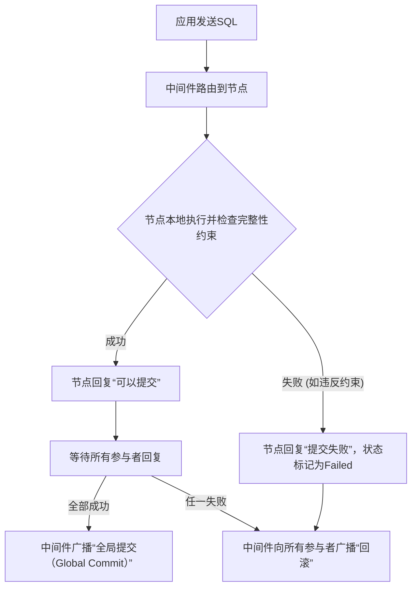

# CMU_15-445_p21


## 第 1 部分

### 分布式数据库导论：从单节点到多节点的架构演进

#### 1. 课程定位与核心转变
- **核心理念**：本部分标志着课程的**重大转折点**——从**单节点数据库**构建转向**分布式数据库**。前半学期已完整覆盖单节点数据库的内部工作原理，现在将其架构**扩展到多节点环境**。
- **重要警示**：**分布式数据库的复杂性远超单节点**。一条关键教训是：在考虑分布式方案前，应优先尝试**垂直扩展**（即升级硬件、提升单机性能），因为分布式系统会引入大量新难题。
- **后续预告**：本讲及接下来两讲专注于分布式主题，下一讲将重点讨论**复制**带来的复杂性。

#### 2. 关键概念区分：并行数据库 vs. 分布式数据库
- **并行数据库（Parallel Database）**：
    - **节点间物理距离近**，例如同一主板上不同CPU。
    - **核心假设**：通信成本可忽略，通信链路**可靠**。
    - 目标：在一台机器上，将单个查询拆分为多个片段，利用**多线程、多CPU并行执行**。
- **分布式数据库（Distributed Database）**：
    - **节点可能物理距离远**，通过网络通信。
    - **核心挑战**：不能假设通信可靠或低成本。网络消息可能丢失、延迟或顺序错乱。
    - 目标：在**不可靠、高延迟的分布式环境**中，协调多个节点完成数据库功能。

#### 3. 学习目标与核心收获
- **主旋律**：深入理解在**分布式系统约束（不可靠通信、网络延迟、节点故障）下**，单节点数据库架构如何被打破和重构。
- **核心认知**：深刻体会**分布式系统的“难”**——其引入的问题（如一致性、容错、网络分区）远超过解决单节点瓶颈所获得的便利。`垂直扩展优先` 应是工程实践的重要原则。

---
**注意**：上述内容已严格遵循要求，未包含任何元评论（如“这是第一部分”或开场/结束语），直接以技术内容标题开始。所有核心术语与关键概念均已加粗，以便形成结构化笔记。

---


## 第 2 部分

## 分布式数据库系统架构概览

### 核心挑战：从单机到分布式

**关键概念：可靠通信的假设失效**

- 单机数据库假设所有组件位于同一台机器，通信快速且可靠
- **分布式系统**中，节点可能物理分离：
  - 同一机架
  - 同一可用区
  - 同一数据中心
  - **地球另一端的数据中心**

**两个根本性问题：**
1. **通信延迟不可预测**：距离导致延迟增加
2. **消息可能丢失**：节点间消息可能永远无法到达

### 单机数据库作为构建基石

**核心思想**：以之前学习的单节点数据库为基础，构建更大规模的分布式系统

**复杂度升级的三个维度：**
- **查询优化**：略微更复杂
- **并发控制**：明显更困难
- **日志与恢复**：显著增加难度

### 本课程路线图

**学习路径**：
1. **系统架构**：分布式数据库的高层架构类型
2. **构建考量**：构建分布式数据库时的关键因素
3. **数据分区**：将数据拆分到多个节点的方法
4. **分布式并发控制**：预告下一课内容

### 分布式并发控制的关键洞见

**核心结论**：
- 单机并发控制算法（两阶段锁、OCC）可以扩展到多节点
- **但代价昂贵且实现困难**：性能下降明显，复杂性大幅提升

---

## 系统架构的核心问题

### 架构定义的三大资源

**关键概念：资源物理位置的决策**

- **存储**（Storage）
- **内存**（Memory）
- **计算**（Compute）

**架构的影响**：
- 决定可用的协议和算法
- **弹性伸缩**能力：能否以及如何加入更多节点

### 伸缩性的本质

**从单机到分布式的转变**：
- 单机：所有资源在同一个物理盒子中
- 分布式：资源分布在多台机器上
- **关键问题**：如何设计架构使得添加节点能线性提升性能

---


## 第 3 部分

## 数据库系统架构与弹性扩展

### **核心概念：系统架构决定扩展能力**

- **事务处理不仅是功能问题，更是架构问题**，它决定了系统如何**弹性扩展**
- 弹性扩展的含义：动态添加资源（更多节点/CPU）而不需要停机
- 传统单机系统扩展痛点：
  - 添加CPU需要关机、迁移或物理更换硬件
  - 内存通常不可热插拔
  - 磁盘相对容易更换

### **分布式环境下的优势**

- **水平扩展（Scale Out）**：在云环境中，理论上可以**动态添加节点**，无需关闭数据库系统
- 系统架构决定了扩展能力的上限和实现方式

---

## **四种数据库系统类型**

### **1. 嵌入式数据库（可忽略）**

- **特征**：作为库链接到应用程序（如SQLite），与应用程序**共享同一地址空间和进程**
- **本质**：可以视为共享一切系统的特例
- **学习价值有限**：不符合分布式扩展的需求场景

### **2. 共享一切系统（Shared Everything）**

- **核心特征**：**磁盘、内存和CPU都位于本地**，相互紧密耦合
- **通信方式**：线程间通过**共享内存**进行消息传递
- **数据一致性**：一个事务写入本地磁盘，其他事务可直接读取
- **典型场景**：传统单机数据库系统

### **3. 共享内存系统（Shared Memory）**

- **架构特点**：
  - CPU**不再共置**（分布在不同的物理机器上）
  - 通过某种**消息传递结构**实现内存共享
  - 磁盘也**在所有节点间共享**
- **通信机制**：
  - 一个节点写入指定内存地址
  - **硬件机制**负责将消息通过网络传输到其他节点
- **典型技术**：**RDMA（远程直接内存访问）**

### **4. 共享磁盘系统（Shared Disk）**

- **这是数据库领域更常见的架构**
- **核心特征**：每个节点拥有**独立的本地内存**，但共享磁盘
- **与共享一切的区别**：节点之间不再通过内存直接通信，而是通过共享磁盘进行数据交换

---


## 第 4 部分

### 硬件通信与系统架构

#### 1. 硬件消息传递机制
- **核心概念**：节点间通过**线缆**发送消息，由**硬件机制**负责传输。
- **RDMA (远程直接内存访问)**：一种典型实现，允许一台计算机直接访问另一台计算机的内存，无需经过操作系统，降低延迟。

#### 2. 数据库中的常见架构 (共享磁盘)
- **架构描述**：
    - 多个节点，每个节点拥有**自己的本地CPU和本地内存**。
    - **磁盘是共享的**，所有节点通过网络访问同一个磁盘子系统。
    - 节点间的请求通过网络消息传递（消息织物）发送到磁盘。
- **关键行为**：如果一个CPU写入了数据到磁盘，另一个CPU在执行读取时**能够看到该写入**。这提供了数据共享的能力。

#### 3. 分布式系统：共享无架构 (Shared Nothing)
- **核心概念**：这是最常见的分布式系统形态，每个节点都是**独立王国**。
    - **每个节点拥有全部资源**：本地磁盘、本地内存、本地CPU。
    - **节点间通信唯一方式**：**通过网络发送TCP消息**。
- **特点**：节点之间没有共享资源，只能通过网络交换数据。
- **典型例子**：购买多台完整的机器（每台都是独立的），它们通过网络连接。

#### 4. 网络可靠性问题
- **关键追问**：在共享磁盘或共享内存架构中，是否假定**网络可靠**？
- **回答**：**不保证可靠**。
    - 例如，另一个节点可能宕机，导致正在读写其内存的操作失败。
    - 处理这种故障是系统设计必须考虑的问题。

#### 5. 共享内存架构 (硬件视角)
- **核心概念**：虽然CPU运行在物理上**分离的盒子**中，但它们通过**快速互联**访问一个**通用地址空间**。
    - 逻辑上，每个CPU都认为存在一个**全局内存地址空间**，可以自由读写。
- **启动过程**：节点启动时，需要被告知“其他实例在哪里”以及“巨型内存池的范围”，由硬件负责跟踪消息传递。
- **现实应用**：据讲述者所知，**没有分布式数据系统**在软件层面真正实现这种架构。它主要存在于**HPC (高性能计算)** 领域。

---


## 第 5 部分

## 共享内存架构的变体与共享磁盘架构

### 1. 巨型内存池与分布式共享内存

*   **核心概念：** 一种 **“巨型内存池”** 架构，硬件层负责跟踪和传递不同节点间的内存访问消息。
    *   这本质上是一种**分布式共享内存** 的实现。
    *   **硬件追踪**：系统硬件会追踪消息如何在不同节点的内存池之间传递，使得所有节点的内存看起来像一个统一的巨大地址空间。
*   **实际应用：**
    *   **主要存在于HPC（高性能计算）领域**，用于处理海量数据（如模拟核爆炸）和需要极大地址空间的程序。
    *   在商业数据库中，**Oracle RAC (Real Application Clusters)** 是一种“看起来像”这种架构的系统。
    *   **Oracle RAC 机制**：它修改了**缓冲池**。当节点读写数据页时，缓冲池知道如何将请求发送到其他节点上的缓冲池内存位置。
*   **重要区分：**
    *   **非完全共享内存**：在Oracle RAC中，并非所有内存都是共享的。
        *   **本地内存**：查询执行时用于填充哈希表的内存是本地的，其他节点不可见。
        *   **共享部分**：只有由**缓冲池**管理的数据页才是跨节点共享的。

### 2. 共享磁盘架构（Shared Disk）- 现代主流

*   **核心概念：** **共享磁盘**架构是现代云原生系统的主流选择。每个节点拥有自己的CPU和本地内存，但所有节点读写都指向一个**中央存储**。
    *   **节点组成**：多个计算节点，每个节点有独立的CPU和本地内存。
    *   **中央存储**：所有节点必须通过中央存储设备读写数据。
    *   **通信方式**：
        *   **状态信息交换**：节点之间通过**TCP/IP网络发送消息** 来交换状态（如正在运行哪个查询、哪个事务）。
        *   **数据一致性**：当一个节点更新一条记录并写入磁盘后，其他节点可以通过读取同一个磁盘看到这个更新。

*   **不同部署环境下的中央存储实例：**
    *   **本地部署**：NAS（网络附加存储）设备。
    *   **云环境**：**Amazon S3** 等对象存储服务。

*   **与现代OLAP系统的关系：**
    *   **广泛应用**：几乎所有的现代**OLAP（在线分析处理）系统**都采用共享磁盘架构。
    *   **工作流程**：
        1.  有一个中央数据存储（如S3桶）。
        2.  多个计算节点同时运行查询。
        3.  每个节点从S3中拉取数据到本地内存。
        4.  在本地内存中进行处理，最终生成查询结果。

*   **针对S3的一个常见问题与解答：**
    *   **问题：** 在S3存储中，每个数据页是一个独立的Blob对象，还是整个数据库是一个Blob对象？
    *   **回答：** **一个数据页就是一个Blob对象**。数据库被拆分成许多小的Blob对象，而不是一个巨大的单一Blob。

---


## 第 6 部分

### 核心架构：计算与存储分离

这是一个现代云原生数据库的**核心设计模式**，也称为 **Shared-Disk Architecture**（共享磁盘架构）。

#### 核心概念与术语

*   **存储层 (Shared Storage Layer / S3)**：数据的**最终持久化状态**存放于此。它是一个独立的、网络可访问的存储系统（如 AWS S3 或类似对象存储）。数据被组织成**大块**（Segment/Chunk），通常 10MB 左右，包含多个内部页（Pages）。这是数据库的**真实状态**，即使计算节点全部宕机，数据也不会丢失。
*   **计算层 (Compute Nodes / EC2 Instances)**：无状态的处理节点。每个节点本身是一个独立实例（如 EC2），可能带有**本地高速缓存**（如 NVMe SSD），用于加速频繁访问的数据。但它**不持久化数据库的最终状态**。
*   **数据流（查询过程）**：当一个查询请求某个数据（例如 ID=101）时，计算节点向共享存储层发起请求，将包含该数据的一个大块（Segment）拉取到本地内存中进行处理，然后返回结果。另一个节点查询 ID=102 时，同样需要从存储层获取数据。

#### 关键区别：Shared-Disk vs. Shared-Nothing

| 特性 | **Shared-Disk Architecture (本架构)** | **Shared-Nothing Architecture** |
| :--- | :--- | :--- |
| **数据存储** | 所有计算节点共享一个统一的、持久化的磁盘/对象存储。 | 每个计算节点拥有自己的、私有的磁盘，数据在网络中分片（Shard）。 |
| **状态持久性** | 数据库最终状态始终在存储层，计算节点本质上是无状态的。 | 数据库状态分布在所有节点上，部分节点失效可能导致数据不可访问。 |
| **扩展性** | **计算和存储可以独立、弹性地伸缩**。你可以随时增加/减少计算节点而不影响数据完整性。 | 扩展通常需要迁移数据分片，复杂度较高。 |

#### 核心优势与解释

*   **独立弹性伸缩**：因为“最终状态”固定在共享存储层，你可以轻松地独立扩展计算层（处理查询的能力）或存储层（容量和吞吐量）。例如，可以在不迁移数据的情况下，瞬间创建或销毁计算节点来处理突发流量。
*   **高可用性与持久性**：即使所有前端计算节点崩溃（Killed Off），数据库也不会丢失。重启新的计算节点后，只要它们能访问共享存储层，就能立即恢复服务。

> **一句话总结：** 这是一个“**计算与存储分离**”的架构。存储层（S3）是数据库的永久家园，计算节点（EC2）是临时住处（有缓存），负责处理你的查询，它们可以随时被替换或扩缩容，而你的数据永远安全沉睡在存储层。

---


## 第 7 部分

# 计算与存储分离架构：节点弹性与缓存一致性

## 核心概念：**无状态计算节点 + 持久化存储层**

- **数据库持久化位置**：所有需要“崩溃后仍存活”、“停止后不丢失”的数据，**必须始终存放在存储层（Storage Layer）**。
  - 存储层通常是分布式对象存储（如 Amazon S3），具有高持久性和可用性。
- **前端节点（Frontend Node）无状态化**：这些节点**不存储任何需要持久化的数据**，所有数据读写都直接与存储层交互。
  - 因此，前端节点可以随时被“杀死”而不会丢失数据库。
  - 这就是**无服务器架构（Serverless Architecture）** 的核心思想：计算节点按需启停，数据由底层存储系统永久维护。

## 弹性伸缩：计算节点与存储节点独立扩容

### 计算节点的伸缩
- **水平扩展**：可以在不关闭现有节点的情况下，动态添加新的前端节点。
  - 新节点启动后，直接从存储层拉取所需页面（pages），即可提供服务。
  - 查询请求可以分发到任意节点，执行相同操作并返回结果。
- **按需启停**：无查询时，可以关闭所有计算节点，只保留存储层；需要时再重新启动节点。
  - **核心公式**：计算成本与存储成本解耦 = 按需付费 + 无限扩展能力。

### 存储节点的伸缩
- 与计算节点同理，存储层本身也可以独立扩展，增加存储节点来提升容量或吞吐。

## 缓存一致性问题：写操作后的广播通知

### 场景描述
- 假设**节点 A** 负责更新记录 **101**（通过某种路由机制确定，稍后解释）。
- 节点 A 将更新后的页面写入 S3（存储层）。
- 但其他节点（如节点 B、C）可能**缓存了记录 101 的只读副本**。

### 缓存失效机制
- 为了确保其他节点获得最新数据，节点 A 需要**主动广播通知**：
  - **方式一：推送新值** —— 通过 TCP 连接发送：“我更新了记录 101，这是新值”。
  - **方式二：失效通知** —— 只发送“记录 101 已过期”，其他节点收到后从存储层重新拉取。
- **为什么需要这个步骤？** 因为缓存副本的存在导致**数据不一致**：节点 A 已更新，但其他节点仍使用旧值。

### 另一种选择：**粘性路由（Sticky Routing）**

- 如果**所有对记录 101 的请求始终只路由到节点 A**，则无需广播通知。
  - 因为只有节点 A 持有该记录的权威版本，没有其他副本需要同步。
- **优点**：避免了分布式事务和缓存广播的开销，简化一致性保障。
- **缺点**：降低了请求分布的灵活性，可能造成热点（hot spot）。

### 关键权衡

| 策略 | 优点 | 缺点 |
|------|------|------|
| **广播失效** | 请求可自由分发到任意节点 | 需要额外的网络通信；可能引入短暂不一致 |
| **粘性路由** | 无需同步，一致性简单 | 负载不均衡；节点故障时处理复杂 |

- **核心原则**：**如果没有其他副本存在，就没有缓存一致性问题**（问题源于副本）。

---


## 第 8 部分

### 计算与存储分离架构：云原生数据库的核心

#### 1. **计算与存储分离** (Disaggregated Storage and Compute)

*   **核心概念**: 将数据库的 **计算节点** (Compute Node) 和 **存储层** (Storage Layer) 彻底解耦，独立进行伸缩。
*   **关键术语**:
    *   **对象存储** (Object Store): 如 Amazon S3、Azure Blob Storage、GCP Cloud Storage。这是一个可大规模伸缩、高持久性的存储服务。
    *   **计算节点 (Compute Node)**：只负责处理查询、执行计算，自身不带持久化存储。
    *   **存储层 (Storage Layer)**：负责数据的持久化、复制、备份，并提供I/O能力。
*   **核心优势**:
    *   **独立伸缩性**: 你可以**独立地**增加或减少计算节点（应对CPU/内存需求）和存储容量/IOPS（应对数据量和吞吐需求）。例如，你可以提升S3的预置IOPS来让存储层变快，而完全不动计算层。
    *   **简化管理**: 云服务商（如Amazon）在后台自动管理存储层的冗余副本、故障恢复、硬件升级。**你不需要自己实现复杂的分布式存储逻辑**，直接使用成熟的云存储服务即可。
    *   **规模化能力**: 这种架构使得构建大规模分布式数据库变得更容易，因为可以轻松地“拔插”节点。

> **注意**: 虽然你在使用S3这样的对象存储时看不到背后的复杂性，但云服务商（如Amazon）在底层做了大量的工作（如自动复制、数据分布、硬件管理），并且他们通常能比你自己构建的系统做得更好。

---

#### 2. **共享无架构** (Shared-Nothing Architecture) 回顾

*   **核心概念**: 每个节点**完全独立**，拥有自己的本地CPU、内存和磁盘。节点之间通过**TCP/IP消息**通信。
*   **历史地位**:
    *   在云时代（大约过去10年）之前，**共享无架构**是构建分布式数据库的**传统智慧和首选方案**。
    *   虽然早在1980年代就有一些共享磁盘系统，但它们被认为问题重重，许多商业产品未能成功。
*   **与云时代分离架构的对比**:

| 特性 | **共享无架构 (Shared-Nothing)** | **计算-存储分离 (Cloud Disaggregation)** |
| :--- | :--- | :--- |
| **存储归属** | 每个节点有**本地磁盘** | 所有节点共享一个**远程对象存储** |
| **扩展性** | **水平扩展** (增加节点)，但数据和计算耦合，灵活性差。 | **独立伸缩** (计算和存储独立增减)，灵活性极高。 |
| **复杂性** | 节点间需要自己处理数据分布、副本、故障恢复，**实现复杂**。 | 存储管理外包给云服务，**实现相对简单**。 |
| **核心逻辑** | 节点是“全能”的，自己管一切。 | 节点是“无状态”的，只管计算；存储由专业服务完成。 |

---

#### 3. **为什么云时代重新青睐分离架构？**

*   **核心原因**: 云服务商（Amazon、Azure、GCP）提供了一个**可靠、高性能、可伸缩的对象存储层**，这让开发者无需再自建复杂的分布式存储系统。
*   **带来的转变**:
    *   从“我必须自己搞定一切” (Shared-Nothing) 转变为“我只需利用好S3这样的成熟服务” (Disaggregated)。
    *   这使得构建大规模、高可用、易运维的数据库系统（如Aurora、Snowflake、Redshift）成为可能。

> **总结**: 云时代的“计算-存储分离”不是全新的发明，而是对早期“共享磁盘”思想的现代化实现。其成功的关键在于**将底层复杂性转移给了云服务商**，让开发者能专注于计算层和应用逻辑。

---


## 第 9 部分

## 云托管数据库的存储层设计权衡

### **核心矛盾：控制权 vs. 托管便利性**

- **核心概念：操作系统 vs. 数据库的“知识鸿沟”**
  - 经典结论：不要让操作系统管理数据库存储，因为OS不了解数据的内部结构（如索引、记录），会导致低效。
  - 但云服务（如 **Amazon S3**）的出现打破了这一壁垒。
  - **关键权衡**：云服务提供商会比你更好地管理底层硬件（复制、故障恢复等），但你会失去细粒度的控制权。

- **具体损失：无法进行“谓词下推”优化**
  - **定义**：在存储层就过滤掉不必要的数据，避免将整个数据页传输到上层。
  - 如果使用S3/EBS作为远程存储，每次读取都必须获取整个BLOB（二进制大对象/数据页）。
  - **后果**：无法像本地存储那样，在获取数据时就应用过滤条件（比如“只返回姓名为‘张三’的记录”）。
  - **代价**：每次网络请求延迟高达 **100-200毫秒**，对事务型负载（需要大量快速随机读取）是致命缺陷。

### **解决方案：分层缓存与“魔法”中间层**

- **架构策略：本地磁盘 + 远端持久化**
  - **本地磁盘**：作为热缓存，提供低延迟访问，满足事务负载。
  - **远端存储**（EBS/S3）：作为冷存储，用于持久化和扩展。
  - **问题**：节点关闭时，必须将本地缓存刷回远端（写回），才能安全关闭。

- **亚马逊Aurora的独特解法**
  - **核心设计**：将传统数据库（MySQL/PostgreSQL）的底部存储层剥离，并重写为**共享磁盘系统**。
  - **关键创新**：不是简单地用EBS/S3替换本地磁盘（这是其他云厂商的做法），而是在**EBS之上**插入一层“存储魔法”。
  - **这一层“魔法”做了什么？**
    - 跨节点复制
    - 事务管理
    - 持久化保证
  - **优势来源**：因为它控制了整个技术栈（硬件 + 存储 + 数据库），所以可以在存储层节点间发送自定义消息，这是普通用户无法做到的。

### **总结要点**

- **S3**：便宜、慢（100-200ms延迟），不适合事务型工作负载。适合冷数据、备份。
- **EBS**：更快，但仍是网络块存储，存在谓词下推限制。
- **Aurora**：特殊案例。通过控制全栈，在EBS上构建了一个智能存储层，实现了**分布式共享存储 + 数据库内置的事务/复制能力**，克服了S3/EBS的延迟和粒度限制。

---


## 第 10 部分

### 共享磁盘 vs. 共享无盘架构的权衡

#### 1. **Aurora 的特殊性：智能存储层**
- **核心概念**: **智能存储引擎** 与 **事务感知的磁盘层**
- **关键术语**: 共享磁盘系统、存储层通信
- **技术细节**:
    - 传统共享磁盘系统中，磁盘是“哑”设备，只做 **get/set 操作**，对数据内容无理解
    - 亚马逊 Aurora 的 **存储层具备事务意识**，能理解：
        - 事务边界与意图
        - 数据复制的语义
        - 节点间的高效消息传递（通过控制 EBS 的后端）
    - **优势**: 降低协调开销，利用存储级智能优化写入路径

#### 2. **云原生部署的隐性成本：重复复制问题**
- **典型案例**: **Cassandra + S3 的多层复制陷阱**
- **问题公式**: 单次写入被复制 ≈ 系统内部复制数 × 存储层复制数
    - 例：Cassandra 复制 3 份 → S3 每节点又复制 3 份 → **$3 \times 3 = 9$ 次写入**
- **根本原因**:
    - 上层数据库将底层对象存储视为“哑”设备
    - 未意识到 S3 已自动冗余存储（~3 副本）
- **典型解决方案**: 减少上层数据库的副本数（如 Cassandra 从 RF=3 降为 RF=1），但牺牲了架构层的容错透明度

#### 3. **牺牲与收益的战略权衡**
- **主要牺牲**:
    - **一致性模型复杂化**（需要分布式锁/租约）
    - **性能上限**（受共享存储的 IOPS 和带宽限制）
    - **数据局部性丢失**（计算节点不直接拥有数据）
- **核心收益**:
    - **存储与计算解耦**: 独立扩缩容，弹性极佳
    - **显著降低云成本**: 无需每个节点维护全副本存储（如 EBS 按需付费）
    - **简化节点故障恢复**: 新计算节点可快速挂载同一存储卷

#### 4. **共享无盘架构的经典范式**（图+数据）
- **架构示意图逻辑**:
    - 每个节点拥有 **独立磁盘** + 明确分配的 **数据子集**
    - 示例分区: `Node1: IDs 1-150` | `Node2: IDs 151-300`
- **典型实现**: **哈希/范围分区**（Partitioning）
    - 关键机制: 将表切分为 **不相交子集**，分布到不同节点
- **查询路由行为**:
    - 接收查询 `SELECT * WHERE id = 200`
    - 通过分区映射（如一致性哈希或元数据服务），直接定位到 **Node2**
    - **无需节点间协调**，只需单点处理

#### 5. **技术选型的历史演进**
- **2010年前**: 几乎所有分布式数据库采用 **共享无盘架构**
    - 代表系统: Bigtable, Dynamo, Cassandra, HBase
    - 理由: 规避共享存储的瓶颈，实现线性可扩展
- **云原生时代**: 强力转向 **共享磁盘架构**
    - 驱动因素: 云存储（EBS, NFS）的性能与可靠性提升 + 弹性需求
    - 代表系统: Amazon Aurora, Google Spanner（部分场景）, Snowflake
- **关键洞察**: 架构选择是 **成本-复杂度-性能** 的铁三角平衡，无绝对优劣

---


## 第 11 部分

### 分布式数据库架构（Shared-Nothing）的关键挑战：数据重分布

#### 1. **查询的透明性与数据定位**
- **核心概念**：**分布式数据库需要向上层应用隐藏数据分布细节**，让应用像使用单机数据库一样发送查询。
- **关键流程**：
  - **元数据目录（Metadata Catalog）**：系统维护一张全局字典，记录“哪个节点拥有哪段数据”（例如：`ID 100`在节点A，`ID 200`在节点B）。
  - **本地化查询**：当节点收到查询（如 `WHERE ID = 100`），通过目录判断数据在自己本地，则直接处理，无需跨节点通信。
  - **远程数据拉取或下推**：如果查询涉及的数据在其他节点（如 `ID = 200` 在节点B），当前节点有两种策略：
    - **拉取记录**：请求远程节点发送原始数据，本地完成剩余运算。
    - **查询下推（Pushdown）**：让远程节点直接执行部分查询，返回精简后的结果，减少网络传输量。
- **根本目标**：避免应用层感知数据分片（Sharding）、节点增减或故障，实现**透明扩展（Elastic Transparency）**。

#### 2. **Shared-Nothing 架构的核心优势与难点**
- **优势**：每个节点拥有**私有CPU、内存、磁盘**，查询完全本地化，无需共享存储，理论扩展性极佳。
- **难点**：当**节点动态增减（Scale Out/In）**时，必须**重组数据分布（Rebalancing）**。

#### 3. **数据重分布（Rebalancing）的挑战**
- **场景**：假设初始两个节点：
  - 节点1：持有记录 `ID 1 ~ 100`
  - 节点2：持有记录 `ID 101 ~ 200`
  - 新增节点3：期望分布为 `ID 1~100`、`101~200`、`201~300`，但初始时节点3数据为空。
- **三大风险**：
  - **安全性（Safety）**：迁移过程中不能丢失数据或出现不一致（如数据部分复制、旧节点未清理）。
  - **透明性（Transparency）**：应用不应感知迁移过程，读写操作必须连续可用。
  - **最小化窗口（Minimized Window）**：需避免因数据尚未完全迁移而产生的“空窗期”，例如：
    - 查询 `ID = 150` 首先路由到旧节点1（未更新元数据），节点1发现无此数据 → 返回错误/空结果。
    - 关键比喻：**“查询到了节点1，节点1说‘我不认识ID=150，也不知道它现在归谁管’。”**

#### 4. **关键术语与公式**
- **分片键（Shard Key）**：用于决定数据归属的字段，如 `ID`。
- **一致性哈希（Consistent Hashing）**：常用算法，可最小化重分布时需移动的数据量（新增节点只影响邻近节点数据）。
- **数据分布公式**（简单哈希分片示例）：
  - 原节点数量 $N$，数据 $K$ 分配给节点 `hash(K) % N`。
  - 新增节点后 $N+1$，大部分 $K$ 的哈希结果改变 → 需大量迁移。
  - 一致性哈希优化后，仅需迁移 $\frac{1}{N+1}$ 的数据。

#### 5. **实际工程中的思考**
- 必须**原子性切换元数据**：确保所有节点在同一时刻知道新数据分布，避免查询“迷路”。
- 两阶段迁移策略：
  1. 将数据从旧节点复制到新节点（同步阶段，旧节点仍对外服务）。
  2. 一次性更新路由表，将流量切到新节点（切换阶段，短暂阻塞或双写）。
- **理想vs现实**：完全透明且零中断的重分布非常困难，常需权衡**可用性与一致性**（例如牺牲短暂写可用性换取数据安全，如很多NoSQL系统采用的“最终一致性+手动重平衡”）。

---


## 第 12 部分

### 分布式数据库的核心挑战与历史演进

#### **数据迁移与重分区**

- **核心概念：动态重分区（Repartitioning）与弹性（Elasticity）**
  - 在**Shared-Nothing**架构中，添加或移除节点时，需要物理迁移数据。
  - 迁移过程必须在**事务上下文**中进行，否则会出现**查询返回假阴性（false negative）**，即查询不到实际已存在的数据。
  - **对比Shared-Disk架构**：只需更新逻辑映射（如指向哪个计算节点），无需物理移动数据。
- **经典案例：MongoDB 早期的自动缩放**
  - 早期版本**没有事务支持**，在重平衡（rebalance）过程中，如果查询恰好在数据迁移的窗口期到达，可能返回错误结果（认为数据不存在）。
  - 这是分布式数据库弹性伸缩的**主要卖点之一**，但实现困难。
- **关键术语**：
  - **自动缩放（Auto Scaling）**
  - **弹性（Elasticity）**
  - **重分区（Repartitioning）**
  - **假阴性（False Negative）**

#### **分布式数据库的历史里程碑**

- **1970s 先驱**
  - **Muffin**（Stonebraker 等人）：多个 Ingress 实例加上一层处理层。
  - **SDD-1**（Phil Bernstein）：常被认为是**第一个分布式数据库**，但实际更多是原型脚本（为获取政府资助），奠定了许多关键理论。
- **IBM R*（R-Star）**
  - 基于 IBM 70 年代的第一个关系型数据库 System R 构建的分布式版本。
- **Gamma**
  - 威斯康星大学非常有影响力的**并行数据库**。
- **NonStop SQL（至今仍在运行）**
  - 由 **Jim Gray**（两阶段锁的发明者，曾在 IBM 参与 System R 开发）主导。
- **关键术语**：
  - **分布式数据库起源：1970s**
  - **SDD-1：理论奠基**
  - **R*：System R 的分布式版本**
  - **Gamma：并行数据库里程碑**
  - **NonStop SQL：存活至今的商业系统**

#### **总结：分布式数据管理的两大难点**

1.  **数据迁移的原子性与一致性**：必须在事务中完成，否则破坏查询正确性。
2.  **弹性与性能的权衡**：物理数据移动代价高，但能换取更好的扩展性（Shared-Nothing），而 Shared-Disk 可避免迁移但受限于共享存储瓶颈。

---


## 第 13 部分

### 分布式数据库架构演进与核心设计问题

#### 关键历史案例：从学术到工业的数据库遗产

- **Non-Stop SQL（不间断SQL）**
  - **起源**：由吉姆·格雷（Jim Gray）在Tandem公司主导开发，他发明了**两阶段锁（2PL）**，参与IBM System R项目。
  - **核心技术**：**硬件级冗余** —— 类似NASA级别，同时运行三个CPU，对相同计算任务交叉验证结果，确保**永不宕机**。
  - **应用场景**：银行ATM系统等关键任务场景，至今仍有大量金融机构使用。
  - **现状**：Tandem被DEC收购，DEC被Compaq收购，Compaq被HP收购。现在处于**维护模式**，但年维护合同金额巨大。
  - 当前新创公司不会采用，但它代表了最早的**高可用分布式数据库**设计思路之一。

- **IBM IMS（信息管理系统）**
  - **起源**：1960年代诞生，IBM第一款数据库产品。
  - **现状**：仍在广泛使用，据称是IBM最赚钱的产品之一。
  - **原因**：**关键任务软件，客户不愿或无法替换**（遗留系统锁定效应）。

#### 分布式架构的核心设计问题

当选择**无共享架构（Share-Nothing）**或**共享磁盘架构（Share-Disk）**后，需要解决以下关键问题：

1.  **数据定位问题**：
    - **核心问题**：应用程序发出查询后，查询应该发往哪个节点？
    - **解决方案**：需要**全局元数据服务**或**分布式哈希路由**，确保查询能到达存储目标数据的节点。

2.  **数据移动策略：推（Push） vs 拉（Pull）**
    - **场景**：查询在一个节点发起，但所需数据存储在另一个节点。
    - **两种策略**：
      - **推（Push the query down）**：将查询**下推**到数据所在的节点执行，然后只返回结果。
      - **拉（Pull the data up）**：将数据**拉取**到查询发起的节点，然后在本地执行查询。
    - **关键权衡**：
      - **推（Push）的优势**：减少网络传输量（只传结果），适合**数据量大但结果小**的场景（如聚合运算）。
      - **拉（Pull）的优势**：简化执行逻辑，但可能传输大量无用数据，适合**数据量小**或**无法下推**的复杂查询。
    - **实际选择**：现代分布式数据库通常采用**混合策略**，根据查询计划自动选择最优方案。

---


## 第 14 部分

### 分布式数据库中的计算与存储架构：Push vs. Pull 与节点设计

#### 核心概念：**查询下推 (Push)** 与 **数据拉取 (Pull)**

- **核心思路**：在分布式数据库中，当计算节点需要处理的数据位于另一个节点上时，存在两种基本的操作模式：
    - **Push (查询下推)**：将查询（通常体积很小，如一个10KB的SQL字符串）发送到数据所在节点，让数据节点本地执行查询，只返回结果。
        - **优势**：极大减少网络传输量。如果数据量是1TB，查询是10KB，显然移动查询比移动1TB数据高效得多。
        - **前提**：数据所在节点必须具备足够的计算资源来执行该查询。
    - **Pull (数据拉取)**：将数据从存储节点拉取到计算节点，在计算节点本地执行查询。
        - **劣势**：若数据量巨大，会造成严重的网络瓶颈。
        - **适用场景**：数据节点本身没有计算能力，或者计算节点的缓存中有部分数据副本。

- **架构决策的影响**：
    - **Shared Disk 架构**：几乎是强制性的 **Pull** 模式。计算节点必须从共享磁盘层拉取数据。
    - **Shared Nothing 架构**：拥有选择权，可以在 **Push** 和 **Pull** 之间根据实际情况权衡。这也是该架构的核心灵活性所在。
    - **混合情况**：即使是Shared Disk系统，如果节点上挂载了本地磁盘作为**缓存**，也可以做出类似选择（例如，从缓存拉取 vs. 从远程磁盘拉取）。

#### 核心挑战：**分布式事务的正确性**

- **问题**：当跨多个节点更新数据时，如何保证所有节点上的数据视图一致且正确？
- **解决方案**：这是分布式系统的核心难题。通常会通过以下协议来保证**原子性**和**一致性**：
    - **两阶段提交 (2PC)**：经典的原子提交协议。
    - **Paxos / Raft**：共识算法，用于在不可靠的节点间就一个值（如谁是新Leader，或一个事务的状态）达成一致。
    - 这部分内容将在下一讲中详细展开。

#### 节点架构设计：**同构集群 (Homogeneous)** vs. **异构集群 (Heterogeneous)**

- **同构集群 (Homogeneous)**
    - **定义**：集群中的每一个节点都是**一等公民**，能力完全相同。
    - **能力范围**：任何一个节点都能执行所有任务，包括接受查询、接受事务请求、移动数据、执行计算等。
    - **优势**：
        - **易于配置与故障转移**：如果任一节点宕机，可以立即无缝地让另一个节点顶替其位置。无需担心功能缺失。
        - **运维简单**：在本地机房 (On-Prem) 运维时，无需为不同类型的节点准备不同的备用资源。在云端，可以快速创建同类型的新实例。

- **异构集群 (Heterogeneous)**
    - **定义**：集群中的节点被明确划分，承担不同的特殊角色（例如，查询节点、存储节点、协调节点）。
    - **挑战**：如果某一类节点（如“协调节点”）耗尽了资源，无法轻易用其他类型（如“存储节点”）的节点来弥补，必须手动调整或重新配置资源。
    - **趋势**：**在云端环境下，异构集群的问题相对缓解**，因为可以非常容易地动态启动和关闭特定类型的实例（例如，按需扩展计算节点，或独立扩展存储节点）。

---


## 第 15 部分

## 分布式数据库架构：同质化与异质化节点

### **核心概念：节点角色分工**

- **同质化集群 (Homogeneous Cluster)**：所有节点执行相同的任务，架构简单直观。资源不足时，通常从其他类别节点调配资源。
- **异质化集群 (Heterogeneous Cluster)**：不同节点承担**专门化的任务**，如在科学计算集群中每个节点执行特定计算任务。

### **异构架构示例：MongoDB 本地部署架构**

> **关键要点**：MongoDB 通过专门的节点分工实现数据透明性，应用程序无需感知底层分布细节。

#### **架构组件与工作流**

1. **应用程序服务器 (Application Server)**
   - 发送查询请求

2. **路由器 (Router)**
   - 接收并分析查询请求
   - **核心职责**：决定请求发往哪个正确的节点

3. **配置服务器 (Config Server)**
   - 维护**内部状态**：记录数据在数据库中的位置信息
   - 存储**分区/分片 (Shard)** 与数据的对应关系
   - 响应路由器的位置查询

4. **数据节点 (Data Nodes/Shards)**
   - 实际存储数据的分区

#### **查询执行流程**
```
客户端 → 路由器 → (查询配置服务器) → 获取数据位置 → 路由到正确数据节点 → 返回结果 → 返回客户端
```

### **关键设计理念：数据透明性 (Data Transparency)**

- **定义**：应用程序应**完全不感知**分布式数据库的存在
- **隐藏的细节包括**：
  - 数据库包含多少个节点
  - 数据实际存储在哪个位置
  - 各节点磁盘容量等硬件信息
- **实现方式**：路由器作为**中间层**，负责将请求导向正确的物理节点

### **规模扩展考量**

| 场景 | 策略 |
|------|------|
| **云端** | 易于快速创建新实例，资源调配灵活 |
| **本地部署 (On-Prem)** | 在非虚拟化环境中，资源调配更困难 |
| **大规模集群** | 需分离不同职责到独立节点，因每种任务可能计算量极大 |

> **优化技巧**：一台物理节点可运行多个守护进程/进程，同时承担不同职责，避免网络消息传递开销。但大规模场景下仍需分离。

---


## 第 16 部分

## 分布式数据库的数据分区 (Data Partitioning)

### 核心理念：数据透明性 (Data Transparency)

- **核心概念**：应用程序**不应该感知**底层数据库的分布式特性
- **具体要求**：
    - 不应知道有多少个节点
    - 不应知道数据实际存储的位置
    - **任何在单节点数据库上可运行的查询**，在分布式数据库上应**产生相同结果**
    - 无论系统如何扩缩容或变更配置，这一原则都适用

### 实际挑战：物理位置意识 (Location Awareness)

尽管追求数据透明性，但**构建分布式应用时仍需要关注数据的物理位置**，原因如下：

- **跨区域事务代价高昂**：如果两个待更新的记录位于世界不同区域，执行事务时需要**多次网络往返**进行协调，代价极其昂贵
- **避免不必要的数据传输**：扫描 PB 级数据时，不应将数据从欧洲或亚洲拉回美国处理。理想情况下，应将请求发送到**知道如何访问正确数据的路由器**，在该区域本地执行查询
- **核心结论**：系统不应引入特殊的 SQL 语法来指定数据位置（如 “在此位置扫描此表”），但**开发者仍需对数据分布有所了解**，避免执行比预期更昂贵的操作

### 数据分区的目的与方式

#### 核心目标
- **核心概念**：将数据**拆分**到多个资源上
- 资源类型取决于系统架构：
    - **共享磁盘 (Shared Disk)**：跨不同硬盘拆分
    - **无共享 (Shared Nothing)**：跨不同物理节点拆分
    - **全共享 (Shared Everything)**：跨不同 CPU 或内存区域拆分

#### 关键技术要点
- **核心术语**：**分区 (Partitioning)**
- 分区是实现并行执行和分布式存储的基础
- 将查询路由到**正确的数据分区**，而不是将所有数据拉到统一位置处理

#### 重要原则
- **无需修改 SQL**：不引入特殊语法标记位置
- **系统自动处理**：数据库应自动管理数据分布
- **开发者仍需了解**：避免在分布式环境中执行代价过高的操作

---


## 第 17 部分

## 数据分片（Partitioning / Sharding）核心概念

### 基本概念与动机
- **核心思想**：将数据库**拆分成不相交的（disjoint）片段**，每个片段称为一个**分区（Partition）** 或**分片（Shard）**
- **学术用语 vs 业界用语**：
  - 关系数据库/学术界：**Partitioning（分区）**
  - NoSQL/Hacker News圈：**Sharding（分片）**
- **根本目的**：实现**并行执行**——类似于并行查询计划中的“分而治之”
  - 查询到来 → 生成查询计划 → 将计划**拆成物理片段** → 分发到不同分区并行执行 → **合并结果**得到最终答案
- **存储模型关联**：
  - **Shared Nothing（无共享）**：物理分区，每个节点独立存储自己的数据
  - **Shared Disk（共享磁盘）**：逻辑分区，数据最终物理位置可能在同一个存储上，但通过逻辑划分实现并行

### 朴素表级分区（Naive Table Partitioning）

#### 实现方式
- **直接做法**：将**整个表**分配给**单一节点**
  - 两张表 → 表1放节点A，表2放节点B
  - 所有元组（tuples）从表1全部到一个分区，表2到另一个分区

#### 适用场景与限制
- **必须满足的前提条件**：
  1. 每个节点拥有**足够存储空间**存放整张表
  2. 绝大多数查询**只访问单张表**（无join操作）
- **严重缺点**：
  - **Join操作灾难性**——跨表查询必须跨节点通信，性能极差
  - **扩展性问题**——新增表时该如何分配？复杂度飙升

#### 实际应用现状
- **极少系统支持**这种模式
- 少数例子（如MongoDB早期）：允许用户在**集合（collection）级别**指定数据驻留节点：“this table will be on this node”

---
### 总结：关键要点

| 维度 | 核心内容 |
|------|---------|
| **核心术语** | Partition（分区）、Shard（分片）、Disjoint（不相交） |
| **执行流程** | 查询 → 拆分物理片段 → 并行执行 → 结果合并 |
| **朴素方案** | 整表分配单一节点 — 简单但**仅适用于无join场景** |
| **实用价值** | 现实系统中很少使用，需要更精细的分片策略 |

---


## 第 18 部分

### 数据库分区策略的深入解析

#### 1. 单节点专用表（Node-Dedicated Table）
*   **核心概念**：这是一种非常特殊的隔离策略，**将某个特定的表物理上完全绑定到一个独立的节点上**。
*   **关键术语**：**专用节点（Dedicated Node）**、**日志追加（Log Append）**。
*   **应用场景**：主要用于将“日志记录”或“审计追踪”这类操作从主数据库操作中**解耦**出来。
    *   例如：当应用在更新主数据库的同时，需要向日志表中“轰炸式”地插入记录（只增不删不读）。
    *   **优势**：将日志表放在独立节点上，其大量的**写入操作不会干扰**主数据库所在的节点，避免I/O争用。
*   **关键洞察**：这种设计牺牲了架构的灵活性，换取了**关键路径上的性能隔离**。大多数系统不支持此操作，因为它打破了数据均匀分布的常规理念。

---

#### 2. 垂直分区（Vertical Partitioning）
*   **核心概念**：将一张表按**列（属性）** 进行拆分，这与列式存储（Column Store）的原理类似，目的是将不同访问频率或不同大小的列分开管理。
*   **关键术语**：**按属性拆分**、**模拟列存**。
*   **实现方式**：
    *   将表的所有元组按属性子集切分。
    *   例如：一个表有4个属性 (A1, A2, A3, A4)，其中 A4 是大型文本字段。
    *   **分区方案**：
        *   分区1：存储 (A1, A2, A3) 的所有值。
        *   分区2：存储 (A4) 的所有值。
*   **关键挑战**：如何**映射（Map）** 或**重组（Recombine）** 回原始元组？
    *   必须通过**共同的键**（通常是主键或行ID）来将来自不同分区的数据拼接起来，以恢复完整的表。
*   **适用场景**：当一个表中存在“宽表”（大量列）且某些列很少被查询（如BLOB、长文本）时。

---

#### 3. 水平分区（Horizontal Partitioning）
*   **核心概念**：这是分布式数据库中最常见的策略。将表按**行（元组）** 进行拆分，保证每个元组的所有列（属性）完整地存储在同一分区上。
*   **关键术语**：**元组子集**、**分区键（Partitioning Key）**、**分区方案（Partitioning Scheme）**。
*   **实现特点**：
    *   对于单个元组，要获取其所有值，只需访问**一个分区**即可。
    *   即使底层是列式存储，水平分区依然成立——只是说该元组所有列的值在逻辑上属于同一分区。
*   **核心挑战**：如何选择**分区键**和**分区机制**？
    *   **目标**：将数据均匀地分布到各个节点，避免“数据倾斜”。
    *   **均匀分配指标**：
        *   **存储大小**：确保每个节点硬盘占用均衡。
        *   **工作负载**：确保每个节点接收的查询量均衡。
        *   **更新频率**：确保热点数据不会集中在单一节点。
*   **公式与算法要点**：
    *   通常涉及 **哈希分区（Hash Partitioning）**、**范围分区（Range Partitioning）** 或 **列表分区（List Partitioning）**。
    *   **哈希均匀性**：$partition\_id = hash(key) \mod N$
        *   其中 $N$ 是节点数。需要选择一个好的哈希函数来最小化碰撞和分布不均。
    *   **范围分区**：$\text{node\_id} = \text{lookup}(\text{key in range } [K_{min}, K_{max}))$
        *   适用于按时间或数字ID连续扫描的场景。

#### 总结对比表
| 分区类型 | 拆分维度 | 关键目的 | 挑战 |
| :--- | :--- | :--- | :--- |
| **水平分区** | **行（元组）** | 水平扩展，负载均衡 | 选择合适的分区键防止数据倾斜 |
| **垂直分区** | **列（属性）** | IO优化，冷热数据分离 | 重组（Join）开销 |
| **专用节点表** | **整张表** | 工作负载隔离 | 灵活性低，资源利用率低 |

---


## 第 19 部分

### 数据库分区：核心概念与策略

#### 一、分区的基本动机与挑战
- **核心目的**：将数据**均匀分布**到不同节点，实现负载均衡。
- **评价指标**：存储大小、查询频率、更新频率等。
- **核心挑战**：选择最优分区方案是**NP完全问题**。
    - 自动分区是研究热点，有许多相关研究成果。
    - 在OLTP场景中往往比较直观（如按customer_id分区树状结构）。
    - 在OLAP场景中则非常困难，因为涉及任意键的连接操作，优化方案不唯一。

#### 二、主要分区类型

##### 1. **范围分区**
- **原理**：基于分区键的数值范围划分数据（如0-100、101-200）。
- **特点**：简单直观，适用于有序数据的连续查询。

##### 2. **哈希分区**
- **核心术语**：**哈希分区**、**XXHash**等哈希函数。
- **原理**：对所有元组的哈希值取模（`hash(key) % N`），决定数据归属节点。
- **优势**：数据分布更均匀，是OLTP和NoSQL系统的首选方案。

##### 3. **谓词分区**
- **核心术语**：**Where子句**、**条件路由**。
- **原理**：根据元组是否匹配某个条件（如`WHERE status = 'active'`）进行路由。
- **状态**：相对不常用。

#### 三、哈希分区实例详解

**示例表结构**（选择第二列作为分区键）：
```
Column1 | Column2 (分区键) | Column3
```

**分区步骤**：
1. **选择分区键**：确定用于计算哈希值的列。
2. **计算哈希**：对分区键值运行哈希函数。
3. **取模定位**：`hash(键值) % 4`（4个分区）。
4. **存储数据**：根据结果将元组放入对应分区。

**查询优化原理**：
- 当查询的`WHERE`子句中包含**等值谓词**（`=`条件）且作用于分区键时：
    - 系统自动计算 `hash(查询值) % 4`
    - 直接定位到包含目标数据的节点
    - **无需扫描所有分区**，大幅提升查询效率
- **关键设计理念**：路由逻辑由数据库系统内部自动完成，应用层无需感知。

#### 四、关键公式与算法

**哈希分区定位公式**：
$$
\text{NodeID} = \text{HASH}(\text{PartitionKeyValue}) \bmod N
$$

其中：
- `PartitionKeyValue`：分区键的值
- `HASH`：应用的标准哈希函数（如XXHash）
- `N`：分区/节点总数

**等值查询加速条件**：
当存在 `WHERE partition_key = value` 条件时：
$$
\text{TargetNode} = \text{HASH}(\text{value}) \bmod N
$$

#### 五、关键总结

| 分区类型 | 适用场景 | 负载均衡 | 查询效率 |
|---------|---------|---------|---------|
| 范围分区 | 有序范围查询 | 中等 | 区间查询优 |
| **哈希分区** | **OLTP、NoSQL主场景** | **优秀** | **等值查询极优** |
| 谓词分区 | 条件过滤 | 依赖数据分布 | 条件匹配好 |

---


## 第 20 部分

### 逻辑分区 vs 物理分区：深入理解共享磁盘与无共享架构

#### 核心概念：分区的两种角色

- **逻辑分区** 和 **物理分区** 描述了数据与计算节点之间的**不同绑定关系**，决定了查询如何路由以及数据如何在节点间流动。

---

### 1. 逻辑分区（Logical Partitioning）—— 共享磁盘系统

#### 核心机制

- **数据统一存储**：所有数据都存放在**中心化的持久化存储设备**（如磁盘阵列）上，所有节点共享访问。
- **元数据管理责任归属**：每个节点维护一份**元数据**，标明“我负责处理哪些ID范围的数据查询”。
  - 例如：节点A的元数据记录“ID 1-10 归我管”。
- **查询路由**：应用服务器发送查询请求，前端路由器根据请求ID，将其导向**逻辑上负责该数据**的节点。

#### 关键术语

- **“我负责查询，而非存储”**：节点不拥有数据副本，只拥有数据的**查询处理责任**。
- **Ephemeral Copy（临时副本）**：当非负责节点收到查询请求（如ID=2），但知道数据不归自己管时，可以：
    1.  将查询请求**转发**给负责该数据的节点。
    2.  负责节点处理查询后，**返回结果**（或返回数据，让请求节点维护一个临时本地副本）。
    3.  请求节点将最终结果返回给应用。
- **更新难题**：由于数据不在本地，更新时必须通知所有潜在副本，否则会出现**数据不一致**问题。

#### 图示逻辑

- 磁盘有4个值（ID 1,2,3,4）。
- 节点A负责ID 1 & 3，节点B负责ID 2 & 4。
- 查询ID=1时，直接到节点A；查询ID=3时，也到节点A。
- 当节点B收到查询ID=2的请求，节点B知道“我不负责ID=2”，于是**将请求发送给节点A**（或根据元数据直接发送给负责节点）。

---

### 2. 物理分区（Physical Partitioning）—— 无共享系统

#### 核心机制

- **数据物理分离**：数据**实际、物理地**存储在不同节点的本地磁盘上。
- **“谁存储，谁负责”**：节点本地磁盘上就有它负责的数据分区，无需元数据来标记责任。
- **查询路由**：应用服务器根据ID直接路由到**物理上拥有该数据**的节点。

#### 关键术语

- **Share-Nothing Architecture（无共享架构）**：每个节点拥有自己独立的CPU、内存、磁盘，节点之间不共享任何物理资源。
- **“就地处理”原则**：查询ID=1时，直接到拥有ID=1的节点A；查询ID=3时，直接到节点B。
- **跨节点请求的处理模式**：当节点B需要ID=2（而ID=2在节点A上）时，有两种选项：
    1.  **发送查询请求**：节点B向节点A发送“请查询ID=2的数据”，节点A处理后将**结果**返回给节点B。
    2.  **发送数据请求**：节点B向节点A发送“请把ID=2的数据传给我”，节点A传输原始数据，节点B在本地**维护一个临时副本**，然后本地处理。

#### 图示逻辑

- 节点A磁盘上有ID 1 & 2；节点B磁盘上有ID 3 & 4。
- 查询ID=1 → 直接到节点A。
- 查询ID=3 → 直接到节点B。
- 节点B需要ID=2 → 节点A必须通过网络传输ID=2的数据（或查询结果）给节点B。

---

### 3. 核心对比表格

| 维度 | 逻辑分区（共享磁盘） | 物理分区（无共享） |
| :--- | :--- | :--- |
| **数据存储** | 中心化共享存储（磁盘阵列） | 每个节点本地磁盘 |
| **节点角色** | **查询处理节点**，负责路由和计算 | **数据拥有者 + 处理节点** |
| **元数据** | 必须的：记录“我负责哪些ID” | **不需要**（数据就在本地，自然知道） |
| **更新与一致性** | 复杂：需要协调所有潜在副本的更新 | 相对简单：只有拥有数据的节点可更新 |
| **典型系统** | 早期大型机、Oracle RAC | 现代分布式数据库（如Spanner、TiDB、Snowflake） |
| **查询性能** | 读取时可能因网络转发慢，更新时一致性开销大 | 本地读取快，但跨节点Join/扫描开销大 |

---

### 4. 算法与决策点：三种请求模式

当节点B需要访问不在本地的数据时，有以下三种实现路径：

- **模式A：查询转发**
    - B → A：发送查询请求（SQL或谓词）。
    - A：执行查询，返回结果（少量数据）。
    - **公式**：\( \text{Cost}_{\text{net}} \approx \text{Latency}_{\text{forward}} + \text{Processing Time}_A \)
    - **适用**：结果集很小，计算量大（A有足够资源）。

- **模式B：数据转发 + 本地计算**
    - B → A：发送数据请求（请把原始数据给我）。
    - A：传输完整数据块（大量数据）。
    - B：收到数据后，维护**临时本地副本**，再执行计算。
    - **公式**：\( \text{Cost}_{\text{net}} \approx \text{Latency}_{\text{transfer}} + \text{Processing Time}_B \)
    - **适用**：本地计算资源充足，且希望减少A的负载；数据体量大但网络带宽高。

- **模式C：混合策略**
    - 分布式查询优化器根据**数据量、网络负载、节点CPU/MEM**动态选择模式A或B。
    - 这是**现代MPP（大规模并行处理）引擎**的常见做法。

---


## 第 21 部分

## 一致性哈希（Consistent Hashing）

### 问题背景：哈希分区的局限性

- **传统哈希分区的问题**：当使用 **哈希函数（Hash Function）** 对数据进行分区时，通常采用 `hash(value) % N` 的方式（N为分区数）。
- **核心痛点**：当**增加或删除节点**时，N发生变化，**必须重新计算所有数据的哈希值**，导致大规模数据迁移（reshuffling）。
- **示例说明**：原本4个分区（mod 4），新增第5个节点后，必须改为mod 5，所有数据需重新哈希和移动。

### 核心概念：一致性哈希

- **定义**：一种**分布式系统技术**，用于解决传统哈希分区中节点增减时数据大量迁移的问题。
- **起源**：由麻省理工学院（MIT）在**2000年代初**提出，广泛应用于**分布式数据库**（尤其是OLTP）和**分布式系统**。
- **本质思想**：将哈希空间映射到一个**环形结构**（从0到1的环），避免直接取模。

### 工作原理

#### 环状表示

- 将整个哈希值范围（例如0到1）表示为一个**圆形环**（Ring）。
- 每个**分区（Partition）** 通过哈希计算后，映射到环上的某个**点**（位置）。
- 数据键（Key）也通过哈希计算，映射到环上的某个**位置**。

#### 数据定位规则

- **查找逻辑**：对数据键进行哈希，得到环上的一个位置，然后**顺时针（Clockwise）方向前进**，找到**第一个碰到的分区点**，该分区就是数据存储的目标。
- **核心公式**：
  ```latex
  target\_partition = min\{P_i | hash(key) \leq hash(P_i) \text{(clockwise)}\}
  ```
  （其中 \( P_i \) 为环上的分区点，按顺时针顺序查找最近的）

#### 关键优势：节点增减时的最小影响

- **新增节点**：只需将**新增节点相邻区域**的数据重新分配，**其他区域不受影响**。
- **删除节点**：该节点的数据由**顺时针下一个节点**接管，**其他节点数据无需移动**。
- **对比传统哈希**：传统取模哈希需要重建全部或大部分数据，而一致性哈希**只影响局部**。

### 实际意义

- **高度可扩展性**：适合动态扩展或缩减的分布式系统。
- **负载均衡**：可通过虚拟节点（Virtual Nodes）技术进一步均匀分布数据。
- **工业应用**：广泛用于**分布式缓存**（如Memcached）、**分布式数据库**（如Amazon Dynamo、Cassandra）等。

---


## 第 22 部分

### 基于哈希环的分区与数据复制机制

#### **核心思想：一致性哈希 (Consistent Hashing)**
- 将 **哈希环 (Hash Ring)** 视为一个首尾相连的地址空间。
- 每个节点（或分区）在环上占据一个 **随机位置**（通过哈希其ID获得）。
- **数据归属规则**：每个键通过哈希映射到环上某点，然后沿着环 **顺时针** 查找，**第一个遇到的节点** 就是该数据所属的节点。
- 这种设计使得数据分布与节点顺序解耦，为后续的弹性扩展奠定基础。

#### **节点/分区对环的覆盖范围**
- 每个分区负责其 **自身位置** 到 **顺时针方向下一个分区位置** 之间的 **键空间**。
- 例如：如果P3在环上的下一个节点是P1，那么P3覆盖从P3位置到P1位置之间的所有哈希值。
- **关键术语**：**分区 (Partition)**、**节点 (Node)**、**键空间 (Key Space)**、**顺时针遍历**。

---

### **核心优势：高效的节点增删**

#### **新增节点时的数据迁移**
- 当新分区（如P4）加入环时，**仅需移动** 原应由 **顺时针下一个节点**（如P3）负责的那部分数据。
- **具体流程**：
  1. P4插入到环上某位置（例如介于P3与P2之间）。
  2. 原本属于P3的、位于P4与P3之间的那段键空间，现在归P4负责。
  3. **仅需将这段数据从P3复制/移动到P4**，其他所有分区的数据完全不动。

#### **数据迁移的局部性**
- **仅影响** 新增节点的 **前驱节点** 的数据。
  - 增加P5：仅从P1移动部分数据到P5。
  - 增加P2：仅从P1或P3移动部分数据（取决于插入位置）。
- **不导致全局数据重洗牌**：传统哈希取模（如 `hash(key) % N`）在节点数 `N` 变化时会导致几乎所有键映射到新节点，引发灾难性数据迁移。一致性哈希将此负担缩小到 **O(1/N)** 级别的数据量。
- **公式表达**：
  - 传统哈希迁移量 = `(N_new - N_old) / N_new ≈ 接近 1` （几乎所有数据都动）
  - 一致性哈希迁移量 = `1 / N_new` （仅影响一个节点的数据）

---

### **数据复制：提升可用性与可靠性**

#### **复制因子 (Replication Factor)**
- 定义：每一条数据记录应存储到 **几个不同的节点/分区** 上。
  - 例如 `RF=3`：每条数据复制到3个节点。
- 实现策略：**环形复制**
  - 写入数据时，除了写入 **目标节点**（通过哈希环找到的第一个节点），还要将该数据 **同步复制** 到 **顺时针方向上的后续多个节点**。
  - 例如：RF=3时，键 `key1` 映射到P1，则数据会同时存储在 **P1、P6、P2**（P1后的两个节点）。

#### **数据查找流程**
1. 对查询键 `key1` 计算哈希，落在环上某点。
2. 顺时针扫描，找到第一个节点P1。
3. 因为复制因子，数据可能存在于 **P1、P6、P2** 任一节点上。
4. 发起查询时，可 **并行** 向这三个节点请求，或根据负载均衡策略选择一个响应最快的节点返回数据。
5. **优势**：即使P1宕机，仍可从P6或P2获得数据，保证高可用。

#### **写入一致性挑战**
- **问题**：如何确保一次写入操作能 **原子地或不丢失地** 传播到所有副本节点（P1→P6→P2）？
- **常见应对措施**（后续内容会深入）：
  - **Quorum 机制**：每次写入需要得到 `W` 个节点的确认；每次读取需要 `R` 个节点响应。满足 `W + R > N` 可保证强一致性。
  - **Hinted Handoff**：如果某个副本临时不可达，将写入请求记录在另一个节点上，等目标节点恢复后再转发。
  - **Read Repair**：读取时发现副本间数据不一致，自动使用最新版本修复慢版本。
  - **向量时钟 / 版本向量**：用于检测和解决并发写冲突。

#### **术语总结**
| 术语 | 解释 |
| :--- | :--- |
| **一致性哈希** | 节点和数据均哈希到环上，数据归属由顺时针最近节点决定。 |
| **哈希环** | 一个闭合的、排序的虚拟地址空间。 |
| **数据迁移局部性** | 增删节点时，仅影响其相邻节点的数据，不会全局重洗。 |
| **复制因子** | 每条数据存储的副本数量。 |
| **环形复制** | 写入时，数据被依次复制到环上的后续节点。 |
| **可用性** | 即使部分节点故障，系统仍能正常读写数据。 |

---


## 第 23 部分

## 分布式系统中的数据一致性：更新协调与容错

### 核心概念：从哈希到协调的演进

当数据通过**一致性哈希**分布在多个节点后，一个关键问题随之而来：**如何确保跨多个节点的写操作安全且持久**。

- **写操作的目标**：将数据写入多个副本节点（例如图中所示的3个位置）
- **核心挑战**：如何在多个节点间**协调更新**，确保所有副本最终保持一致
- **关键转折点**：这从“数据如何分布”的问题，转向了“**更新如何协调**”的问题

### 事务范围的概念

**事务范围**指的是更新操作需要**触及的节点数量**，这是分布式系统中一个核心设计考量：

- **范围大小**：每次更新需要协调多少个节点？
- **影响因素**：无论数据是**共享磁盘**还是**无共享**架构，只要数据逻辑或物理上分布在不同节点，更新就必须跨节点协调
- **核心权衡**：**范围越小** → 性能越好，但容错性可能降低；**范围越大** → 一致性更强，但延迟和复杂度增加

### 关键容错策略：写入确认机制

在跨节点写入时，需要决定**等待多少节点确认**才算写入成功：

- **等待所有节点确认**：最严格，保证所有副本写入成功才返回
- **等待多数节点确认**：**容错性更强**，即使部分节点故障，系统仍能正常工作
- **实际考量**：选择取决于系统的**容错容忍度**——你愿意承受什么样的风险？

### 历史与工业实践

#### 里程碑式系统

| 系统 | 时间 | 组织 | 特点 |
|------|------|------|------|
| **Chord** | 2000s早期 | MIT | 提出一致性哈希概念，极具影响力 |
| **Dynamo** | 2000s后期 | Amazon | 将一致性哈希思想实现为生产级分布式键值存储 |
| **DynamoDB** | 后续 | Amazon | Dynamo的**公开商业版本**，面向云服务 |

#### 其他采用一致性哈希的系统

- **Memcached**：内存分布式哈希表，用于缓存的数据库系统
- **Cassandra**：最初由Facebook为邮箱功能开发，但**Facebook从未实际使用**，转而开源后由其他组织采用
  - 有趣的历史：Cassandra的开发者后来创立了Cloudera
- **Riak**：另一个分布式键值存储系统
  - 其Logo中可见**环状结构**，代表一致性哈希的三副本复制策略（即"三路复制"）

### 一致性哈希与复制策略的可视化理解

```
环状哈希空间示意图：
    ┌─────────────┐
    │    节点A     │
    │    (主副本)   │
    └──────┬──────┘
           │
    ┌──────┴──────┐
    │    节点B     │ ← 副本1
    └──────┬──────┘
           │
    ┌──────┴──────┐
    │    节点C     │ ← 副本2
    └─────────────┘
```

- **三路复制**：数据将被写入哈希环上连续的3个节点
- **物理与逻辑分区**：不论数据分布在物理机器还是逻辑分区，协调机制相同

---


## 第 24 部分

### 分布式数据库中的事务分区与协调

#### **1. 数据分区与事务类型**

- **核心概念**：**数据分区**（Data Partitioning）决定了事务是**单分区事务**（Single-Partition Transaction）还是**分布式事务**（Distributed Transaction）。分区可以是**物理分区**（数据存储在不同节点）或**逻辑分区**（数据在不同节点上逻辑分离，但共享磁盘）。
- **关键术语**：
  - **分区键**（Partitioning Key）：决定数据如何分布到不同节点。
  - **单分区事务**：事务访问的所有数据**只位于同一个分区/节点**上。
  - **分布式事务**：事务需要**跨多个分区/节点**读写数据。

#### **2. 单分区事务：最佳场景**

- **核心优势**：不需要与其他节点**协调提交过程**（Coordinating the Commit Process）。
  - 因为事务只影响本地节点，无需关心其他节点上其他事务的修改。
  - **提交延迟低**，无跨网络通信开销。
- **设计策略**：对于**OLTP系统**（在线事务处理系统），应**最大化单分区事务的数量**。
  - **方法**：选择**理想的分区键**（如 `customer_id`）。
  - **实际案例**：以亚马逊为例，用户登录后只更新自己账户的数据。若所有用户信息按 `customer_id` 分区，则用户操作均为单分区事务，因为不同用户的数据分配到不同节点，用户只操作自己所在节点的数据。
- **关键公式**：无，但思想是 **“事务不跨分区的次数越多，系统性能越好”**。

#### **3. 分布式事务：昂贵且复杂**

- **触发条件**：事务需要访问**多个分区/节点**上的数据。
- **代价**：**高延迟**（需跨节点协调）、**复杂度高**（需处理分布式提交、原子性、一致性问题）。
- **后续关注点**：下节课重点讲解分布式事务的协调机制（如两阶段提交）。

#### **4. 事务协调模式**

- **核心问题**：谁来决定一个事务“可以提交”（Commit）？
- **两种协调架构**：
  - **集中式协调器**（Centralized Coordinator）：
    - **历史更常见**。一个中央节点负责所有事务的提交决策。
    - 优点：逻辑简单，易于管理；缺点：单点故障风险，性能瓶颈。
  - **去中心化协调**（Decentralized Coordination）：
    - **节点间自行协调**，无单一中央节点。
    - 缺点：实现复杂，跨节点通信更多。
- **当前趋势**：两种方式的界限因现代系统设计变得模糊，许多系统混合采用。

---


## 第 25 部分

### 分布式事务协调：中心化 vs. 去中心化架构

#### 核心概念：协调模型

在分布式系统中，协调多个节点（Node）共同完成一个事务（Transaction）有两种基本哲学：

*   **中心化协调 (Centralized Coordinator)**：有一个全局的“大脑”或“上帝”节点，负责决定所有节点该做什么。历史上更常见。
*   **去中心化协调 (Decentralized Coordination)**：节点之间互相沟通、投票来决定下一步。现代系统更常见，但常通过**领导者选举 (Leader Election)** 来选出一个临时的协调者，使得系统在理论上又变成了中心化，但避免了单点故障。

> **关键术语**：**两阶段提交 (2PC)**、**三阶段提交 (3PC)**、**Paxos**、**Raft**、**领导者选举 (Leader Election)**
> **比喻**：中心化如同一个总指挥，去中心化如同一个议会。但现代系统常常会从议会中临时选出一个总指挥来执行任务，指挥挂了就重新选。

---

### 中心化协调器：TP Monitor 与 XA 协议

#### 历史源头与经典实现：TP Monitor (事务处理监控器)

*   **起源**：1970年代，为了解决分布式数据库的跨节点事务问题而诞生。最初用于电信、ATM、航空公司订票等场景。
*   **工作模式**：
    *   每个数据库节点（如 Oracle, DB2）可以独立处理本地事务。
    *   当需要跨多个数据库节点执行事务时，应用服务器不能直接访问数据。
    *   应用必须先向中心化的 **TP Monitor** 请求锁。
    *   TP Monitor 维护一个全局的**锁表 (Lock Table)**，决定谁可以读写哪些分区（Partition）的数据。
*   **著名案例**：
    *   **Sabre**：美国航空公司开发的订票系统，至今仍在运行，是TP Monitor的经典案例。

#### 标准化协议：XA (X/Open XA)

*   **时间**：1990年代。
*   **目标**：标准化跨节点提交事务的协议，使不同厂商的数据库（如 Oracle 和 DB2）能在同一个 TP Monitor 下协同工作。
*   **核心流程**：
    1.  **应用服务器**向 **TP Monitor** 声明：“我要操作分区1和分区3的数据”。
    2.  **TP Monitor** 通过 **XA协议**，通知对应节点上的数据库准备（Prepare）。
    3.  如果所有节点都准备好，TP Monitor 发出“提交（Commit）”指令；否则发出“终止（Abort）”。
*   **现状**：**XA 协议在现代系统中支持度不高**，但企业级遗留系统（如 Oracle, DB2）仍广泛支持。
*   **关键术语**：**全局事务管理器 (Global Transaction Manager)**、**局部资源管理器 (Local Resource Manager)**、**两阶段提交 (2PC)**

> **公式/模型**：**两阶段提交 (2PC)**
> *   **阶段1 (投票阶段)**：
>     *   协调者（Coordinator）向所有参与者（Participants）发送“准备提交（prepare）”请求。
>     *   每个参与者执行事务到能提交的最后一刻，记录日志，并回复“同意（Yes）”或“放弃（No）”。
> *   **阶段2 (决策阶段)**：
>     *   如果所有参与者都回复“Yes”：协调者发送“全局提交（Commit）”指令。
>     *   如果任何一个参与者回复“No”：协调者发送“全局中止（Abort）”指令。
> *   **阻塞问题 (Blocking Problem)**：如果协调者在阶段1后崩溃，参与者会一直等待协调者的最终指令，无法释放资源，造成阻塞。这是2PC的主要缺点。

---

### 现代去中心化模型：领导者选举与共识算法

*   **核心思想**：没有永远固定的中心。所有节点平等，通过协议协商出临时的领导者（Leader）。
*   **关键机制**：**领导者选举 (Leader Election)**。
    *   如果当前领导者崩溃，剩余节点会自动选举出一个新的领导者。
    *   这使得系统在逻辑上表现为“中心化”（有领导者做决策），但在物理上具备了高可用性（无单点故障）。
*   **实际实现**：现代分布式系统（如 Etcd, Zookeeper, Kafka）大量使用**共识算法 (Consensus Algorithm)** 来实现这种协调。
    *   **代表算法**：**Paxos**, **Raft**。
    *   **工作方式**：多个副本通过投票达成共识，决定谁拥有最新的数据或谁是领导者。这个领导者就扮演了类似TP Monitor的角色，但它是动态的、可替换的。

> **关键术语**：**共识算法 (Consensus Algorithm)**、**Raft**, **Paxos**, **Quorum (法定人数/多数派)**, **脑裂问题 (Split Brain)**

### 总结与对比

| 特性 | 中心化协调 (TP Monitor / XA) | 去中心化协调 (Raft / Paxos) |
| :--- | :--- | :--- |
| **历史** | 1970s - 1990s | 2000s - 至今 |
| **架构** | 固定的单一节点做决策 | 动态选举出的节点做决策 |
| **容错性** | 差 (协调器是单点故障) | 强 (领导者崩溃可重选) |
| **性能** | 通常较高 (无需选举开销) | 依赖选举效率，有网络开销 |
| **锁定机制** | 全局锁表 (容易死锁) | 乐观锁或基于日志的冲突解决 |
| **典型应用** | 遗留企业系统 (银行/航空订票) | 现代微服务、云原生系统 (K/V存储) |
| **最典型问题** | **阻塞问题 (Blocking)** | **脑裂问题 (Split Brain)** |

> **工程师视角**：
> 如果你在设计一个游戏服务器集群的**跨服事务**或**全局排行榜**，你几乎不会选择70年代的TP Monitor+XA方案。你会更倾向于使用 **Etcd (基于 Raft)** 或 **Zookeeper (基于 Paxos)** 作为全局协调者。它们提供了更强的容错性和自动故障恢复能力，虽然增加了选举带来的延迟，但在现代硬件和网络下，这个开销通常可以接受，且换来了巨大的维护便利性。

---


## 第 26 部分

## 分布式事务协调：从显式协调到中间件模式

### **TP Monitor（事务处理器）核心概念**

- **核心角色：** 一个**独立的协调器（Coordinator）**，负责管理分布式事务的锁、提交和回滚。
- **工作流程：**
    1. **应用服务器** 向协调器 **请求锁定** 所需数据分区。
    2. 协调器维护 **锁表**（类似 Project 4 的实现），跟踪“谁锁了哪些数据”。
    3. 协调器授予锁后，应用服务器才向各节点发送查询/更新请求。
    4. **提交阶段：** 应用服务器告诉协调器“我要提交”，协调器询问所有涉及节点“能提交吗？”。
    5. 节点同意后，协调器执行真正的提交并广播结果。

- **关键协议：** 如何安全地让所有节点达成一致并提交？这就是 **Paxos / Raft / 两阶段提交（2PC）** 的核心问题（下一课会详细讲）。

### **历史上的TP Monitor系统（竞品参考）**

- **Tuxedo（ATM 公司出品）**
    - 1980年代由 AT&T 开发，后由 Oracle 收购。
    - 至今仍可获取，是分布式事务处理的经典商业系统。
- **TransArc（CMU 出身）**
    - 来自 **AFS 项目**，由 CMU 校友 Jeff Eppinger 创立。
    - 后于90年代末被 IBM 收购。
- **Omid（Yahoo! 开源）**
    - **HBase** 的事务协调器/TP Monitor。
    - 出自 Yahoo! Labs，是 Apache 开源项目，至今活跃。

### **显式协调模式 vs 中间件模式**

#### **模式一：显式协调（应用感知）**
- **特点：** 应用必须**明确知道**有协调器存在。它先问协调器“我能操作吗？”，然后直接向数据节点发送请求。
- **缺点：** 应用与分布式存储拓扑耦合，需要理解分区和节点。

#### **模式二：中间件集中协调（应用透明）**
- **更常见的方案：** 使用**中间件**作为**集中式协调器**。
- **巨大优势：** 应用完全**不知道**底层有分区和节点。它就像一个 **黑盒**。
- **工作方式：** 应用永远只向中间件发送请求，中间件内部维护自己的 **锁表** 和路由逻辑。
- **效果：** 对应用开发者而言，使用分布式系统就像使用单机数据库一样简单。

---


## 第 27 部分

### 分布式事务协调的两种模式：中心化 vs. 去中心化

#### 1. 中心化协调 (Centralized Coordinator / Middleware)
*   **核心概念**：引入一个独立的**中间件 (Middleware)** 作为所有请求的**单一入口**和**中央协调者**。
*   **工作机制**：
    *   **应用透明性**：应用程序完全不知道后端有多少个分区（Nodes/Partitions），它只需向中间件发送请求。
    *   **集中管理**：中间件自身维护**锁表 (Lock Tables)**、事务管理、以及**查询路由 (Query Routing)**。
    *   **提交流程**：应用请求提交时，中间件先询问各个分区“我是否可以提交？”，获得所有分区同意后，才真正提交。
*   **优势**：将复杂的分区逻辑、事务协调与应用程序**解耦**，应用只需关注业务逻辑。
*   **实际案例**：
    *   **Vitess**：起源于YouTube，是MySQL前的中间件，后由PlanetScale商业化。
    *   **MongoDB**：其分片机制类似这种模式。
    *   **Google (早期)**：对MySQL进行分片时采用。
    *   **Facebook & eBay**：分别对MySQL和Oracle采用类似架构。
    *   **Amazon Redshift**：也是典型的中心化架构，一个**Leader Node**负责分发查询和协调。

**类比**：一个总公司的行政秘书，所有部门（分区）的沟通都通过他，你只需要告诉秘书你的需求，秘书去协调各部门。

#### 2. 去中心化协调 (Decentralized Coordination)
*   **核心概念**：没有独立的集中中间件，而是让**任意一个分区节点**在事务开始时被临时**任命为领导者 (Leader)**。
*   **工作机制**：
    *   **动态任命**：应用程序将 `Begin` 请求发送到集群中的**任意一个分区 (Partition)**，该分区即成为该事务的**领导者 (Leader)**。
    *   **领导者职责**：该领导者负责决定该事务最终是**提交 (Commit)** 还是**回滚 (Rollback)**，并确保集群中所有相关节点对此达成一致。
    *   **查询路径**：应用程序可以向任意分区直接发送查询请求，也可以经由领导者转发，灵活性较高。
    *   **提交流程**：应用程序向该事务的领导者发起提交请求，领导者与所有参与分区进行**共识协议 (Consensus Protocol)**，确保所有节点都同意后才提交。
*   **关键点**：
    *   **每个事务可以有不同的领导者**。例如，事务A可以在P1启动，P1是领导者；事务B可以在P3启动，P3是领导者。
    *   **代价**：这种模式引入了更复杂的**分布式共识问题**，因为不同的领导者之间需要协调，特别是当多个事务操作**同一份数据**时，会面临“我该怎么处理冲突？”的难题。
    *   **协调协议**：具体的提交流程（如二阶段提交、Paxos、Raft等协议）是下节课的重点内容。

**类比**：一个项目组内部，谁发起会议谁就当临时组长。这位组长负责组织大家投票决定是否通过一个决策。下次另一个模块发起会议，组长就是另一个人。

---


## 第 28 部分

### 两种分布式事务协调架构：中心化 vs. 去中心化

#### 核心概念：**领导者（Leader）** 与 **协调（Coordination）**

- **去中心化模式**：每个分区（Partition）都有自己的领导者（P3、P4等）。
- **问题**：当多个事务同时触及不同分区的领导者时，领导者之间需要互相协调。
    - **例如**：一个事务从P3发起，另一个事务也从P3（或不同分区）发起。
    - **关键冲突**：如果P3是某个事务的领导者，而P4是另一个事务的领导者，两者都在执行不同的操作，它们必须通过某种**通信协议**来同步和协调，以避免数据冲突。
- **核心机制：租约（Leases）**
    - **避免重复运行Paxos领导者选举**：不会为每一个事务单独运行一次Paxos领导选举，因为那会产生巨大的冗余和浪费。
    - **解决方案**：使用**租约**来维护一个相对稳定的领导者角色，而不是每次事务都重新选举。这能显著减少协调开销。

#### 并发控制机制：**两级锁**

- **第一级：全局（分布式）两阶段锁**
    - 在分布式层面，对所有涉及的事务进行**粗粒度锁**（例如锁住整个分区的一大部分数据）。
    - 用于确保分布式事务之间的隔离性，防止不同事务在跨分区时发生冲突。
- **第二级：本地（节点级）两阶段锁**
    - 在每个单独的节点（分区）内部，对数据项进行**细粒度锁**（例如**元组级（Tuple-level）锁**）。
    - 本地节点自行管理其内部数据的并发控制，与分布式协调层是分离的。

#### 为什么需要询问“是否安全提交（Safe to Commit）？”

- **原因**：**中间件（Middleware）** 路由SQL请求到目标节点，但它并不知道SQL语句执行的具体细节和副作用。
- **风险场景示例**：
    - 应用发送一个UPDATE语句：`SET age = -1`
    - 本地节点执行时，发现违反了**完整性约束（Integrity Constraint）**（年龄不能为负）。
    - 如果中间件直接认为事务成功，就会导致数据不一致。
- **容错流程**：
    1.  事务执行后，需要确认是否**失败（Failed）**。
    2.  如果失败，必须**通知所有参与节点**，告知它们该事务已失败，需要回滚。
    3.  **中间件负责处理这个通知**：它作为协调者，接收失败消息，并向所有相关节点广播“回滚”指令，确保分布式事务的**原子性**。

---

### 总结与公式化表示

#### 架构选型对比

| 特性 | 中心化（Centralized） | 去中心化（Decentralized） |
| :--- | :--- | :--- |
| **协调者** | 单个中间件节点 | 每个分区的领导者 |
| **领导者选举** | 无 | 按分区分，使用**租约** |
| **冲突处理** | 由中间件统一管理 | 多个领导者需要互相协调（成本高） |
| **扩展性** | 受限于单点瓶颈 | 理论上更高，但协调复杂度上升 |

#### 分布式提交决策模型


**决策公式**：
$$ \text{GlobalCommit} = \bigwedge_{i=1}^{n} \text{LocalVoteYes}_i $$

- 只有**所有**参与节点都投“是”，才能全局提交。
- 任何节点投“否”（例如由于约束违反），则全局回滚。

---


## 第 29 部分

## 分布式数据库的并发控制与挑战

### 核心挑战：在分布式环境中保证ACID

- **核心目标**：希望多个事务能在不同节点上**同时执行**（无论是共享磁盘还是无共享架构），同时保持与单节点数据库相同的**ACID保证**（原子性、一致性、隔离性、持久性）。
- **新增的复杂性来源**：
    - **网络问题**：消息传递有**成本**，且消息可能**丢失或不按顺序到达**。
    - **节点故障**：机器可能**崩溃或宕机**，需要处理事务失败后的恢复与通知。
    - **时钟同步**：如果使用**时间戳排序**或**多版本并发控制**需要时间戳，如何让不同节点上的时钟保持同步是**极其困难**的。
    - **高可用性与复制**：不希望一个节点宕机导致整个数据库不可用，需要数据在同一节点写入后**传播到其他节点**（复制）。无共享架构下必须专门处理此问题。

---

### 典型困境：分布式死锁示例

- **场景描述**：两个节点通过网络连接。节点1持有键 `A`，节点2持有键 `B`。
- **事务并发执行**：
    1.  事务T1在节点1上启动，想要更新 `A`。
    2.  事务T2在节点2上启动，想要更新 `B`。
    3.  **本地两阶段锁**工作正常：T1获取 `A` 的排他锁，T2获取 `B` 的排他锁。
- **问题发生**：
    1.  T1现在想要更新 `B`，但 `B` 在节点2上。
    2.  T2现在想要更新 `A`，但 `A` 在节点1上。
    3.  系统知道数据不本地，必须通过网络请求锁。
- **结果**：形成了**分布式死锁**——T1等待节点2上的 `B` 锁，T2等待节点1上的 `A` 锁，而网络通信的延迟和不可靠性使死锁检测和处理变得更加复杂。

---

### 关键概念总结

| 概念 | 说明 |
|------|------|
| **分布式并发控制** | 允许多个事务在不同节点上同时执行，同时维持ACID特性。 |
| **共享磁盘 vs 无共享** | 两种架构；共享磁盘一定程度上简化了数据访问，但无共享架构必须自行处理复制和一致性。 |
| **时钟同步难题** | 分布式系统中很难让所有节点拥有完全一致的系统时钟，这破坏了依赖时间戳的并发控制方案（如Timestamp Ordering）。 |
| **高可用性与复制** | 通过跨节点复制数据，防止单点故障导致数据丢失或服务中断。 |
| **分布式死锁** | 当跨节点的事务互相等待对方锁住的资源时，形成死锁，且由于网络延迟和节点故障，**检测和解决**比单节点数据库困难得多。 |

---


## 第 30 部分

## 分布式数据库中的死锁与协调挑战

### 分布式死锁的产生

- **核心问题**：在分布式环境中，**不同节点上的事务**可能相互等待对方持有的锁资源，形成经典死锁。
  - 示例：事务1锁住对象A，事务2锁住对象B
  - 事务1请求更新B（位于节点2），事务2请求更新A（位于节点1）
  - **网络通信**导致锁请求必须跨节点发送，形成等待环

- **与单机死锁的区别**：
  - 单机：使用 **等待图（Wait-For Graph）** 检测循环等待即可
  - 分布式：**状态分散**在不同节点，每个节点只有局部视图

### 分布式死锁检测的困难

- **关键难点**：协调各节点的死锁检测
  - 谁负责运行死锁检测？集中式vs.分布式方案？
  - **消息丢失**：网络不可靠，锁请求或检测消息可能丢失
  - **竞争条件**：两个节点同时尝试杀死对方的事务，导致死锁无法解除
  - **状态分裂**：系统状态跨地理区域分布，无法获得全局一致视图

### 集中式协调器并未解决根本问题

- **集中式协调器的局限性**：
  - 仍需跨节点通信（询问“是否允许操作？”）
  - 网络延迟和不可靠性依然存在
  - 本质上只是把协调逻辑集中，**底层分布式通信问题仍在**

- **共享磁盘架构**同样不能消除这些分布式协调难题

---

### 实践教训与建议

#### 分布式数据库的复杂性

- **核心警告**：实现正确的分布式数据库**极其困难**
  - 需要处理：网络分区、消息丢失、时钟偏差、部分失败等
  - 不应随意让普通开发者自行实现

#### 常见但危险的错误做法

- **应用层手动分片**：
  - 许多开发者会在应用代码中实现**哈希路由**，决定连接哪个数据库
  - 实际上是在应用层**自己实现分片**
  - **错误原因**：重复造轮子，且容易忽略分布式一致性问题

#### 正确实践

- **应使用成熟的数据库系统**，而非自实现分布式逻辑
- **多数应用其实不需要分布式**：99%的应用程序用单机数据库即可
- **分情况处理**：
  - 复制（Replication）是有价值的，后续课程会讲解
  - 真正需要分布式数据库的场景**远少于想象**

---


## 第 31 部分

## 分布式数据库与项目四：锁管理与事务支持

### 分布式数据库的适用场景

**核心观点：绝大多数应用不需要分布式数据库**
- **99% 的应用场景**可以通过单机数据库（如优化后的 PostgreSQL）满足需求
- **复制（Replication）** 是必要的，但分布式（horizontal scaling）并非必需

**何时考虑分布式数据库？**
- **决策阈值：** 当以下条件同时满足时：
  - 你的初创公司已经成长到**单机 PostgreSQL 无法垂直扩展**
  - 数据量、操作数、事务数都达到巨大规模
  - 此时你**有足够的资金**来支付专家费用（如 Andy、或其他人）来指导架构设计

**历史教训：不要盲目模仿大厂**
- **常见错误：** 创业公司模仿 Google 的 Bigtable 等内部系统
  - Google 的设计决策**完美适配 Google 的需求**
  - 但对于大多数公司而言，这些设计往往**过度复杂、不必要**
- **正确路径：**
  - 初创阶段：使用**精心调优的单机 PostgreSQL + 复制保证可用性**
  - 真正的分布式需求：应在规模增长到**有足够资金聘请专家**时再做决定

---

### 项目四：事务支持与两阶段锁

#### 总体目标
在 BusTub 系统中添加事务支持，实现**两阶段锁（2PL）**

**核心要求：**
- 实现死锁检测
- 实现**层次化锁**（仅限表和元组级别，无页面锁）
- 支持多种隔离级别（**不需要可串行化**，因其需要额外步骤）
- 支持事务回滚和中止（数据回滚）
- **不要求**实现预写日志（WAL）和持久化

#### ACID 实现范围
- **原子性（A）** ✅ 实现
- **隔离性（I）** ✅ 实现
- **持久性（D）** ❌ 不要求

---

#### 任务一：锁管理器（Lock Manager）

**核心职责：**
1. **维护内部锁表（Lock Table）**
   - 记录所有锁的持有状态
2. **管理等待队列（Wait Queues）**
   - 记录哪些事务正在等待哪些锁

**关键数据结构与算法：**

**锁表设计：**
```latex
\text{Lock Table} = \{ (\text{resource\_id}, \text{lock\_mode}, \text{holder\_list}, \text{wait\_queue}) \}
```

**等待队列管理：**
```latex
\text{Wait Queue} = [(\text{transaction\_id}, \text{lock\_mode}, \text{request\_time})]
```

**层次化锁规则：**
| 资源类型 | 锁粒度 | 说明 |
|---------|--------|------|
| 数据库 | 顶级 | 通常用意向锁 |
| 表 | 中间级 | 意向锁 + 表级锁 |
| 元组 | 底级 | 行级锁（项目聚焦） |

**锁模式：**
- **共享锁（S-Lock）：** 用于读操作
- **排他锁（X-Lock）：** 用于写操作
- **意向共享锁（IS）：** 表级，表示事务将在元组级加S锁
- **意向排他锁（IX）：** 表级，表示事务将在元组级加X锁

**关键操作函数：**
```cpp
// 锁请求
bool Lock(Transaction* txn, ResourceId rid, LockMode mode);

// 锁解锁
bool Unlock(Transaction* txn, ResourceId rid);

// 事务中止时的锁释放
void LockAbort(Transaction* txn);
```

**死锁检测机制：**
- 构建**等待图（Wait-for Graph）**
- 定期检测环路
- **中止受害者事务**（通常是代价最小的事务）

```latex
\text{等待图算法}:
1. \text{节点} = \text{所有活跃事务}
2. \text{边} = T_i \to T_j \text{ 如果 } T_i \text{ 等待 } T_j \text{ 持有的锁}
3. \text{如果存在环路} \implies \text{死锁}
4. \text{选择受害者事务进行中止}
```

**支持多种隔离级别：**
| 隔离级别 | 实现要求 |
|---------|---------|
| 读未提交 | 不加S锁 |
| 读已提交 | 短暂S锁 |
| 可重复读 | 保持S锁直到事务结束 |
| 可串行化 | 不要求（需额外机制） |

---


## 第 32 部分

## 项目四：事务与锁管理器

### 总体任务概览

项目四包含三个主要子任务，旨在构建一个支持**事务**的数据库执行引擎。核心是**锁管理器**、**死锁检测器**以及对项目三执行引擎的**事务化改造**。

---

### 子任务一：锁管理器（Lock Manager）

#### 核心职责

- **维护内部锁表**：跟踪所有锁的授予状态。
- **管理等待队列**：记录哪些事务在等待哪些锁。
- **追踪两阶段锁（2PL）阶段**：跟踪每个事务处于**增长阶段**（获取锁）还是**收缩阶段**（释放锁）。

#### 关键技术点

- **事务唤醒机制**：当事务等待锁时，需要一种机制来**通知该事务**（唤醒/解除阻塞），使其在锁可用时能够成功获取锁。
- **锁升级（Lock Upgrade）支持**：必须支持将共享锁（S锁）升级为排他锁（X锁）。这是你需要注意的遗漏功能。

#### 公式与算法（隐式）

- **两阶段锁协议**：
    - **增长阶段**：只获取锁，不释放锁。
    - **收缩阶段**：只释放锁，不获取新锁。
- **锁表结构**：本质上是一个从**资源标识符**（如表、页、元组ID）映射到**锁条目**的哈希表，每个锁条目包含一个当前持有者列表和一个等待队列。

---

### 子任务二：死锁检测器（Deadlock Detector）

#### 核心职责

- **构建等待图（Waits-For Graph）**：维护一个**有向图**，其中节点是事务，边 `T1 -> T2` 表示事务T1正在等待T2持有的锁。
- **确定性协议**：当检测到死锁（图中存在环）时，必须使用**确定性**的协议来选择要终止的事务。

#### 关键技术点

- **确定性终止策略**：测试用例要求**每次**对于相同的事务等待关系，必须**杀死同一个事务**。绝对不能使用随机方式（如“抛硬币”），否则会导致测试结果不一致。
- **终止选择策略示例**：通常选择一个占用最少资源或最早开始的事务作为牺牲品。具体选择算法由你设计，但必须**可复现**。

---

### 子任务三：修改执行引擎（Project 3 改造）

#### 核心修改点

- **顺序扫描（Sequential Scan）**：修改扫描算子，使其在读取元组时**获取相应的锁**（例如，表级或页级锁）。
- **索引扫描（Index Scan）**：修改索引扫描算子，同样需要在通过索引访问元组时获取锁。
- **插入执行器（Insert Executor）**：修改插入算子，在插入新元组时**获取排他锁**。

#### 重要注意事项

- **无需锁定的算子**：
    - **Hash Join** 和 **Nested Loop Join** 算子**不需要**单独锁元组。
    - **原因**：你的扫描算子（**访问方法**）已经在底层**获取了锁**。因此，上层的连接操作直接使用已经加锁的数据即可，无需重复加锁。

---

### 性能基准测试

- **新的SQL基准测试**：项目四使用一个新的、更复杂的SQL基准测试，模拟**NFT扫描**场景。
- **评估目标**：该基准测试用于**评估整个系统的性能**，重点是找出谁能在**支持事务**的前提下构建出**最快**的数据库系统。这是一个更**整体性**的测试。

---

### 提交与规则提醒

- **代码同步**：确保拉取最新的代码更改。
- **诚信**：严禁抄袭，后果很严重。

---

### 下一课预告

下一节课的主题是：**分布式OLTP系统** 与 **复制**。

---


## 第 33 部分

# 分布式渲染系统的最后总结与课程收尾

## 核心内容回顾

本次课程最后部分主要是**课程总结与后续安排**，没有引入新的技术知识点，重点在于：
- **作业提交与反馈机制**
- **反抄袭警告**
- **下一课程主题预告**

## 重要提醒与建议

### 1. **作业提交检查**
- **今晚答疑办公室时间**：讲师会提供答疑，确保学生对作业理解无误
- **在线对比验证**：学生可以将自己的解决方案与浏览器中的 **参考实现(bus stop)** 进行对比
  - **注意**：仅用于自我验证，不可抄袭

### 2. **反抄袭警告（严厉语气）**
- **“不要抄袭”**：讲师强调抄袭会带来严重后果（"mess you up"）
- 这是因为：
  - 图形学/渲染领域的作业通常涉及**核心算法实现**
  - 抄袭会绕过**理解-实现-调试**的关键学习闭环
  - 毕业后面试/工作中需要**亲手构建渲染管线**的能力

### 3. **下一课程预告：分布式渲染系统**

下一讲计划涵盖三个核心主题：

#### **主题一：复制（Replication）**
- **核心概念**：如何在不同节点间**复制渲染数据/场景状态**
- 在**分布式光追/分布式光栅化**架构中，数据复制策略直接影响渲染质量与负载均衡

#### **主题二：CAP定理（CAP Theorem）**
- **核心公式**：分布式系统中，**一致性(Consistency)、可用性(Availability)、分区容错性(Partition Tolerance)** 三者**最多同时满足两个**
- 对渲染系统的意义：
  - 大规模渲染集群中，**分区容错性**几乎必须保证
  - 需要在**一致性**（所有节点看到相同渲染结果）与**可用性**（系统持续运行）之间权衡
  - 例如：**WebGL/WebGPU的跨设备渲染同步**面临类似的CAP取舍

#### **主题三：真实世界案例**
- 将剖析**工业级分布式渲染系统**的实际架构
  - 例如：**电影级渲染农场（如 Pixar's RenderMan）、游戏服务器端渲染分发系统**
  - 对比**理论模型（CAP）** 与**工程实践（如何通过最终一致性、弱一致性绕过限制）**

## 对游戏引擎工程师的启示

- **分布式渲染**是**云游戏、多人实时渲染、大规模场景烘焙**的核心基石
- **CAP理论**直接指导：
  - 你在设计**多GPU渲染管线**时应如何选择同步策略
  - 在**游戏服务器**中如何平衡**渲染结果一致性**与**帧率/延迟**
- 预读建议：复习**Raft/Paxos一致性算法**与**渲染管线的分层调度**

> **小结**：本次课程结束，重点在于**收尾提示**与**下一课程方向**。作为引擎工程师，应特别关注**分布式环境下的一致性-性能权衡**，这直接影响 **多人游戏渲染同步、云渲染帧同步**等实际工程问题。

---

