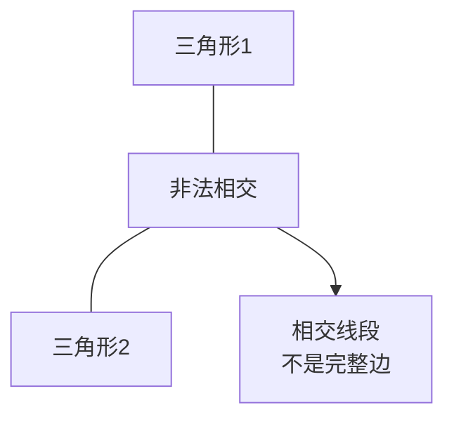

# CMU_DDG_p03

## 第 1 部分

# 组合曲面与单纯复形基础

## 核心概念：从组合到几何的桥梁

### **单纯复形（Simplicial Complex）** 的定义

- **本质定义**：由顶点、边、三角形、四面体及其高维类比构成的组合结构
- **双重理解维度**：
  - **抽象单纯复形**：仅描述元素之间的**连接关系（connectivity）**
  - **几何单纯复形**：在空间中具体指定**元素的位置**

## 拓扑空间与网格的深层关系

### **拓扑空间（Topological Space）** 的核心思想

- **关键区分**：对点之间如何连接进行建模，**而不关心它们在空间中的具体位置**
- **与网格的关系**：网格正是对拓扑空间的离散建模
- 离散方法（抽象单纯复形）提供对拓扑空间的直观理解，无需先学习复杂的连续数学定义

### 网格（Mesh）的精确定义

- 区别于日常使用的模糊含义，在此课程中具有**非常精确的数学定义**
- 主要研究对象为**单纯复形**类型的网格

## 研究内容概览

### 核心议题

- **定向（Orientation）**：如何定义各元素的朝向
- **流形性质**：判断单纯复形是否为**流形（manifold）**
- 为后续的离散微分几何运算奠定基础

### 应用延伸

- **数据分析**：单纯复形在数据分析中的应用
- **更一般的网格结构**：
  - **胞腔复形（Cell Complexes）**
  - **庞加莱对偶（Poincaré Dual）**：对后续**离散外微积分**至关重要

### 数据结构实现

- 三种主要编码方式及**各自的权衡取舍**：
  - **邻接表（Adjacency Lists）**
  - **关联矩阵（Incidence Matrices）**
  - **半边网格（Half-Edge Meshes）**

## 预备知识：凸集（Convex Set）

### 直观理解

- 即使没有精确定义，我们也能凭直觉判断形状是否凸

### 正式定义（隐含意义）

- 凸集是理解单纯复形的基础概念
- 为后续更复杂的几何结构定义提供铺垫

---

## 第 2 部分

## 凸集与凸包 (Convexity & Convex Hull)

### 凸集的定义与直观理解

- **核心概念：** 一个集合 $S \subseteq \mathbb{R}^n$ 被称为 **凸集 (Convex Set)**，当且仅当对于集合内的任意两点 $p$ 和 $q$，连接这两点的 **线段** 完全包含在该集合内。

- **数学定义：**
  > 对于 $\forall p, q \in S$，线段 $\{ (1-t)p + tq \mid t \in [0, 1] \} \subseteq S$。

### 如何判断凸性

- **判定非凸集 (Non-Convex) 更容易：** 只需找到 **一对点**，它们之间的线段穿出了集合边界，即可证明该集合非凸。
  - **示例：** 星形、瓶子、被切掉一块的 blob 都是非凸的。
- **判定凸集：** 需要验证 **所有点对** 的线段都不离开集合。这通常更难，但直觉上更容易识别。
  - **示例：** 三角形、十二面体、完整的 blob 是凸的。

### 凸包 (Convex Hull)

- **核心概念：** 如果形状本身非凸，我们可以用一个“包裹”它的最小凸形状来近似它，这个形状就是 **凸包**。

- **精确定义：**
  > 对于任意集合 $S \subseteq \mathbb{R}^n$，其凸包 $\text{conv}(S)$ 是 **包含 $S$ 的最小凸集**。
  > 等价定义：凸包是 **所有包含 $S$ 的凸集的交集**。

- **几何直觉：** 想象用一个橡皮筋紧紧包裹住一个形状（例如星形），橡皮筋最终形成的形状就是该形状的凸包。

---

## 第 3 部分

### **单纯形 (Simplex)：离散微分几何的基石**

#### **1. 凸集 (Convex Set) 与凸包 (Convex Hull)**

*   **核心概念**：**凸集** 是理解 **单纯形** 的几何前导。一个集合如果包含其中任意两点的连线，则称为凸集。
*   **凸包的两种等价定义**：
    *   **直观定义**：集合 S 的 **凸包** 是包含 S 的 **最小** 凸集。可以理解为“将一张弹性薄膜紧紧包裹在点集 S 外部所形成的形状”。
    *   **数学定义**（交集定义）：所有包含 S 的凸集的 **交集**。
        *   *几何直觉*：想象许多个包含 S 的凸多边形相互重叠，它们的重叠区域会逐渐缩小，直到“缩紧”成唯一的、最小的那个凸包。

*   **实例：立方体的凸包**
    *   给定点集 S = \( \{ (\pm1, \pm1, \pm1) \in \mathbb{R}^3 \} \) （即一个立方体的 8 个顶点）。
    *   **结论**：**凸包(S) = 实心立方体**。
    *   **推理过程**：
        1.  连接任意两个顶点，**棱** (edge) 在凸包内。
        2.  连接棱上的任意两点，**面** (face) 被填充。
        3.  连接不同面上的任意两点，**内部** (interior) 被填充。
    *   **关键**：凸包是**最小**的包含集合。虽然存在一个更大的凸球体也包含这些点，但它不是凸包。凸包必须是“恰好包裹住”的形状，即立方体本身。

#### **2. 单纯形 (Simplex) 的定义与构造**

*   **核心概念**：**单纯形** 是 **凸包** 的一个重要特例。它是一种最基本、最简单的“积木块”，用于在离散微分几何中构建复杂的形状。本质上，它是 **一组仿射无关点（Affinely Independent Points）的凸包**。
*   **通俗解释**：可以将单纯形理解为 **“低维空间的三角形”** 在高维的推广。
    *   **0-单纯形 (0-Simplex)**：一个点。
    *   **1-单纯形 (1-Simplex)**：一条线段。
    *   **2-单纯形 (2-Simplex)**：一个三角形。
    *   **3-单纯形 (3-Simplex)**：一个四面体。

*   **数学定义与公式**：
    *   给定 \( k+1 \) 个 **仿射无关** 的点 \( v_0, v_1, \dots, v_k \)，它们的凸包称为 **k-单纯形**。
    *   **数学表达式**：一个 k-单纯形 \( \sigma^k \) 是所有满足以下条件的点的集合：
        \[
        \sigma^k = \{ \sum_{i=0}^k \lambda_i v_i \mid \lambda_i \ge 0, \sum_{i=0}^k \lambda_i = 1 \}
        \]
        其中 \( \lambda_i \) 是 **重心坐标 (Barycentric Coordinates)**。
    *   **关键条件**：**仿射无关** 确保了所有点不共线/不共面，从而形成一个 “非退化” 的形状。例如：
        *   2 个点：不能重合。
        *   3 个点：不能共线（形成三角形而非线段）。
        *   4 个点：不能共面（形成四面体而非平面四边形）。

#### **3. 单纯形的几何结构与可视化**

*   **直观的构建过程（升维视角）**：
    1.  从一个 **0-单纯形**（点 A）开始。
    2.  向一个不与 A 重合的方向**拉伸**，得到 **1-单纯形**（线段 AB）。
    3.  从线段 AB 向一个**不共线的方向**伸长，得到 **2-单纯形**（三角形 ABC）。
    4.  从三角形 ABC 向一个**不共面的方向**伸长，得到 **3-单纯形**（四面体 ABCD）。
*   **关键性质**：
    *   **维度**：k-单纯形是一个 k 维对象。
    *   **边界**：单纯形的边界由 **低一维的单纯形**（其“面”或 Face）组成。
        *   例如，一个 2-单纯形（三角形）的边界是三条 1-单纯形（线段）。
        *   一个 3-单纯形（四面体）的边界是四个 2-单纯形（三角形）。

#### **4. 离散微分几何中的意义**

*   **宏大的图景**：为什么这很重要？在离散微分几何中，我们不处理连续的曲面，而是处理 **离散的网格**。而 **单纯形** 正是构建这些网格的 **原子构件**。
    *   **三角网络**：通常由 2-单纯形（三角形）组成。
    *   **四面体网格**：由 3-单纯形（四面体）组成，用于体渲染或有限元分析。
*   **总结性观点**：**单纯形是连接连续数学（凸集、几何）和离散计算（网格、算法）的桥梁**。理解其定义、构造以及作为凸包的性质，是深入理解后续复杂几何算法（如莫尔斯理论、拉普拉斯算子离散化等）的 **必要基础**。

---

## 第 4 部分

### 单纯形 (Simplex) 与仿射独立性 (Affine Independence)

- **核心概念：** **单纯形 (Simplex)** 是离散微分几何（Discrete Differential Geometry, DDG）中用于构建离散曲面和网格的基本“积木块”。
- **直观理解：** 一个 *k*-单纯形是 *k* 维空间中最简单的图形：
    - **0-单纯形:** 一个点
    - **1-单纯形:** 一条线段
    - **2-单纯形:** 一个三角形
    - **3-单纯形:** 一个四面体
    - **更高维度 (k>3):** 难以直接可视化，但概念逻辑上可以无限延伸。

#### 精确定义：从几何直觉到数学严谨

为了严格定义单纯形，需要引入一个关键的前置概念——**仿射独立性**。它与线性代数中的**线性独立性**概念相近，但应用于“点”而非“向量”。

**1. 线性独立性 (Linear Independence)**

- **定义回顾：** 一组向量 \( v_1, v_2, ..., v_n \) 是线性无关的，当且仅当**没有任何一个向量**可以表示为其他向量的**线性组合**。
    - **线性组合**形式： \( v_j = \sum_{i \neq j} a_i v_i \)，其中 \( a_i \) 是实数系数。
- **几何示例：**
    - **线性相关：** 两个方向相反（平行）的向量 \( v_1 \) 和 \( v_2 \)。因为 \( v_2 = -\lambda v_1 \)，它们可以通过缩放互相表示。
    - **线性无关：** 两个不平行（指向不同方向）的向量 \( v_1 \) 和 \( v_2 \)。无论怎么缩放 \( v_1 \)，都无法指向 \( v_2 \) 的方向。

**2. 仿射独立性 (Affine Independence)**

- **核心思想：** 一组**点** \( p_0, p_1, ..., p_k \) 是仿射无关的，如果通过它们构造出的**向量组**是线性无关的。
- **构造方法：** 选择其中一个点作为原点（通常是 \( p_0 \)），然后计算从该点到其他所有点的向量：\( v_i = p_i - p_0 \)，其中 \( i \geq 1 \)。
- **结论：** 如果向量集合 \( \{v_1, v_2, ..., v_k\} \) 是线性无关的，那么点集 \( \{p_0, p_1, ..., p_k\} \) 就是仿射无关的。
- **几何示例对比：**
    - **仿射无关（左侧三点）：** 选择任意一点为原点，得到的两个向量方向不同且不平行。因此它们是线性无关的，点集是仿射无关的。
    - **仿射相关（右侧三点）：** 选择任意一点为原点，得到的两个向量指向同一方向（共线）。因此它们是线性相关的，点集是仿射相关的。

#### 单纯形的正式定义

一个 **k-单纯形 (k-Simplex)** 就是由一个 **k+1 个仿射无关的点**组成的集合的**凸包(Convex Hull)**。

---

## 第 5 部分

## 单纯形（Simplex）——几何定义

### 核心思想：从仿射独立性到单纯形

**关键术语：** **仿射独立（Affinely Independent）**、**凸包（Convex Hull）**、**顶点（Vertices）**

单纯形是我们在 **“几何视角”** 下研究网格的基础。它不仅仅是拓扑上的连接关系，还**真正定义了图形在空间中的形状和位置**。

#### 仿射独立性的直观判断

两个向量是判断三个点是否仿射独立的关键。
- **左图示例**：向量 v1 和 v2 **线性无关**（不能通过缩放彼此得到） → 三个点 **仿射独立**。
- **右图示例**：向量 v1 和 v2 **线性相关**（v2 = 缩放 * v1） → 三个点 **仿射依赖**。

**直观理解**：
- **仿射独立** ≈ 点在一个空间中被“**一般位置**”放下，没有落入特殊情形。
- **仿射依赖** ≈ 点位于一条直线上（或更低维的子空间中），这是一种**退化情况**。

---

### 单纯形的正式几何定义

> **定义：** 一个 **k-单纯形** 是 **(k + 1) 个仿射独立点** 的**凸包**，这 (k + 1) 个点被称为它的**顶点**。

**为什么要强调“仿射独立”？**
如果顶点不满足仿射独立，例如在 2D 中选取了三个共线的点，它们的凸包是一条线段（1-单纯形），而不是一个三角形（2-单纯形）。这会导致**维度缺失**，因此必须确保顶点配置是“非退化”的。

---

### 常见单纯形示例及凸包计算

#### **0-单纯形：一个点**
- **组成**：1 个顶点（k+1 = 0+1 = 1）
- **凸包**：一个点本身。因为单点集合本身就是凸集（任意两点都是同一个点，连线不超出集合）。
- **几何形状**：**顶点**

---

#### **1-单纯形：一条边**
- **组成**：2 个仿射独立点
- **凸包**：连接这两点的**线段**。线段是包含这两点的最小凸集。
- **几何形状**：**线段**

---

#### **2-单纯形：一个三角形**
- **组成**：3 个仿射独立点（不共线）
- **凸包**：包含这三个点的**三角形**（包括内部区域）。
- **几何形状**：**三角形**

---

### 重要算法与公式

**凸包计算（核心思想）**
给定点集 \( S = \{p_0, p_1, ..., p_k\} \)，其凸包定义为：

\[
\text{Conv}(S) = \left\{ \sum_{i=0}^{k} \lambda_i p_i \ \bigg| \ \lambda_i \geq 0, \sum_{i=0}^{k} \lambda_i = 1 \right\}
\]

这表示凸包是由所有仿射组合（系数非负且和为 1）构成的点集。对于单纯形，由于顶点仿射独立，这种表示是**唯一**的。

### 总结：核心记忆点

| 单纯形类型 | 顶点数 | 几何形状 | 关键限制条件 |
| :--- | :--- | :--- | :--- |
| **0-单纯形** | 1 | **点** | 无 |
| **1-单纯形** | 2 | **线段** | 两点必须不同 |
| **2-单纯形** | 3 | **三角形** | 三点不共线 |
| **3-单纯形** | 4 | **四面体** | 四点不共面 |

> **一句话总结：** 单纯形就是由“足够一般位置”的顶点所**张成**的最基本几何单元。从点出发，到线段、三角形、四面体，每一级都通过增加一个位于“现有维度之外”的点来升维。

---

## 第 6 部分

## **单纯形 (Simplex) 与 重心坐标 (Barycentric Coordinates)**

### **1. 仿射独立 (Affine Independence) 的重要性**

-   **核心概念**：一个 **k-单纯形** 被定义为 **k+1 个仿射独立点** 的 **凸包 (Convex Hull)**。
-   **为何需要“仿射独立”？**
    -   **避免退化 (Degeneracy)**：如果点不独立（例如，三个点共线），它们的凸包会退化成更低维的形状（如线段），而不是预期的三角形。
    -   **保证维度**：仿射独立性确保了凸包的维度恰好是 **k**。
        -   2个仿射独立点 → 一个 **1-单纯形** (线段/边)。
        -   3个仿射独立点 → 一个 **2-单纯形** (三角形)。
        -   **关键公式**：仿射独立需要 **k+1** 个点，且这些点必须位于至少 **k 维** 的空间中。

-   **维度限制 (Dimensionality Constraint)**：
    -   **核心规则**：一个 **k-单纯形** 不能存在于维度低于 **k** 的空间中。
    -   例如：一个 **3-单纯形** (四面体) 需要 **4个仿射独立点**。在2D空间里，最多只有两个独立向量，无法支撑四个仿射独立点。因此，**四面体必须嵌入在3D或更高维空间**。
    -   **总结**：单纯形的维度受限于其所在空间的维度。在 **d** 维空间中，最高只能存在 **d-单纯形**。

### **2. 几何直观：从点到高阶单纯形**

-   **0-单纯形**：一个点。
-   **1-单纯形**：一条线段（连接两个点）。
-   **2-单纯形**：一个三角形（三个点围成的平面区域）。
-   **3-单纯形**：一个四面体 (Tetrahedron)（四个点在三维空间中的凸包）。

### **3. 重心坐标 (Barycentric Coordinates)：单纯形的“自然”坐标系**

-   **核心目的**：为单纯形内的任意点提供一个直观、统一的参数化方法。

-   **1-单纯形（线段）的重心坐标**：
    -   **参数化方式**：线段上的任意点 \( P(t) \) 可以表示为两个端点 \( A \) 和 \( B \) 的加权平均，权重之和为 1。
    -   **数学公式**：
        \[
        P(t) = (1 - t)A + tB, \quad t \in [0, 1]
        \]
    -   **解读**：当 \( t=0 \) 时，\( P = A \)；当 \( t=1 \) 时，\( P = B \)；当 \( t=1/4 \) 时，\( P \) 位于从A到B的 \( 1/4 \) 处。

-   **推广到k-单纯形**：
    -   这个概念可以直接推广。对于由点 \( v_0, v_1, ..., v_k \) 构成的 **k-单纯形**，其内部的任意点 \( P \) 都可以唯一地表示为：
        \[
        P = \sum_{i=0}^{k} \lambda_i v_i, \quad \text{其中} \quad \sum_{i=0}^{k} \lambda_i = 1, \quad \lambda_i \ge 0
        \]
    -   **权重 \( \lambda_i \)** 就是该点相对于顶点 \( v_i \) 的 **重心坐标**。
    -   **存在的条件**：所有权重 \( \lambda_i \) 非负，且和为1，这保证了点 \( P \) 位于单纯形内部（包括边界）。

-   **重点提炼**：
    -   **仿射独立性**是定义单纯形的关键，它保证了单纯形不会退化。
    -   **重心坐标**完美契合了单纯形的结构，它利用“权重和为一”与“非负性”这两个条件，将单纯形上的点与一个**概率分布**（或 **混合比例**）联系起来。这在插值、纹理映射、物理模拟等图形学核心应用中至关重要。

---

## 第 7 部分

### 单形（Simplex）的深入理解：重心坐标与凸组合

#### 核心概念：单形上的任意点如何表示？

*   **核心思想**：一个单形（即三角形、四面体等）内的**任意一点 p**，都可以表示为它的**顶点**的**非负加权平均**，且这些权重之和为 **1**。
*   **关键术语**：
    *   **重心坐标 (Barycentric Coordinates)**：指的就是这些权重 $t_i$。
    *   **凸组合 (Convex Combination)**：这种带非负权重且和为1的线性组合，就叫做凸组合。

*   **示例说明**：
    *   在三角形 $\sigma$ 中，内部一点可以写成：
        $$ p = \frac{2}{10} p_1 + \frac{4}{10} p_2 + \frac{4}{10} p_3 $$
    *   如何理解？该点离 $p_2$ 和 $p_3$ 更近，因为它们的权重（0.4）比 $p_1$ 的权重（0.2）更大。

*   **公式总结（重要）**：
    *   一个 $k$-单形 $\sigma$ 由所有满足以下条件的点 $p$ 组成：
        $$ p = \sum_{i=0}^{k} t_i p_i $$
        **约束条件**：
        1.  **非负性**：$t_i \ge 0$
        2.  **归一性**：$\sum_{i=0}^{k} t_i = 1$

*   **深入理解：凸包**
    *   根据上述定义，**凸包 (Convex Hull)** 可以重新被定义为：一个点集 **S** 的凸包，就是 **S 中所有点的所有凸组合的集合**。这是一个非常重要的等价定义。

### 标准 n-单形 (Standard n-Simplex)

*   **核心概念**：一个非常特殊且重要的单形，其顶点位于坐标轴上。
*   **定义**：
    *   在 $\mathbb{R}^{n+1}$ 空间中，所有满足以下条件的点 $\sigma$ 的集合：
        $$ \sigma = \{ (x_0, x_1, ..., x_n) \in \mathbb{R}^{n+1} \mid x_i \ge 0, \sum_{i=0}^{n} x_i = 1 \} $$
*   **几何形象**：
    *   它有一个顶点在原点，其余顶点都在坐标轴上，距离原点为 1。
    *   连接这些顶点，就形成了一个单形（例如在 $\mathbb{R}^2$ 中是线段，在 $\mathbb{R}^3$ 中是三角形）。
*   **一个著名的别名**：**概率单形 (Probability Simplex)**
    *   **为什么？** 因为概率的基本性质是：**非负** 且 **总和为 1**。这与标准 n-单形的坐标约束（$x_i \ge 0$, $\sum x_i = 1$）完全一致。所以，概率和单形有天然的联系。

### 从单个单形到网格：单纯复形 (Simplicial Complex)

#### 术语提示
*   **单数 vs 复数**："simplex"（单形）的复数形式不是 "simplexes"，而是 **"simplices"**。就像 "vertex"（顶点）的复数是 "vertices"。

#### 核心概念：连接单形的规则

*   **核心思想**：**单纯复形** 并不是一堆单形的简单堆砌，而是一个**有组织的、结构化的集合**。它必须满足特定的性质，才能方便地进行数学和几何处理。
*   **关键规则（必须解决两个核心问题）**：
    1.  **如何连接？**
        *   任意两个单形（例如两个三角形）**要么**是**完全不相交**的，
        *   **要么**它们只能沿着**一个更低维的公共面**（一个顶点、一条边（1-单形）或一个面（2-单形））相交。
        *   **反例（不允许的）**：两个三角形的相交部分不是它们的一个完整边界元素（例如，只相交于半条边），这种连接是被禁止的。必须是“面到面”的完整交接。

    2.  **如何包含？**
        *   如果一个单形在复形中，那么它的**所有面 (faces)**（即其所有低维子单形）也**必须**在复形中。
        *   **示例**：如果一个二维三角形（2-单形）在复形中，那么它的三条边（1-单形）和三个顶点（0-单形）也必须是复形的一部分。这保证了“元素”的完整性。

---

## 第 8 部分

### 单纯复形（Simplicial Complex）的结构与性质

#### 核心概念：什么是单纯复形？

- **单纯复形**不是一堆单纯形（simplex）的随机堆叠，而是一个**有严格组织规则**的集合。
- 其核心在于**规定不同单纯形之间如何相交**，这是复形易于操作的关键。

#### 单一单纯形的解剖：面（Face）

- **定义**：一个单纯形 $\sigma$ 的**面**是由 $\sigma$ 的**顶点子集**构成的任何单纯形。
- **举例（2-单纯形，即三角形）**：
    - 设三角形顶点为 $P_0, P_1, P_2$。
    - 它的所有面包括：
        - **顶点**（1-面）：$\{P_0\}, \{P_1\}, \{P_2\}$（大小为1的子集）
        - **边**（2-面）：$\{P_0, P_1\}, \{P_1, P_2\}, \{P_0, P_2\}$（大小为2的子集）
        - **自身**（3-面）：$\{P_0, P_1, P_2\}$——**一个单纯形是它自身的面**（非真子集情况）。
- **技术细节：空集**：严格来说，所有顶点的子集还包括**空集** $\emptyset$，它形式上定义了一个 **-1 维单纯形**。这是一个纯技术性概念，用于简化某些公式，**理解上可以忽略它**。

#### 定义：几何单纯复形（Geometric Simplicial Complex）

这是一个**在空间中具有几何位置**的单纯形集合，必须满足两条严格规则：

1.  **规则一（交的封闭性）**：复形中**任意两个单纯形的交**，必须是一个**单纯形**（或为空集，空集被视为一个“特殊”的-1维单纯形）。
    - **示例**：两个三角形可以相交于一条边或一个顶点；一个四面体和一个三角形可以相交于一个顶点。
2.  **规则二（面的完整性）**：如果复形中包含一个单纯形，那么**它的每一个面也必须包含在复形中**。
    - **示例**：如果复形中有一个四面体，那么它必须同时包含该四面体的所有三角形面、所有边和所有顶点。

---

## 第 9 部分

## 单纯复形（Simplicial Complex）的核心概念

### 1. 单纯复形的定义与包含关系

**核心概念**：一个合法的单纯复形不仅包含其最高维的单纯形，还**必须包含所有低维的面（faces）**。

- **闭包性质（Closure Property）**：如果某个单纯形（如四面体）在复形中，那么它的所有面（三角形、边、顶点）以及空集都必须在复形中。

- **几何单纯复形（Geometric Simplicial Complex）**：
  - 由点、线段、三角形、四面体等**凸包**组成的集合
  - 必须满足"**所有子集都在集合中**"的性质

### 2. 非法单纯复形的反例

**核心概念**：两个三角形在某条边的一个**子线段**上相交，但该线段**不是**这两个三角形的公共边。

- 这种结构**不是**合法的单纯复形，因为相交部分不是一个明确属于复形的边。

### 3. 具体实例分析

**示例复形结构**：
- **顶点**：0, 1, 2, 3, 4, 5, 6, 7, 8, 9, 10
- **2-单纯形（三角形）**：{6,7,9} 和 {7,10,8}
- **1-单纯形（边）**：
  {2,3}, {3,4}, {4,5}
  {6,7}, {7,9}, {9,6}
  {7,8}, {8,10}, {10,7}
- **0-单纯形（顶点）**：所有11个顶点（0-10）

### 4. 连通性 vs 几何信息

**核心洞察**：单纯复形的描述**只包含连接信息**，不包含位置信息。

| 不包含的信息 | 包含的信息 |
|------------|-----------|
| 顶点坐标 | 顶点间的连接关系 |
| 边长 | 哪些顶点构成边 |
| 面积 | 哪些边构成三角形 |
| 角度 | 哪些三角形构成四面体 |

## 抽象单纯复形（Abstract Simplicial Complex）

### 1. 抽象定义

**核心概念**：从几何中剥离出来，只保留组合结构的纯粹代数定义。

> **形式化定义**：
> 令 \( S \) 是一个集合的集合（collection of sets），
> 如果对于每个 \( \sigma \in S \)，\( \sigma \) 的所有子集也都在 \( S \) 中，
> 则 \( S \) 是一个**抽象单纯复形**。

### 2. 抽象单纯形（Abstract Simplex）

**核心概念**：将几何单纯形抽象为**集合**。

- **定义**：集合 \( \sigma \in S \) 的大小为 \( k+1 \) 时，称为一个**k-抽象单纯形**
- **关键转变**：
  - 几何视角：\( k \)-单纯形是 \( k+1 \) 个仿射无关点的凸包
  - **抽象视角**：\( k \)-单纯形就是一个含有 \( k+1 \) 个元素的集合

### 3. 记法与维数

**核心概念**：维数通过集合大小减1来定义。

\[
\text{维数} = |\sigma| - 1
\]

- **0-单纯形**：大小为1的集合（顶点）
- **1-单纯形**：大小为2的集合（边）
- **2-单纯形**：大小为3的集合（三角形）

### 4. 抽象化的意义

**核心洞察**：抽象单纯复形**完全由组合结构定义**，不依赖于具体几何实现。

- **优势**：
  - 可以描述任意维度的拓扑结构
  - 便于计算机表示和处理
  - 适用于**离散微分几何**等数值计算领域

- **与几何单纯复形的关系**：
  - 每个几何单纯复形对应一个抽象单纯复形
  - 但抽象单纯复形可以有多种几何实现方式

## 关键公式总结

### 闭包条件

\[
\forall \sigma \in S, \tau \subseteq \sigma \implies \tau \in S
\]

### 维数公式

\[
\dim(\sigma) = |\sigma| - 1
\]

其中 \( |\sigma| \) 表示集合 \( \sigma \) 的元素个数。

---

## 第 10 部分

## 抽象单纯复形与抽象单纯形

- **核心概念**: 将单纯复形的概念从几何中抽象出来，**只关心连接关系，忽略几何形状和空间位置**。
- **抽象单纯复形 (Abstract Simplicial Complex)**: 是一个集合的集合 \(S\)，其中每个元素都是某个基础顶点集的一个子集，并且满足 **向下封闭性**：如果 \(\sigma \in S\)，那么 \(\sigma\) 的所有子集也都在 \(S\) 中。
- **抽象单纯形 (Abstract Simplex)**: 在 \(S\) 中，大小为 \(k+1\) 的集合 \(\sigma\) 称为一个 **k维抽象单纯形**。
- **几何 vs. 抽象**: 一个几何单纯复形，如果忽略其在空间中的具体“摆放”方式，只关心“谁和谁相邻”、“哪些顶点构成了三角形/四面体”，那么它就对应一个纯粹的抽象单纯复形。

### 拓扑空间的离散模拟

- **核心概念**: 抽象单纯复形是 **拓扑空间的一个离散模拟**。
- **意义**: 它提供了一个框架来研究几何体的 **连接性（连通性）**，而无需关心其具体的形状或嵌入空间的位置。
- 它就像一张“连接蓝图”，只告诉你顶点、边、面等之间如何相互关联。

## 关键示例

### 示例 1：图 (Graph)

- **核心概念**: 一个 **无向图 \(G = (V, E)\) 是一个一维抽象单纯复形**。
- **解释**:
    - 最高维度的单纯形是边（一维）。
    - **0-单纯形 (0-simplex)** = 图的顶点。
    - **1-单纯形 (1-simplex)** = 图的边。
- 这是最直观的例子，完全符合抽象单纯复形的代数结构。

### 示例 2：抽象的符号集合

- **核心概念**: 通过检查是否满足“所有子集都在集合中”来验证一个抽象的符号集合是否为单纯复形。
- **问题**: 给定一个集合 \(S\)，它由以下元素组成：
    - \(\{1\}, \{2\}, \{heart\}, \{smiley\}\)
    - \(\{1, 2\}, \{2, heart\}, \{heart, 1\}, \{1, smiley\}, \{2, smiley\}, \{heart, smiley\}\)
    - \(\{1, 2, heart\}\)
    - \(\varnothing\) (空集)

- **验证过程**:
    1. 检查每个集合的所有子集是否都在 \(S\) 中。
    2. 以 \(\{1, 2, heart\}\) 为例，它的所有2元素子集是：\(\{1, 2\}, \{2, heart\}, \{heart, 1\}\)，这些都在 \(S\) 中。
    3. 所有1元素子集 \(\{1\}, \{2\}, \{heart\}\) 也在 \(S\) 中。
    4. **结论**: \(S\) 是一个 **有效的抽象单纯复形**。

- **绘制示意图**: 你可以根据这个抽象结构绘制一个“连接图”，例如顶点1、2、heart组成一个 **三角形（2-单纯形）**，而顶点 smiley 仅通过 **边（1-单纯形）** 与前者相连。

---

## 第 11 部分

### 拓扑数据分析与单纯复形构建

#### 核心思想：从点云到结构理解

- **核心概念**：通过**单纯复形（Simplicial Complex）**，将离散的数据点（如点云）转化为可分析的拓扑结构，从而发现数据内部的连通性模式。
- **关键术语**：
  - **抽象单纯复形（Abstract Simplicial Complex）**：顶点不再局限于空间中的几何点，可以是任何数据对象（例如网络节点、特征向量）。
  - **单纯形（Simplex）**：
    - **0-单纯形** = 顶点（点）
    - **1-单纯形** = 边（连接两个点）
    - **2-单纯形** = 三角形（连接三个点）

#### 单纯复形的直观示例

- **场景**：两个三角形（2-单纯形）共享一条公共边（1-单纯形）。
- **几何可视化**：
  - 在平面中绘制，两个三角形共用一条边，形成一个“蝴蝶结”形状。
  - 顶点可以是任意数据，不要求坐标位置。

#### 关键应用：持久同调（Persistent Homology）

- **目标**：在没有几何形状信息的情况下，仅通过**连通性**分析数据中的结构（例如，从点云中识别出字母“A”、“B”等形状）。
- **方法步骤**：
  - **输入**：一组离散数据点（如坐标列表）。
  - **过程**：**逐半径扩张球体**（Growing Balls）：
    1. 以每个点为中心，不断增大球体半径。
    2. **连接规则**：
       - 两个球重叠 → 创建一条 **1-单纯形**（边）。
       - 三个球重叠 → 创建一个 **2-单纯形**（三角形）。
       - 更多球重叠 → 创建更高维单纯形（**d-单纯形**）。
  - **输出**：随着半径增长，逐步建立不同维度的单纯形，形成不同分辨率的连通结构。

- **算法示意**：
  - **输入**：点集 \( P = \{p_1, p_2, ..., p_n\} \)
  - **循环**：对半径 \( r = r_0, r_1, ..., r_k \)（逐步增大）：
    - 对每对点 \((p_i, p_j)\)，如果距离 \( d(p_i, p_j) \le 2r \)，则添加边（1-单纯形）。
    - 对每三个点 \((p_i, p_j, p_k)\)，如果它们两两距离都 \(\le 2r\)，则添加三角形（2-单纯形）。
    - 以此类推，添加更高维单纯形。
  - **结果**：通过比较不同半径下的连通性特征（如环、空洞的出现与消失），识别数据的持久的拓扑特征（例如，三个字母对应的环形结构）。

#### 实际意义

- **拓扑数据分析（Topological Data Analysis）**：一个独立的研究领域，专注于用拓扑学（而非纯几何）来理解数据。
- **优势**：
  - 对噪声不敏感（结构基于连通性）。
  - 能自动发现数据中的多维结构（如空洞、簇状、环形）。
- **例子价值**：人类肉眼能看出点云形成字母“A”、“B”、“C”，但计算机通过持久同调也能“识别”出这些形状的连通性差异。

---

## 第 12 部分

## 持久同调与持久性图（Persistence Diagram）

### 核心思想：不信任单一尺度，跟踪特征的“生死”

- **问题**：对于点云数据（如字母形状的采样点），如果用一个固定半径的球去连接点（球半径增大时，球重叠则连边，三个球重叠则填充三角形），你会得到一系列不断变化的单纯复形。
- **现象**：半径很小时，点都是孤立的（多个连通分量）。半径增大时，正确的连接（如字母内部的点）先形成，但半径继续增大，错误的连接（字母之间、孔洞被填充）也会出现。
- **结论**：没有哪个单一半径是“正确”的。**你不能信任任何一个特定的尺度，而应该追踪不同拓扑特征（如连通分量、孔洞）的“出生”和“死亡”过程。**

### 关键过程：球半径增长下的复形演化

- **生长过程**：对于底部的点集，让球半径从0开始逐渐增大。
  - **两球重叠** → 形成一条**边**。
  - **三球重叠** → 形成一个**三角形**（二维单纯形）。
  - 更多球重叠 → 形成更高维的单纯形。
- **观察结果**：
  - 初始阶段：三个字母内部正确连接。
  - 后期阶段：过度连接，字母间的孔洞被填满，不同字母的点被连接在一起。

### 核心工具：持久性图（Persistence Diagram）

- **定义**：将每个拓扑特征（如一个连通分量、一个环）的“出生”和“死亡”时刻作为一个点绘制在二维平面上。
  - **X轴**：该特征**出生**时的半径（或阈值）。
  - **Y轴**：该特征**死亡**时的半径（或阈值）。
- **关键性质**：所有点都位于**对角线（y = x）上方**，因为一个特征必须先生存，才能死亡。
- **信息解读**：
  - **远离对角线的点**：表示**寿命长**的特征（特征出生后很久才死亡）。
  - **靠近对角线的点**：表示**寿命短**的特征（特征出现后很快就消失了）。

### 信号与噪声的区分：持久性（Persistence）作为信度指标

- **长效特征（远离对角线） = 真实信号**
  - 例如：三个字母的独立连通分量。它们各自在内部连接后，形成了稳定的结构，持续了很长时间，直到整个数据集最终被连接到一起才“死亡”。
  - 这意味着这些特征是数据固有的拓扑属性，具有高置信度。

- **短效特征（靠近对角线） = 噪声**
  - 例如：两个点刚接触产生一条边，但很快第三个点加入，边就变成了三角形（原特征死亡）；或者一个微小孔洞出现后立即被填充。
  - 这些特征通常由采样密度不均或数据局部随机性引起，是**可忽略的噪声**。

### 总结公式 (思想层面)

- **持久性 (Persistence)** = **死亡时间 (Death)** - **出生时间 (Birth)**
- **持久性越大**，该拓扑特征越有可能代表数据的真实结构（**信号**）。
- **持久性越小**，该拓扑特征越可能由采样误差或局部细节引起（**噪声**）。

---

## 第 13 部分

### 持续同调的应用：从材料科学到几何与生物网络

**核心概念：** 持续同调不仅是一个纯拓扑工具，其真正的价值在于**将离散的点云数据转化为一个具有辨识度的“指纹”——即持续条形码**。这个条形码可以用来分类、识别和比较不同的数据现象。

#### 1. 从噪声中识别特征

- **关键术语：** 噪声特征、显著特征。
- **核心思想：** 在持续同调生成的条形图中，**那些在横轴上跨度很长（持久）的条形** 代表数据中鲁棒的、本质的结构特征。而**那些短暂出现后迅速消失（跨度短）的条形** 极大概率是**噪声**，其产生仅仅依赖于采样方式。这是利用同调进行数据分析的底层逻辑。

#### 2. 材料科学中的应用：玻璃态的表征

- **问题背景：** 在材料科学中，区分固体、液体、气体相对容易。但“玻璃”是一种特殊的非晶态，其原子排列既不像固体那样长程有序，也不像液体那样完全无序。传统方法**缺乏一种定量的、可计算的判据**来定义什么是玻璃。
- **关键方法与发现：**
    - 研究人员将**玻璃中的大量原子坐标视为三维空间中的一个点云**。
    - 通过构建这些点的**Vietoris-Rips复形**（或其他单纯复形），并计算其**持续同调**。
    - **核心发现：** 与完全随机排列的原子相比，玻璃的**持续条形图中会出现一个非常强烈、显著的特征**（如图中橙色竖直的长条形区域）。这个特征在随机排列中不存在。
- **公式/算法启发：** 虽然没有具体公式，但过程本质上是：对点云进行**持续同调计算** → 生成**条形码** → 发现重复出现的**长条** → 定义为“玻璃态”的结构特征。
- **意义：** 这提供了其他数据分析工具（如 PCA 或聚类）无法发现的**深层结构信息**。

#### 3. 几何识别：指尖与物体的“签名”

- **核心思想：** 持续同调可以作为一个**局部的、多尺度的形状签名**。
- **具体方法（以手指识别为例）：**
    1.  **选定查询点：** 假设在左手食指中部有一个点。
    2.  **模拟膨胀过程：** 在该点上**生长一个球体**，半径逐渐增大。
    3.  **捕捉拓扑事件：**
        - 当球体增大到一定程度时，它会**凹陷下去**包裹住指尖结构。
        - 球体会**与自身发生碰撞**，切断指尖的连接部分。
        - 最终指尖被完全覆盖。
    4.  **记录事件时间：** 记录上述拓扑事件（如 1-圈 或 0-圈 的出生与死亡）发生的**半径值**。
    5.  **形成签名：** 将这些事件排列成一个独特的**持续条形码**。
- **关键术语：** 形状签名、局部特征描述子。
- **交叉验证：** 如果另一只手（可能来自不同个体）的中指中部也提取出相似的条形码，算法即可做出判断：“这是一个位于中指中部的点”。

#### 4. 生物网络：脑神经分析

- **应用场景：** 将每个神经元视为点云中的一个数据点，神经元之间的连接视为边或单纯形。
- **目的：** 利用持续同调分析整个脑神经网络的拓扑结构。
- **结果：** 通过比较**健康大脑**与**患病大脑（如阿尔茨海默症、癫痫等）** 的持续条形码，可以**帮助区分两类大脑的结性差异**。例如，健康大脑的条形码可能显示出更长的环或更复杂的空洞结构。

### 总结与核心启示

| 应用领域 | 输入数据 | 核心洞察（从条形码中看到的） | 实际意义 |
| :--- | :--- | :--- | :--- |
| **材料科学 (玻璃)** | 原子坐标 (3D点云) | 存在一个**非常持久**的拓扑特征（如环），在随机排列中缺失。 | 提供了一种**量化定义玻璃态**的数学工具。 |
| **几何识别 (指尖)** | 曲面上的一个点 (2D流形上的局部邻域) | 球体膨胀过程中遇到的**序列拓扑事件**（切断、覆盖）。 | 生成**多尺度、局部唯一的签名**，用于点对点匹配。 |
| **生物网络 (脑神经)** | 神经元连接图 (图/网络点云) | 不同类别（健康/病变）的条形码在**条形长度**和**结构复杂性**上存在差异。 | 提供了一种**区分病理状态**的非监督式分析方法。 |

**一句话总结：** 持续同调将任意维度的点云数据，通过**拓扑学的“镜头”**，转化为**可比较的、抗噪声的“指纹”**，使其成为从微观材料结构到宏观大脑网络等复杂系统的强大分析引擎。

---

## 第 14 部分

## 单纯复形的解剖学：闭包、星与链环

在深入探讨**持续同调**之前，理解单纯复形的精细结构至关重要。持续同调是**拓扑数据分析（TDA）**的核心工具，应用广泛，例如：
- **医学成像**：通过分析手指（或大脑神经元网络）的“持久性条形码”来区分健康与病变组织。
- **社交网络分析**：洞察社区结构与成员关系，不依赖于图上的具体数值数据。
- **其他应用**：识别癌症、对篮球运动员进行分类、图像压缩等。

要像这样分析单纯复形，需要掌握其三个基本解剖操作：**闭包（Closure）**、**星（Star）**和**链环（Link）**。

---

### 1. 闭包（Closure）

*   **核心概念**：给定一个单形集合，**闭包**是指包含该集合的**最小单纯复形**。
*   **关键性质**：单纯复形必须包含其所有**面（Faces）**。因此，闭包操作会补全所有缺失的子单形。
*   **算法/过程**：
    1.  给定集合 $S$。
    2.  找到包含 $S$ 的 **最小单纯复形** $\text{Cl}(S)$。
    3.  这意味着将 $S$ 中每个单形的**所有面**都纳入集合。

*   **例子**：
    *   **给定集合**：一个二维单形（三角形）+ 一条边。
    *   **闭包结果**：不仅包含原始三角形和边，还必须包含：
        *   三角形的**三条边**。
        *   三角形的**三个顶点**。
        *   那条边的**两个顶点**。
    *   **图示**：想象一个三角形和一条不相连的线段。闭包操作会填充三角形的所有边框，并独立地补全线段的两端。

---

### 2. 星（Star）

*   **核心概念**：给定一个子集（如一个顶点），**星**是该子集是其中一部分的所有单形的**并集**。
*   **关键性质**：它强调“**包含关系**”。星关注的是所有**“包含”**给定子集的单形。
*   **算法/过程**：
    1.  给定一个单纯复形 $K$ 和一个子集 $A \subseteq K$。
    2.  **星** $\text{St}(A)$ 是所有满足 $A \subseteq \tau$ 的 $\tau \in K$ 的集合。

*   **例子**：
    *   **给定子集**：一个顶点 $v$。
    *   **星结果**：所有**包含** $v$ 的单形：
        *   所有以 $v$ 为一个端点的边。
        *   所有以 $v$ 为一个顶点的三角形（或更高维单形）。
    *   **关键区别**：星**不包含**那些不包含 $v$ 的边（例如，暗蓝色区域外围的边界边），即使这些边与 $v$ 相邻。

---

### 3. 链环（Link）

*   **核心概念**：**链环**是**闭包**和**星**的复合操作。它提取出围绕给定子集的“边界”结构。
*   **定义/公式**：
    $$\text{Lk}(A) = \text{Cl}(\text{St}(A)) - \text{St}(\text{Cl}(A))$$
    *   另一种常见解释：$\text{Lk}(A) = \text{Cl}(\text{St}(A)) \setminus \text{St}(A)$。即，**链环**是星的**闭包**，再**减去**星本身。
*   **直观理解**：如果你有一个顶点 $v$，
    *   **星**包含所有“填满”的三角形和边。
    *   **链环**则剥离这些填充物，留下**围绕该顶点的环状边界**。它就像一个“项链”或“环”。

*   **例子**：
    *   **给定子集**：一个顶点 $v$。
    *   **链环结果**：一个由边组成的**环**（Loop），该环完全围绕顶点 $v$，但**不包含** $v$ 本身或任何包含 $v$ 的单形。
    *   **为什么有用**：通过分析顶点 $v$ 的**链环**，可以判断 $v$ 是否位于一个封闭区域的内部（如圆盘中心）或边界上。这是理解单纯复形局部拓扑性质的关键。

---

## 第 15 部分

## 3D网格的局部结构：星形、闭包与链接

### 核心概念：三种基本集合操作
在三角网格的**单纯复形**理论中，有三大基本操作可以精准描述"以某个顶点为中心"的局部结构。这些操作帮助我们避免冗长的描述，用一句话就能指明你关心的是网格的哪一部分。

- **星形 (Star)**：**与顶点相邻的所有单纯形的集合**。具体来说，就是所有包含该顶点的三角形、边和顶点本身。就像一个"辐射"出去的区域。
    - *注意*：星形**不包含**环绕该顶点的**边环**（即最外圈的边）。
- **闭包 (Closure)**：**把任何集合的所有面（边和顶点）都补齐的操作**。如果你有一个三角形，闭包会把这个三角形的三条边和三个顶点全部加入该集合。
- **链接 (Link)**：**"边界"结构**，用于描述顶点周围的"邻居"连接关系。计算公式为：
    - **`link(顶点) = Closure(Star(顶点)) - Star(Closure(顶点))`**
    - 通俗理解：先把星形闭包（填满所有内部），再减去星形的内部区域，剩下的就是**环绕顶点的那一圈边界**（即那个边环）。

> **应用场景**：当你想描述"与顶点相邻的所有三角形"时，直接说 **"该顶点的星形"**；当你想描述"环绕顶点的那个边环"时，直接说 **"该顶点的链接"**。

---

## 三角网格的符号表示

### 关键公式与命名惯例
对于三角网格（二维单纯复形），我们采用与图论类似的简写标记，但增加了"面"的维度：

- **`K = ( V , E , F )`**
    - `V` = **顶点集合** (Vertices)
    - `E` = **边集合** (Edges)
    - `F` = **面集合** (Faces)

### 重要警告：术语冲突
- **通用单纯形定义**中，"面"（face）指的是**任何**由原始单纯形顶点子集构成的低维单纯形（例如：三角形的三条边和三个顶点都是它的"面"）。
- **在此处三角网格的上下文中**：`F` 特指 **最高维度的面**，即**三角形**本身。

> **记忆点**：在网格处理中，见到 `F` 就默认理解为"三角形"（Top-degree face），而非通用理论中的低维子集。

### 命名来源
为什么用 `K` 表示复形？
- 因为**复形**的德文是 **"Komplex"**，以 `K` 开头。

---

## 网格的"方向性"：为计算赋能的额外结构

### 引入动机
仅仅拥有顶点、边、面的拓扑结构还不够。当我们开始**在网格上进行几何计算**（例如：法线计算、曲率、积分）时，需要为每个单元赋予**方向**这一额外数据。

### 直观理解：生活中的"方向"
- **单行道**：一条街道（边）只能朝一个方向行驶，这就是**边的定向**。
- **有向盒**：搬运箱子时必须保持某一面朝上，这就是**面的定向**。
- **莫比乌斯带**：一个经典的"不可定向"曲面，它**只有一条边、一个面**。这直接证明了并不是所有表面天然具有一致的方向性。

### 核心要点
**方向 (Orientation)** 是附加在单纯形（顶点、边、面）上的一种数据结构。有了它，我们才能定义：
1.  哪个方向是"正向"的边（用于计算梯度）。
2.  哪个方向是"向上"的面（用于计算法线，区分内外）。
3.  识别网格是否具备**可定向性**（例如：莫比乌斯带不可定向，而球面可定向）。

> **总结**：这一小节为后续引入**方向**概念做铺垫，让你意识到：看似简单的"上/下"、"左/右"在网格计算中是必须明确指定的基础数据。

---

## 第 16 部分

### 单纯形的定向 (Orientation of Simplices)

#### 核心概念：为什么需要定向？
- **定向**的核心思想是赋予几何元素一个“方向”，这对于后续计算（如**积分**）至关重要。
- 比如，一条边（1-单纯形）从A到B的积分，与从B到A的积分符号相反。定向就是用来记录这种顺序的。

#### 1-单纯形（边）的定向
- **核心概念**：1-单纯形的定向就是确定边的“走向”。
- **表示方法**：
    - 无序集合：`{a, b}` 只表示顶点集合，没有方向。
    - **有序元组**：`(a, b)` 或 `(b, a)` 明确表示了方向。
- **直观理解**：就像一条单向街道，你可以选择“从A到B”或“从B到A”。

#### 2-单纯形（三角形）的定向
- **核心概念**：三角形的定向由**顶点环绕顺序**决定。
- **两种定向**：
    - **逆时针 (Counterclockwise)**：例如 `(a, b, c)`。
    - **顺时针 (Clockwise)**：例如 `(a, c, b)`。
- **关键规则**：**循环移位**（Cyclic Shift）表示相同的定向。
    - 例如 `(a, b, c)`、`(b, c, a)`、`(c, a, b)` 都代表同一个逆时针定向。
    - 而 `(c, b, a)`、`(b, a, c)`、`(a, c, b)` 都代表同一个顺时针定向。
- **数学抽象**：有向2-单纯形可以定义为**三元组的等价类**，其中两个三元组如果可以通过循环移位相互转换，则视为等价。

#### k-单纯形的通用定向定义
- **核心概念**：对于任意维度的k-单纯形，定向的定义是统一的。
- **定义方法**：
    - 一个**有向k-单纯形**由一个**有序的(k+1)元组** `(v0, v1, ..., vk)` 给出。
    - 如果两个元组可以通过一个**偶置换**（偶数次交换）相互转换，则它们定义**相同的定向**。
    - 如果通过**奇置换**（奇数次交换）转换，则定义**相反的定向**。
- **重要性质**：这种定义方式与**循环移位**一致，但适用于更高维度。

#### 为什么定向是重要的铺垫？
- **目标**：构建**离散外微分 (Discrete Exterior Calculus, DEC)**。
- **应用**：在DEC中，我们需要沿边进行积分。**定向决定了积分的符号正负**。
- **物理类比**：就像液晶中的微小粒子具有方向性，但与磁铁不同，它们没有天然的优势方向。定向是人为赋予但在计算中必不可少的属性。

---

## 第 17 部分

### 单形与复形的方向性

#### 核心定义：**定向 \( k \)-单形**
- **基本思想**：定向 \( k \)-单形是一个有序元组，但仅在**偶置换**意义下等价。
  - **数学定义**：两个有序顶点元组通过**循环移位**或**偶数次交换**被视为等价的。
  - 这意味着每个 \( k \)-单形始终只有**两种可能的定向**，对应于**偶数次置换**（正定向）和**奇数次置换**（负定向）。
- **与低维类比**：
  - 1-单形（线段）：定向 = 箭头方向（\( [v_0, v_1] \) vs \( [v_1, v_0] \)）。
  - 2-单形（三角形）：定向 = 顺时针/逆时针旋转次序。
  - 高维单形（如四面体）：通过**顶点顺序的奇偶性**定义，无法用简单箭头表示。

#### 关键术语与概念
- **正/负定向**：
  - 以规范单形 \( [0, 1, \dots, k] \) 为基准，偶数次置换得到**正定向**（相同方向），奇数次得到**负定向**（相反方向）。
- **边界情况：0-单形（顶点）**：
  - 此时仅有**一个排列**（元组不变），因此顶点**总是正定向**的，无正负之分。

#### 示例：四面体（3-单形）的定向
- 顶点编号为 1, 2, 3, 4。
  - **正定向**（偶置换）：\( [1,2,3,4] \)、\( [1,3,4,2] \)、\( [1,4,2,3] \) 等。
  - **负定向**（奇置换）：\( [1,2,4,3] \)、\( [3,1,4,2] \)、\( [1,3,2,4] \) 等。
  - **快速表示**：只需一个代表性元组，如：
    - \(\text{+}\sigma = [1,2,3,4]\)
    - \(\text{-}\sigma = [1,2,4,3]\)

#### 推广：**定向单纯复形**
- 定义：为**单纯复形中的每个单形**都指定一个定向（即顶点顺序的等价类）。
- 关键要求：
  - 不同单形间的定向选择**无全局约束**（每个单形独立选择正或负）。
  - 但为了后续**链复形**（链、边界算子）的计算一致，约定：
    - 如果两个单形共享低维面，它们的定向应**自然相容**（即共享面的定向应匹配）。

#### 重要公式与笔记
- **定向与置换数量的关系**：
  \[
  \text{存在 } (k+1)! \text{ 种顶点排列} \implies \frac{(k+1)!}{2} \text{ 种元组表示同一正定向}\ （当 k \ge 1）
  \]
- **边界算子中的应用**（后续章节关键）：
  - 定向决定了边界项的**符号**：\( \partial [v_0, \dots, v_k] = \sum_{i=0}^k (-1)^i [v_0, \dots, \hat{v_i}, \dots, v_k] \)，其中 \((-1)^i\) 依赖于定向的一致性。

---

## 第 18 部分

好的，这是根据您提供的第18部分讲座内容整理的笔记。

### 定向单纯复形 (Oriented Simplicial Complex)

#### 核心概念：从“集合”到“有序元组”的转变

- **定向单纯复形** 本质上就是一个普通的 **单纯复形**，但其中每个单纯形都被赋予了一个**方向**。
- 这个方向是通过指定其顶点的**顺序**（直到偶置换）来定义的。
- 在表示上，每个单纯形不再被写成一个**集合**（例如 `{a, b, c}`），而是被写成一个**有序元组**（例如 `(a, b, c)` 或 `(b, a, c)`），用这个元组来代表该单纯形的定向。

#### 关键特性：方向选择的任意性

- **最重要的一点：方向的选择是完全任意的。** 同一个复形中的不同单纯形之间，其方向**不需要**任何形式的一致性。
- 例如，如果一个三角形的方向是顺时针，它并不要求其三条边的方向也必须构成顺时针的循环。每个单纯形（每个顶点、每条边、每个面）的方向都是独立决定的。

    > **例子对比：**
    >
    > 一个定向单纯复形 `K₁` 可能包含三角形 `(a, c, b)` (逆时针) 和边 `(b, c)` (从b到c)。
    >
    > 另一个定向单纯复形 `K₂` 包含完全相同的几何形状（相同的顶点、边、三角形），但可能包含三角形 `(a, b, c)` (顺时针) 和边 `(c, b)` (从c到b)。这就是一个完全不同的定向单纯复形，因为它包含了不同的方向信息。

#### 相对定向 (Relative Orientation)

尽管方向可以任意选择，但我们可以精确地讨论两个定向单纯形之间的**相对定向**关系。

- **定义：** 两个不同的**定向单纯形**，如果它们交集中的**最大维面**（`maximal faces`）具有**相反的方向**，则称它们具有**相同的相对定向**。

- **重要术语：**
  - **最大维面：** 指两个单纯形交集里维数最高的那个单纯形。
    - 例如，两个三角形交于一条边，这条边就是它们的最大维面。
    - 如果两个三角形交于一个顶点，这个顶点就是它们的最大维面。
  - **“相反的方向”：** 这里的“方向”是针对该**最大维面**本身作为定向单纯形而言的。

- **判定标准：**
  - 对于两个交于一条边的三角形，如果这条边在**一个**三角形中的方向与在**另一个**三角形中的方向**相反**，则这两个三角形具有**相同的相对定向**。

- **例子分析 (两个共享边 `bc` 的三角形)：**
  - 假设三角形1是 `(a, b, c)` (即顶点顺序为a, b, c)。
    - 它的边 `bc` 的方向是：从 `b` 到 `c`。记为 `(b, c)`。
  - 假设三角形2是 `(d, c, b)` (即顶点顺序为d, c, b)。
    - 它的边 `bc` 的方向是：从 `c` 到 `b`。记为 `(c, b)`。
  - 判定：
    - 最大维面是边 `bc`。
    - 在三角形1中，边 `bc` 的方向是 `(b, c)`。
    - 在三角形2中，边 `bc` 的方向是 `(c, b)`。
    - `(b, c)` 和 `(c, b)` 的方向**相反**。
  - **结论：** 因此，三角形 `(a, b, c)` 和三角形 `(d, c, b)` 具有**相同的相对定向**。

> **直观理解：** “相同的相对定向”意味着沿共享边界时，两个单纯形的“行走方向”或“流量”是连续的，一个流入，另一个流出，而不是互相冲突。这为后续定义边界算子（boundary operator）和上同调（cohomology）等概念奠定了基础。

---

## 第 19 部分

### 三角网格中的相对朝向与定向一致性

本部分深入探讨了单纯复形（Simplicial Complex）中，共享边（或面）在不同三角形之间的**相对朝向（Relative Orientation）** 概念，并揭示其如何反映整体形状的**拓扑性质**。

#### 1. 核心概念：共享边的朝向

- **关键术语**：**相对朝向（Relative Orientation）**、**边朝向（Edge Orientation）**。
- **问题**：两个共享一条边的三角形，它们的“朝向”是否一致？答案取决于该共享边在两个三角形中的**方向定义**。
- **判断标准**：判断相对朝向是否相同，不是看三角形的顶点排列顺序，而是看**对公共边的方向定义是否相反**。
    - **相同相对朝向**：两个三角形对共享边的方向定义**相反**（例如，一个定义为 $C \to B$，另一个定义为 $B \to C$）。这意味着在局部，两个三角形都按照**顺时针**或**逆时针**排列。
    - **不同相对朝向**：两个三角形对共享边的方向定义**相同**。这意味着它们的局部旋转方向不一致。

#### 2. 实例分析：两个不同的三角形对

- **场景A：相同相对朝向**
    - 三角形1: $\triangle ACB$，共享边为 $CB$（方向 $C \to B$）。
    - 三角形2: $\triangle BCD$，共享边为 $BC$（方向 $B \to C$）。
    - **结论**：由于 $CB = -BC$，方向相反，因此它们具有**相同的**相对朝向。两者都是顺时针（Clockwise）。
- **场景B：不同相对朝向**
    - 三角形1: $\triangle ABC$，共享边为 $BC$（方向 $B \to C$）。
    - 三角形2: $\triangle BCD$，共享边为 $BC$（方向 $B \to C$）。
    - **结论**：由于 $BC = BC$，方向相同，因此它们具有**不同的**相对朝向。

#### 3. 全局意义：可定向性

- **关键术语**：**可定向流形（Orientable Manifold）**、**不可定向流形（Non-orientable Manifold）**。
- **核心问题**：能否为整个单纯复形（Simplicial Complex）的**所有**三角形统一分配一个朝向，使得任意两个共享边的三角形都具有**相同的**相对朝向（即，共享边方向始终相反）？
- **答案**：并不总是可行。
    - **可行情况**：对于**可定向**的曲面，如**圆柱体（Cylinder）**，可以做到全局一致。
    - **不可行情况**：对于**不可定向**的曲面，如**莫比乌斯带（Möbius Band）**，由于拓扑上的扭曲，无法做到全局一致。当你尝试遍历并统一朝向时，最终会产生矛盾。
- **重要启示**：这种关于“相对朝向”的**局部信息**，实际上可以揭示形状的**全局拓扑性质**。这是离散微分几何中的一个核心洞察。

#### 4. 总结与预告

- **概括**：判断两个三角形是否具有相同相对朝向，核心在于**检查共享边的方向是否相反**。
- **展望**：理解相对朝向是实现**离散外微分（Discrete Exterior Calculus）** 的基础。后续内容将深入探讨如何将这种局部的朝向信息，系统地用于定义和计算更复杂的几何量。

---

