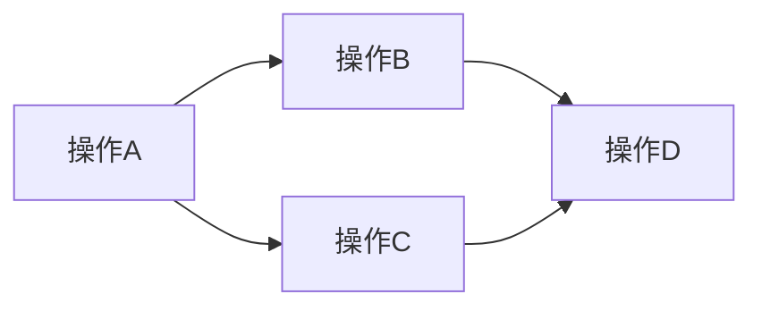

# CS149_p08

## 第 1 部分

## 并行计算的思维模型：从单线程到数据并行

### 核心转变：从“执行循环”到“操作集合”

传统并行思维方式：
- 创建线程，每个线程执行一段循环体
- 手动管理线程的创建、同步、销毁
- 关注“线程做什么”

**新思维方式：数组操作抽象**
- 将计算视为对**数据集合**应用**丰富的基本操作集**
- 不再关注“如何在每个元素上运行函数”，而是关注**“对数组做什么操作”**
- 核心思想：**操作是预定义的，我们只需调用并传递参数**

### GPU并行性的规模要求

- **执行上下文总数**：约 **163,000**（单个芯片上）
- **最小数据集需求**：至少16万以上，否则无法获得：
  - **完全并行性**
  - **延迟隐藏**效果
- **实际生产环境**：需要**两百万级别**的并行任务

### 依赖关系：并行性的根本

**核心原则**：并行性来源于**无依赖关系**



- 在依赖图中，**必须先执行前置操作**
- 识别依赖关系 = 找到可并行执行的部分
- **没有依赖 = 可以获得并行性**

### 课程关注点的转移

**之前**：我们编写代码时，必须自己处理：
- 依赖关系分析
- 线程创建和管理
- 执行顺序控制

**现在**：假设**基础操作已被实现**，我们只需：
1. **调用操作**
2. **传递参数**
3. **处理输出**

### 关键洞察

> **并行计算不是关于“创建线程”，而是关于“如何描述数据上的操作”**

我们的思维方式从**“如何执行循环”**转变为**“如何组合数组操作”**。
- 不再需要关心细粒度的依赖管理
- 上层抽象隐藏了并行实现的复杂性
- 开发者专注于**计算逻辑**而非**并行机制**

---

## 第 2 部分

### 核心概念：通过封装并行原语实现大规模并行化

**核心思想：** 并非手动编写细粒度的线程管理和依赖控制代码，而是将算法**简化为对一系列已知、高度并行的函数（原语）的调用**。只要你的程序完全由这些高度并行的函数构建，你的整个程序就是高度并行的。

- **不要重新发明轮子：** 不需要考虑底层的线程调度、内存依赖等复杂细节。只需要关注如何调用这些函数并处理其输出。
- **编程模型：** 类似于在 NumPy、PyTorch 或 TensorFlow 中编写代码。你操作的是整个**数组、张量**或**序列**，而不是单个循环的迭代。库本身负责底层的高度并行实现。
- **关键点：** 你自己的程序逻辑退化为一连串对成熟并行函数库的调用，从而继承其并行性。

### 核心数据类型：序列（Sequence）

为了严格实现无依赖的并行计算，引入一种受限的数据结构：**序列**。

- **定义：** 一个**有序的元素集合**。它不同于普通的数组。
- **关键区别：** 这是一个**抽象概念**，在不同语言中有具体实现（例如：Python 的 `list`，NumPy 的 `array`，PyTorch 的 `tensor`，C++ 的 `std::vector` 等）。但在此上下文中，它有一个严格的约束。
- **与数组的核心差异：**
    - **数组（Array）：** 允许**随机访问**。你可以通过索引 `a[i]` 直接读写任意元素。这种能力会引入复杂的、难以预测的**数据依赖关系**（例如，循环的迭代 `i` 依赖迭代 `i-1` 的结果）。
    - **序列（Sequence）：** 程序只能通过**特定、封装的并行操作**来访问或修改序列的元素。它**禁止了直接、任意的元素访问（如 `a[i]`）**。通过剥夺随机访问的能力，从根源上**消除了产生数据依赖的可能性**，从而保证了安全的并行执行。

### 第一个关键并行原语：映射（Map）

这是最基础、最熟悉的并行操作。很多时候，并行算法本质上就是一个 `map` 操作。

- **定义：** **`map`** 是一个**高阶函数**（以函数作为输入）。
- **操作：** 它将一个**给定的函数**应用到输入序列的**每一个元素**上，并产生一个**全新的输出序列**。
- **核心属性：** 这是**天生、完美的可并行**操作。对元素 `a[i]` 应用函数完全不依赖对 `a[j]`（`j != i`）的应用。不存在任何数据依赖。
- **语法类比：**
    - 命令式循环：
        ```c++
        for (int i = 0; i < N; i++) {
            output[i] = some_function(input[i]);
        }
        ```
    - 函数式/并行 `map` 语法（类似于 `a.map(some_function)`）：
        ```python
        # 伪代码
        output = map(some_function, input_sequence)
        # 或者类似的标准库风格
        output = input_sequence.map(some_function) 
        ```

**总结：** 通过将底层数据模型从可随机访问的**数组**转变为受控操作的**序列**，并利用 `map` 等无依赖的并行原语，可以高效、安全地构建大规模并行程序，而无需陷入细粒度的并发控制细节。

---

## 第 3 部分

## 高阶函数与 Map 操作的并行性

### **核心概念：高阶函数 (Higher-Order Function)**

*   **定义**：一个能够接受**其他函数作为参数**或**返回一个函数**的函数。
*   **核心优势**：提升代码的**抽象层次**和**复用性**，将操作逻辑（函数）与数据遍历（循环）解耦。
*   **`Map` 函数是典型的高阶函数**。
    *   **输入**：
        1.  一个**转换函数** `f`（类型：`A -> B`，即接受类型 `A` 的输入，返回类型 `B` 的输出）。
        2.  一个**输入序列** `a`（类型：`Sequence<A>`，如整数数组）。
    *   **输出**：
        *   一个**输出序列** `b`（类型：`Sequence<B>`，如整数或字符串数组）。

### **关键术语：函数签名与类型推导**

*   **函数签名 `A -> B`**：
    *   **含义**：表示一个函数，它接受**类型为 `A`** 的输入，并返回**类型为 `B`** 的输出。
    *   **示例**：
        *   `f(x) = x + 10` 的签名是 `int -> int`。
        *   `g(x) = std::to_string(x)` 的签名是 `int -> string`。
*   **类型推导**：
    *   Map 函数的输出类型 (`B`) **完全由**输入函数的返回类型决定。
    *   **例子**：若输入 `f` 是 `int -> int`，Map 返回 `int` 序列；若输入 `f` 是 `int -> string`，Map 返回 `string` 序列。

### **并行性与安全性：为什么 Map 天生适合并行**

*   **核心特性**：**操作 `f` 是无状态的**，且**仅依赖单个输入元素**。
    *   `f` 的实现者**无需**关心集合操作或多线程同步。
    *   `f` 的每次调用都是**独立的**，不会创建跨元素的数据依赖。
*   **并行性的保证**：
    *   **绝对安全**：因为 `f` 无法访问或修改其他元素的状态，所以可以**安全地将 `f` 应用到每个元素上并行执行**。
    *   **避免副作用**：`f` 的实现者不会无意中造成竞态条件或数据竞争。

### **签名与实现举例**

*   **抽象签名**：
    ```text
    map :: (A -> B) -> Sequence<A> -> Sequence<B>
    ```
    *   含义：输入一个函数 `A -> B` 和一个序列 `Sequence<A>`，输出一个新序列 `Sequence<B>`。

*   **C++ 实现（`std::transform`）**：
    *   **语法更复杂**，但逻辑等价：
        ```cpp
        // 将函数 f(int) 应用到数组 [1,2,3,4,5] 的每个元素
        std::transform(begin(a), end(a), begin(b), [](int x){ return x + 8; });
        ```

*   **函数式语言实现（Haskell 风格）**：
    *   **更清晰简洁**：
        ```haskell
        -- 定义函数 f: x -> x+10
        let f x = x + 10
        -- 将 f 映射到列表 a 上
        let b = map f a
        ```

### **总结**

*   **Map 是高阶函数的典范**：它将**遍历逻辑**与**元素处理逻辑**分离。
*   **Map 的并行性天生安全**：因为其操作函数 `f` 是**无依赖、无副作用的纯函数**，允许**直接并行化**而不用担心线程安全问题。
*   **函数签名决定了类型安全**：输出序列类型 `B` 由输入函数 `f` 的返回类型决定，保证了类型一致性。

---

## 第 4 部分

## Map 的并行实现：黑箱与线程池

**核心概念**：并行 `map` 的实现哲学——**实现者无需关心 `f` 的内部构造**，只需把 `f` 当作一个**“黑箱”**（black box）调用。

- **黑箱思维**：`f` 的实现者甚至不需要考虑操作集合的类型，只需关注“给我一个元素，我告诉你怎么做”。这是一种极佳的抽象思考方式。
- **并行策略**：
  - 假设 `f` 被编译为 SIMD（如“Cindy模式”），但通常只能同时处理有限数量（如8个元素）。
  - 对于包含**十万个元素**的序列，需要更通用的方法。
- **工程实现**：
  - 创建**线程工作池**（thread worker pool）。
  - 将序列 `S` 分割成 **p 个更小的子序列**（p 为处理器或线程数）。
  - 每个线程在子序列 `s_i` 上 **顺序** 调用 `f` 进行 map，生成部分输出。
  - 最后 **连接所有输出** 得到完整结果。
- **关键认知**：这本质上就是**分治**（divide and conquer）思想，没有太神奇的魔法。

## Fold（折叠）操作：串行与并行挑战

**核心概念**：`fold` 是一个**极其重要的操作**，应用广泛。它将一个序列缩减（reduce）为一个单一值。

### 类型签名与含义

- **签名**：`fold : (b, (a, b) -> b) -> Sequence a -> b`
- **参数分解**：
  - 接受一个**起始元素**（初始累加器）`b`
  - 接受一个**二元函数** `f: (a, b) -> b`，即函数不再接受单个 `a` 到 `b`，而是接受一个**对**（a 和 b）并产生 `b`
  - 接受一个**序列** `a`
  - 最终**产生一个元素** `b`
- **本质行为**：**迭代地应用** `f`，将序列中的元素逐个合并到累加器中。

### 具体例子（Scala 风格）

以**求和**为例：
- 函数 `f(accum: Int, x: Int) = accum + x`
- 起始值 `b = 0`
- 序列 `[5, 10, 20, 18]`
- 执行过程：`((((0 + 5) + 10) + 20) + 18) = 53`
- 结果：`53`（序列所有元素的和）

### 并行折叠的争议与关键难点

- **核心问题**：能否并行执行 `fold`？
- **不同观点**：一些人说“绝不可能”，另一些人说“可以”。
- **关键限制**：我们不知道被传递的函数 `f` 是否满足**结合律**（associative property）。
  - **可并行**：如果 `f` 是结合的（如加法 `+`），可以分治处理——把序列分成多段，每段各自折叠，再合并结果。所有人都同意整数求和可并行。
  - **不可并行**：如果 `f` 不满足结合律（如 `fold` 的语义通常隐含**左折叠**，顺序依赖），串行是唯一正确方式。
- **公式表示**（结合律条件）：
  - 可并行条件：$\forall x, y, z, \quad f(f(x, y), z) = f(x, f(y, z))$
  - 即函数的运算顺序不影响最终结果。

### 对渲染/游戏引擎工程师的启示

- **`map` 的无脑并行**：任何逐元素操作（如逐像素着色、逐顶点变换、逐网格处理）均可直接套用线程池分治。
- **`fold` 的危险并行**：**聚合操作**（如求最大深度、计算包围盒大小、光追中的累计辐射值）必须确认操作的结合律。若 GPU 或多线程乱序执行，会导致结果不确定。
- **工程实践**：实现如 `ParallelReduce` 或 `ComputeShader` 中的归约操作时，务必明确告知使用者：
  - 输入操作必须是**可结合且可交换**的，否则结果未定义。
  - 游戏引擎中的 `TransformHierarchy` 更新（世界矩阵累乘）就是典型不满足结合律的例子（矩阵乘法结合但顺序重要）。

---

## 第 5 部分

### 并行折叠（Parallel Fold）与结合性

#### 核心概念：`fold` 的通用性与并行限制

- **通用 `fold` 的问题**：标准 `fold` 接受一个**任意二元函数 `f`**，但并行实现需要保证无论数据如何分割，最终结果一致。
- **关键属性：结合性（Associativity）**：
  - 如果 `f` 是**结合的**（如加法 `(a+b)+c = a+(b+c)`），则并行 `fold` 可行。
  - **不要求交换性**（例如减法不结合，但结合性已足够）。
- **并行策略**：
  - 将序列分割成子序列 → 各线程顺序 `fold` → 用 **组合函数**（combiner）合并子结果。
  - **组合函数**必须也是 `f` 本身（即 `f: B × B → B`），否则用户需额外指定。

#### 公式与实现细节

- **并行 `fold` 的数学条件**：
  ```latex
  \text{若 } f \text{ 满足结合律：} f(f(a,b),c) = f(a,f(b,c))
  \text{则并行实现正确。}
  ```
- **实现伪代码**（假设 `f` 结合）：
  ```
  输入序列 S
  分割为 S1, S2, ..., Sk
  每个线程：result_i = fold(f, S_i)  // 顺序折叠
  最后：final = f(result_1, f(result_2, ...))  // 逐层合并
  ```

#### 重要扩展：`map` + `fold` 的融合优化

- **点积示例**：
  1. 先 **`map`**：每个元素乘以10 → 新序列
  2. 再 **`fold`**：用加法求和
- **编译时优化（如 Jet 编译器）**：
  - 检测到 `map` 后跟 `fold` 的模式后，**融合**为单个 `fold`，**避免两次遍历**数据。
  - 融合后 `fold` 内部直接执行乘法并累积结果，内存/计算效率提升。
  - 这是**现代函数式编译器**（如 Futhark、Halide）的关键优化。

#### 实际应用建议

- **使用场景**：求和、求积、最大/最小值、点积、平均（需结合 map）。
- **何时需用户提供组合器**：当 `f` 的类型为 `B × B → B` 且不满足 `f` 的原始签名时（例如 `fold` 输入为 `B → B`，而组合需 `B × B → B`）。
- **性能关键点**：并行 `fold` 通常**不能直接用于非结合运算**（如列表反转、字符串拼接），需人工分解。

#### 总结：三大要点

1. **并行 `fold` 的有效性完全依赖 `f` 的结合性**，不要求交换性。
2. **并行实现 = 分割 → 顺序折叠 → 组合**，组合函数默认复用 `f`。
3. **`map` + `fold` 可被编译器融合为单次遍历的 `fold`**，是高级编译器的优化策略。

---

## 第 6 部分

### 扫描操作：从序列到序列的并行化

#### 核心概念：从折叠到扫描

- **核心定义**：**折叠**（Reduce）将序列转换为一个标量值（例如求和）。**扫描**（Scan）则将序列转换为另一个序列，对每个前缀应用相同的二元运算符。
- **关键术语**：**前缀和**（Prefix Sum）是扫描操作最常见的形式。它计算每个位置之前（包括或排除当前元素）所有元素的和。
- **直观理解**：扫描的最后一个元素就是折叠的结果。但扫描生成了所有中间部分，即**部分和**（Partial Sums）。

#### 包含性扫描 vs 排他性扫描

- **包含性扫描**（Inclusive Scan）：输出中的第 *i* 个元素包含输入中的第 *i* 个元素本身。
    - 公式：`output[i] = input[0] ⊕ input[1] ⊕ ... ⊕ input[i]`
- **排他性扫描**（Exclusive Scan）：输出中的第 *i* 个元素**不包含**输入中的第 *i* 个元素。
    - 公式：`output[i] = input[0] ⊕ input[1] ⊕ ... ⊕ input[i-1]`
- **重要关系**：包含性扫描和排他性扫描可以互相转换。例如，如果已知包含性扫描的结果 `inclusive[i]`，则排他性扫描的结果 `exclusive[i+1] = inclusive[i]`。
- **算法实现细节**：典型的序列化实现会用一个循环，将当前元素与上一个输出元素相加。这看起来是**顺序的**，但它可以被**并行化**。

#### 并行化扫描的思考路径：从分治到重建

- **核心挑战**：扫描操作表面上依赖前一个结果，这使其难以直接并行。但我们可以通过 **分治策略**（Divide and Conquer）来实现。
- **第一步：并行计算部分和**。将输入数组分成 *t* 个块（例如按线程数量划分）。每个线程独立计算自己块内的**部分和**（即该块内所有元素的和）。这一步是完全并行且高效的，时间复杂度为 `O(n/t)`。
- **第二步：合并部分和**。现在，我们获得了一个长度为 *t* 的部分和数组。我们需要对这些部分和进行**扫描**（例如用另一个并行算法或简单的顺序扫描）。这一步的代价较小，因为 *t* 通常远小于 *n*。
- **第三步：重建最终扫描结果**。有了每个块的前缀部分和后，我们可以将它们广播或累加回每个线程。每个线程用全局前缀（来自上一个块的部分和）来更新自己块内的元素，从而生成完整的扫描结果。

#### 关键公式与算法步骤

1.  **分治**：将长度为 *n* 的数组 *A* 划分为 *t* 个连续的块 *B_0, B_1, ..., B_{t-1}*，每个块大小大致为 *n/t*。
2.  **并行计算块和**：为每个块 *B_j* 计算其内的所有元素之和 `sum(B_j)`。这是并行完成的。
3.  **扫描块和**：对 `sum(B_0), sum(B_1), ..., sum(B_{t-1})` 执行一个**包含性扫描**，得到块级的前缀和 `prefix_sum_block[j]`。
4.  **并行更新块内元素**：对于每个块 *B_j*，让块内的每个线程计算：
    `output[i] = (如果 i 在 B_j 内，则 output[i] = prefix_sum_block[j-1] + input[i])`
    （注意：这一步需要正确处理边界，特别是第一个块）。
    - **更准确的实现**：对于每个元素 *A[i]* 在块 *B_j* 内，其最终的扫描输出为：
      `output[i] = (prefix_sum_block[j-1] if j > 0 else 0) + (从 B_j 开头到 A[i] 的包含性扫描)`
      其中内部扫描是每个线程在各自块内独立计算的。

- **时间复杂度分析**：
    - 并行部分和计算：`O(n/t)`
    - 块级扫描（串行或小规模并行）：`O(t)` 或 `O(log t)`（如果使用更高级的并行扫描算法，如Blelloch扫描）
    - 整体复杂度：`O(n/t + t)`，当 `t` 为 `sqrt(n)` 量级时最优。

#### 总结与记忆点

- **扫描 = 并行化的前缀和**。它通过分治将明显的顺序依赖化解为可并行的子问题。
- **核心步骤**：先并行计算每个块的和，然后扫描这些块和（小规模），最后用块扫描结果并行地更新每个块内元素。
- **并行扫描是许多GPU算法的基础**，例如排序（基数排序）、流压缩、数据打包等。掌握其思想对理解GPU计算至关重要。
- **区分包含性与排他性**：两者仅差一个元素，可以轻松互转，但实现时需注意边界。

---

## 第 7 部分

### 并行扫描（Parallel Prefix Sum / Scan）的核心思路优化

本部分内容探讨了如何将**顺序扫描算法**（Prefix Sum）进行**并行化**，主要聚焦于**减少计算跨度（Span）** 与**控制总工作量（Work Complexity）** 的权衡。目标是设计一个**适合GPU等大规模并行机器**的高效算法。

---

#### 1. 初级并行思路：分块与合并

- **核心概念**：**划分数组（Divide & Conquer）** 与 **部分和（Partial Sum）**
- **做法**：
    - 将长度为 `n` 的数组分成 `t` 个块。
    - 每个线程/处理器**独立计算**自己那块的部分和。
    - 最后**合并**所有部分和结果。
- **关键点**：
    - **总时间** ≈ `n / t`（每个线程的工作量）。
    - **合并部分和**这一步骤本身就很容易并行化（例如，使用上一节的分层加法）。
- **评价**：
    - 这是一个**合理的起点**，但并不是最理想的**高性能并行方案**（对于GPU而言不够高效）。

---

#### 2. 基于“一半”的递归并行思路

- **核心概念**：**递归分治（Recursive Halving）** 与 **结果复用**
- **做法**：
    - **递归前提**：如果我们“神奇地”得到了前半部分（`a0` 到 `a_{mid}`）的扫描结果。
    - **关键操作**：将**前半部分的总和**加到后半部分的每个元素上。
    - **优化点**：这个“加总”操作可以**并行执行**，从而将问题规模不断减半。
- **公式化描述**：
    - 将数组分为 `Low` 和 `High` 两半。
    - 并行计算 `Low` 的扫描结果 `Scan(Low)`。
    - 计算 `Low` 的总和 `Sum(Low)`（可用并行归约）。
    - 将 `Sum(Low)` 并行加到 `High` 的每个元素上，然后递归处理 `High` 的扫描结果 `Scan(High)`。
- **核心优势**：这种“折叠”或“递归分割”是**实现并行求和（Parallel Reduction）** 的有效方式。

---

#### 3. GPU视角下的“朴素”并行扫描（Naive Parallel Scan）

- **核心概念**：**跨步（Stride）** 与 **逐步累加**
- **场景设定**：假设线程数与元素数相同（`n` 个线程）。
- **过程演示（基于幻灯片示例）**：
    - **第1步**：每个线程计算自己和邻居的和（`a_i + a_{i+1}`），结果存于 `a_{i+1}`。此时 `a_1` 包含 `a0+a1`。
    - **第2步**：步长翻倍，每个线程计算与自己相隔2的元素的累加（`a_i + a_{i+2}`），结果存于 `a_{i+2}`。此时 `a_2` 包含 `a0+a1+a2`。
    - **第k步**：步长变为 `2^{k-1}`，持续累加。经过 `log n` 步之后，所有位置都包含到该位置为止的完整前缀和。
- **算法复杂度分析**：
    - **工作复杂度（Work）**：**O(n log n)**。因为一共有 `log n` 步，每步需要执行 `n` 次加法。
    - **跨度（Span）- 理论最短时间**：**O(log n)**。如果有无限处理器，这是最长依赖链的长度。
- **评价与问题**：
    - **对于GPU来说不理想**。
    - **根本问题**：总工作量从顺序算法的 **O(n)** **退化** 到了 **O(n log n)**。对于 `n` 很大（例如百万）的机器，这是巨大的浪费。
    - **核心矛盾**：我们为了**并行性（降低跨度）** 而牺牲了**工作量（增加总计算量）**。我们希望找到一个**既高效又高度并行**的算法。

---

#### 4. 引出更优方案：Guy Blelloch 算法

- **核心概念**：**并行前缀和（Parallel Prefix Sum）的突破性设计**
- **关键人物**：**Guy Blelloch**（盖伊·布鲁赫）。
- **核心成就**：提出了一种**既具有 O(log n) 跨度，又具有 O(n) 工作复杂度**的并行扫描算法。
    - = **完美调和了并行性与效率之间的矛盾**。
- **后续预告**：后续部分将详细讲解这种**既不增加总工作量，又能充分利用并行硬件**的`Guy Blelloch`算法（通常被称为**Blelloch Scan** 或 **Work-Efficient Scan**）。

---

### 总结要点

| 算法思路 | 工作复杂度 | 跨度 | 关键评价 |
| :--- | :--- | :--- | :--- |
| **分块合并** | O(n) | 线性 | 简单起点，但非最高效并行方案 |
| **朴素并行扫描** | **O(n log n)** | **O(log n)** | 并行度高但**浪费算力**，不适合大规模GPU |
| **Blelloch 算法** | **O(n)** | **O(log n)** | **理想方案**，兼顾效率与并行性 |

**核心目标**：从“合理但低效”的并行方案出发，认识到**工作复杂度膨胀**是设计并行算法时的关键陷阱，并引出**既高效计算又高度并行**的`Guy Blelloch`扫描算法。

---

## 第 8 部分

### 并行前缀和（Scan）算法优化：从 O(n log n) 到 O(n) 工作量的两阶段方法

#### 核心目标
- 在拥有**无限处理器**的理论假设下，将**并行前缀和**算法的**总工作量**从 \( O(n \log n) \) 降低到 **\( O(n) \)**，同时保持 **\( O(\log n) \) 的步骤数**。
- **核心思想**：规避简单树形并行算法中大量重复、冗余的计算。原算法虽步骤少，但总工作量高，且存在**负载不均衡**（处理器利用率逐步下降）。

#### 算法发明者
- **Guy Blelloch**（盖伊·布鲁克），该算法是并行计算领域的经典成果。

#### 算法结构：两阶段法（Two-Phase Method）
- 也被称为 **“上行-下行”（Up-Sweep / Down-Sweep）** 或 **“结合树-分裂树”（Combine Tree / Split Tree）** 阶段。
- **阶段一：上行（Up-Sweep / 结合树阶段）**
    - 从树底向上构建，计算每个子树内部的**部分和**。
    - 沿途计算出一些中间结果，用于后续阶段。
- **阶段二：下行（Down-Sweep / 分裂树阶段）**
    - 从树根向下，利用阶段一生成的中间结果，**将部分和“传播”或“重新基化”** 到数组的各个元素。
    - **核心操作**：将前半部分的部分和，应用到后半部分的对应元素上，进行“重新基于”（re-basing），从而推导出最终结果。

#### 为什么总工作量是 \( O(n) \)？
- **上行阶段的工作量**：每一层的计算量是 \( n, \frac{n}{2}, \frac{n}{4}, \ldots \)。
    - 这是一个**等比数列**，和为 \( 2n \)。
- **下行阶段的工作量**：同样是类似的等比数列，贡献 \( 2n \)。
- **总体工作量**：\( 2n + 2n = 4n \)，即 \( O(n) \)。虽然有一个常数系数“2倍”，但**从渐进复杂度看，是 \( O(n) \) 而不是 \( O(n \log n) \)**。
- **步骤数**：两个阶段各需 \( \log n \) 步，总共 \( 2 \log n \) 步，因此**步骤复杂度仍为 \( O(\log n) \)**。

#### 理想与现实：算法与工程实现的差异
- **理论优势**：在**工作量**和**步骤数**上达到理论最优。
- **工程实践中的挑战**（为什么作业里不直接这么写）：
    1.  **负载不均衡**：随着算法进行到上层，使用的处理器数量急剧减少，并非所有处理器都时刻满载。
    2.  **数据移动**：为了平衡负载和减少全局同步，需要频繁地移动数据，这会带来昂贵的通信开销。
    3.  **常数因素**：虽然算法是 \( O(n) \)，但实际有 \( 4n \) 左右的常量工作，并且需要多轮同步，这在GPU或实际硬件上可能不是最快的选择。
- **实际策略（例如在NVIDIA工作）**：不会直接实现这个理想化的 \( O(n) \) 算法，而是会为了**内存访问模式、负载均衡**和**减少同步点**，投入更多精力设计更复杂、更实用的高效库。

#### 简单并行化案例：双处理器
- 假设只有两个处理器，将数组分为两半。
- **第一阶段**：每个处理器独立、完美地负载均衡地扫描自己的一半。
- **第二阶段**：需要进行一次通信，将左半部分的总和传给右半部分，然后右半部分将其所有元素加上这个值。
- 这是实际多核CPU或GPU上实现高效并行扫描的基础思想。

---

## 第 9 部分

### 并行扫描（Scan）算法：从双核到SIMD的演进

#### 1. 双核处理器上的朴素并行扫描

- **核心思路：** 将数组**等分为两半**，每个处理器（核）独立执行一个**顺序扫描**。
- **工作流程：**
    - **处理器1（P1）：** 扫描数组的前半部分，得到前缀和结果。
    - **处理器2（P2）：** 扫描数组的后半部分，得到局部的前缀和。
    - **最终修正：** 将P1计算出的**前半部分的总和（基数）** 广播到P2，P2将其所有结果加上这个基数。
- **优势：**
    - **完美负载均衡：** 工作平分给两个核心。
    - **极少的通信：** 仅需传输一个数值（基数）给另一个处理器。
- **隐藏问题：** **内存访问模式**不佳。
    - 虽然每个处理器处理一半数据，但数据在内存中是**连续存储**的。
    - 每个处理器依然需要在内存中**大跨度跳跃**访问其负责的元素，这无法利用CPU缓存的局部性原理（缓存行预取失效）。**“你在内存中到处跳跃”**。
- **结论：** 这是最简单、直观的并行思路，但对于现代多核CPU并非最优方案。

#### 2. 共享内存系统中的“分治+基数广播”法

- **适用场景：** 多个线程在**共享内存**的系统中运行，所有线程都能直接访问整个数组。
- **简化步骤：**
    1.  **顺序扫描第一段：** 一个线程（或一组线程）顺序扫描数组的前半部分，得到完整的前缀和。
    2.  **记录基数：** 记住前半部分的最后一个值（即前半部分的总和）。
    3.  **顺序扫描第二段：** 另一个线程（或一组线程）顺序扫描数组的后半部分。
    4.  **并行加法：** 所有处理后半部分的线程，将它自己计算出的局部前缀和，**同时加上**第一步得到的基数。
- **评价：**
    - 这是最符合直觉的并行化方式。
    - 共享内存使得基数传递非常快速（直接读写同一个内存地址），通信开销可忽略。
    - 每个线程都进行**顺序的内存访问**，缓存友好。
    - **“如果我给你一个小时做作业，你很可能就会这么写。”**

---

#### 3. 深入SIMD（如CUDA Warp）中的扫描算法——Warp Scan

- **背景转变：** 从多核CPU（任务并行）转向**SIMD（单指令多数据）** 机器，例如GPU或特定的SIMD处理器。
- **核心概念：** **Warp** 是GPU中执行SIMD指令的基本单位，通常包含32个线程。
- **关键认知：** 所有在同一个Warp中的线程，在同一时刻**执行完全相同的指令**，只是操作不同的数据（自己的“车道”或“索引”）。
- **算法实现（以CUDA为例）：**

    - **目标：** 对一个Warp内的32个元素的局部前缀和。
    - **输入：** 每个线程的**线程ID**（在CUDA中，可以是Thread Block内的任何ID，需要先映射到Warp内的位置）。
    - **核心操作：** 通过**条件分支**和**固定的对数步骤**完成。**“这是一段很hacky的代码”**。

- **Warp Scan 核心代码逻辑（步骤拆解）：**

    ```cuda
    // 每个线程执行
    int laneId = threadIdx.x % 32; // 计算当前线程在Warp中的位置 (0~31)
    int value = input[threadIdx.x]; // 加载自己的数据

    // 以下是核心的5步循环 (log2(32) = 5)
    // 每一步，符合条件的线程将自己的值累加给另一个线程
    if (laneId >= 1)  value += shuffle_up(value, 1);  // 步骤1：与左边第1个邻居交换
    if (laneId >= 2)  value += shuffle_up(value, 2);  // 步骤2：与左边第2个邻居交换
    if (laneId >= 4)  value += shuffle_up(value, 4);  // 步骤3：与左边第4个邻居交换
    if (laneId >= 8)  value += shuffle_up(value, 8);  // 步骤4：与左边第8个邻居交换
    if (laneId >= 16) value += shuffle_up(value, 16); // 步骤5：与左边第16个邻居交换
    ```

- **算法特性分析：**
    - **为何是5步？** 因为 \(2^5 = 32\)，每次步长翻倍，对数的复杂度。
    - **工作方式：** 第 \(k\) 步，只有Warp内索引 \(>= 2^{k-1}\) 的线程参与计算，并将自己左侧 \(2^{k-1}\) 个位置的线程的值累加过来。这本质上是一个**树形加法**的“升序”版本。
    - **内存模式：** 在SIMD模型中，不存在“到处跳跃”的内存访问问题。所有线程的“交换”动作是通过**寄存器间的直接数据交换（Shuffle）** 完成的，效率极高。
    - **复杂度：** 操作数量级为 **O(log n)**，其中 \(n\) 是Warp大小（32）。

- **重要总结：**
    - 这里的算法复杂度是 **O(log n)**。
    - 之所以是5步，是因为 **log₂(32) = 5**。

---

## 第 10 部分

## 扫描算法并行化的权衡：工作高效 vs. 跨度高效

### 核心分析：`O(n log n)` 算法 vs. `O(n)` 算法在并行环境下的对比

- **`O(n log n)` 算法（工作低效，跨度高效）**：有**5条指令**（忽略if语句），每个线程执行1条指令，共有 `3` 个线程（对数基数约为3/2），总工作量为 **`n * log n`**。其**跨度**（从开始到结束的最短时间）仅为 **5步**。
- **`O(n)` 算法（工作高效，跨度低效）**：需要**10步**（5步上扫，5步下扫）。

### 关键悖论与核心概念

- **跨度 vs. 工作量的矛盾**：尽管 `O(n log n)` 算法理论总工作量更多，但其跨度（5步）却比 `O(n)` 算法（10步）更小。这意味着在特定硬件上，前者**实际运行更快**。
- **“重复工作”往往有益**：在并行计算中，让处理器做更多“重复”或“冗余”的计算，有时反而能利用硬件特性，大幅减少总执行时间。

### 性能差异的根本原因：硬件映射与资源利用率

#### **1. SIMD 执行单元的特性**
- **硬件行为**：处理器有一个 **SIMD 执行单元的块**，它能在一轮指令中**同时处理32项数据**。
- **资源闲置**：
    - `O(n log n)` 算法用**5轮**（5步）利用所有车道，但**做重复工作**。
    - `O(n)` 算法需要**10轮**（10步），虽然总工作量少，但每轮中**70条车道中有大量闲置**。
- **结果**：`O(n log n)` 通过“浪费”计算来**压满硬件 pipeline**，而 `O(n)` 算法在等待数据移动时让执行单元空转。

#### **2. 指令分散与数据格式**
- **损失来源**：`O(n)` 算法虽然总工作量少，但将指令**分散在多种高度不一致的格式**中。这意味着每次数据移动、格式转换都会引入额外的开销。
- **核心观点**：**总指令数不是唯一指标**，指令的**连续性**和**数据排布格式**对SIMD性能至关重要。

### 扫描库实现的关键决策：根据硬件选择算法

你的选择完全取决于 **并行工作如何映射到机器上**。

#### **不同硬件架构下的最佳策略**
1.  **千个独立处理器（如GPU）**：倾向于使用**工作高效**的 `O(n)` 算法。因为你有独立的执行单元，数据移动和同步的开销相对可控，减少总计算量更有利。
2.  **两个处理器（如双核CPU）**：采用最简单的**分割法**：将数据分成两半，分别计算扫描，再移动数据合并。手动管理数据流。
3.  **SIMD 单指令多数据处理器（如向量化CPU，GPU warp）**：**`O(n log n)` 算法是更好的选择**。原因如上：它能最大化利用SIMD单元的并行能力，即使有冗余计算，也赢在“把硬件喂饱”上。

---

## 第 11 部分

### 数据并行扫描的高效实现：以NVIDIA GPU为例

#### 核心概念：Warp级并行与分治策略
- **核心思路**：在GPU（如NVIDIA）上，利用**Warp**（32个线程）作为基本并行单元，实现高效的扫描（Prefix Sum）。
- **关键术语**：**Warp**、**SIMD**（单指令多数据流）、**分治扫描**、**共享内存**。
- **效率关键**：算法步骤少，不追求大O复杂度（如`O(n log n)`），而是追求**实际执行步骤少**（如warp内5个周期完成32元素扫描）。

#### 算法细节：从32到128再到1024元素

##### 1. 32元素扫描（Warp内完成）
- **实现方式**：使用CUDA内部的**Warp Shuffle**（`__shfl_up_sync`等）指令，在1个Warp内完成。
- **性能**：仅需 **5个周期**（5 steps），无需全局内存同步。
- **代码示例**（课程提供）：
  ```cpp
  // 伪代码核心：利用warp shuffle进行树形规约
  for (int offset = 1; offset < 32; offset <<= 1) {
      int val = __shfl_up_sync(0xffffffff, thread_val, offset);
      if (threadIdx.x >= offset) thread_val += val;
  }
  ```

##### 2. 128元素扫描（多Warp分治）
- **策略**：将128个元素划分为 **4个32元素块**，每个块由1个Warp在5周期内完成扫描。
- **步骤**：
  1. **各块独立扫描**：4个Warp并行执行4次32元素扫描，得到4个局部扫描结果（5周期）。
  2. **计算块偏移**：对每个块的**最后一个元素**（即块前缀和）执行一次**小扫描**（同样可用Warp），得到块之间的累积偏移（5周期）。
  3. **广播加法**：每个Warp将对应的块偏移广播到其所有线程，并行加到已扫描的结果上（1周期）。
- **总周期**：`5 (块扫描) + 5 (偏移扫描) + 1 (广播加) = 11个周期`（理论上**常数时间**，与元素数无关）。

##### 3. 1024元素扫描（大规模并行）
- **层级结构**：
  ```
  元素块(32) → Warp扫描(5周期)
  ↓
  块偏移(32个) → 再次Warp扫描(5周期)
  ↓
  广播更新(1周期)
  ↓
  重复 -> 更大规模
  ```
- **实现**：将1024个元素分为32个块（每块32元素），由32个Warp并行处理。
  1. **第一层**：32个Warp并行扫描各自的32元素块（5周期）。
  2. **第二层**：对32个块的最后一个元素（即32个块前缀和）执行一次Warp扫描（5周期）。
  3. **更新**：每个线程将对应的块偏移加到自己的局部结果上（1周期）。
- **总周期**：`5 + 5 + 1 = 11个周期`（与128元素相同！）。

#### 重要公式与算法
- **分层扫描复杂度**：对于元素数 \( N \)，若基本块大小为 \( B \)（通常为32）：
  - 一次扫描，分治层数为 \( \log_B N \)。
  - **实际周期数** ≈ \( 5 \times \log_B N + (\log_B N - 1) \) 次更新。
  - 例如，\( N = 1024, B = 32 \)：\( 5 \times 2 + 1 = 11 \) 周期。
- **性能关键**：利用**SIMD并行度**远远大于处理器数量的场景，保持高并行效率。

#### 实践建议与作业提示
- **作业三**：实现一个`O(n)`的CUDA扫描算法，目标是**尽可能逼近CUDA标准库`cub::DeviceScan`的性能**。
  - **挑战**：对比官方库，理解底层优化（如Warp shuffle、共享内存bank conflict避免）。
  - **心态**：不必完全理解所有细节，但通过**分治+Warp扫描**，可写出**极具竞争力**的代码。
- **优化哲学**：
  - **不追求大O**：当`log n`因子可以被硬件并行能力“隐藏”时，实际步骤数才是影响性能的关键。
  - **混合策略**：数据并行（SIMD）与顺序算法（分治）结合：当SIMD并行度足够高时，全用数据并行；当并行度下降时，退化为更传统的顺序同步。

#### 与作业直接相关的代码结构
```cpp
__global__ void scan_kernel(int* data, int N) {
    extern __shared__ int shared[];
    int tid = threadIdx.x;
    int block_size = blockDim.x; // 通常为32的倍数

    // 阶段1：每个warp扫描32元素
    int warp_id = tid / 32;
    int lane_id = tid % 32;
    // ... 使用warp shuffle实现 ...

    // 阶段2：warp间偏移扫描（只需每个warp一个代表）
    if (lane_id == 31) {
        // 将warp的最后一个元素写入共享内存
        shared[warp_id] = my_val;
    }
    __syncthreads();
    // 对共享内存中的warp代表做warp扫描
    // ...
    __syncthreads();

    // 阶段3：广播加法
    int offset = shared[warp_id];
    // 每个线程加上对应warp的偏移
}
```

#### 关键见解
- **算法与硬件的深度绑定**：扫描的实现必须匹配GPU的**Warp执行模型**，而非纯理论的`log n`复杂度。
- **常数因子优化**：在GPU上，**实际执行周期数**比渐近复杂度更重要。例如，`O(n)`但周期数巨大的算法，不如`O(n log n)`但周期数少且并行的算法。
- **代码示例**：教授提供了一个完整的32元素warp扫描子程序，可直接用于作业，展示了**生产级优化**的思路。

---

## 第 12 部分

### 分段扫描（Segmented Scan）

#### 核心概念与动机

* **问题背景**：在图形学、科学计算或数据处理中，常遇到“**序列的序列**”，即外层有多个序列，每个序列内部又有多个元素。例如：
  * **图处理**：对于图中的每个顶点，遍历该顶点的所有边。
  * **物理模拟**：对于每个粒子，检查在其影响范围内的其他粒子。
  * **文档集合**：对于每个文档，处理其内部的单词序列。
* **核心挑战**：子序列长度通常**不同**，且外层序列数量可能不足以提供足够的**并行度**（例如，只有数千个顶点，但GPU需要数十万线程才能满载）。此时必须挖掘**内层序列的并行性**。
* **关键术语**：**分段扫描 (Segmented Scan)** 是一种并行原语，它接受一个“序列的序列”作为输入，对**外层**序列进行并行化，但**内层**每个子序列独立执行标准扫描操作。

#### 工作原理与示例

* **操作定义**：在给定一个“序列的序列”后，分段扫描会**并行地**对每个子序列应用扫描（通常是前缀和），但子序列之间互不干扰。
* **明确示例**：
  * **输入子序列**： `[1, 2]` , `[3]` , `[4, 5, 6]`
  * **分段** **Exclusive Scan** 结果：
    * 对 `[1, 2]` 扫描：`[0, 1]`
    * 对 `[3]` 扫描：`[0]`
    * 对 `[4, 5, 6]` 扫描：`[0, 4, 9]`
  * **最终输出**：`[0, 1, 0, 0, 4, 9]`
    * 可见每个子序列从零重新开始，内部前缀和独立计算。

#### 数据编码与实现思路

* **典型数据表示**：在实际实现中，“序列的序列”常被扁平化为两个并行数组：
  1. **值数组**：包含所有子序列的所有元素，按顺序排列（例如 `[1,2,3,4,5,6]`）。
  2. **标志位数组 (Head Flags)**：一个二进制数组，标记每个新子序列的起始位置（例如 `[1,0,1,1,0,0]`，其中1表示子序列开头）。
* **算法核心**：扫描操作在处理每个元素时，必须检查其对应的标志位：
  * 若标志位为 **1**（新序列开始），则**重置累加器**（通常从0或单位元开始）。
  * 若标志位为 **0**（同序列内部），则**正常累加**前一个元素。
* **关键区别**：标准一元扫描是“全局连续的”，而分段扫描是“**局部连续，全局重置**”的。

#### 为什么这是“更有趣的原始类型”

* **解决并行度不足问题**：当外层并行度不够时（如仅有几百个顶点），它可以让你利用内层的大量边来填充GPU的线程束。这是一种**两层并行**的分解。
* **更能反映真实应用**：大多数实际数据（如稀疏矩阵、图、不规则树）都不是完美的单一序列，而是嵌套且长度不一的。分段扫描是处理这类数据的**有效设计模式**。
* **性能优化机会**：
  * **利用“墙壁”优化 (Wall Optimization)**：利用标志位切换的“墙壁”来减少不必要的计算分支。
  * **与稀疏张量结合**：在稀疏张量计算（如稀疏注意力机制）中，可以结合扫描操作来高效处理非零元素。

---

## 第 13 部分

### 稀疏矩阵与压缩稀疏行（CSR）格式

- **核心概念**：**稀疏矩阵**是指大部分元素为零的矩阵。例如，一个 \(N \times N\) 的矩阵，若 99% 的值为零，则直接存储会浪费大量空间和计算资源。
- **关键术语**：**压缩稀疏行（Compressed Sparse Row，CSR）** 是一种高效存储稀疏矩阵的格式，通过只存储非零元素及其位置信息来节省空间。
- **工作原理**：CSR 将矩阵视为 **序列的序列**。每行作为一个子序列，只包含该行中的非零元素。
    - 例如，一个四行矩阵：
        - 第1行非零元素为3和1 → 子序列 `[3, 1]`
        - 第2行非零元素为2 → 子序列 `[2]`
        - 第3行非零元素为4 → 子序列 `[4]`
        - 第4行非零元素为三个值 → 子序列 `[..., ..., ...]`
    - 这些子序列被 **扁平化** 为一个连续的数组（值数组）。
- **关键编码**：除了值数组，CSR 还维护一个 **行指针数组**，标记每个子序列（即每行）在值数组中的起始位置。这本质上就是 **序列的序列的紧凑表示**。

### 分段扫描（Segmented Scan）算法

- **核心概念**：**分段扫描** 是一种并行算法，在给定一个序列及其对应的 **段标志**（标记每个子序列的开始位置）时，能够高效地对每个子序列独立执行 **扫描（Scan）** 操作。
- **工作原理**：
    - 输入：一个扁平化的值数组（所有子序列的连接）和一个标志数组（标记每个子序列的起始点，例如 `1` 表示开始，`0` 表示非开始）。
    - 算法在 **O(n) 时间** 和 **O(log n) 跨度** 内完成。
    - **核心技巧**：在传播信息（如前缀和）时，检测到 **段开始标志**（如 `1`）时，**阻止** 前一段的信息传播到当前段。这相当于在算法内部添加一个条件判断：“如果标志为1，则执行不同的操作（通常是重置累积器）”。
- **直观理解**：你可以将分段扫描看作是普通扫描的“重置版”。每当遇到一个段标志，扫描的累积状态被重置，从而每个段独立计算。这对于处理 **序列的序列** 结构非常有用。

### 稀疏矩阵乘法中的应用

- **核心场景**：**稀疏矩阵-向量乘法** 是图形学和机器学习中极其常见的操作。例如，亚马逊的客户-产品推荐系统中，用户和产品的关联矩阵通常是稀疏的（大多数用户只购买少量产品）。
- **方法**：
    1. 将稀疏矩阵以 CSR 格式存储（值数组 + 行指针）。
    2. 将稠密向量 \(x\) 与 CSR 格式的稀疏矩阵相乘。
    3. 利用 **分段扫描** 算法：对于每一行（每个子序列），计算该行非零元素与向量 \(x\) 的对应元素的点积。由于每行是独立的，分段扫描可以并行地完成这一过程。
- **关键优势**：分段扫描允许在 **并行** 环境下高效处理这种“每段独立计算”的模式，避免了串行遍历每一行的开销，充分利用了 GPU 或多核 CPU 的计算能力。

---

## 第 14 部分

### 稀疏矩阵的编码与并行乘法

#### 核心概念：稀疏矩阵为何需要特殊编码？
- 矩阵中绝大多数元素是 **零**，存储全部元素浪费空间。
- 只存储 **非零元素** 及其位置，能大幅减少内存和计算开销。

#### 压缩稀疏行（CSR）格式
- **核心思想**：按行存储非零元素，并用辅助数组标记每行起始位置。
- **三个关键数组**：
  - **非零值数组**：按行顺序存储所有非零元素（例如：`[2, 4, ...]`）。
  - **列索引数组**：记录每个非零元素所在的 **列号**（例如：`[col_of_2, col_of_4, ...]`）。
  - **行起始指针数组**：记录每行第一个非零元素在非零值数组中的 **起始索引**（例如：行0从索引0开始，行1从索引2开始，行2从索引4开始等）。
- **优点**：只存储非零元素和必要的索引，内存友好。

#### 如何在GPU上并行计算稀疏矩阵乘法（SpMV）
- **目标**：计算 \( y = A \cdot x \)，其中A是稀疏矩阵，x是向量。
- **步骤分解**：
  1. **聚集**：根据列索引数组，从向量x中提取对应列的值，生成一个与**非零元素数量相同**的临时数组。
     - 这相当于“按需复制”x中元素，形成新数组。
  2. **逐元素乘法**：将非零值数组与聚集后的x值数组逐元素相乘，得到每个非零元素的乘积。
  3. **分段规约求和**：按行进行**分段求和**（类似于分段扫描 + 取最后一个元素）。
     - 利用行起始指针数组生成 **标志数组**（标记每行开始位置）。
     - 对乘积数组执行 **分段扫描**（前缀和），使每行内元素累加。
     - 取每行最后一个元素即为该行的结果 \(y_i\)。

#### 算法复杂度与意义
- **并行度**：与非零元素数量成正比，而非矩阵行数。
- **适用场景**：当非零元素数量远大于行数时（常见于大稀疏矩阵），性能极佳。
- **瓶颈**：主要依赖 **聚集** 和 **分段扫描** 操作的高效实现。

> **公式**：若A有N个非零元素，则算法时间复杂度为 \(O(N)\) 的并行操作，且每步可完全并行化。

#### 关键操作总结
- **聚集**：按索引从数组中提取元素 → 类似“查表”。
- **分段扫描**：在每组内独立计算前缀和 → 用于行内求和。
- **分段规约**：取每段最后一个元素 → 得到行求和结果。

---

## 第 15 部分

### 核心概念：不规则并行性与数据移动操作

#### 1. 稀疏数据与不规则并行性的处理策略

- **核心问题**：当处理稀疏矩阵（每行非零元素数量差异巨大）时，传统的“逐行”并行计算会导致负载严重不均衡（**不规则并行性**）。
- **关键解决方案**：**展平与数据并行化**。
    - 将稀疏矩阵所有行的非零元素**“展平”**成一个单一的大数据流。
    - 然后对这个大流执行**数据并行**计算，而不是并行处理每一行。
    - **核心优势**：计算单元（如GPU线程或SIMD通道）在计算单元上得到均匀利用，避免了“空闲”的等待。
    - **实现方式**：需要显式地完成**收集（Gather）** 操作。
        - **向量化收集（Vectorized Gather）**：这不是简单的内存加载，而是根据一个**索引数组**（存储了每个非零元素在原矩阵中的位置）去内存中取出对应的值，并打包成一个密集数组。
        - **代价**：需要**物化（Materialize）** 这个收集结果，即创建一个新的、连续的密集数组用于后续遍历。这与传统的内存访问模式不同（传统模式是“即时”访问，不创建中间数组）。

#### 2. 核心数据移动操作：Gather 与 Scatter

- 这是数据并行编程中用于**在分散与密集数据结构间转换**的两种基本操作。

- **收集 (Gather)**：
    - **定义**：给定一个**索引序列**和一个**源数据序列**，Gather 操作使用索引序列中的每个值作为地址，从源数据序列中**“抓取”**对应的元素，并输出一个密集的、连续的**输出序列**。
    - **公式**：$\text{Output}[i] = \text{Source}[\text{Index}[i]]$
    - **示例**：在执行稀疏矩阵-向量乘（SpMV）时，使用 Gather 从向量 `x` 中按索引取出元素。

- **散播 (Scatter)**：
    - **定义**：Gather 的反向操作。给定一个**密集的输入序列**和一个**索引列表**，Scatter 将输入序列中的元素**稀疏地分布**到一个更大的目标数组中。
    - **公式**：$\text{Target}[\text{Index}[i]] = \text{Input}[i]$
    - **注意**：如果 Scatter 的索引是**置换（Permutation）**——即所有索引唯一且覆盖目标数组的全部元素——则该操作是可逆的，Gather 和 Scatter 可以相互转化。

#### 3. 硬件层面的挑战与优化技巧

- **聚集的昂贵代价**：Gather 和 Scatter 是昂贵的操作，因为它们是**数据依赖的、不确定的内存访问**模式。
    - **缓存问题**：向量（SIMD）中的每个通道（Lane）可能访问**不同缓存行**，导致大量缓存未命中（Cache Miss）。
    - **内存管理问题**：每个通道可能触发**不同的页错误处理程序**，严重影响性能。
    - **核心对比**：
        - **向量加载（Vector Load）**：直接从基址开始连续加载N个元素，硬件知道这是一个连续的、可预测的访问。**这是最高效的**。
        - **聚集加载（Gather Load）**：从一个基址开始，但加载位置由**任意索引向量**决定。硬件无法预测，导致上述问题。

- **优化技巧：将 Gather 转化为 Scatter（在特定条件下）**
    - **条件**：如果 Gather 的索引集构成一个**置换**（索引唯一且覆盖所有目标元素）。
    - **方法**：可以用 **Scatter** 操作替代 **Gather**。这利用了不同的内存访问模式，有时可以更有效地利用缓存或带宽，尤其是在目标数组已知且可写的场景下。

- **编程模型中的应用**：
    - 在**ISPC** 或 **CUDA** 中，如果程序实例访问数组的**相邻元素**，编译器会将其优化为高效的向量加载。
    - 如果访问模式是**索引驱动的**，则编译器将自动插入代价高昂的 Gather/Scatter 指令（例如 x86 的 `VPGATHER` / `VSCATTER` 或 CUDA 的无序内存访问）。理解这一点比盲目信任编译器更关键。

---

## 第 16 部分

### 散列优化与并行基本操作

#### 1. 散列的本质与置换

- **核心概念：** 当散列函数是一个**置换（Permutation）** 时，意味着所有输出的索引都是**唯一的**，且**覆盖了数组的全部元素**。
- **等价关系：** 如果散列是一个置换，那么根据散列后的索引对数据进行操作，实际上就等同于**按照索引数组对数据进行排序**。
- **实际问题：** 在没有置换保证的情况下，多个值可能散列到同一个位置，导致**聚集（Clustering）**。解决这一问题的常见技巧是**将无散列的情况转化为另一版本**，即**排序映射（Sorted Mapping）** 与**分段扫描（Segmented Scan）**。

#### 2. 散列优化的典型场景：直方图与累加操作

- **核心任务：** 处理一个序列，需要一个操作将每个元素的值放入目标位置（散列桶），但**不仅仅是存储**，而是要执行一个**累积操作**（例如，将当前值与桶内旧值相加）。
- **关键步骤（并行化流程）：**
    1.  **排序索引（Sort Indices）：** 首先对索引数组进行**并行排序**。排序后，所有需要放入同一桶的值（即具有相同索引的输入数据）将**在内存中连续排列**。
    2.  **确定段起始位置（Identify Segment Starts）：** 对排序后的索引数组进行并行扫描。
        - 操作：对于每个元素 `i`，比较 `index[i]` 与 `index[i-1]`。
        - 结果：如果不同，则标记 `i` 为一个**新段（新桶）的起始位置**。
        - **算法表示：**
          ```
          start_bit[i] = (i == 0 || index[i] != index[i-1]) ? 1 : 0
          ```
        - 这是一个**完全可并行化**的操作（例如在CUDA中，每个线程只处理自己的元素）。
    3.  **分段扫描（Segmented Scan）：** 基于上一步得到的段起始位向量，对数据进行**分段扫描**。这实现了在每个桶内进行局部的累积操作（如局部前缀和）。
    4.  **散射回写（Scatter Back）：** 将最终的计算结果（例如每个桶的总和）**散射（Scatter）** 回目标内存地址。

- **公式/算法关系：**
  \[
  \text{目标} = \text{散列}(\text{数据}) \rightarrow \text{排序}(\text{索引}) \rightarrow \text{分段扫描}(\text{数据}, \text{段起始位}) \rightarrow \text{散射}(\text{结果})
  \]

#### 3. 扩展：其他重要的并行基本操作

- **核心思想：** 通过组合基础的并行操作，可以构建出强大的数据并行处理能力。
- **常见操作：**
    - **过滤（Filter）：** 给定一个序列和一个谓词（Predicate），生成一个新序列，只包含满足条件的元素。
    - **分组（Group By）：** 给定一个`(键, 值)`对序列，创建一个序列的序列，其中每个子序列包含具有相同键的所有值（例如，按文档ID对单词排序）。
    - **实际应用：** 这些操作在**数据库系统**和**大数据处理**中极其常见。

- **方法论总结：** 任何复杂的并行算法，都可以通过**分解和组合**这些**基本操作**来高效实现。**善于用这些基本操作来思考问题，是简化复杂并行计算的核心能力**。

---

## 第 17 部分

### 并行构建空间数据结构：从粒子到网格单元的列表

#### 核心问题定义
- **目标**：在拥有大量粒子（如星系模拟中的恒星或流体模拟中的粒子）的场景下，**完全并行地**创建一个数据结构。
- **数据结构**：一个“序列的序列”（即 **网格的列表**），其中外部序列索引对应空间中的 **网格单元**（如一个4x4=16个单元），内部序列是该单元内所有粒子的ID列表。
- **应用场景**：物理模拟中，用于快速查找“附近粒子”，从而高效计算粒子间的力（如重力、流体压力）。只需遍历相邻单元内的粒子，而非全局所有粒子。

#### 朴素且低效的并行方案
- **实现**：遍历所有粒子（如数百万个），计算每个粒子所属的单元，然后**使用全局锁**将粒子ID附加到对应单元的列表中。
- **核心问题**：该操作看似并行（`par-for` 循环），但**实际并行性极低**。
    - **瓶颈**：所有线程都在争夺同一个共享资源——**全局锁**。每次只有一个线程可以修改列表，其他线程必须等待。
    - **结论**：这是一个**伪并行**，性能受限于锁的串行化。

#### 改进策略：分区与合并
- **核心思想**：**消除对共享资源的争用**。通过为每个工作线程（或每个处理器）创建一份独立的数据结构副本，彻底避免锁。
- **具体步骤**：
    1.  **并行计算**：为机器上的每个“工人线程”创建一个独立的、完整的网格单元列表副本。
    2.  **无锁处理**：每个线程只处理自己负责的粒子，将自己的粒子ID追加到自己的副本列表中。此过程**完全无需锁**。
    3.  **最终合并**：在所有线程完成各自的任务后，执行一个快速的 **合并过程**，将所有线程的独立列表合并成最终的全局网格单元列表。

#### 关键权衡
- **优点**：完美解决了锁争用问题，实现了高度的**数据并行**。
- **代价（开销）**：
    - **内存开销**：需要为每个工作线程预先分配并维护整个网格单元列表的副本。如果网格单元很多，内存消耗会线性增加。
    - **合并开销**：最后的合并步骤本身也是一个需要处理的并行或串行操作，会增加总计算时间。
    - **分配开销**：需要为每个线程的每个单元列表分配内存。

#### 算法/公式要点
- **无核化设计**：这是一个典型的 **“分区-并行处理-合并”** 算法模式。它通过**空间换时间**（增加内存开销换取并行效率）的方式，将原本需要串行化同步的问题转化为可完全并行的任务。
- **关键数据结构**：`grid_cell_list[thread_id][cell_id]`，其中 `thread_id` 是工人线程的索引，`cell_id` 是空间网格单元的索引。

#### 总结
这种并行构建空间索引（如网格）的方法，是解决物理模拟中“邻居搜索”问题的常见高性能工程手段。**避免全局锁，采用线程本地副本+最终合并**，是处理海量数据并行的核心思想。其本质是在**内存消耗**与**并行效率**之间做出权衡。

---

## 第 18 部分

好的，我们来深入分析这个关于 **并行粒子模拟中数据竞争与锁争用** 的讨论。

### 核心问题：多线程粒子-细胞列表更新的瓶颈

在粒子模拟（如 SPH、N-Body）中，一个常见操作是将每个粒子分配到其所在的网格细胞（Cell）。当使用多线程并行处理时，如果多个粒子（线程）同时试图修改同一个细胞的列表（例如，向一个动态数组添加粒子索引），就会发生 **数据竞争 (Data Race)**。

我们已经分析的几个解决方案及其局限性如下：

### 方案一：粗粒度锁（Coarse-Grained Locking）

*   **核心概念**: 为每个需要更新的数据结构（如整个细胞列表数组）设置一个全局锁。
*   **操作**: 每当一个线程要更新任何细胞列表时，必须先获取这个全局锁。
*   **代价与瓶颈**:
    *   **高争用 (High Contention)**: 当线程数量较多时（如成千上万个），所有线程都在争抢同一个锁，导致大量线程被阻塞等待。
    *   **串行化执行**: 大部分时间，更新操作实际上是串行执行的，无法利用多核优势。
    *   **合并开销**: 即使采用复制后合并的思路，最终的合并操作本身也可能成为一个串行瓶颈。

### 方案二：细粒度锁（Fine-Grained Locking）

*   **核心概念**: 放弃一个全局锁，改为为**每一个细胞**（或细胞列表）分配一个独立的锁。
*   **优势**:
    *   大大降低了锁争用（例如，从争抢1个锁变为争抢N个锁，N是细胞数）。
    *   只有当两个线程试图同时更新**同一个细胞**时，它们才会发生冲突。
*   **局限性**:
    *   **依然无法完美扩展**: 当线程数量极大（如 100,000 个 CUDA 线程）时，尽管争用率降低了，但某些热门细胞（例如，粒子密集区域的细胞）仍然可能被大量线程同时访问，导致锁争用。
    *   **锁开销**: 管理大量锁（创建、获取、释放）本身也会带来性能开销。

### 方案三：数据复制与合并（Data Replication & Merge）

*   **核心概念**: 为每个线程（或每个线程块）复制一份完整的细胞列表数据结构。每个线程独立、无竞争地更新自己的副本。
*   **优势**:
    *   **完全无锁 (Lock-Free)**: 在更新阶段，不存在任何数据竞争，性能理想。
*   **劣势与瓶颈**:
    *   **内存爆炸**: 如果有 100,000 个线程，就需要保存 100,000 份细胞列表副本，内存消耗巨大。
    *   **合并开销**: 最终，必须将这些副本合并成一个全局细胞列表。对于百万计的线程，这个合并过程本身就会消耗大量时间和内存带宽，成为新的瓶颈。

### 方案四：数据并行重映射（Data-Parallel Remapping）—— 核心突破

讨论到这里，关键转折点出现了：**转向数据并行思维 (Think Data-Parallel)**。

#### 核心思想：
不再让每个细胞或每个线程负责“遍历所有粒子”，而是改为让**每个粒子**负责“计算自己属于哪个细胞”。这样，整个粒子系统经历一次 **S**ingle **I**nstruction, **M**ultiple **T**hreads (SIMT) 风格的无竞争映射。

#### 具体实现步骤（初步构想）：

1.  **粒子-细胞映射 (Per-Particle Map)**:
    *   假设有粒子索引 0, 1, 2, 3, 4, 5...（红色数字）。
    *   **并行执行**: 为每一个粒子启动一个线程。
    *   **每个线程的任务**: 计算其对应粒子 `i` 所在的细胞坐标 `cell_id[i]`。
    *   **结果**: 得到一个数组 `cell_per_particle`，其长度等于粒子总数。

#### 这个方案的“巧妙”之处与潜在问题：

*   **无竞争 (No Data Race)**: 在这个映射步骤中，每个线程只写入属于自己的输出位置（`cell_per_particle[i] = cell_id`），没有两个线程会写入同一个位置。这是**完全安全、数据并行**的操作。
*   **潜在问题 1：并行粒度不够** (如讲师所说)：
    *   如果粒子总数为 10,000，而网格只有 16 个细胞。那么每个粒子只是单纯地计算了一个细胞ID。工作负载太小，真正的大头（将粒子归类到细胞列表中）还未开始。
*   **潜在问题 2：后续步骤的瓶颈**：
    *   我们拿到了 `cell_per_particle` 数组，但我们需要的是一个 **细胞到粒子列表** 的结构。如何将 `cell_per_particle` 高效地转换为 `cells[cell_id] -> list_of_particle_ids`？
    *   **朴素方案（灾难）**: 再次让每个细胞遍历所有粒子。这又把我们带回了原点（每个线程读取所有数据），且复杂度是 `O(细胞数 * 粒子数)`，完全不可接受。
    *   **正确方案（数据并行精华）**: 需要用到**排序 (Sort)** 和**扫描 (Scan)** 等归约算法。
        1.  **排序**: 对 `cell_per_particle` 数组按照 `cell_id` 进行排序（例如，使用并行基数排序或并行归并排序）。排序后，同一个细胞的粒子索引会聚集在一起。
        2.  **并行扫描 (Prefix Sum / Scan)**: 对排序后的 `cell_id` 数组进行一次并行扫描，计算出每个细胞的起始位置和粒子数量（例如，通过计算 `cell_id` 变化处的索引）。
        3.  **最终结果**: 通过排序和扫描，我们得到了一个紧凑的、细胞列表的间接索引结构，无需任何锁。

### 总结与对比

| 方案 | 并行思想 | 核心挑战 | 是否适合海量线程 (如 100K+ CUDA) |
| :--- | :--- | :--- | :--- |
| **粗粒度锁** | 任务并行 | **锁争用** -> 串行化 | ❌ 完全不可行 |
| **细粒度锁** | 任务并行 | **热门锁争用** + 锁管理开销 | ❌ 扩展性差 |
| **数据复制合并** | 数据并行 | **内存爆炸 + 合并开销巨大** | ❌ 不可扩展 |
| **数据并行重映射** | **数据并行** | **需要排序+扫描等归约算法** | ✅ **可扩展** (核心) |

**结论**：
对于需要扩展到海量线程（如 GPU 上的百万线程）的粒子模拟，**避免使用任何形式的锁**是至关重要的。**数据并行优先的原则**指导我们：必须将“更新细胞列表”这个看似有依赖的操作，转化为一系列无冲突的、可高度并行的基本操作（如 Map, Sort, Scan）。这通常被称为 **粒子-网格映射 (Particle-to-Grid Mapping)** 的标准数据并行解法。

---

## 第 19 部分

### 核心主题：使用并行排序与映射构建均匀网格数据结构

#### 1. **核心问题：从粒子位置到网格单元格分组**

- **核心概念**：给定一系列粒子的位置（如 $(x,y)$），我们可以通过简单的计算确定每个粒子属于哪个**网格单元格**。
- **关键术语**：`ComputeCell(particle_x, particle_y)` -> 返回单元格索引。
- **过程**：
    - 为每个粒子运行此映射，得到一个**序列网格单元格数组**，表示每个粒子所属的单元格ID。
    - 示例：粒子0、1、2、3、4、5 -> 映射 -> 单元格序列 [3, 3, 3, 4, 4, 5,...]。
- **目标**：将粒子按网格单元格**分组**，以便后续查找邻居（如“给我一个粒子，告诉我它旁边的粒子是什么”）。

#### 2. **并行化分组：用排序代替手动分组**

- **核心思想**：**分组与排序是等价问题**。为了在GPU上实现高效并行，我们不直接手动分组，而是**基于网格单元格ID对所有粒子的索引进行排序**。
- **关键操作**：`SortByGridCell(particle_index_array)`。
- **示例**：
    - 排序前粒子索引：[0,1,2,3,4,5,...]
    - 对应原始单元格：[3,3,3,4,4,5,...]
    - 排序后索引：[0,1,2,3,4,5,...] (索引随单元格排序而重排)
    - 排序后单元格：[3,3,3,4,4,5,...] (已分组，所有3在一起，所有4在一起)
- **重要留意**：排序时**保留粒子索引**，因为我们需要知道哪个粒子进入了哪个单元格（例如：“粒子3进入网格单元3，粒子4和5进入网格单元4”）。

#### 3. **识别单元格边界：寻找子序列起点**

- **问题**：排序后我们只有一个长序列，而不是“序列的序列”。我们需要知道每个单元格的**子序列的起始位置**。
- **并行解决方案**：对排序后的数组运行**另一个映射**。
- **逻辑**：检查当前元素的值与**左边邻居**的值是否不同。
    - 如果不同 -> 当前元素是**一个新单元格子序列的开始**。
- **伪代码**：
    ```
    if (current_value != previous_value)
        this_index_is_start_of_new_cell = true;
    ```

#### 4. **最终数据结构：单元格起始/结束表**

- **数据流总结**：
    1.  **映射**：计算每个粒子所属的网格单元格。
    2.  **排序**：按单元格ID对所有粒子索引进行全局排序。
    3.  **映射**：检测单元格边界（每个子序列的起始位置）。
    4.  **生成数据结构**：一个包含**所有单元格起始索引和结束索引**（或每个单元格的粒子范围表）的数组。
- **数据结构的特点**：
    - 这是一个**完全数据并行**的结构。并行复杂度与**粒子数量成正比**，而不是与单元格数量成正比。
    - 大部分单元格可能是空的，该结构优雅地处理了稀疏性问题。
- **使用方式**：给定一个单元格（如4或5），可以：
    - 查询其**开始和结束索引**。
    - 在原始粒子数组中，从该范围取出所有粒子索引，从而访问粒子的具体数据（如位置、速度）。

#### 5. **关键公式/算法要点**

- **无显式公式**，但核心算法模式是**三个步骤**：
    - `ComputeCell(Particle)` (映射)
    - `SortByKey(CellID)` (排序)
    - `DetectBoundary(CellID_sorted_array)` (映射)

- **并行原语**：`Map`, `Sort`, `Map` 的组合是构建稀疏数据结构的强大范式。

---

## 第 20 部分

### 直方图生成：基于基本并行操作的应用

- **核心目标**：利用已学的基本并行操作（如 map、sort、scan）来构建更复杂的算法，**直方图生成**是其中一个典型案例。
- **关键步骤与难点**：
  - **基本思路**：通过 **并行分桶** 操作，将每个数据点分配到对应的桶中。
  - **核心问题**：在统计每个桶内元素数量时，需要处理 **空桶** 的特殊情况。
  - **实现方式**：先通过 **sort**（排序）将属于同一桶的元素聚集到一起，然后使用 **segment scan**（分段扫描）来计算每个段的长度，从而得到桶的计数。
  - **注意事项**：当分段扫描遇到空桶时，需要特殊标记或跳过，否则会导致计数错误。这要求在算法设计时显式处理空段。

### 不规则并行性与高级数据并行库

- **核心概念**：**不规则并行性** 是指数据或计算结构不再规整（如数组大小不一、图结构等），需要一种更通用的并行抽象来处理。
- **重要转变**：今天的重点在于介绍一种 **全新的看待并行算法的方式**——即通过一组 **通用的、高级的、数据并行的原语操作** 来表达所有复杂算法，而不是手动处理底层线程和同步。
- **关键术语**：**数据并行原语**，包括 **map**（映射）、**reduce**（规约）、**sort**（排序）、**scan**（扫描）、**segment scan**（分段扫描）等。

### 工业级实现：Thrust 与 Apache Spark

- **Thrust（GPU 编程库）**：
  - 由 **Nvidia** 开发，是一个 **C++ 模板库**，用于 **CUDA** 环境。
  - **核心思想**：你不需要成为 CUDA 黑客，只需用高级原语表达算法，库会负责底层并行执行。
  - **API 特点**：提供的就是讲座中讲到的 map、sort、scan、segment scan 等——**非常熟悉**。
  - **建议**：去Google搜索“Thrust API documentation”，你会发现大量熟悉的概念。

- **Apache Spark（分布式计算框架）**：
  - **底层模型**：所有 Spark 程序都基于 **RDDs**（弹性分布式数据集），RDD 本质上就是一个 **分布式序列**。
  - **编程方式**：你只能通过一组受限的 **数据并行操作**（与 Thrust 类似）来操作 RDDs。
  - **核心优势**：这种抽象模式自动为你提供了 **集群并行性**、**故障容错** 和 **冗余**。
  - **与 Thrust 的关系**：虽然针对不同平台（集群 vs. GPU），但设计哲学高度一致：用高级原语表达并行任务，系统处理底层复杂性。

### 总结与后续行动

- **核心启示**：**掌握这组基本并行操作（map、reduce、sort、scan）是理解现代并行计算框架（无论是 GPU 还是分布式系统）的关键**。Thrust 和 Spark 只是同一思想在不同硬件上的具体实现。
- **实践任务**：作业三的第二部分即将发布，旨在让你实际运用这些概念。祝你好运。

---

