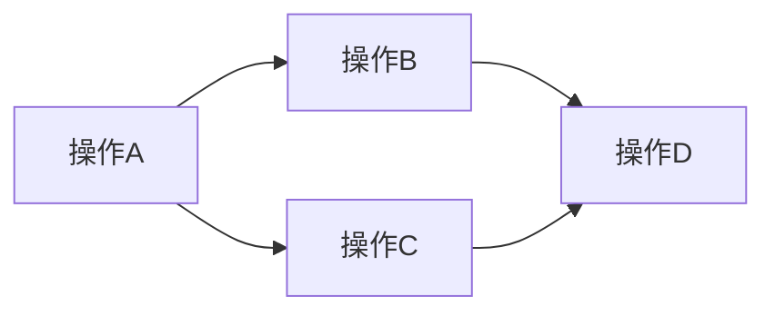

# CS149_p08

## 一、并行计算的思维模型：从单线程到数据并行

> 主题：介绍并行计算的核心思维转变，从手动管理线程到通过数据并行原语操作集合。

### 核心转变：从“执行循环”到“操作集合”

传统并行思维方式：
- 创建线程，每个线程执行一段循环体
- 手动管理线程的创建、同步、销毁
- 关注“线程做什么”

**新思维方式：数组操作抽象**
- 将计算视为对**数据集合**应用**丰富的基本操作集**
- 不再关注“如何在每个元素上运行函数”，而是关注**“对数组做什么操作”**
- 核心思想：**操作是预定义的，我们只需调用并传递参数**

### GPU并行性的规模要求

- **执行上下文总数**：约 **163,000**（单个芯片上）
- **最小数据集需求**：至少16万以上，否则无法获得：
  - **完全并行性**
  - **延迟隐藏**效果
- **实际生产环境**：需要**两百万级别**的并行任务

### 依赖关系：并行性的根本

**核心原则**：并行性来源于**无依赖关系**



- 在依赖图中，**必须先执行前置操作**
- 识别依赖关系 = 找到可并行执行的部分
- **没有依赖 = 可以获得并行性**

### 课程关注点的转移

**之前**：我们编写代码时，必须自己处理：
- 依赖关系分析
- 线程创建和管理
- 执行顺序控制

**现在**：假设**基础操作已被实现**，我们只需：
1. **调用操作**
2. **传递参数**
3. **处理输出**

### 关键洞察

> **并行计算不是关于“创建线程”，而是关于“如何描述数据上的操作”**

我们的思维方式从**“如何执行循环”**转变为**“如何组合数组操作”**。
- 不再需要关心细粒度的依赖管理
- 上层抽象隐藏了并行实现的复杂性
- 开发者专注于**计算逻辑**而非**并行机制**

---

## 二、核心数据类型与并行原语

> 主题：介绍序列数据类型和映射（Map）等基本并行原语。

### 核心概念：通过封装并行原语实现大规模并行化

**核心思想：** 并非手动编写细粒度的线程管理和依赖控制代码，而是将算法**简化为对一系列已知、高度并行的函数（原语）的调用**。只要你的程序完全由这些高度并行的函数构建，你的整个程序就是高度并行的。

- **不要重新发明轮子：** 不需要考虑底层的线程调度、内存依赖等复杂细节。只需要关注如何调用这些函数并处理其输出。
- **编程模型：** 类似于在 NumPy、PyTorch 或 TensorFlow 中编写代码。你操作的是整个**数组、张量**或**序列**，而不是单个循环的迭代。库本身负责底层的高度并行实现。
- **关键点：** 你自己的程序逻辑退化为一连串对成熟并行函数库的调用，从而继承其并行性。

### 核心数据类型：序列（Sequence）

为了严格实现无依赖的并行计算，引入一种受限的数据结构：**序列**。

- **定义：** 一个**有序的元素集合**。它不同于普通的数组。
- **关键区别：** 这是一个**抽象概念**，在不同语言中有具体实现（例如：Python 的 `list`，NumPy 的 `array`，PyTorch 的 `tensor`，C++ 的 `std::vector` 等）。但在此上下文中，它有一个严格的约束。
- **与数组的核心差异：**
    - **数组（Array）：** 允许**随机访问**。你可以通过索引 `a[i]` 直接读写任意元素。这种能力会引入复杂的、难以预测的**数据依赖关系**（例如，循环的迭代 `i` 依赖迭代 `i-1` 的结果）。
    - **序列（Sequence）：** 程序只能通过**特定、封装的并行操作**来访问或修改序列的元素。它**禁止了直接、任意的元素访问（如 `a[i]`）**。通过剥夺随机访问的能力，从根源上**消除了产生数据依赖的可能性**，从而保证了安全的并行执行。

### 第一个关键并行原语：映射（Map）

这是最基础、最熟悉的并行操作。很多时候，并行算法本质上就是一个 `map` 操作。

- **定义：** **`map`** 是一个**高阶函数**（以函数作为输入）。
- **操作：** 它将一个**给定的函数**应用到输入序列的**每一个元素**上，并产生一个**全新的输出序列**。
- **核心属性：** 这是**天生、完美的可并行**操作。对元素 `a[i]` 应用函数完全不依赖对 `a[j]`（`j != i`）的应用。不存在任何数据依赖。
- **语法类比：**
    - 命令式循环：
        ```c++
        for (int i = 0; i < N; i++) {
            output[i] = some_function(input[i]);
        }
        ```
    - 函数式/并行 `map` 语法（类似于 `a.map(some_function)`）：
        ```python
        # 伪代码
        output = map(some_function, input_sequence)
        # 或者类似的标准库风格
        output = input_sequence.map(some_function) 
        ```

### 高阶函数与 Map 操作的并行性

#### **核心概念：高阶函数 (Higher-Order Function)**

*   **定义**：一个能够接受**其他函数作为参数**或**返回一个函数**的函数。
*   **核心优势**：提升代码的**抽象层次**和**复用性**，将操作逻辑（函数）与数据遍历（循环）解耦。
*   **`Map` 函数是典型的高阶函数**。
    *   **输入**：
        1.  一个**转换函数** `f`（类型：`A -> B`，即接受类型 `A` 的输入，返回类型 `B` 的输出）。
        2.  一个**输入序列** `a`（类型：`Sequence<A>`，如整数数组）。
    *   **输出**：
        *   一个**输出序列** `b`（类型：`Sequence<B>`，如整数或字符串数组）。

#### **关键术语：函数签名与类型推导**

*   **函数签名 `A -> B`**：
    *   **含义**：表示一个函数，它接受**类型为 `A`** 的输入，并返回**类型为 `B`** 的输出。
    *   **示例**：
        *   `f(x) = x + 10` 的签名是 `int -> int`。
        *   `g(x) = std::to_string(x)` 的签名是 `int -> string`。
*   **类型推导**：
    *   Map 函数的输出类型 (`B`) **完全由**输入函数的返回类型决定。
    *   **例子**：若输入 `f` 是 `int -> int`，Map 返回 `int` 序列；若输入 `f` 是 `int -> string`，Map 返回 `string` 序列。

#### **并行性与安全性：为什么 Map 天生适合并行**

*   **核心特性**：**操作 `f` 是无状态的**，且**仅依赖单个输入元素**。
    *   `f` 的实现者**无需**关心集合操作或多线程同步。
    *   `f` 的每次调用都是**独立的**，不会创建跨元素的数据依赖。
*   **并行性的保证**：
    *   **绝对安全**：因为 `f` 无法访问或修改其他元素的状态，所以可以**安全地将 `f` 应用到每个元素上并行执行**。
    *   **避免副作用**：`f` 的实现者不会无意中造成竞态条件或数据竞争。

#### **签名与实现举例**

*   **抽象签名**：
    ```text
    map :: (A -> B) -> Sequence<A> -> Sequence<B>
    ```
    *   含义：输入一个函数 `A -> B` 和一个序列 `Sequence<A>`，输出一个新序列 `Sequence<B>`。

*   **C++ 实现（`std::transform`）**：
    *   **语法更复杂**，但逻辑等价：
        ```cpp
        // 将函数 f(int) 应用到数组 [1,2,3,4,5] 的每个元素
        std::transform(begin(a), end(a), begin(b), [](int x){ return x + 8; });
        ```

*   **函数式语言实现（Haskell 风格）**：
    *   **更清晰简洁**：
        ```haskell
        -- 定义函数 f: x -> x+10
        let f x = x + 10
        -- 将 f 映射到列表 a 上
        let b = map f a
        ```

### Map 的并行实现：黑箱与线程池

**核心概念**：并行 `map` 的实现哲学——**实现者无需关心 `f` 的内部构造**，只需把 `f` 当作一个**“黑箱”**（black box）调用。

- **黑箱思维**：`f` 的实现者甚至不需要考虑操作集合的类型，只需关注“给我一个元素，我告诉你怎么做”。这是一种极佳的抽象思考方式。
- **并行策略**：
  - 假设 `f` 被编译为 SIMD（如“Cindy模式”），但通常只能同时处理有限数量（如8个元素）。
  - 对于包含**十万个元素**的序列，需要更通用的方法。
- **工程实现**：
  - 创建**线程工作池**（thread worker pool）。
  - 将序列 `S` 分割成 **p 个更小的子序列**（p 为处理器或线程数）。
  - 每个线程在子序列 `s_i` 上 **顺序** 调用 `f` 进行 map，生成部分输出。
  - 最后 **连接所有输出** 得到完整结果。
- **关键认知**：这本质上就是**分治**（divide and conquer）思想，没有太神奇的魔法。

---

## 三、折叠（Fold）操作：串行与并行挑战

> 主题：介绍折叠操作的定义、串行实现，以及并行化的关键条件——结合律。

### 核心概念

`fold` 是一个**极其重要的操作**，应用广泛。它将一个序列缩减（reduce）为一个单一值。

### 类型签名与含义

- **签名**：`fold : (b, (a, b) -> b) -> Sequence a -> b`
- **参数分解**：
  - 接受一个**起始元素**（初始累加器）`b`
  - 接受一个**二元函数** `f: (a, b) -> b`，即函数不再接受单个 `a` 到 `b`，而是接受一个**对**（a 和 b）并产生 `b`
  - 接受一个**序列** `a`
  - 最终**产生一个元素** `b`
- **本质行为**：**迭代地应用** `f`，将序列中的元素逐个合并到累加器中。

### 具体例子（Scala 风格）

以**求和**为例：
- 函数 `f(accum: Int, x: Int) = accum + x`
- 起始值 `b = 0`
- 序列 `[5, 10, 20, 18]`
- 执行过程：`((((0 + 5) + 10) + 20) + 18) = 53`
- 结果：`53`（序列所有元素的和）

### 并行折叠的争议与关键难点

- **核心问题**：能否并行执行 `fold`？
- **不同观点**：一些人说“绝不可能”，另一些人说“可以”。
- **关键限制**：我们不知道被传递的函数 `f` 是否满足**结合律**（associative property）。
  - **可并行**：如果 `f` 是结合的（如加法 `+`），可以分治处理——把序列分成多段，每段各自折叠，再合并结果。所有人都同意整数求和可并行。
  - **不可并行**：如果 `f` 不满足结合律（如 `fold` 的语义通常隐含**左折叠**，顺序依赖），串行是唯一正确方式。
- **公式表示**（结合律条件）：
  - 可并行条件：$\forall x, y, z, \quad f(f(x, y), z) = f(x, f(y, z))$
  - 即函数的运算顺序不影响最终结果。

### 并行折叠（Parallel Fold）与结合性

#### 核心概念：`fold` 的通用性与并行限制

- **通用 `fold` 的问题**：标准 `fold` 接受一个**任意二元函数 `f`**，但并行实现需要保证无论数据如何分割，最终结果一致。
- **关键属性：结合性（Associativity）**：
  - 如果 `f` 是**结合的**（如加法 `(a+b)+c = a+(b+c)`），则并行 `fold` 可行。
  - **不要求交换性**（例如减法不结合，但结合性已足够）。
- **并行策略**：
  - 将序列分割成子序列 → 各线程顺序 `fold` → 用 **组合函数**（combiner）合并子结果。
  - **组合函数**必须也是 `f` 本身（即 `f: B × B → B`），否则用户需额外指定。

#### 公式与实现细节

- **并行 `fold` 的数学条件**：
  ```latex
  \text{若 } f \text{ 满足结合律：} f(f(a,b),c) = f(a,f(b,c))
  \text{则并行实现正确。}
  ```
- **实现伪代码**（假设 `f` 结合）：
  ```
  输入序列 S
  分割为 S1, S2, ..., Sk
  每个线程：result_i = fold(f, S_i)  // 顺序折叠
  最后：final = f(result_1, f(result_2, ...))  // 逐层合并
  ```

#### 重要扩展：`map` + `fold` 的融合优化

- **点积示例**：
  1. 先 **`map`**：每个元素乘以10 → 新序列
  2. 再 **`fold`**：用加法求和
- **编译时优化（如 Jet 编译器）**：
  - 检测到 `map` 后跟 `fold` 的模式后，**融合**为单个 `fold`，**避免两次遍历**数据。
  - 融合后 `fold` 内部直接执行乘法并累积结果，内存/计算效率提升。
  - 这是**现代函数式编译器**（如 Futhark、Halide）的关键优化。

### 对渲染/游戏引擎工程师的启示

- **`map` 的无脑并行**：任何逐元素操作（如逐像素着色、逐顶点变换、逐网格处理）均可直接套用线程池分治。
- **`fold` 的危险并行**：**聚合操作**（如求最大深度、计算包围盒大小、光追中的累计辐射值）必须确认操作的结合律。若 GPU 或多线程乱序执行，会导致结果不确定。
- **工程实践**：实现如 `ParallelReduce` 或 `ComputeShader` 中的归约操作时，务必明确告知使用者：
  - 输入操作必须是**可结合且可交换**的，否则结果未定义。
  - 游戏引擎中的 `TransformHierarchy` 更新（世界矩阵累乘）就是典型不满足结合律的例子（矩阵乘法结合但顺序重要）。

---

## 四、扫描操作：从序列到序列的并行化

> 主题：介绍扫描（Scan/前缀和）操作的定义、分类，以及并行化实现的核心思路与算法。

### 核心概念：从折叠到扫描

- **核心定义**：**折叠**（Reduce）将序列转换为一个标量值（例如求和）。**扫描**（Scan）则将序列转换为另一个序列，对每个前缀应用相同的二元运算符。
- **关键术语**：**前缀和**（Prefix Sum）是扫描操作最常见的形式。它计算每个位置之前（包括或排除当前元素）所有元素的和。
- **直观理解**：扫描的最后一个元素就是折叠的结果。但扫描生成了所有中间部分，即**部分和**（Partial Sums）。

### 包含性扫描 vs 排他性扫描

- **包含性扫描**（Inclusive Scan）：输出中的第 *i* 个元素包含输入中的第 *i* 个元素本身。
    - 公式：`output[i] = input[0] ⊕ input[1] ⊕ ... ⊕ input[i]`
- **排他性扫描**（Exclusive Scan）：输出中的第 *i* 个元素**不包含**输入中的第 *i* 个元素。
    - 公式：`output[i] = input[0] ⊕ input[1] ⊕ ... ⊕ input[i-1]`
- **重要关系**：包含性扫描和排他性扫描可以互相转换。例如，如果已知包含性扫描的结果 `inclusive[i]`，则排他性扫描的结果 `exclusive[i+1] = inclusive[i]`。

### 并行化扫描的思考路径：从分治到重建

- **核心挑战**：扫描操作表面上依赖前一个结果，这使其难以直接并行。但我们可以通过 **分治策略**（Divide and Conquer）来实现。
- **第一步：并行计算部分和**。将输入数组分成 *t* 个块（例如按线程数量划分）。每个线程独立计算自己块内的**部分和**（即该块内所有元素的和）。这一步是完全并行且高效的，时间复杂度为 `O(n/t)`。
- **第二步：合并部分和**。现在，我们获得了一个长度为 *t* 的部分和数组。我们需要对这些部分和进行**扫描**（例如用另一个并行算法或简单的顺序扫描）。这一步的代价较小，因为 *t* 通常远小于 *n*。
- **第三步：重建最终扫描结果**。有了每个块的前缀部分和后，我们可以将它们广播或累加回每个线程。每个线程用全局前缀（来自上一个块的部分和）来更新自己块内的元素，从而生成完整的扫描结果。

### 并行前缀和算法优化：从 O(n log n) 到 O(n) 工作量的两阶段方法

#### 核心目标
- 在拥有**无限处理器**的理论假设下，将**并行前缀和**算法的**总工作量**从 \( O(n \log n) \) 降低到 **\( O(n) \)**，同时保持 **\( O(\log n) \) 的步骤数**。
- **核心思想**：规避简单树形并行算法中大量重复、冗余的计算。原算法虽步骤少，但总工作量高，且存在**负载不均衡**（处理器利用率逐步下降）。

#### 算法发明者
- **Guy Blelloch**（盖伊·布鲁克），该算法是并行计算领域的经典成果。

#### 算法结构：两阶段法（Two-Phase Method）
- 也被称为 **“上行-下行”（Up-Sweep / Down-Sweep）** 或 **“结合树-分裂树”（Combine Tree / Split Tree）** 阶段。
- **阶段一：上行（Up-Sweep / 结合树阶段）**
    - 从树底向上构建，计算每个子树内部的**部分和**。
    - 沿途计算出一些中间结果，用于后续阶段。
- **阶段二：下行（Down-Sweep / 分裂树阶段）**
    - 从树根向下，利用阶段一生成的中间结果，**将部分和“传播”或“重新基化”** 到数组的各个元素。
    - **核心操作**：将前半部分的部分和，应用到后半部分的对应元素上，进行“重新基于”（re-basing），从而推导出最终结果。

#### 为什么总工作量是 \( O(n) \)？
- **上行阶段的工作量**：每一层的计算量是 \( n, \frac{n}{2}, \frac{n}{4}, \ldots \)。
    - 这是一个**等比数列**，和为 \( 2n \)。
- **下行阶段的工作量**：同样是类似的等比数列，贡献 \( 2n \)。
- **总体工作量**：\( 2n + 2n = 4n \)，即 \( O(n) \)。虽然有一个常数系数“2倍”，但**从渐进复杂度看，是 \( O(n) \) 而不是 \( O(n \log n) \)**。
- **步骤数**：两个阶段各需 \( \log n \) 步，总共 \( 2 \log n \) 步，因此**步骤复杂度仍为 \( O(\log n) \)**。

### 扫描算法并行化的权衡：工作高效 vs. 跨度高效

#### 核心分析：`O(n log n)` 算法 vs. `O(n)` 算法在并行环境下的对比

- **`O(n log n)` 算法（工作低效，跨度高效）**：有**5条指令**（忽略if语句），每个线程执行1条指令，共有 `3` 个线程（对数基数约为3/2），总工作量为 **`n * log n`**。其**跨度**（从开始到结束的最短时间）仅为 **5步**。
- **`O(n)` 算法（工作高效，跨度低效）**：需要**10步**（5步上扫，5步下扫）。

#### 关键悖论与核心概念

- **跨度 vs. 工作量的矛盾**：尽管 `O(n log n)` 算法理论总工作量更多，但其跨度（5步）却比 `O(n)` 算法（10步）更小。这意味着在特定硬件上，前者**实际运行更快**。
- **“重复工作”往往有益**：在并行计算中，让处理器做更多“重复”或“冗余”的计算，有时反而能利用硬件特性，大幅减少总执行时间。

#### 性能差异的根本原因：硬件映射与资源利用率

##### **1. SIMD 执行单元的特性**
- **硬件行为**：处理器有一个 **SIMD 执行单元的块**，它能在一轮指令中**同时处理32项数据**。
- **资源闲置**：
    - `O(n log n)` 算法用**5轮**（5步）利用所有车道，但**做重复工作**。
    - `O(n)` 算法需要**10轮**（10步），虽然总工作量少，但每轮中**70条车道中有大量闲置**。
- **结果**：`O(n log n)` 通过“浪费”计算来**压满硬件 pipeline**，而 `O(n)` 算法在等待数据移动时让执行单元空转。

##### **2. 指令分散与数据格式**
- **损失来源**：`O(n)` 算法虽然总工作量少，但将指令**分散在多种高度不一致的格式**中。这意味着每次数据移动、格式转换都会引入额外的开销。
- **核心观点**：**总指令数不是唯一指标**，指令的**连续性**和**数据排布格式**对SIMD性能至关重要。

#### 扫描库实现的关键决策：根据硬件选择算法

你的选择完全取决于 **并行工作如何映射到机器上**。

##### **不同硬件架构下的最佳策略**
1.  **千个独立处理器（如GPU）**：倾向于使用**工作高效**的 `O(n)` 算法。因为你有独立的执行单元，数据移动和同步的开销相对可控，减少总计算量更有利。
2.  **两个处理器（如双核CPU）**：采用最简单的**分割法**：将数据分成两半，分别计算扫描，再移动数据合并。手动管理数据流。
3.  **SIMD 单指令多数据处理器（如向量化CPU，GPU warp）**：**`O(n log n)` 算法是更好的选择**。原因如上：它能最大化利用SIMD单元的并行能力，即使有冗余计算，也赢在“把硬件喂饱”上。

### 数据并行扫描的高效实现：以NVIDIA GPU为例

#### 核心概念：Warp级并行与分治策略
- **核心思路**：在GPU（如NVIDIA）上，利用**Warp**（32个线程）作为基本并行单元，实现高效的扫描（Prefix Sum）。
- **关键术语**：**Warp**、**SIMD**（单指令多数据流）、**分治扫描**、**共享内存**。
- **效率关键**：算法步骤少，不追求大O复杂度（如`O(n log n)`），而是追求**实际执行步骤少**（如warp内5个周期完成32元素扫描）。

#### 算法细节：从32到128再到1024元素

##### 1. 32元素扫描（Warp内完成）
- **实现方式**：使用CUDA内部的**Warp Shuffle**（`__shfl_up_sync`等）指令，在1个Warp内完成。
- **性能**：仅需 **5个周期**（5 steps），无需全局内存同步。
- **代码示例**（课程提供）：
  ```cpp
  // 伪代码核心：利用warp shuffle进行树形规约
  for (int offset = 1; offset < 32; offset <<= 1) {
      int val = __shfl_up_sync(0xffffffff, thread_val, offset);
      if (threadIdx.x >= offset) thread_val += val;
  }
  ```

##### 2. 128元素扫描（多Warp分治）
- **策略**：将128个元素划分为 **4个32元素块**，每个块由1个Warp在5周期内完成扫描。
- **步骤**：
  1. **各块独立扫描**：4个Warp并行执行4次32元素扫描，得到4个局部扫描结果（5周期）。
  2. **计算块偏移**：对每个块的**最后一个元素**（即块前缀和）执行一次**小扫描**（同样可用Warp），得到块之间的累积偏移（5周期）。
  3. **广播加法**：每个Warp将对应的块偏移广播到其所有线程，并行加到已扫描的结果上（1周期）。
- **总周期**：`5 (块扫描) + 5 (偏移扫描) + 1 (广播加) = 11个周期`（理论上**常数时间**，与元素数无关）。

##### 3. 1024元素扫描（大规模并行）
- **层级结构**：
  ```
  元素块(32) → Warp扫描(5周期)
  ↓
  块偏移(32个) → 再次Warp扫描(5周期)
  ↓
  广播更新(1周期)
  ↓
  重复 -> 更大规模
  ```
- **实现**：将1024个元素分为32个块（每块32元素），由32个Warp并行处理。
  1. **第一层**：32个Warp并行扫描各自的32元素块（5周期）。
  2. **第二层**：对32个块的最后一个元素（即32个块前缀和）执行一次Warp扫描（5周期）。
  3. **更新**：每个线程将对应的块偏移加到自己的局部结果上（1周期）。
- **总周期**：`5 + 5 + 1 = 11个周期`（与128元素相同！）。

#### 重要公式与算法
- **分层扫描复杂度**：对于元素数 \( N \)，若基本块大小为 \( B \)（通常为32）：
  - 一次扫描，分治层数为 \( \log_B N \)。
  - **实际周期数** ≈ \( 5 \times \log_B N + (\log_B N - 1) \) 次更新。
  - 例如，\( N = 1024, B = 32 \)：\( 5 \times 2 + 1 = 11 \) 周期。
- **性能关键**：利用**SIMD并行度**远远大于处理器数量的场景，保持高并行效率。

#### 实践建议与作业提示
- **作业三**：实现一个`O(n)`的CUDA扫描算法，目标是**尽可能逼近CUDA标准库`cub::DeviceScan`的性能**。
  - **挑战**：对比官方库，理解底层优化（如Warp shuffle、共享内存bank conflict避免）。
  - **心态**：不必完全理解所有细节，但通过**分治+Warp扫描**，可写出**极具竞争力**的代码。
- **优化哲学**：
  - **不追求大O**：当`log n`因子可以被硬件并行能力“隐藏”时，实际步骤数才是影响性能的关键。
  - **混合策略**：数据并行（SIMD）与顺序算法（分治）结合：当SIMD并行度足够高时，全用数据并行；当并行度下降时，退化为更传统的顺序同步。

---

## 五、分段扫描与稀疏数据处理

> 主题：介绍分段扫描的概念及其在稀疏矩阵、粒子模拟等不规则并行场景中的应用。

### 分段扫描（Segmented Scan）

#### 核心概念与动机

* **问题背景**：在图形学、科学计算或数据处理中，常遇到“**序列的序列**”，即外层有多个序列，每个序列内部又有多个元素。例如：
  * **图处理**：对于图中的每个顶点，遍历该顶点的所有边。
  * **物理模拟**：对于每个粒子，检查在其影响范围内的其他粒子。
  * **文档集合**：对于每个文档，处理其内部的单词序列。
* **核心挑战**：子序列长度通常**不同**，且外层序列数量可能不足以提供足够的**并行度**（例如，只有数千个顶点，但GPU需要数十万线程才能满载）。此时必须挖掘**内层序列的并行性**。
* **关键术语**：**分段扫描 (Segmented Scan)** 是一种并行原语，它接受一个“序列的序列”作为输入，对**外层**序列进行并行化，但**内层**每个子序列独立执行标准扫描操作。

#### 工作原理与示例

* **操作定义**：在给定一个“序列的序列”后，分段扫描会**并行地**对每个子序列应用扫描（通常是前缀和），但子序列之间互不干扰。
* **明确示例**：
  * **输入子序列**： `[1, 2]` , `[3]` , `[4, 5, 6]`
  * **分段** **Exclusive Scan** 结果：
    * 对 `[1, 2]` 扫描：`[0, 1]`
    * 对 `[3]` 扫描：`[0]`
    * 对 `[4, 5, 6]` 扫描：`[0, 4, 9]`
  * **最终输出**：`[0, 1, 0, 0, 4, 9]`
    * 可见每个子序列从零重新开始，内部前缀和独立计算。

#### 数据编码与实现思路

* **典型数据表示**：在实际实现中，“序列的序列”常被扁平化为两个并行数组：
  1. **值数组**：包含所有子序列的所有元素，按顺序排列（例如 `[1,2,3,4,5,6]`）。
  2. **标志位数组 (Head Flags)**：一个二进制数组，标记每个新子序列的起始位置（例如 `[1,0,1,1,0,0]`，其中1表示子序列开头）。
* **算法核心**：扫描操作在处理每个元素时，必须检查其对应的标志位：
  * 若标志位为 **1**（新序列开始），则**重置累加器**（通常从0或单位元开始）。
  * 若标志位为 **0**（同序列内部），则**正常累加**前一个元素。
* **关键区别**：标准一元扫描是“全局连续的”，而分段扫描是“**局部连续，全局重置**”的。

### 稀疏矩阵与压缩稀疏行（CSR）格式

- **核心概念**：**稀疏矩阵**是指大部分元素为零的矩阵。例如，一个 \(N \times N\) 的矩阵，若 99% 的值为零，则直接存储会浪费大量空间和计算资源。
- **关键术语**：**压缩稀疏行（Compressed Sparse Row，CSR）** 是一种高效存储稀疏矩阵的格式，通过只存储非零元素及其位置信息来节省空间。
- **工作原理**：CSR 将矩阵视为 **序列的序列**。每行作为一个子序列，只包含该行中的非零元素。
    - 例如，一个四行矩阵：
        - 第1行非零元素为3和1 → 子序列 `[3, 1]`
        - 第2行非零元素为2 → 子序列 `[2]`
        - 第3行非零元素为4 → 子序列 `[4]`
        - 第4行非零元素为三个值 → 子序列 `[..., ..., ...]`
    - 这些子序列被 **扁平化** 为一个连续的数组（值数组）。
- **关键编码**：除了值数组，CSR 还维护一个 **行指针数组**，标记每个子序列（即每行）在值数组中的起始位置。这本质上就是 **序列的序列的紧凑表示**。

### 稀疏矩阵的编码与并行乘法

#### 核心概念：稀疏矩阵为何需要特殊编码？
- 矩阵中绝大多数元素是 **零**，存储全部元素浪费空间。
- 只存储 **非零元素** 及其位置，能大幅减少内存和计算开销。

#### 压缩稀疏行（CSR）格式
- **核心思想**：按行存储非零元素，并用辅助数组标记每行起始位置。
- **三个关键数组**：
  - **非零值数组**：按行顺序存储所有非零元素（例如：`[2, 4, ...]`）。
  - **列索引数组**：记录每个非零元素所在的 **列号**（例如：`[col_of_2, col_of_4, ...]`）。
  - **行起始指针数组**：记录每行第一个非零元素在非零值数组中的 **起始索引**（例如：行0从索引0开始，行1从索引2开始，行2从索引4开始等）。
- **优点**：只存储非零元素和必要的索引，内存友好。

#### 如何在GPU上并行计算稀疏矩阵乘法（SpMV）
- **目标**：计算 \( y = A \cdot x \)，其中A是稀疏矩阵，x是向量。
- **步骤分解**：
  1. **聚集**：根据列索引数组，从向量x中提取对应列的值，生成一个与**非零元素数量相同**的临时数组。
     - 这相当于“按需复制”x中元素，形成新数组。
  2. **逐元素乘法**：将非零值数组与聚集后的x值数组逐元素相乘，得到每个非零元素的乘积。
  3. **分段规约求和**：按行进行**分段求和**（类似于分段扫描 + 取最后一个元素）。
     - 利用行起始指针数组生成 **标志数组**（标记每行开始位置）。
     - 对乘积数组执行 **分段扫描**（前缀和），使每行内元素累加。
     - 取每行最后一个元素即为该行的结果 \(y_i\)。

#### 算法复杂度与意义
- **并行度**：与非零元素数量成正比，而非矩阵行数。
- **适用场景**：当非零元素数量远大于行数时（常见于大稀疏矩阵），性能极佳。
- **瓶颈**：主要依赖 **聚集** 和 **分段扫描** 操作的高效实现。

> **公式**：若A有N个非零元素，则算法时间复杂度为 \(O(N)\) 的并行操作，且每步可完全并行化。

### 核心数据移动操作：Gather 与 Scatter

- 这是数据并行编程中用于**在分散与密集数据结构间转换**的两种基本操作。

- **收集 (Gather)**：
    - **定义**：给定一个**索引序列**和一个**源数据序列**，Gather 操作使用索引序列中的每个值作为地址，从源数据序列中**“抓取”**对应的元素，并输出一个密集的、连续的**输出序列**。
    - **公式**：$\text{Output}[i] = \text{Source}[\text{Index}[i]]$
    - **示例**：在执行稀疏矩阵-向量乘（SpMV）时，使用 Gather 从向量 `x` 中按索引取出元素。

- **散播 (Scatter)**：
    - **定义**：Gather 的反向操作。给定一个**密集的输入序列**和一个**索引列表**，Scatter 将输入序列中的元素**稀疏地分布**到一个更大的目标数组中。
    - **公式**：$\text{Target}[\text{Index}[i]] = \text{Input}[i]$
    - **注意**：如果 Scatter 的索引是**置换（Permutation）**——即
