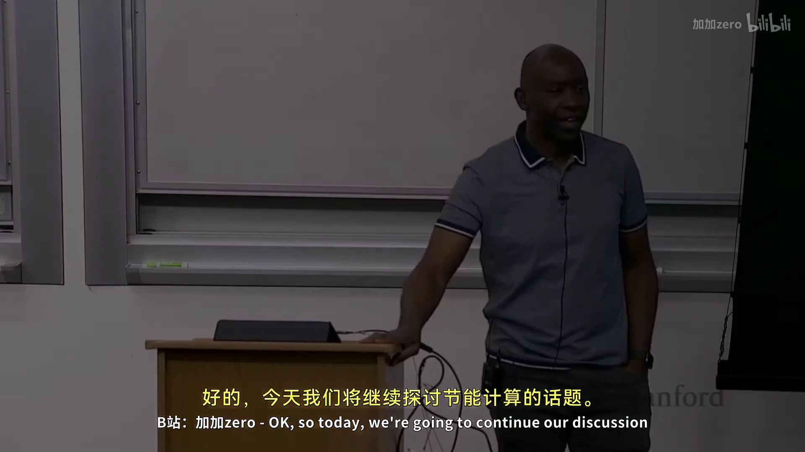

# CS149_p18

## 第 1 部分



### 能效计算：从 Dennard Scaling 到专业化的必然性

#### 1. 核心驱动力：能效是新的性能瓶颈

*   **背景现状：** 我们正处在一个**能量受限**的计算时代。
*   **核心问题：** 为什么能效如此紧迫？
    *   **Dennard Scaling 的终结：** 过去，每一代新制程工艺能提供更多晶体管，但单个晶体管功耗降低，使得总功耗不变。**十年前，这个规律停止了**。
    *   **当前困境：** 现在，增加晶体管数量直接导致功耗上升。
    *   **根本公式：** **能量 = 功率 × 时间**
        *   在现代计算中，**功率 (Power)** 受限于散热和供电能力，几乎固定。
        *   因此，要提升**性能 (性能 = 1/时间)**，唯一途径是**降低每操作的能量 (Energy)**。
*   **关键结论：** 提升性能 = 提升能效。**能效是新时代提升性能的杠杆。**

#### 2. 能量受限的广泛场景：无处不在的限制

*   **高性能计算 (HPC) & 数据中心 (如超级计算机、Google/Facebook 后台)：**
    *   **限制来源：** 电力供应和冷却系统。
    *   **成本压力：** 在大型设施中，为整个系统供电和制冷的成本巨大，甚至可能**超过硬件本身的采购成本**（如：三年运营成本 > 硬件成本）。
*   **移动设备 (手机、平板)：**
    *   **限制来源：**
        1.  **被动散热：** 没有风扇，只能依靠被动散热，热量散不出去。
        2.  **电池容量：** 必须依靠有限的电池提供计算所需能量。
*   **核心观点：** 从云端到终端，整个计算领域都已被“能效墙”所困。

#### 3. 解困之道：走向专业化

*   **核心机制：** 为了在固定的功率预算内获得更高的性能，必须**提高效率**。
*   **提高效率的关键步骤：** **专业化**。
*   **专业化的本质：** 去除计算中不直接用于“推动计算前进”的**额外开销**。
    *   *类比：* 通用CPU需要为各种指令集和分支预测等消耗能量，而专业化硬件（如GPU）只专注“数据并行”，剔除了这些“无关”的能量消耗。

*   **回顾：** 我们之前讨论的**异构性**和**数据并行计算**正是利用了这一原理。
    *   **GPU 的专业化：** 专注于数据并行计算，通过大规模简化控制逻辑，在同样的功耗下获得远超CPU的算力。
    *   **这是下一阶段“硬件专用和算法特定编程”的基础。**

#### 4. 核心公式梳理

| 概念 | 关系 | 解释 |
| :--- | :--- | :--- |
| **功率 (Power)** | **受限的常数** | 由供电和散热能力决定（TDP），无法轻易增加。 |
| **能量 (Energy)** | **能量 = 功率 × 时间** | 完成一个任务总消耗。 |
| **性能** | **1 / 时间** | 单位时间内完成的运算量。 |
| **能效** | **1 / 能量** | 单位能量能完成的运算量。 |
| **核心矛盾** | **功率固定 → 要提升性能 (缩短时间) → 必须降低每任务能量 → 必须提升能效** | |
| **解决方案** | **专业化** | 设计专用硬件，去除通用处理中不必要的开销，从而在固定功率下大幅缩短时间。 |

---

## 第 2 部分

### 专门化 vs. 通用处理：性能提升的根源与代价

#### 核心问题：为什么通用CPU效率低下？

*   **根本矛盾**：执行一条指令（如乘法、加法）时，**实际用于计算（绿色部分）的能量占比极低**，仅约6%。
*   **能量浪费在何处（非绿色开销）**：
    *   **指令获取与解码**：读取指令、理解其意图。
    *   **依赖性检查**：检查当前指令是否依赖其他正在执行的指令。
    *   **资源冲突仲裁**：判断执行单元是否被占用，以及操作数是否可用。
    *   **数据移动**：将操作数从寄存器文件/缓存读取，或将结果写回。
    *   **控制与同步**：保持所有流水线阶段同步的时钟分配与电路开销。
*   **结论**：通用CPU的大部分能量和晶体管被用于**“指令管理”而非“数据计算”**。

#### 专门化（GPU/SIMD）如何解决效率问题？

*   **核心策略**：通过**“摊销”（Amortization）** 来降低每个数据元素上的“非计算”开销。
*   **具体机制**：**一次指令（Instruction Fetch & Decode）作用于多个数据元素**。
    *   **类比**：原本需要“获取-解码-执行”N次（N个数据），现在只需要一次指令处理，然后执行N个数据操作。
*   **关键度量**：**SIMD宽度**（一个指令能处理多少数据元素）。
    *   公式：`理论效率提升 ≈ SIMD宽度 × 6%（计算能量占比）` ？
    *   **更准确的效率模型**：绿色（计算）占比显著提升，因为所有非绿色开销被多个数据操作分摊。
    *   **理想情况**：如果SIMD宽度为8，一个指令就能完成8个数据操作，指令管理开销被**除以8**。

#### SIMD宽度的极限：为什么不做16、32或64？

*   **核心矛盾**：**数据并行度（Occupancy）**  vs. **硬件利用率**。
*   **现实困境**：你的程序可能**无法提供足够的数据并行性**来填满所有SIMD通道。
    *   **高峰 vs. 平均**：理论峰值性能（所有通道满负荷）很高，但**平均性能（部分通道空闲）会很差**。
    *   **“空闲通道”就是浪费**：当一个SIMD指令只使用了8个通道中的3个时，剩余5个通道的计算单元完全闲置，但**指令获取、解码等开销仍然被完整支付**（并未被摊销）。
*   **结论**：
    *   **必须平衡**：不要盲目追求极端SIMD宽度。
    *   **实际限制**：取决于应用场景能否提供**稳定、足够宽**的数据并行性。
    *   **GPU的做法**：通过**大量线程并行（Context Switching）** 来隐藏数据并行度不足的问题，但本质仍是硬件利用率与并行度的权衡。

#### 总结：专门化的收益与代价

| 维度 | 通用CPU | 专用GPU (利用SIMD) |
| :--- | :--- | :--- |
| **能量效率** | 低（大部分能量花在控制/指令上） | **高**（控制开销被大量数据操作摊销） |
| **峰值性能** | 中等 | **高**（宽SIMD单元） |
| **平均性能** | **稳定**（对所有算法公平） | **波动大**（严重依赖数据并行度） |
| **核心挑战** | 指令级并行性（ILP）提取 | **数据并行性（DLP）的填充** |

**一句话总结：**
专用化（如GPU/SIMD）通过**摊销指令开销**获得了巨大的峰值性能提升，但这个提升能否转化为实际收益，**完全取决于应用程序能否提供足够的“数据并行性”来填满所有处理单元**，否则就会陷入“峰值漂亮，平均惨淡”的陷阱。

---

## 第 3 部分

### 专用计算架构：从通用到定制的效率跃迁

#### 1. SIMD的局限性：能效提升的瓶颈
- **核心概念**：即使对于**数据并行和适合SIMD**的应用（如视频编码），SIMD带来的能效提升也**有限**。
- **关键术语**：**SIMD能量开销** (SIMD energy overhead)
    - 在一项斯坦福的研究中，分析了一个CD播放器运行视频编码（256编码）的能量消耗。
    - 结果显示，**SIMD相关能耗（红色框部分）占比并不高**。
    - **结论**：仅仅依赖CPU内的SIMD，无法在能效上实现巨大突破。要显著提升，需要引入**更加专用的硬件组件**。

#### 2. ASIC（专用集成电路）：能效与面积的极致
- **核心概念**：针对**单一特定算法**（如**快速傅里叶变换 FFT**）设计专用硬件，能获得**千倍的硅面积效率提升**和**百倍的能源效率提升**。
- **关键术语**：**ASIC (Application-Specific Integrated Circuit)**、**硅面积效率** (Silicon area efficiency)、**能源效率** (Energy efficiency)
- **性能对比（40nm工艺， vs. Intel Core i7）**：
    - **每平方毫米性能（GFLOPS/mm²）**：ASIC > DSP > GPU > CPU
    - **硅面积效率提升**：ASIC 比 CPU 高约 **1000倍**。
    - **能源效率提升**：ASIC 比 CPU 高约 **100倍**。
- **ASIC的致命缺点**：
    - **灵活性为零**：只能运行**一种**算法（例如FFT）。
    - **开发周期长**：设计、流片需要 **18个月**。
    - **沉没成本高**：除非算法极其重要（如FFT），否则不值得投入，因为市场变化后芯片立刻作废。

#### 3. DSP（数字信号处理器）：一种折中方案
- **核心概念**：DSP通过**增强通用CPU的指令集和地址模式**，专门为信号处理算法（FFT、滤波）优化，从而在**效率与可编程性**之间取得平衡。
- **关键术语**：**DSP (Digital Signal Processor)**、**复杂地址模式** (Complex addressing modes)、**位反转寻址** (Bit-reversed addressing)
- **具体优化**：
    - **指令集**：加入能一步完成特定算法（如乘加MAC）的复杂指令。
    - **地址模式**：加入支持FFT算法所需的**位反转寻址**等特殊模式。
- **权衡结果**：
    - **编程难度**：介于**ASIC（最难）** 和**通用CPU（最易）** 之间。DSP需要**低级编程**（难以用编译器自动优化）。
    - **效率**：介于**ASIC（最高）** 和**通用CPU（最低）** 之间。
- **例子**：D.E. Shaw（金融高频交易公司）开发的专用计算单元，就是这种思路的极致体现，在金融领域获得巨大成功。

#### 4. 专用计算图谱：效率与灵活性的三元组

| 架构类型 | 效率 (Energy/Area) | 灵活性 (Programmability) | 适用场景 | 开发周期 | 典型例子 |
| :--- | :--- | :--- | :--- | :--- | :--- |
| **通用CPU** | 低 | 高 | 任意通用任务 | 短 (软件) | Intel Core i7 |
| **SIMD/GPU** | 中 | 较高 | 数据并行、吞吐量型任务 | 较复杂 (并行编程) | AVX, CUDA |
| **DSP** | 高 | 低 | 固定的信号处理流水线 | 长 (低级汇编) | 音频解码、FFT |
| **ASIC** | 极高 | 无 | 唯一的、极其重要的算法 | 极长 (18个月) | ASIC矿机、FFT芯片 |

- **核心公式**：**效率提升 = 灵活性牺牲**。从CPU到DSP到ASIC，是在用**可编程性换取能效和面积效率**。作为引擎工程师，需要根据项目核心负载（物理模拟 vs 网络协议 vs 特定加密）权衡选择。

---

## 第 4 部分

### 专用计算单元与可编程硬件的平衡

#### 1. 分子动力学专用加速器：安东 (Anton)

- **核心概念**：为了解决**分子动力学**（研究蛋白质折叠等）这一特定领域的问题，而专门设计的加速器。其核心任务是快速计算**N体模拟**中的分子间相互作用力。
- **关键术语与背景**：
    - **分子动力学 (Molecular Dynamics, MD)**：通过计算分子间作用力来模拟分子运动，是理解蛋白质折叠等过程的关键化学领域。
    - **N体模拟 (N-Body Simulation)**：计算大量粒子（分子）之间相互作用力的基础算法。
- **核心优势**：通过**算法与硬件的协同设计**，安东专用加速器在性能和能效上远超通用CPU和GPU。
- **发展现状**：已开发至第三代，每一代性能都有显著提升。
- **行业内的张力**：在专用加速器（硬件方案）与“统计方法/机器学习”（软件方案）之间存在方法论上的竞争。后者近年非常流行。

#### 2. 机器学习专用加速器：张量处理单元 (TPU)

- **核心概念**：为加速**机器学习**算法（特别是深度学习）而设计的专用处理器。其核心杀手锏是**高速、大规模的矩阵乘法**。
- **关键术语与核心计算**：
    - **密集矩阵乘法 (Dense Matrix Multiplication)**：TPU的核心任务就是极其高效地完成此运算。
    - **整数/浮点矩阵乘法**：例如第一代TPU擅长128x128的整数矩阵乘法，后续版本开始支持16位浮点数运算。
- **硬件特点**：为了适应快速演进的ML算法，大多数现代ML专用架构都具备**可编程性**，但核心计算核（**计算核 (Compute Kernel)**）依然是矩阵乘法。
- **核心公式 (以TPU为例)**：其计算核心可抽象为：
  `\[
  \text{Output}_{(m,n)} = \sum_{k} \text{InputA}_{(m,k)} \times \text{InputB}_{(k,n)}
  \]`

#### 3. 固定算法与可编程性的折中：可编程门阵列 (FPGA)

- **核心矛盾**：设计针对**特定固定算法**的硬件（如ASIC）效率极高但灵活性差。是否有一种**中间立场**，既能获得硬件加速的效率，又能保留一定的可编程性以适应算法变化？
- **解决方案**：**现场可编程门阵列 (Field-Programmable Gate Array, FPGA)**。
- **关键结构与原理**：
    - **可配置逻辑块 (Configurable Logic Block, CLB)**：FPGA的基本单元。它本质上是一个**查找表 (Look-Up Table, LUT)**，用于实现布尔函数。
        - **核心思想**：将布尔函数的**真值表**映射为查找表。
        - **工作方式**：给定输入，查找表直接输出预存的结果。
    - **寄存器 (Register)**：与组合逻辑块（LUT）结合，提供存储功能。
    - **互连结构 (Interconnect)**：将大量的逻辑块排列成阵列，并通过可编程的连线将它们**连接成更复杂的逻辑电路**。
- **应用范例**：
    - 例如，一个**6输入查找表**只能处理6个输入的布尔函数。
    - 如果想实现一个**40输入与门**，可以将多个6输入逻辑块组合、级联起来，形成一个更复杂的功能。

---

## 第 5 部分

### 可编程计算领域的设计权衡：从 CPU 到 ASIC

#### **可编程逻辑的密度与效率平衡**
*   **核心概念**：虽然由 **可配置逻辑块 (CLBs)** 构成的 FPGA 提供了最大的灵活性，但用它构建一切会带来巨大的 **开销**。
    *   **开销来源**：
        *   连接逻辑块之间的互联延迟与资源消耗。
        *   用这种通用技术实现具体计算单元时的面积浪费。
*   **解决路径**：为了提高 **密度** 并更有效地利用 **硅面积**，现代 FPGA 引入了 **硬宏模块**。
    *   **关键模块**：
        *   **密集内存**：嵌入式的块内存 (Block RAM)。
        *   **DSP 块 (数字信号处理块)**：专用乘法器等运算单元。
    *   **目的**：将通用逻辑无法高效完成的专用功能固化到硅片中，实现更优的能效比。

#### **FPGA 与云资源**
*   **访问方式**：除了传统的实验室开发板，现在也可以通过 **云服务**（如 Amazon AWS）访问高性能 FPGA 资源。
*   **开发环境**：现代 FPGA 平台提供了完整的软件开发环境，允许开发者进行感知硬件但更偏向软件层面的开发。
*   **连接技术**：
    *   与 **CPU** 通过 **PCIe (Peripheral Component Interconnect Express)** 接口连接。
    *   与 **其他 FPGA** 通过专用链路进行高速通信。
    *   与 **内存** 通过 DDF (具体指代不详，但代表高速内存控制器) 连接。

#### **计算技术谱系：从 CPU 到 ASIC**
*   **核心权衡**：在整个现代计算技术空间中，存在一个根本性的 **能源效率** 与 **可编程性** 之间的权衡。
    *   **谱系图 (从左到右)**：

| 技术路径 | 可编程性 (易用性) | 能源效率 (性能/瓦特) | 开发复杂度 |
| :--- | :--- | :--- | :--- |
| **通用 CPU** | **最高** (高级语言编程) | **最低** | 最低 |
| **GPU** | 中等 (CUDA 编程) | 较高 | 中等 |
| **DSP** | 较低 (汇编语言) | 高 | 较高 |
| **领域特定计算** | 领域优化 (如 ML: PyTorch) | 更高 | 领域特定 |
| **FPGA** | **硬件设计** (RTL) | 很高 | 非常高 |
| **ASIC** | **无** (固定功能) | **最高** | **极高 (成本高)** |

*   **设计决策建议**：
    *   **向左移动**：如果 CPU 就能满足性能需求，直接使用高级语言编程 (如 Python, C++) 是最快且成本最低的方案。
    *   **向右移动**：需求更高性能时，则需在编程难度与开发成本上做出妥协。每向右移动一步，虽然能获得显著的能效提升，但付出的 **开发努力** 与 **资金成本** 将大幅增加。
    *   **FPGA 与 ASIC 的本质**：使用 FPGA 意味着你实际上成为了 **硬件设计师**；而制造 ASIC 则是不计成本、追求极致效率的终极选择。

#### **关键公式与概念**
*   **最终共识**：作为系统设计师，你的决策取决于 **应用需求**：
    *   能效限制是多少？
    *   应用程序需要在多快的时间内完成？
    *   你愿意为让应用程序正常运行的 **编程工作量** 支付多少代价？
*   **当前讨论**：对于 GPU 与 **张量处理单元 (TPU)** 之间的中间地带（例如 FPGA 相对于专用加速器的优势），目前业界仍在深入探讨和评估，尚未形成定论。

---

## 第 6 部分

### 从通用计算到专用加速器：内存、计算与编程模型的演进

#### 核心议题：为何与如何转向专用加速器（如TPU、Tensor Core）

- **性能与效率的权衡：通用 vs 专用**
    - **核心概念：** 虽然GPU是强大的通用并行处理器，但在特定领域（尤其是**机器学习**），专用硬件（如**TPU**）可能提供更高的**每瓦特性能**或**每美元性能**。
    - **关键术语：** **TPU (Tensor Processing Unit)**、**GPU (Graphics Processing Unit)**、**Tensor Core**、**DSP (Digital Signal Processor)**。
    - **核心洞察：**
        - **“为什么不直接做个TPU？”**：TPU是高度专门化的，针对矩阵运算（张量核心）进行了极致优化，舍弃了通用计算的灵活性。
        - **“GPU在向TPU学习”**：最新的GPU集成了**Tensor Core**单元，这是GPU通用性向机器学习专用性的一次妥协与融合，体现了硬件设计的流变。
        - **“Tensor Core很难编程”**：作为CUDA程序员，直接操控Tensor Core具有挑战性，其编程模型与传统的通用线程编程有显著差异。这揭示了专用硬件的第一道门槛：**编程复杂性**。

- **为什么DSP适合特定任务？**
    - **核心概念：** **DSP（数字信号处理器）** 拥有专门化的**地址机制**和**计算单元**，使其在处理**数字信号**（如音频、图像滤波）时比通用GPU更高效。
    - **关键术语：** **DSP**、**地址机制**、**MAC (Multiply-Accumulate)**。
    - **核心洞察：** DSP的专用性在于其**内存访问模式**和**计算模式**与信号处理算法高度匹配。但如果用它做机器学习，其优势可能不复存在，因为机器学习的数据流与计算模式不同。

---

### 设计/编程加速器时需控制的“控制点”

#### 从“在现有架构上编程”到“为新型加速器编程”

- **思维转变：** 我们之前专注于在**固定资源集**（如通用处理器、GPU）上编写程序。现在的问题是：**要设计或编程一个全新的加速器，需要控制哪些关键要素？**
- **核心性能杠杆：内存系统**
    - **关键术语：** **定制内存系统**、**访问行为**、**局部性特征 (Locality Characteristics)**。
    - **核心洞察：** 任何硬件的性能改进，**绝大部分来自于内存系统的组织方式**。
    - **关键任务：**
        1.  **分析你的应用**：识别出其中的**访问行为**和**局部性特征**（时间局部性、空间局部性）。
        2.  **定制硬件内存**：根据应用特征，设计**缓存结构、内存带宽、数据路径**等。
        3.  **匹配计算**：将**专门化的计算单元**（如矩阵乘法器、FFT单元）与优化后的内存系统结合起来。

- **当前编程加速器的两种方式及其痛点**

    - **1. 传统方式：硬件描述语言 (HDL)**
        - **方法：** 使用 **VHDL** 或 **Verilog** 等底层硬件语言，在**寄存器传输级别 (RTL)** 进行设计。
        - **痛点：** **极度痛苦、效率低下**。需要硬件设计者的思维，底层细节繁多，开发周期长。

    - **2. 现代方式：高级综合 (HLS — High-Level Synthesis)**
        - **方法：** 用 **C 程序** 编写算法，然后依赖 **编译器** 将其自动转化为硬件描述（如Verilog）。
        - **核心思想：** 提升抽象层级，让软件工程师也能参与硬件设计。
        - **两个核心问题：**

            - **问题一：C 程序不是硬件描述**
                - **核心洞察：** C 程序是为**通用顺序处理器**设计的，其执行模型是“读指令-执行-写回”。而硬件是**并行、并发、具有状态机**的。编译器需要**大量推断**硬件行为，容易出错或低效。

            - **问题二：Pragma 的本末倒置**
                - **解决方法：** 为了弥补 C 的不足，HLS 工具引入了大量的 **Pragma**（编译指令）来指导硬件实现（如：`#pragma HLS PIPELINE`、`#pragma HLS UNROLL`）。
                - **致命缺陷：** 为了写出高性能的代码，你必须**深入了解底层硬件细节**（如内存带宽、流水线深度、冲突避免），才能知道该加哪些 Pragma 以及如何加。
                - **结论：** 这种“高级抽象”最终让你**又回到了硬件级别**，失去了“高级编程”的意义。为了得到**任何有价值且性能良好的东西**，你不得不降级思考，这违背了 HLS 的初衷。

---

### 总结：加速器开发的核心困境与路径

1.  **性能源于专用**：相比通用处理器，加速器的性能突破点在于**内存系统与应用访问模式的精确匹配**以及**计算单元的定制化**。
2.  **编程模型是核心障碍**：从Verilog到C+HLS，每一次抽象提升都试图解决编程效率问题，但都因为**硬件本身的复杂性**而未能彻底成功。
3.  **现实路径**：当代GPU（如Tensor Core）代表了**通用与专用的混合**，而工程师需要同时掌握**应用层算法（如机器学习）** 与**底层硬件特性**，才能有效驾驭这些日益复杂的异构计算平台。

---

## 第 7 部分

## 空间语言：面向性能程序员的硬件加速器设计

### 核心定位：从高级综合到硬件感知

- **传统高级综合（HLS）的困境**：试图用纯高级语言（如C/C++）描述硬件，但为了获得**有价值和性能良好的结果**，必须**降级到硬件级别**，通过使用 pragma 等指令来控制硬件行为。
- **空间语言（Spatial Language）**：一种**特定于加速器设计的领域特定语言（DSL）**，专为**性能导向的程序员**设计，使其能够**直接指定硬件结构**，而不是抽象地“综合”硬件。

### 关键设计原则：程序员关心的核心

- **并行性**：整个学期（即性能导向编程）的核心问题。
  - **独立并行性**：将任务（如 map, reduction）分配到**独立的计算单元**上执行。
  - **依赖并行性**：处理相互依赖的并行任务。
    - **流水线并行性**：类似于**CPU指令流水线**或**汽车装配线**——每个阶段独立工作，但整体形成依赖关系，通过流水级划分获得并行度。
- **局部性**：需要管理**专门的内存**和**数据移动方式**。
  - 程序员必须能够**明确指定内存层次结构**，并控制其使用方式。
  - 这比从**线程层面**思考机器学习应用场景**更符合直觉**。

### 核心机制：表达并行与局部性的契约

- **并行设计模式**：语言内置了程序员熟悉的**并行模式**，如：
  - **map**
  - **reduce**
  - 这些模式可以**嵌套**，形成**层次化的控制**。
- **内存与局部性**：
  - 提供**内存模板**，允许程序员**显式控制内存层次结构**（如本地缓存、全局内存等）。
  - 支持通过**参数化**探索整个设计空间，将这些参数**暴露给编译器**，允许编译器**自动探索最优设计**。

### 总结：空间语言对性能导向程序员的吸引力

- 聚焦于**高性能的真正驱动因素**：
  - **利用并行性**：不只是独立并行，还包括**依赖并行（流水线）**。
  - **管理局部性**：不是抽象的内存模型，而是**可控制的硬件内存层次**。
- 目标：让程序员**像设计硬件一样思考**，但使用**高级抽象**，而不是陷入纯低级硬件描述的细节。

---

## 第 8 部分

### 空间语言 (Spatial Language) 核心概念与内存层次操作

#### 1. 内存层次结构 (Memory Hierarchy) 与显式数据移动

- **核心思想**：与CPU编程中统一的“程序可见内存地址空间”不同，**空间语言**要求程序员**显式地在不同级别的内存层次之间移动数据**。这赋予了开发者对数据流的精细控制，是提升性能的关键。
- **芯片上内存 (On-Chip Memory / SRAM)**：
    - 位于芯片内部，访问速度极快。
    - 可声明为特定数据类型（如 `UInt8`）的**一维数组**，并指定元素个数。
- **芯片外内存 (DRAM)**：
    - 位于芯片外部，容量大但访问延迟高。
    - 可声明为特定数据类型的**二维数组**（例如，用于存储图像或帧缓冲区）。
- **专用内存结构**：
    - **累加器 (Accumulator)**：用于执行归约操作（如求和）的专用寄存器。
    - **FIFO (队列)**：一种先进先出的队列结构，用于数据流缓冲。
    - **线缓冲 (Line Buffer)**：一种可以**横向滑动**的二维数组，常用于图像处理中实现滑动窗口卷积。
    - **移位寄存器 (Shift Register)**：与线缓冲功能类似，用于数据流的移位操作。

#### 2. 显式数据移动指令：加载与存储

- **核心概念**：程序员通过指令显式地将数据在不同内存层之间搬移。
- **指令模式**：
    - **加载 (Load)**：将数据从 **DRAM** 传输到 **SRAM (缓冲区)**。
    - **存储 (Store)**：将数据从 **SRAM** 写回 **DRAM**。
    - **作用**：这是一种**密集的数据流动 (Dense Data Movement)**，用于处理连续、规整的数据块（如整个图像）。

#### 3. 不规则数据访问：聚集 (Gather) 与散列 (Scatter)

- **核心概念**：处理**稀疏 (Sparse)** 或不规则索引的数据。
- **聚集 (Gather)**：
    - **操作**：根据一个索引数组（数组 `a`）中的地址，从源存储（如DRAM中的图像）中**随机读取**多个不连续的元素，然后将它们**组合 (Combine)** 成一个**密集**的、连续的内存缓冲区。
    - **效果**：将稀疏数据“聚集”为密集数据，便于后续高效处理。
- **散列 (Scatter)**：
    - **操作**：是聚集的反向操作，将密集缓冲区中的数据，根据索引数组写回源存储的不连续位置。

#### 4. 数据流 (Streaming) 与控制模板

- **核心概念**：数据流是提升效率的关键，允许数据以流水线方式持续在内存层次和处理单元间流动，无需等待全部数据加载完毕。
- **控制模板 (Control Template)**：
    - **`excel` 块**：将程序划分为两个区域：
        - **可加速部分**：在空间架构（如FPGA）上运行。
        - **CPU部分**：在传统CPU上运行。
    - **`excel*`**：用于指定一个 `excel` 块是**持续运行**（无限循环）还是**只运行一次**。
    - **有限状态机 (FSM)**：课程中不重点讨论，但作为一种可用的控制结构。

#### 5. 并行模式 (Parallel Patterns) 与 DSL 嵌入

- **核心概念**：并行计算的核心模式被抽象为语言结构，如 `foreach` 和 `reduce`。
- **`foreach` (映射 Map)**：
    - **语义**：对一个集合（如数组 `c`）中的**每个元素**，**独立且并行地**执行花括号 `{...}` 内的代码块。
    - **本质**：一个**映射 (Map)** 操作，没有元素间的依赖。
- **`reduce` (归约 Reduce)**：
    - **语义**：将一个集合中的所有元素**组合**成一个单一结果（例如求和、求最大值）。
- **语言嵌入**：
    - 空间语言是**内嵌 (Embedded)** 在 **Scala** 语言中的领域特定语言 (DSL)。
    - **原因**：Scala 语法极其灵活，非常适合用于构建内部 DSL，曾因Apache Spark框架而被广泛采用。其主要局限在于运行在JVM上，可能影响最终性能。

---

## 第 9 部分

### 内积计算加速器设计与实现

#### 核心概念：**Reduce（归约）** 与 **For-Each（遍历）** 的并行控制

- **对于 `for` 循环中的每个元素**，加速器会**逐个处理**，并执行循环体内的代码（花括号内）。
- 设计时需指定多个**设计参数**：
  - **并行度**：每个 `for-each` 和 `reduce` 操作可以运行多宽（同时处理多少个元素）。
  - **调度策略**：选择**流水线化**（Pipeline）或**流式处理**（Streaming）。
  - **缓冲区大小**：默认大小为 64，可配置范围从 **64 到 1024**，编译器会据此探索最佳实现。
- **内存银行（Memory Bank）管理**：
  - 当需要**并行访问同一内存单元**时，编译器**自动处理**内存**复制**或**合理安排内存银行**，以满足并行度要求。
  - 这是**编译器隐式完成的细节**，开发者无需手动干预。

---

### 实例：构建空间加速器计算内积

#### 目标：实现 **向量内积（Dot Product）** 的硬件加速

- **C 代码逻辑**：
  ```c
  int result = 0;
  for (int i = 0; i < N; i++) {
      result += vec_one[i] * vec_two[i];
  }
  ```
  - 对两个向量 `vec_one` 和 `vec_two` 进行**逐元素相乘**，再**累加**所有乘积。

#### 加速器设计步骤

##### 1. 数据移动基础：**DMA（直接内存访问）**
- 两个数组存放在**主内存（DRAM）**中。
- 使用 **DMA** 高效地在主内存与加速器之间传输数据。
- 加速器内部定义**两个 SRAM 块**（`Tau_1` 和 `Tau_2`）作为数据落脚点。
  - 每个 SRAM 块尺寸为 **Tile 大小**（具体大小需进一步讨论确定）。

##### 2. 循环结构改造：从单层到双重嵌套
- **原因**：要通过**铺装（Tiling）** 方式计算内积。
- **单层循环不适用**，必须改为**双重嵌套循环**：
  - **外层循环**：遍历所有**瓷砖（Tile）**。
  - **内层循环**：在单个瓷砖内计算**部分内积**（元素乘加操作）。

---

## 第 10 部分

### 数据分块（Tiling）的核心原理

*   **核心概念：数据分块（Tiling）** 与 **空间局部性（Spatial Locality）**
    *   **避免“单元素”访问：** 直接从DRAM（主存）读取单个元素效率极低。
    *   **类比“超市购物”：** 去一次超市（DRAM访问）很“贵”，所以应该一次性批量采购（读取整个Tile/数据块），放进冰箱（片上缓存/局部存储），而不是每次饿（需要数据）都跑一趟超市。
    *   **显式数据移动：** 不同于CPU的通用缓存由硬件自动管理，在加速器/DSP中，你可以**显式编程数据移动**，更精细地控制什么数据何时被加载到本地。

*   **关键原因：为什么用“瓷砖”（Tile）而非单个元素？**
    *   **提升接口利用率：** 更好地填充DRAM与计算单元之间的总线带宽。
    *   **降低延迟：** 减少访问DRAM的次数，因为从本地存储（如卷1、卷2）读取数据的延迟远低于从DRAM读取。

### 三步式Tile处理流程

**核心操作：** 这是一个“分块-内积-累加”的过程，通过三重循环（隐含）来高效计算向量内积。

1.  **第一步：加载（Load）**
    *   从 `vec_one` 中加载一个Tile大小的数据到本地缓冲区 `tile_one`。
    *   从 `vec_two` 中加载一个Tile大小的数据到本地缓冲区 `tile_two`。

2.  **第二步：Tile内缩减（Intra-Tile Reduction）**
    *   对加载到本地的两个Tile中的元素进行**元素级乘法**，并将所有乘积累加成一个**局部和**（Partial Sum）。
    *   *公式：* 设Tile大小为 *N*，则局部和 *partial_sum* = Σ\[*i*=0 到 *N-1*\] ( *tile_one\[i*\] × *tile_two\[i*\] )

3.  **第三步：跨Tile缩减（Inter-Tile Reduction）**
    *   将所有Tile计算出的局部和（`partial_sum`）累加起来，得到最终的点积结果。
    *   *公式：* 最终结果 = Σ\[所有Tile的 *partial_sum*\]

### 并行化策略：挖掘并行性

**问题：** 如何利用硬件并行性提升此算法的性能？

*   **并行性源一：流水线（Pipelining）**
    *   **机制：** 在“加载”、“计算”、“累加”三个步骤之间构建**流水线**。例如，在计算当前Tile的内积时，预取下一个Tile的数据。
    *   **效果：** 隐藏数据加载延迟，提高吞吐量。

*   **并行性源二：Tile间并行（Inter-Tile Parallelism）**
    *   **机制：** 对**不同的Tile**，可以并行执行上面的三步流程。
    *   **要求：** 需要有足够的计算单元（如PE阵列）和内存带宽来同时处理多个Tile。

*   **并行性源三：Tile内并行（Intra-Tile Parallelism）** — **核心优化点**
    *   **本质：** 对`第二步`中的乘法与缩减进行并行化。
    *   **最佳方法：使用SIMD（单指令多数据流）指令或向量单元。**
        *   **原因：** 对所有元素都执行完全相同的操作（乘加操作），且操作是独立的。
        *   **实现：**
            *   **并行乘法：** 多条乘法指令同时执行（例如，一条指令同时计算4个、8个或16个乘积）。
            *   **并行缩减树（Reduction Tree）：** 使用加法器树，将局部N个乘积并行累加。
                *   *图示：* 输入向量对 → 并行乘法 → 加法器树（Log(Depth)） → 局部和。
                *   **公式：** 对于宽度为 *W* 的SIMD单元，可以在 *O(N/W + log W)* 步长内完成一个Tile的缩减，而非 *O(N)*。
        *   **关键术语：** **SIMD**, **向量化**, **缩减树 (Reduction Tree)**。

### 总结：高效点积的计算模型

一个高效的硬件实现应遵循此模型：
1.  **数据流：** 批量加载Tile（DRAM → Local Buffer）。
2.  **计算流：** 对每个Tile，利用**SIMD**并行做乘法，利用**缩减树**并行做累加，生成局部和。
3.  **累加流：** 通过**流水线**或**并行Tile处理**，将所有局部和合并为最终结果。

---

## 第 11 部分

### 空间程序员的优化三要素：并行化、数据局部性与流水线

#### 1. 减少树与硬件资源的权衡
- **核心概念**：**减少树 (Reduction Tree)** 是并行计算中的一种关键结构。树的“宽度”决定了并行度。
- **关键权衡**：
    - **更宽的树**：意味着更高的并行性（可以同时进行更多乘法/操作）。
    - **代价**：更大的减少树需要**更多硬件资源**（逻辑单元、寄存器等）。这是一个“没有免费午餐”的交换。
    - **控制点**：开发者可以基于期望的性能提升幅度，主动控制树的宽度，从而决定资源消耗。

#### 2. 控制 Tile 大小与数据局部性
- **核心概念**：**Tile 大小** 决定了每次内存访问时获取的数据量。
- **优化目标**：通过调整 Tile 大小，可以优化数据在内存层次结构中的复用率（即**数据局部性**）。
- **操作**：开发者可以主动指定用于计算的 Tile 大小，以平衡带宽利用率和片上存储容量。

#### 3. 流水线化与重叠执行
- **核心思想**：通过**流水线调度 (Pipelining)**，将外层循环的减少操作重叠执行，而不是一步一步串行完成。
- **关键条件与代价**：
    - **无数据冒险**：流水线工作的前提是不同阶段之间没有数据依赖关系（没有“危险”）。
    - **额外资源**：需要**双缓冲 (Double Buffering)**。即：
        - 第一阶段（如从内存填充数据）在处理当前数据时。
        - 第二阶段（如计算）必须能够处理来自前一次执行（第一阶段）的数据。
    - **实质**：流水线是硬件中最接近“免费午餐”的优化，因为它将延迟隐藏起来。但它并非完全免费，因为需要额外的内存（Tile 存储）来防止数据被覆盖。

#### 4. 空间程序员的职责与编译器的分工

**空间程序员的责任：**

- **算法表达**：使用 `for each` 和 `reduce` 等高级构造来显式表达算法。
- **内存层次管理**：**显式地**指定数据应该放在不同层级的内存（例如，片上 SRAM vs 片外 DRAM）中的哪个位置。
- **数据移动**：负责显式的数据搬运（如从外存搬入本地 Tile 内存）。
- **并行性与调度控制**：
    - 指定并行度（填充因子/宽度）。
    - 选择合适的 Tile 大小。
    - 设计流水线调度策略（如何重叠执行）。
- **反馈循环**：为了理解和提升性能，需要通过工具获取关于代码在目标硬件上的实际性能及资源使用情况的反馈。

**编译器的责任：**

- **低级细节**：处理内存的银行分配和缓冲管理，以最大化性能并最小化资源消耗。
- **生成配置**：针对特定目标硬件生成最优的低级配置代码。

---

## 第 12 部分

### 流式执行模型与空间编译器：避免显式融合内核的注意力机制优化

#### 核心问题：从“物质化”到“流式”的性能瓶颈突破

- **传统注意力机制的痛点**：在标准实现中（例如Flash Attention出现前），计算注意力分数 $S = Q \times K^T$ 会导致**全矩阵物质化**。
    - 这意味着 $S$ 矩阵（通常是巨大的 $N \times N$）必须被完整地写入显存，然后才能进行后续的Softmax和加权求和。
    - 这带来了极高的**内存带宽消耗**和**内存占用**瓶颈。
- **Flash Attention的解法**：通过编写**显式的融合内核**（Fused Kernel），将注意力计算切分成块（Tiling），逐块计算并立即合并，从而避免物质化整个 $S$ 矩阵。
    - **代价**：开发者必须手动处理复杂的块状逻辑、寄存器调度，并且为了在线计算Softmax（需要行统计量），通常需要**额外计算**（重计算Recomputation）。
- **新思路：流式执行模型**：目标是用**更简单的编程模型**，自动获得Flash Attention级别的性能和内存优势，而无需编写显式的融合内核或承担额外计算代价。

#### 核心机制：空间编译器与“生产者-消费者”流式架构

- **核心概念**：利用**空间编译器**（Spatial Compiler）将计算图描述为一种**流式数据流**。
- **工作原理**：
    1.  **解构Softmax**：将原本的内存密集型三步过程（指数计算 -> 行求和 -> 归一化除法）拆解为微操作。
    2.  **生产者-消费者模型**：
        - **Mappper（生产者）**：生成局部计算结果，**不写入全局内存**，而是将数据推入一个**FIFO（先进先出队列）**。
        - **Reducer（消费者）**：直接从FIFO中读取数据，进行归约（如行求和）操作。
    3.  **空间语义**：使用空间编程语言的 `for each` 和 `for each`（或其他并行原语）来描述这种任务：
        - 第一个 `for each`：负责计算**指数函数**（$exp(s_{ij})$），充当生产者。
        - 第二个 `for each`：负责执行**行归约**（计算 $\sum exp(s_{ij})$），充当消费者。
        - **关键**：这两个操作在空间和时序上是**同时并行执行**的，而不需要像传统方式那样先完成所有指数计算再开始归约。

- **数学表达与公式**：
    - 传统三步法（物质化S矩阵）：
        1.  $E_{ij} = \exp(s_{ij})$ （物质化E矩阵）
        2.  $l_i = \sum_{j} E_{ij}$ （物质化l向量）
        3.  $A_{ij} = E_{ij} / l_i$ （物质化A矩阵）
    - 流式执行模型（无物质化）：
        - **动态流水线**：计算 $E_{ij} \rightarrow$ 将结果 **立刻** 通过FIFO传递给归约消费者。
        - **局部归约**：归约消费者在收到所有 $E_{ij}$ 后，立即计算出 $l_i$ 并可用于后续除法，**整个过程无需将任何中间矩阵写回全局显存**。

#### 关键优势与权衡

- **优势**：
    - **零物质化**：彻底避免 $S$、$E$、$A$ 等中间大矩阵的全局内存读写，**直接降低内存带宽需求**。
    - **更简单的编程模型**：开发者只需用空间语言描述“做什么”，编译器自动生成高效的数据流调度，无需手写复杂的CUDA融合内核。
    - **无额外计算**：相比Flash Attention的在线Softmax（需要在线重计算），流式模型通过硬件数据流自然解决存储问题，**避免了因避免物质化而引入的冗余计算**。
- **权衡**：
    - **牺牲内存**：为了实现流式，可能需要在片上（On-Chip）或FIFO中**缓存更多局部数据**，以换取全局内存带宽的节约。
    - **硬件要求**：需要**空间计算架构**支持（例如特定FIFO、流水线深度、并行度），通用GPU单靠CUDA较难直接实现这种细粒度流式。

---

## 第 13 部分

### 流式处理的时空语义与内存优化

#### **核心概念：生产者-消费者模式与FIFO管道**

- **两个`for each`循环**：在流式处理中，第一个`for each`作为**生产者**，第二个`for each`作为**消费者**。
- **FIFO作为中间通道**：两个`for each`之间通过**FIFO**（先进先出队列）连接，生产者将计算结果压入FIFO，消费者从FIFO取出数据继续处理。
- **连续和与减少**：通过从第一个FIFO中移除一个元素来维持**连续和**，最终FIFO中只保留一个输出元素。

#### **流式处理 vs 朴素实现**

| 特性 | 朴素实现（物质化） | 流式处理 |
|------|-------------------|-----------|
| **内存占用** | 物质化整个 `N * N` 矩阵 | 仅需 **两个元素的FIFO**（双缓冲等价） |
| **数据移动** | 所有数据同时存在并移动 | 数据在FIFO间流水线式移动 |
| **并行性** | 需等待整个矩阵生成 | 可**重叠**生产者和消费者的计算 |
| **硬件思维** | 软件自然 | **硬件自然**（显式FIFO连接内核） |

> **关键洞察**：流式处理的核心是**避免物质化整个矩阵**，数据仅在FIFO中流动，极大减少内存需求。

#### **流式处理的硬件与软件思维差异**

- **硬件思维方式**：自然地将两个内核用FIFO连接，视为**管道并行**。
- **软件思维方式**：不自然，因为软件通常将内核视为独立、全物质化的。
- **Spatial编程模型**：允许用户以**硬件高效实现**的方式思考，而非软件惯用模式。

#### **限制与优化：行FIFO与Flash Attention**

- **行操作限制**：当需要对数据进行按行操作时（如计算p矩阵元素），FIFO需要能够容纳**整行数据**。
    - 公式：FIFO深度 ≥ 行长度
- **Flash Attention 优化**：即使行数据量过大，也可通过**重新排列操作**、使用**运行总和**和**缩放**来进一步降低FIFO内存需求。
    - **朴素流式**：需要一行数据
    - **Flash Attention**：将朴素减少替换为**增量计算**，大幅降低FIFO大小需求

#### **算法核心：Flash Attention 的增量更新**

- **运行总和**：在流式处理过程中，维护部分结果的累计和，而非等待全部数据就绪再计算。
- **缩放因子**：当新数据到达时，使用缩放因子调整已有累计值，保证数学等价性。
- **公式示例**（简化）：
    \[
    \text{output} = \frac{\sum_{i=1}^{N} \text{score}_i \cdot V_i}{\sum_{i=1}^{N} \text{score}_i}
    \]
    在流式下，可以维护分子和分母的**运行累积**，每处理一个元素就更新：
    \[
    \text{numerator} += \text{score}_i \cdot V_i \quad \text{denominator} += \text{score}_i
    \]
    \[
    \text{output} = \frac{\text{numerator}}{\text{denominator}}
    \]
    这样无需存储整行score或V矩阵。

#### **并行性提升：流水线重叠**

- **流式实现**允许多个内核的计算**重叠**：
    - 生产者计算下一批数据的同时，消费者正在处理当前FIFO中的数据。
    - 这种重叠带来的**并行性**远超朴素实现，因为硬件资源（如计算单元、存储器）可以同时被多个内核利用。

#### **总结：流式处理路径**

1. **定义片上S内存和两个FIFO**
2. **执行`AND Q`（计算指数等）** → 结果压入FIFO1
3. **执行`AND Q data`** → 从FIFO1取出数据，处理，结果压入FIFO2
4. **在第二个FIFO中解队** → 得到最终输出
5. **逐元素流式处理**，避免存储整个中间矩阵

---

## 第 14 部分

### 流式执行模型：核心概念与优势

#### 1. 核心思想：流水线与并行性叠加
*   **核心概念**：流式执行模型的核心在于**将计算拆分为多个独立的内核（Kernel）**，并通过**流水线（Pipeline）** 的方式让它们并行执行，而非串行等待。
*   **关键术语**：**流水线执行 (Pipeline Execution)**、**内核 (Kernel)**、**并行性 (Parallelism)**。
*   **机制**：
    *   每个内核的计算可以**重叠 (Overlap)**，即当第一个内核在处理一个数据块时，第二个内核可以同时处理上一个数据块的结果。
    *   这种设计允许你**空间地映射每个计算**，无需显式的管道间通信，从而更充分地利用硬件资源。
*   **核心公式/逻辑**：
    *   **传统执行**：Kernel A → 等待 → Kernel B → 等待 → Kernel C （串行，资源利用率低）
    *   **流式执行**：Kernel A (块1) → Kernel B (块1) & Kernel A (块2) → Kernel C (块1) & Kernel B (块2) & Kernel A (块3) （流水线，高度并行）

#### 2. 流式实现的主要优势

*   **优势一：额外并行性与性能**
    *   **核心概念**：通过重叠和管道化不同输出块的计算，流式实现能挖掘出**传统融合内核无法获得的额外并行度**。
    *   **关键术语**：**双缓冲 (Double Buffering)**、**FIFO 编程表达式**。
    *   **机制**：
        *   基础层面：编译器可以自动应用**双缓冲技术**来实现流式执行。
        *   高级优化：你可以用 **FIFO（先进先出队列）** 替换双缓冲。FIFO 允许更细粒度的流水线，能实现**更高的效率**。

*   **优势二：隐式融合，无需显式创建融合内核**
    *   **核心概念**：在流式模型中，你**不必**手动编写一个庞大的、耦合的**融合内核**。
    *   **关键术语**：**显式融合内核 (Explicit Fused Kernel)**、**隐式融合 (Implicit Fusion)**。
    *   **逻辑**：
        *   传统模型（如 CUDA）要求你必须写出一个融合内核，将所有操作合并成一个，这导致代码复杂、难以维护。
        *   流式模型中，内核可以保持**独立实现**。只要使用 FIFO 或缓冲区进行连接，操作会自动融合执行。这提供了**额外的自由度**。
        *   **小结**：流式模型 = 独立代码 + 自动流水线融合。

#### 3. 与现有硬件架构的关系

*   **流式模型 vs. GPU (如CUDA)**
    *   **现状**：在今天的主流 GPU 上（尤其是 CUDA），**很难直接编写真正的流式程序**。因为 GPU 的硬件模型不支持以这种独立分块、流水线重叠的方式操作内核。
    *   **关键术语**：**硬件模型 (Hardware Model)**、**可重新配置的数据流 (Reconfigurable Dataflow)**。
    *   **解释**：流式模型最初是为一种叫做“**可重新配置的数据流**”的新型架构设计的，它**并不匹配 GPU 的执行模型**。虽然可以让流式程序在 CPU 上运行，但效果有限。CUDA 开发者正在尝试启用这种执行模式，但目前（演讲时）尚不可行。

*   **流式模型的替代方案与挑战**
    *   **核心概念**：当无法使用 FIFO 或 FIFO 变得太大时，你需要额外的努力。
    *   **关键术语**：**片外存储器 (Off-chip Memory / DRAM)**、**SRAM**。
    *   **策略一：使用缓冲区**：如果 FIFO 太大，可以用 **SRAM** 代替 FIFO 作为缓冲区，但需要**稍微重写应用程序**的逻辑。
    *   **策略二：应用级优化**：使用诸如**Flash Attention** 之类的技术。这类技术能从根本上减少 FIFO 的大小，让你在一定程度上仍能享受流式执行的好处。
    *   **总结**：理想情况下用 FIFO 实现最直接的流水线。当 FIFO 过大时，需要深入应用做算法级调整来减小数据流尺寸。

---

## 第 15 部分

### 流式执行模型与加速器设计精要

#### 1. 核心执行模型：流式与并行

*   **流式执行模型**：一种非传统的执行方式，其核心思想是 **“数据流驱动计算”**，而非传统的指令流驱动。
    *   **关键概念**：数据像流水一样在计算单元（核）之间流动，每个核收到数据后立即执行预定操作，无需显式的取指令和调度。
    *   **优势**：
        *   **隐式并行**：多个核可以同时操作不同数据流的片段，实现 **流水线并行**。
        *   **融合与填充**：可以自由地将相邻操作（如乘法和加法）**融合**成一个操作，或利用流水线空档进行数据**填充**，以提高硬件利用率。这种优化**不需要被程序显式指出**，由硬件或编译器自动完成。
*   **并行操作的本质**：多个计算核同时工作，每个核处理数据流的不同部分，实现 **“有核在并行操作”**。

#### 2. 加速器的核心优势：能源效率

*   **定性结论**：加速器（如GPU、TPU、FPGA）相比通用CPU，能带来 **显著的能源效率改进**。
*   **定量范围**：典型的改进幅度为 **100倍到1000倍**。
*   **根本原因**：通用CPU需要为各种未知任务预留大量开销（如指令取指、解码、乱序执行、缓存一致性等），而加速器是**为特定应用场景专门设计的**，砍掉了所有不必要的通用性开销，将能量直接用于有效计算。

#### 3. 加速器设计的关键方法论

*   **第一步：深刻理解你的应用程序**
    *   这是整个课程一直强调的核心。你必须彻底分析目标算法。
    *   **要回答的问题**：
        *   **瓶颈在哪里？** 是 **内存受限**（等数据）还是 **计算受限**（等运算）？
        *   **瓶颈如何变化？** 当你改变算法或实现方式时，瓶颈会如何移动？
*   **第二步：识别并利用并行性与局部性**
    *   找出应用程序所展示的 **特定类型的并行性**（如数据并行、任务并行、流水线并行）。
    *   设计硬件资源来 **显式定义** 并利用这些并行性。
    *   设计 **内存层次结构**，确保数据在移动过程中能获得 **最大的空间与时间局部性**，最小化访存开销。
    *   **关键能力**：在硬件设计中，你可以 **明确定义** 当数据从内存层次结构的一级（如L1缓存）移动到另一级（如L2缓存或片上SRAM）时，数据块的大小（例如，一次搬运多少字节）。这赋予了极大的设计灵活性。
*   **第三步：探索设计空间，进行权衡**
    *   **空间是一种编程模型**：将不同的设计决策（如计算单元数量、内存大小、带宽、互联结构）看作一个多维空间。你的任务是在这个空间中寻找最优解。
    *   **权衡**：例如，增加更多计算单元可能会加剧内存瓶颈，而增大片上缓存则会增加面积和功耗。你需要根据应用瓶颈，在这些因素之间做出平衡。
    *   **思考框架**：你现在理解了应用、并行性和不同类型的并行结构。现在，你获得了 **对硬件的实际控制权**，需要思考：“如果由我来定义，我会怎么做？”

#### 4. 总结与行动指南

*   **核心任务**：将应用程序的知识（瓶颈、并行性、局部性）映射到硬件设计的决策上。
*   **设计循环**：
    1.  分析应用，明确瓶颈。
    2.  识别并行性和局部性。
    3.  采用流式或并行执行模型。
    4.  定义硬件资源（计算单元、内存层次结构、数据搬运粒度）。
    5.  评估效率，重复直至达到100-1000倍的能效提升。
*   **未竟话题**：关于更深入的 **内存设计**，讲座中未展开，但它是加速器性能的关键一环。

---

