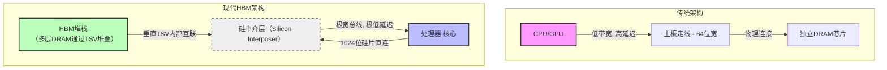

# CS149_p19

## 第 1 部分

## 内存系统基础：从处理器到DRAM

### 核心概念：内存访问的抽象层次

在现代计算机系统中，内存访问并非直接由处理器核心操作物理DRAM芯片，而是经过**多层缓存层级**和**内存控制器**的协调。

- **处理器核心**：执行指令，发起内存请求（如加载/存储指令）
- **缓存层级**：通常包含 **L1、L2、L3（最后一级缓存，LLC）**。缓存的目的是减少内存访问延迟，提升带宽
- **内存控制器**：当 **最后一级缓存（LLC）发生缺失** 时，内存控制器接管请求，向物理内存（DRAM）发出读取/写入指令，并将返回的数据填充到适当的缓存层级

> **关键术语**：**缓存缺失（cache miss）**、**最后一级缓存（Last-Level Cache, LLC）**、**内存控制器（Memory Controller）**

### DRAM物理结构：单元阵列与行缓冲区

#### 1. **DRAM单元的本质**

- 每个DRAM单元存储**1个比特**，通过**电容**存储电荷量来表示0或1（类似数字相机中光电二极管存储光子数量）
- 工作在**模拟世界**：读取时需要感知电荷量，而非简单的数字电平

#### 2. **行缓冲区（Row Buffer）**

- 每个DRAM芯片内部有一个**行缓冲区**，本质上是一个**数字缓冲器**，存储了DRAM阵列中**一整行**的数据
- **关键理解**：当你从DRAM读取数据时，实际上只能访问**当前存储在行缓冲区中的那一小部分数据**，而不是任意地址的单个字节
- 这一行数据大小通常为几千字节（KB级别），是内存访问的最小批量单位

### 内存访问流程（从缓存缺失到DRAM）

当处理器执行加载指令，访问**物理地址 X** 时：

1. **处理器** → 检查各级缓存（L1 → L2 → L3）
2. 如果 **L3缺失** → 请求到达**内存控制器**
3. **内存控制器** 向DRAM芯片发送请求
4. DRAM芯片将**目标行**加载到**行缓冲区**
5. 内存控制器从行缓冲区中读取目标地址对应的数据
6. 数据返回，并填充到缓存层级中

> **公式/算法提示**：内存访问延迟 ≈ 缓存命中时间 + 缺失率 × 内存访问时间  
> 其中 **内存访问时间** 主要由DRAM的行激活、列读取、行缓冲区刷新等操作决定（后续会更详细展开）

### 实际联系：物理视角

- 如果你拆开笔记本电脑，会看到**多个DRAM芯片**焊接在主板上
- 每个芯片内部就是上述的**大型内存单元阵列**
- 理解DRAM的物理行为（行缓冲区、列选择、预充电等）是优化内存带宽的关键基础

> **工程师视角**：为什么“内存带宽用完了”？  
> 核心原因之一就是**行缓冲区命中率低**，导致频繁的行激活、预充电操作，浪费了大量带宽。后续内容会深入探讨如何通过**访问模式优化**来提升行缓冲区命中率。

---

## 第 2 部分

### DRAM 读取流程详解：从物理地址到数据返回

#### 1. 核心问题：缓存未命中与物理地址请求
- **核心概念**：当处理器发生 **缓存缺失 (Cache Miss)**，它会向内存控制器发送一个包含 **物理地址 (Physical Address)** 的加载指令。
- **关键操作**：这个请求本质上是要求内存控制器提供包含该地址的 **缓存行 (Cache Line)** 的数据。
- **理解要点**：地址 `x` 通常代表一个缓存行的起始地址。处理器后续访问的每个字节，都将是这个数组中某一行上的连续部分。比如，需要访问图中用红色标记的特定字节。

#### 2. 目标：从存储单元读取值并传回处理器
- **物理过程**：需要将 **存储单元 (Memory Cell)**（电容器）上存储的电荷（电压），通过 **位线 (Bit Lines)** 转换为数字信号（二进制 0 和 1），最终传回处理器。

#### 3. 步骤分解：DRAM 读取的三个主要阶段

##### 阶段 1：预充电 (Precharge) —— 准备通信线路
- **核心概念**：**预充电 (Precharge)** 是读取的第一步，类似于“准备行”。
- **底层行为**：位线是穿过整个芯片的电线，用于读取并传输每一行中存储单元的电压。在复制数据前，必须将这些电线设置到一个已知的基准电压（类似于“归零”或“复位”）。
- **时间开销**：这个过程大约需要 **10 纳秒 (ns)**。
- **关键比喻**：在软件层面，这类似于准备将某一行数据复制到 **行缓冲区 (Row Buffer)** 中。在硬件层面，这实际上是调整电线的电压状态。

##### 阶段 2：行激活 (Row Activation) —— 读取整行数据
- **核心概念**：**行激活 (Row Activation)** 或 **并行激活 (Parallel Activation)**。这步操作实际上就是读取整行的电荷，并将其传输到芯片底部的 **行缓冲区 (Row Buffer)**。
- **关键物理特性**：这个**复制**过程是**模拟信号**操作。更关键的是，**这个读取/复制过程会破坏原存储行中的值**。这意味着数据不再存在于电容中，而是临时驻留在行缓冲区里。这一步也需要大约 **10 纳秒**。
- **简单理解**：数据被从一整行的所有单元中“吸”出来，暂存在一个临时的缓冲区域，等待后续的列选择。

##### 阶段 3：列选择 (Column Select) & 数据传输
- **核心概念**：**列选择 (Column Select)**。现在，整行数据已经在行缓冲区中待命，你可以从中精确地选择所需的 **特定字节**。
- **操作**：这个选择动作会定位到具体的列，并将选中的位（列）通过 **内存总线 (Memory Bus)** 传输回内存控制器。
- **最终结果**：内存控制器收到数据后，将其放入处理器的缓存中，完成一次内存读取。

### 关键问题解答：如何读取连续字节？

- **场景**：如果你要读取的**下一个字节**恰好是当前行中的**下一个字节**（连续访问）。
- **高效操作**：你**不需要重新执行行激活**。因为整行数据已经存在于 **行缓冲区 (Row Buffer)** 中。
- **实际做法**：你只需要**移动列选择 (Column Select)** 到行缓冲区中的下一个字节位置，即可快速读取。这被称为 **行缓冲区命中 (Row Buffer Hit)**，是内存访问性能优化的关键。

### 总结公式 / 流程

**一次完整的随机字节读取 = 预充电 (10ns) + 行激活 (10ns) + 列选择 + 数据传输线**

- **预充电**: 准备位线，设为基准电压。
- **行激活**: 整行数据读入行缓冲区（破坏原值）。
- **列选择**: 从行缓冲区中选择目标字节。
- **连续访问优化**: 如果下一个地址在同一行，则只需执行新的列选择，跳过前两步。

---

## 第 3 部分

# DRAM 内存访问延迟与带宽优化

## 核心概念：DRAM 访问时间并非固定

- **DRAM 访问延迟取决于访问模式**，而非固定值
- **行激活** 和 **列选择** 是两个关键步骤
- **行缓冲区** 中的数据可以被快速读取

### 行缓冲区与访问模式

- **首次访问** 需要完整流程：
  1. **行激活（Row Activation）**：加载整行数据到行缓冲区
  2. **列选择（Column Select）**：从行缓冲区中读取目标字节
- **第二次访问（同一行）** 更快：
  - 只需 **读取行缓冲区** 中的下一个字节
  - 跳过行激活步骤
  - 节省约 **20纳秒** 的准备时间

### 跨行访问的惩罚

- 如果访问**不同行**，需要：
  1. **写回** 当前行缓冲区数据（防止数据丢失）
  2. **准备数据引脚**
  3. **激活新行**
- 结果：**跨行切换非常慢**

## 带宽损失的量化

- **理想情况**：每个周期抓取一口数据，通过总线推送约需 **10纳秒**
- **糟糕情况**：
  - **40纳秒** 的全过程
  - **30纳秒** 的过程来获取下一个字节
  - 结果：**DRAM 带宽减少 3-4 倍**

## DRAM 设计权衡

### 为什么不用更宽的总线？

- **成本问题**：更多引脚意味着更高成本
- **类比**：为什么公路不是一千条车道？高峰时段会受益，但平时浪费
- **实际方案**：
  - 标准 DRAM 芯片引脚宽度为 **8 bit**
  - 需要更宽带宽时 → **堆叠更多 DRAM 芯片**

### 内存控制器的作用

- **内存控制器** 负责将 **逻辑地址** 映射到 **二维数组中的物理位置**
- **软件几乎没有机制** 可以控制这种映射
- 这是硬件层面的实现细节

## 总结：关键公式与关系

- **DRAM 延迟 = 动态延迟**
  - 取决于访问模式
  - 不是所有地址访问时间相同

- **带宽公式（概念性）**：
  - 理想带宽 $\propto \frac{\text{数据大小}}{\text{行访问时间}}$
  - 实际带宽 $\propto \frac{\text{数据大小}}{\text{行激活 + 列选择 + 可能的跨行切换}}$

---

## 第 4 部分

### DRAM 内存访问与延迟隐藏技术

#### 核心问题：内存总线的低利用率

- **核心概念**：在传统的DRAM访问模式中（如遍历链表），内存总线的利用率极低。
- **关键术语**：内存总线、内存引脚、行缓冲区、列访问。
- **问题分析**：
    - 每次DRAM访问需要多个步骤：**预充电**（准备位线）、**行访问**（选择行，将数据加载到行缓冲区）、**列访问**（从行缓冲区读取指定列）。
    - “列访问”步骤（即数据在内存引脚上传输）通常只占整个访问周期的一小部分（例如图中10个时间槽中只有4个传输数据），导致**内存引脚作为系统最宝贵的资源被大量浪费**。
    - 尤其对于**非连续、随机访问模式**（如链表 `malloc` 分配的数据），无法预知下一个数据的存储位置，进一步加剧了总线的空转。

#### 解决方案：提高内存总线利用率的核心策略

##### 1. 批量传输（Burst Transfer）

- **核心概念**：通过一次性请求**连续的数据块**来摊销每次访问的固定开销。
- **具体做法**：增加最小请求大小或缓冲区大小。例如，芯片命令支持一次读取连续64字节（而非单个字节）。
- **优势**：
    - **大幅提升总线利用率**：一次行激活可以服务多次列读取，减少预充电和行选择的次数。
    - **与缓存行设计对齐**：现代CPU的缓存行（Cache Line）通常是64字节，而内存总线宽度（如64位）远小于此。批量传输正好满足缓存行填充的需求，**专门设计用于高效传输连续数据**。
- **公式/关键点**：现代设备的设计哲学——**大规模、连续粒度的数据传输更有效率**（例如64位宽总线配合64字节缓存行，传输比为8:1）。

##### 2. 流水线技术（Pipelining）

- **核心概念**：将一次完整的DRAM访问（预充电、行激活、列读取）分解为多个阶段，在完成当前操作的同时，开始下一个操作。
- **工作方式**：不等待上一次访问完全结束，就发起下一次访问的预充电或行激活命令。
- **效果**：通过重叠不同操作的执行时间，**隐藏延迟**，让内存总线和引脚持续工作。
- **应用场景**：这是解决“高延迟操作”的经典方法——**结构化的延迟隐藏**（此处对应于DRAM的访问流水线）。

##### 3. 多线程（Multi-threading / Simultaneous Multi-threading）

- **核心概念**：利用多个独立的内存请求流来填充流水线间隙。
- **工作方式**：当当前线程等待内存数据返回时，迅速切换执行另一个线程的内存请求。
- **效果**：这是一种通用的**任意延迟隐藏**技术，尤其适用于无法预测访问模式的情况（如链表遍历）。
- **与硬件的关系**：现代GPU（图形处理器）和某些CPU（如Intel的Hyper-Threading）天然支持此模式——当一条线程因为内存访问而停滞时，硬件自动切换执行另一条线程的计算或内存请求，从而保持内存总线处于忙碌状态。

#### 总结与工程启示

- **核心要点**：高延迟操作的解决路径有二：
    - **结构化延迟隐藏**：通过**流水线**和**批量传输**（利用访问模式的结构化特点，如连续数据）来填满总线。
    - **任意延迟隐藏**：通过**多线程**（利用多个独立请求并交替执行）来掩盖不可预测的延迟。
- **工程实践**：
    - **CPU内存系统**：缓存行+突发传输是经典的“结构化”方案。
    - **GPU内存系统**：大规模多线程是“任意延迟”方案的代表。
    - **代码优化**：作为引擎/渲染工程师，应尽量构造**连续的内存访问模式**（如AoS转SoA、使用紧凑的数组而非指针链表），以充分利用硬件的批量传输和流水线能力。

---

## 第 5 部分

## DRAM 内部结构与并行流水线

### 核心概念：DRAM 架构与多 Bank 设计

- **每个 DRAM 芯片** 内部包含一个 **存储单元阵列** 和一个 **行缓冲区**。
- **核心术语**：
  - **Row Buffer（行缓冲区）**：用于暂存从存储阵列中读取的一整行数据。
  - **Bank（存储体/库）**：DRAM 芯片内部被划分为多个独立的存储阵列，每个 Bank 拥有自己的行缓冲区。
  - **Data Pins（数据引脚）**：芯片与外部通信的数据通道，通常每个芯片有 8 位宽度。

**关键思想**：通过将多个 Bank 并行化，**隐藏行激活的延迟**。当一个 Bank 正在等待行激活时，可以同时从其他 Bank 发起请求并传输数据。

### 流水线操作：Bank 间并行

- **地址交错（Address Interleaving）**：将内存地址分散到不同的 Bank 中，使得连续地址属于不同 Bank。
- **经典流水线示例**：
  1. 从 **Bank 0** 读取数据（正在使用行缓冲区）。
  2. 同时，在 **Bank 1** 中开始行访问（预充电 + 行激活）。
  3. 当 Bank 0 数据传输完毕，Bank 1 的行缓冲区已准备好，可立即读取下一笔数据。
- **关键机制**：**垂直数据线（Vertical Data Lines）** 是复制的（每个 Bank 有独立的内部数据线），但 **数据引脚是共享的**。

> **要点**：流水线通过 Bank 间并行，让行激活的延迟被后续数据读/写操作所掩盖，从而提高总吞吐量。

### 从 DRAM 芯片到内存模组（DIMM）

- **DIMM（Dual Inline Memory Module）**：将多个 DRAM 芯片并排放置在同一块 PCB 上。
- **典型配置**：
  - 8 个 DRAM 芯片，每个 8 位数据引脚 → 组成 **64 位内存总线**。
  - 所有芯片接收 **相同的命令**（Bank、行、列地址），但每个芯片存取自己 Bank 中对应位置的数据。
  - 例如：命令“Bank b, Row r, Column c”会让 8 个芯片各自返回 1 字节数据，总计 8 字节（64 位）。

- **内存控制器职责**：
  - 将 **缓存行（Cache Line）** 地址（例如 64 字节=512 位）映射到 **三维地址空间**：**Bank → Row → Column**。
  - 发出多个请求，获取完整的缓存行数据。

### 缓存行读取的底层实现

- 假设 **DRAM 阵列的行宽度** 为 **2048 字节**（常见于现代 DRAM）。
- **简单策略**：将整个缓存行（64 字节）放置在 **同一 DRAM 芯片的连续行** 中。
- **更聪明的做法**：将缓存行 **分散到多个 Bank** 中（地址交错），利用 Bank 间流水线能力，提高读取效率。

---

## 第 6 部分

### 内存系统优化：地址交错与缓存行读取

#### 核心概念：DRAM芯片组织与数据读取
- **DRAM芯片阵列**：每个芯片内部包含多个**银行（Banks）**，每个银行由**行（Rows）**和**列（Columns）**组成。
- **数据宽度**：单个DRAM芯片的阵列宽度为**2048字节**（示例数据），但内存总线通常为**64位（8字节）**。
- **单次读取**：从同一地址（银行B、行R、列0）读取时，每个芯片贡献1字节，8个芯片并行提供**8个连续字节**（总线宽度）。

#### 关键问题：如何快速获取完整缓存行（64字节）？
- **缓存行大小**：通常为64字节，需要8次8字节读取。
- **瓶颈**：若仅使用同一行，后续读取需等待前一次完成，延迟累积。

---

### 解决方案：地址空间交错（Interleaving）

#### **核心思想**：将连续的物理地址分布在多个DRAM芯片的**不同银行**中，实现并行读取。
- **交错方式**：
  - 第1个字节：芯片0，银行0，行R，列0  
  - 第2个字节：芯片1，银行0，行R，列0  
  - ...  
  - 第8个字节：芯片7，银行0，行R，列0  
  - 第9个字节：芯片0，银行1，行R，列0（下一银行）  
- **效果**：在同一时钟周期内，8个芯片并行输出8字节，且**下一个8字节的预充电或行激活可与当前读取重叠**。

#### **流水线化（Pipelining）**：
- **内存控制器**在发出第一个请求后，立即**预充电当前银行**并**激活下一银行的行**。
- **爆发模式（Burst Mode）**：连续读取同一行的后续列，无需重复行激活（如从列0到列7连续读取8字节）。

---

### 银行层次与流水线示例

#### 图示说明（如幻灯片所示）：
- **每个DRAM芯片内**：多个银行（Bank 0, Bank 1, ...），每个银行有自己的行缓冲。
- **内存控制器操作序列**：
  1. 周期1：发送“激活行R，银行0”命令 → 等待列访问（读取8字节）。
  2. 周期2：在读取当前数据的同时，发送“预充电银行0” + “激活行R，银行1”命令。
  3. 周期3：从银行1读取下一组8字节，同时准备银行2。
- **结果**：64字节缓存行读取延迟接近**理论最小值**（约8个周期，忽略初始行激活开销）。

#### **关键术语**：
- **Burst Transfer**：连续传输一组数据（如8个64位字），无需额外地址命令。
- **Row Access Strobe (RAS)** & **Column Access Strobe (CAS)**：行激活和列访问是DRAM访问的两个阶段，流水线操作可重叠处理。

---

### 算法与公式（隐式）
- **延迟模型**：
  \[
  \text{总延迟} = t_{RAS} + t_{CAS} + (N-1) \times \max(t_{RAS}, t_{CAS})
  \]
  其中 \( N \) 是读取次数（如8），\( t_{RAS} \) 为行激活时间，\( t_{CAS} \) 为列访问时间。
- **交错深度**：通常为缓存行大小/总线宽度（如64/8 = 8路交错）。

---

## 第 7 部分

### 内存请求与内存控制器：从缓存缺失到实际数据传输

#### 1. 数据请求的基本单元：行与突发传输

- **核心概念**：现代DRAM（如DDR）中，最小数据传输单位不是单个字节，而是一次**突发传输（Burst Transfer）**。
- **关键术语**：
    - **行（Row）**：DRAM芯片内部的一个水平地址行。
    - **突发长度（Burst Length）**：一次行访问后连续传输的数据量。通常为8个字节（对于64位数据总线）或64字节（8个字节 × 8个芯片）。
- **关键技术细节**：
    - 当内存请求命中同一行时，**不会启动新的行激活命令**，而是直接在同一行内连续读取8个字节（×8芯片 = 64字节）。
    - 这极大减少了**行冲突**，提高了数据吞吐效率。

#### 2. 命令总线与数据总线

- **核心概念**：内存系统有两条独立的物理总线：命令总线和数据总线，二者**不同时复用**（尽管有些资料可能提到时间复用，但DDR中不存在）。
- **关键术语**：
    - **命令总线**：传输地址、读写命令等控制信号。
    - **数据总线**（通常为64位宽）：传输实际数据。
- **DDR特性**：在时钟的**上升沿和下降沿**均传输数据，实现双倍数据速率。这意味着命令和数据无法进一步压缩或复用，因为时序已高度优化。

#### 3. 双通道内存系统

- **核心概念**：双通道系统本质上是**复制**单通道的架构，每个通道拥有独立的内存控制器、命令总线和数据总线。
- **关键特性**：
    - 每个通道**每时钟周期只能发出一个命令**，且该命令同时传递给该通道下所有DIMM（内存条）。
    - 双通道意味着理论上带宽翻倍（两个64位数据总线同时工作）。
    - **图示理解**：可以想象为两个完全独立的内存流，每个流从头到尾（控制器→模块）都是独立的。

#### 4. 内存控制器：地址映射与请求重排序

- **核心概念**：处理器内部发生缓存缺失（Cache Miss）时，该缺失会转化为对内存控制器的请求。内存控制器负责将**线性物理地址**映射到具体的**DRAM数组物理位置（Bank, Row, Column）**。
- **关键术语**：
    - **物理线性地址**：CPU视角的连续地址。
    - **DRAM数组位置**：实际芯片中的Bank（组）、Row（行）、Column（列）坐标。
- **核心工作流程**：
    1. **收集请求**：内存控制器接收来自所有处理器核心的随机缓存缺失请求。
    2. **排队与缓冲**：将这些请求放入一个队列（FIFO或更复杂的结构）。
    3. **重排序**：为了最大化性能，控制器会**重新排序**这些请求，而不是按照CPU发出的顺序执行。
        - **目标**：最大化**行缓冲局部性**（Row-Buffer Locality），即尽可能让后续请求命中同一行，避免反复开关行（行激活和预充电消耗大量时间）。
        - **示例**：如果两个不同的应用程序分别线性读取内存，它们的请求可能交替访问不同行。控制器会尝试将属于同一行的请求聚在一起处理。

#### 5. 延迟与带宽的权衡：缓存与重排序策略

- **核心概念**：重排序和缓冲虽然能提升带宽，但会引入额外延迟。不同场景需要不同策略。
- **关键权衡因素**：
    - **带宽受限场景**（如GPU）：应**激进地缓存和重排序**，甚至可能缓存成千上万个请求（如Nvidia的复杂内存控制器），以确保总带宽最大化。
    - **延迟敏感场景**（如实时应用、游戏逻辑）：高度缓存的重排序会导致严重的延迟抖动，不适合。应尽量减少缓冲深度。
- **Nvidia的典型做法**：在GPU架构中，内存控制器通常是芯片上**最复杂**的部分之一，因为它必须处理极高的带宽要求，同时管理众多线程的并发内存请求。

#### 6. 实际工作中的命中与等待策略

- **核心问题**：在重排序过程中，控制器会等待多少个请求才决定下一个操作？
- **实现细节**：这取决于具体硬件（如队列深度、调度算法）。基本思路是：如果控制器发现当前行已经打开，并且后续队列中有对该行的请求，它会**等待片刻**（不立即关闭行），直到更多请求到达，从而一次处理更多数据。这就是**开放页策略**（Open Page Policy）的典型体现。

### 核心总结公式（无具体数学公式，但可抽象为性能模型）

内存系统的性能可用以下简化模型理解：
\[
\text{有效带宽} \propto \frac{\text{一次突发传输的数据量}}{\text{行激活时间} + \text{列访问时间} + \text{数据传输时间}}
\]
- **重排序**可以取消除第一个请求外的**行激活时间**（如果后续请求命中同一行）。
- **重排序**也可能通过减少**行冲突**（预充电与激活的延迟）来提升整体吞吐。

---

## 第 8 部分

### 内存控制器与带宽：从指令调度到DRAM请求管理

#### 核心理念：从CPU内部复杂性到内存控制器复杂性

现代处理器（尤其是GPU）的架构演变，为了应对**带宽受限**和**高延迟**的挑战，将处理复杂调度的逻辑从CPU核心内部转移到了**内存控制器**。

*   **关键转变：** 过去，CPU的核心专注于对**指令流**进行复杂的乱序执行和调度（如分支预测）。现在，为了最大化利用多核，处理器变得相对“简单”（指令级智能减少），而所有核心共享的**内存系统**（尤其是内存控制器）则变得极其智能和复杂。

#### 内存控制器的核心任务：调度缓存缺失流

当所有核心都向内存系统发出请求时，内存控制器面临的是一个**动态的、由延迟与带宽权衡决定的调度问题**。

*   **核心概念：** **延迟与带宽的博弈**。
    *   **场景：** 内存控制器正在处理一个对某“行”（Row）的开放请求。它不会立即关闭这个行，而是会等待**极短的时间（如十纳秒）**，看是否有其他对该开放行的请求到来。
    *   **策略：** 如果后续有请求命中该开放行，则将其**排在队列前端**。因为它“很便宜”（省去了重新打开行的延迟和能耗），能有效利用带宽。
*   **动态决定：** 这种调度策略（是优先服务延迟敏感的请求，还是优先合并带宽高效的请求）由**内存控制器**根据其设计算法动态决定。
*   **结果：** 计算机架构的研究重点从90年代的“如何构建分支预测器”（核心内），转向了2012-2016年间的“如何查看缓存缺失流并制定好的调度策略”（控制器内）。**处理器的复杂性被剥离，并“塞进了”内存控制器**。它就像一个超线程处理器，从多个核心（如16核）接收请求，并理清这些来自不同进程的请求，以**最大化DRAM利用率**或**最小化能量消耗**。

### 增加带宽的策略：内存通道与双数据率

#### 核心理念：复制通道以倍增带宽

当单个内存总线的带宽不够时，最直接的策略是**复制**。

*   **双通道（Dual-Channel）系统：**
    *   传统的单通道（Single Channel）是一根64位宽的总线连接到一个DIMM（内存条）。
    *   **双通道：** 添加第二个独立的64位总线，连接到另一个DIMM。因此，理论上带宽**翻倍**。
    *   **关键区别：** 在**同一个通道**内，所有连接的DRAM芯片接收**相同的命令**（例如，同时激活同一行）。而不同通道则可以发送独立的命令。

#### 内存规格解读（以DDR4为例）

**规格：DDR4-2400，双通道**

1.  **术语分解：**
    *   **DDR4：** 为第四代双倍数据速率（Double Data Rate）内存技术。
    *   **2400：** 这指的是内存总线的**时钟频率**，为 **1.2 GHz**。数字更大，听起来更“快”，但实际是频率的倍率。
    *   **双数据率（DDR）：** 在每个时钟周期的**上升沿**和**下降沿**各传输一次数据。因此，有效数据传输率是时钟频率的**两倍**。

2.  **带宽计算：**
    *   **单通道带宽计算：**
        *   位宽：64位
        *   数据传输率：`1.2 GHz × 2 (DDR)` = `2.4 GT/s` (每秒24亿次传输)
        *   理论带宽：`64 bits × 2.4 GT / s = 153.6 Gbps`
        *   转换为字节（除以8）：`153.6 Gbps / 8 = 19.2 GB/s`
        *   **公式：** `带宽 (字节/秒) = 位宽 (位) × (时钟频率 × 2) / 8`
    *   **总带宽（双通道）：**
        *   只需将单通道带宽乘以通道数。
        *   `19.2 GB/s × 2 = 38.4 GB/s`
        *   这通常就是内存系统规格上标称的**38.4 GB/s**带宽的数字来源。

### 总结

*   **内存控制器**是现代多核系统性能的关键，它通过复杂的调度算法在**延迟**和**带宽**之间寻找最佳平衡点。
*   **DDR内存**通过在每个时钟周期进行两次数据传输（双倍数据率）来提高有效带宽。
*   **多通道配置**通过并行使用多个独立的内存总线，线性地倍增系统总带宽。

---

## 第 9 部分

### DRAM 时序、延迟与内存控制器调度

#### 核心概念：从处理器视角看内存延迟

- **计算核心频率与内存延迟的鸿沟**：现代处理器运行在 ~3 GHz，时钟周期约 **0.3 纳秒 (ns)**。而 DRAM 访问，仅 **列地址选通 (CAS) 延迟** 就已达 ~13 ns。这意味着一次内存列访问需要等待大约 **30 倍**的处理器时钟周期。这个差距是巨大的，不能忽视。
- **完整的内存延迟链条**：实际延迟远大于 CAS。它包含：
    - 从处理器核心到各级缓存。
    - 缓存未命中后，请求离开芯片。
    - 内存控制器处理请求。
    - 在 DRAM 芯片内部完成行、列寻址和数据输出。
    - 数据通过总线返回。

#### 关键术语与数值

- **带宽估算**：在讲座的示例中，通过将内存系统所有操作并行化（“所有事情乘以二”）计算出的峰值带宽约为 **38 GB/s**。这是一个基于内存系统规格的典型标准计算方法。
- **CAS (Column Address Strobe) 延迟**：最重要的 DRAM 延迟指标之一，指从发出列地址到数据在引脚上可用的时间。示例中为 ~13 ns。
- **容错机制 (ECC)**：
    - 在服务器内存（如带第九个芯片的 DIMM）中，会使用**错误纠正码 (Error-Correcting Code, ECC)**。
    - 多出一个冗余芯片用于检测和纠正位翻转。
    - 这是以牺牲一小部分容量为代价，获得的数据完整性保障。

#### 关键机制：内存控制器调度

- **核心任务**：**重排序内存请求**。
- **类比**：如同程序员重排计算指令以提高缓存命中率一样，内存控制器**硬件**会重排来自处理器的缓存未命中请求，使这些请求以对 DRAM 最友好的顺序到达。
- **目标**：通过重新排序请求序列（例如，优先处理同一行的请求，减少预充电和行激活次数），最小化 DRAM 的访问延迟，最大化带宽利用率。
- **重要提示**：这个调度过程完全由硬件完成，程序员无法直接控制，但理解其存在对优化内存访问模式至关重要。

#### 发展趋势：带宽瓶颈与片上集成

- **根本瓶颈**：**引脚（Pin）数量**。传统主板上的接口限制了处理器与内存间通信的物理带宽。昂贵的引脚数量限制了数据通道宽度（例如示例中提到的只有8个引脚）。
- **解决方案**：**将内存拉近处理器**。
    - **芯片堆叠 (Chip Stacking)**：将多层 DRAM 芯片垂直堆叠在处理器芯片上方。
    - **硅中介层集成**：将内存直接集成在处理器的同一硅片上。
- **优势**：缩短物理传输距离，降低延迟，并使构建更多的内存通道（经济可行）成为可能，从而大幅提升带宽。这在服务器和高性能 GPU 中已成为常见做法。

---

## 第 10 部分

### 深入理解现代高带宽内存架构：从HBM到硅中介层

#### 核心变革：从主板走线到硅片直连

*   **传统内存瓶颈**：传统CPU/GPU通过**主板上的铜质走线**连接到独立的DRAM芯片。这种方式的**位宽有限**（例如64位），限制了内存带宽。
*   **HBM革命**：**高带宽内存（HBM）** 的核心思想是**将内存直接集成到处理器硅片上**，消除主板走线的瓶颈。
    *   **关键转变**：数据连接不再是电路板上的走线，而是**硅片上的金属线**。这使得连接数量可以大幅增加，从64位提升到**1024位甚至4096位**（如英伟达/AMD高端GPU）。

#### HBM的关键实现技术：硅通孔与立体堆叠

*   **硅通孔（TSV, Through Silicon Via）**：
    *   **问题**：传统芯片的引脚只能在边缘，限制了连接数量。
    *   **解决方案**：TSV技术允许垂直导线**直接穿透DRAM芯片本身**。
    *   **效果**：利用整个芯片底部的空间来布线，而不是仅限边缘，从而**成倍增加数据通道**。
*   **DRAM堆叠**：将多个DRAM芯片**物理上垂直堆叠**在一起，通过TSV连接，形成高密度的内存立方体。

#### 物理封装：硅中介层与片上系统

*   **硅中介层**：一块**硅片**作为基础平台，上面同时放置了**处理器（GPU/CPU）** 和**堆叠的HBM**。
    *   **注意**：整个封装（包含CPU+HBM+硅中介层）在外观上仍然像一个芯片。
    *   **连接方式**：从堆叠DRAM底部引出的**1024位宽总线**，通过硅中介层**直接连到处理器**，实现超宽位宽和极低延迟。
*   **示例（2016年高端系统）**：
    *   硅中介层上放置**1个GPU** + **4个HBM堆栈**，每个HBM提供**1024位**连接，总**4096位内存总线**。
    *   **带宽**：约**720 GB/s**（2016年水平），现已接近**2 TB/s**。
    *   **容量**：固定，如**16 GB**（现已更高）。

#### 现代内存层次结构：由浅入深的多级体系

*   **HBM的位置**：它不是缓存，而是一种**新型DRAM**，位于L3缓存（约80MB）和传统DDR内存之间。
*   **分层访问路径及性能**：
    1.  **L3缓存**（~80MB）：最快，但容量最小。
    2.  **堆叠DRAM（HBM）**（~16GB）：**高带宽（~1 TB/s）**，**低延迟**。这是当前高端GPU的核心工作内存。
    3.  **传统内存（DDR5/DDR4）**（几百GB至TB）：**带宽低（~300-400 GB/s）**，延迟高。用于处理巨大但访问不频繁的数据。
*   **延迟隐藏**：对GPU而言，HBM的延迟已不是问题，因为**多线程并行**和**流水线技术**可以轻松隐藏延迟，从而专注于利用其超高带宽。

#### 硬性限制

*   **固定内存容量**：HBM技术的一个显著特点是，其容量是硬性固定的（例如最初设计就适配16GB），无法像传统内存那样随意增减。这意味着应用必须在设计时充分考虑其容量上限。

### 总结图表示意图（逻辑关系）

---

## 第 11 部分

### 核心主题：计算与数据移动的博弈

#### 1. 延迟与带宽的权衡
- **核心概念**：在并行计算中，**延迟（Latency）** 可以被多线程或流水线技术隐藏，而**带宽（Bandwidth）** 是更珍贵的资源。
- **关键要点**：
  - 更高的带宽、更低的延迟是理想目标，但**高延迟不可怕**，因为可以通过多线程/流水线掩盖（如 GPU 的线程级并行）。
  - **真正瓶颈**：将数据移动到处理器附近，即 **数据搬运**，而非计算本身。

#### 2. 调度与数据传递的难度
- **核心观点**：**并行化容易，数据传递难**。
  - 调度（如何分配任务）和数据流动（如何让数据靠近计算单元）是系统设计的核心难点。
  - 硬件设计原则：**“数据需要位于处理器旁边，或者处理器需要靠近数据”**。

#### 3. 带宽受限时的核心策略：压缩
- **核心原则**：**如果带宽是瓶颈，压缩数据几乎总是值得的**。
  - **原因**：带宽受限时，CPU/GPU 处于空闲状态，用更多指令（计算）换取更少的数据移动是划算的。
- **具体实现示例（GPU 纹理压缩）**：
  1. **缓存缺失时**：从内存中读取**压缩后的数据**（移动更少字节）。
  2. **数据到达芯片**：在芯片上**解压缩**成完整的缓存行，再供计算单元使用。
  - 这是图形学中非常常见的优化。

#### 4. 现代硬件趋势：异构与专业化
- **现状**：现代处理器（如苹果 Silicon、手机 SoC）是**异构多核**系统，包含：
  - 多个 **CPU 核心**（通用计算）
  - 多个 **GPU 核心**（并行渲染/计算）
  - **神经处理单元（NPU）**（AI/机器学习专用）
  - 专门处理睡眠模式、数据流等低功耗单元。
- **未来方向**：
  - 在没有基础技术突破（如光学/量子计算）前，性能提升将依赖**并行化**和**特定领域的专业化**。
  - **机遇**：如何让这些专用处理器**更容易编程**，成为重要的研究领域。

#### 5. 软件效率的巨大差距：现代硬件的“潜力”
- **核心观察**：大多数软件**效率惊人地低下**，远未发挥硬件能力。
- **量化对比**（以字符串程序为例）：
  - **普通写法**：基准性能（慢）
  - **按硬件特性编写**（使用向量化单元、SIMD）：**快 10 ~ 100 倍**
  - **结合专用处理**：进一步提升
- **关键启示**：
  - 面对“扩展到大型集群”的方案，先问：**是否可以先优化软件，使其运行快 1000 倍？**
  - 有时投入少量优化工作，效果远超横向扩展。
  - 这种提升可能**改变游戏规则**，甚至让你做到以前无法想象的事。

### 总结：你应带走的三个核心思考

1. **内存系统是性能的战场**：从硬件压缩到数据就近放置，所有设计都在解决“数据移动”问题。
2. **未来是异构且专业的**：了解并善用 GPU、NPU 等专用单元，将是领先的关键。
3. **优化软件，而非盲目扩展**：一个聪明的优化可能带来千倍性能提升，这比增加硬件节点更有价值。

---

## 第 12 部分

### 核心思想：性能优化改变游戏规则，洞察并行与抽象至关重要

*   **性能的巨大提升**：在计算领域，**投入少量努力，获得千倍加速**是完全可能的。
    *   **实践意义**：这种优化不仅能彻底改变现有应用（例如游戏体验），更能**解锁过去被认为不可能**的场景。
    *   **典型例子**：移动设备上原本被认为无法实现的复杂计算（如图形渲染、AI推理），如今已因高效优化而成为现实。

### 课程价值：面向所有真实世界的应用，而不仅是科学计算

*   **课程普适性**：课程内容并非仅适用于大规模科学计算，而是**几乎所有现代计算应用**的核心。
    *   **就业指向**：
        *   **苹果（移动团队）**：极度关注**高效软件**与**电源效率**。
        *   **Waymo（自动驾驶）**：同样关注高效计算。
        *   **大型AI语言模型**：更是高度受限于效率，因此本课程知识至关重要。

### 关键技能：识别并行性与编排并行性

*   **核心难点**：
    *   **识别并行性**：相对容易，是基础。
    *   **编排并行性**：**更难也是价值更高的技能**。关键在于**理解依赖关系**后，如何有效地调度和安排并行任务。
    *   **规模**：从小规模（单处理器内核）到大规模（分布式系统）都适用。

### 实用策略：依赖高级抽象，并理解底层硬件

*   **高级抽象的价值**：框架（如 **TensorFlow、PyTorch** 或游戏引擎）已经为你处理了底层的复杂并行化和效率。
    *   **工程师心态**：当你使用这些抽象时，应意识到并感谢背后为此付出努力的工程师，而不必每件事都从零思考。
*   **正确估算计算时间**：理解硬件原理让你能**质疑不合理的预估**。
    *   **批判性思维**：当有人说“计算需要3小时”，你可以质疑：“如果合理调度，是否只需5秒？” 这种情况远比想象中更常见。

### 推荐后续课程与学习路径

*   **硬件编程课程**：下学期开设（可能由Cole教授），注重空间应用。
*   **并行计算课程**：**CS 149（架构）** 与 **CS 229（并行）** 内容互补，建议先学1949，再学229。
*   **图形学课程**：下个学期教授。
*   **视觉计算系统课程**（混合图形学）：
    *   **内容**：阅读最新论文，学习如何构建**大型视觉计算系统**（如：谷歌视频处理系统、数据中心级的聊天GPT服务）。
    *   **目标**：思考如何构建**生成或理解像素**的系统。
    *   **形式**：小班制（~30人），基于项目。

---

## 第 13 部分

### 从理论到实践：构建视觉计算系统与融入研究生态

#### 核心目标：产生或理解像素
- **核心概念**：构建视觉计算系统（如渲染、仿真）的最终目标是**产生或理解像素**。这包括生成图像（渲染）或分析图像（视觉理解）。
- **课程衔接**：课程如 **CS280** 是深入硬件操作系统的良好基础。系里许多课程从不同角度涉及**并行性**，这是视觉计算系统性能的关键。

#### 研究之路：从课程作业到实验室贡献
- **技能积累**：完成 **CS489** 这类高级课程后，你已具备**真正的编程技能**，能够处理较难的作业任务。
- **融入研究实验室**：
    - **角色定位**：你可以在实验室扮演**软件工程或支持角色**，例如加入一个现有研究项目，负责**并行处理优化**或**将特定任务提速100倍**。
    - **成果输出**：你的工作可能直接贡献于论文，成为共同作者。
    - **关键优势**：斯坦福的独特之处在于**与优秀同伴合作**（本科/研究生/博士生）。这种环境能激发“我也能达到这种水平”的**成长心态**。

#### 现代 AI 与游戏引擎的交叉点
- **核心应用**：训练 **AI 代理**（机器人或软件代理）。问题在于，在现实世界中执行复杂任务代价高昂。
- **游戏引擎 = 模拟器**：从图形学出身的角度看，**游戏引擎本质上是强大的模拟器**。
    - **经典案例**：OpenAI 的 **Dota 玩机器人**、**两人对二的捉迷藏游戏**等 AI 训练，本质是在 **Unity** 或 **Unreal** 等引擎中运行模拟。
- **AI 训练方法**：
    - **LLM 指令法**：让大语言模型告诉你做什么（有时有效）。
    - **大规模试错法**：机器人反复尝试任务（如摔倒、调整）。这个过程本质是**强化学习**，而游戏引擎提供了安全、可控、可并行的训练环境。

#### 关键洞察与总结
- **并行性是桥梁**：无论是课程、研究还是现代 AI 训练，**并行计算** 是解决性能瓶颈与实现大规模模拟的核心。
- **研究 ≠ 学术生涯**：你可以仅以“独立研究”学分形式参与项目，积累工业级经验，甚至成为论文作者。
- **技能迁移**：在游戏引擎（Unity/Unreal）中高效设置和运行大规模模拟，是连接传统图形学与前沿 AI 应用的**核心工程技能**。

---

## 第 14 部分

## 大规模并行模拟中的游戏引擎设计

### 核心挑战：从试错中学习
- 机器人学习技能依赖**大量试错（trial and error）**  
  - 需要**数十亿次时间步（time steps）** 的模拟  
  - 在3D环境中重复执行动作、观察失败、微调策略  
  - 例如：机器人捡起物体时摔倒 → 记录错误 → 修正动作 → 重试  
- 资源开销巨大：  
  - **GPU集群（GPU clusters）** 大规模并行计算  
  - 同时运行**数万个游戏实例** 进行并行试错  

### 现有方法的局限性
- **传统多实例运行方式的问题**：  
  - 每个服务器运行独立的Unity副本  
  - 或同机运行30个Unity副本  
  - 导致**资源浪费**：缺乏同步、并行效率低、管理混乱  
  - 目标：完成**十万场比赛**时，此方法效率极差  

### 面向并行模拟的微型游戏引擎设计
- **设计哲学**：  
  - **不为人类渲染图像**，而是为**执行数万个独立游戏副本**  
  - 保持**副本间同步**，获得**并行一致性（parallel consistency）** 和良好特性  
- **应用实例**：捉迷藏游戏  
  - 两个队伍（各两人）学习：  
    - 通过赢得比赛学会拉拽物品  
    - 根据规则学会隐藏/看见对手  
  - 背景：基于OpenAI早期工作复现  

### 模拟中的复杂计算需求
- **必须包含的核心系统**：  
  - **物理模拟（physics simulation）**：符合游戏世界物理规则  
  - **光线追踪（ray tracing）**：判断“谁看见了谁”  
  - **游戏逻辑（gameplay logic）**：任意规则脚本（如拾起方块、附着属性）  
- **编程模型要求**：  
  - 能够像正常编写游戏逻辑一样：  
    - 定义事件处理器  
    - 编写脚本（如“当我接近方块并按下按钮，它附着于我”）  
  - 但底层**自动并行化模拟**，无需开发者显式思考并行  

### 关键实现思想
- **类比现有技术**：  
  - 类似 **ISP（In-System Programming）** 或 **CUDA** 的“数据并行”思想  
  - 将“所有地方都表示”的并行模式应用于游戏模拟  
- **核心突破**：  
  - 通过**基础计算机科学思维（如CS 149课程中的并行模式）**  
  - 实现**同时排列成千上万个游戏实例** 的并行模拟  
  - 开发者只需关注游戏逻辑，无需处理并行细节  

> **公式/算法要点**：  
> - 并行模拟规模：\( \text{实例数} \approx 10^4 \)  
> - 试错步数：\( \text{时间步} \approx 10^9 \)  
> - 核心模式：**SIMD（单指令多数据）式游戏引擎并行化**

---

## 第 15 部分

### 并行化与性能的革命性提升

- **核心概念：** 通过 **任务并行化** 和 **算法优化**，将原本需要大量分布式计算资源（如64 GPU集群）的任务，压缩到**单个GPU**上完成。
- **关键术语：** **CS149式思考**（CS149是斯坦福一门强调并行计算思维的基础课程）、**加速比**、**运算量级**。
- **性能对比：**
    - **传统方式：** 需要64个GPU集群，运行一周。
    - **优化后：** 单个GPU，运行一到两小时。
    - **加速效果：** 约 **2-3个数量级**（100-1000倍加速）。
- **具体案例：** 过熟AI训练（一种常见强化学习任务）。
    - 训练运行时间从 **4小时** 缩短至 **3秒**。
    - **原因：** 游戏环境本身非常简单，通过并行化极大地提升了采样效率。

### 渲染系统的颠覆：非像素渲染 vs 像素渲染

- **核心概念：** 根据训练目标不同，可以选择**跳过像素渲染**，直接进行状态驱动的模拟，以获得**极致速度**；也可以切换回**实际图像渲染**，用于训练端到端的图像到动作模型。
- **关键术语：** **摊销（Amortization）**、**场景复用**、**帧率（FPS）**。
- **本科生项目成果：** 一种新型渲染系统，可以**摊销超过十万种不同场景**的计算成本。
- **性能数据：**
    - **非像素渲染（无图像输出）：** **200万 FPS**（主要用于纯状态驱动的智能体训练）。
    - **像素渲染（有图像输出）：** **10万 FPS**（为了支持目标检测、视觉导航等视觉任务）。
    - **实际使用限制：** 通常还需要同时运行深度网络（如CNN），因此模拟与推理各占一半，有效FPS会下降。
- **数据收集规模的想象空间：**
    - 10万 FPS × 10秒 = **100万个经验样本**。
    - 一个周末（48小时） ≈ **10亿个经验样本**。

### 脚本化与项目生态：从CUDA到Python

- **核心概念：** 将**Python脚本**编译为底层的**CUDA PTX代码**，允许开发者用更高级、更易上手的语言进行性能关键代码的开发，而非直接编写CUDA。
- **关键术语：** **PTX（并行线程执行）**、**Python脚本化**、**CUDA编译器后端**。
- **技术门槛与参与度：**
    - **低门槛项目：** Python编译CUDA PTX代码。此类小型技术项目很多，容易上手，适合优秀执行者参与。
    - **高门槛项目：** 从零实现自定义游戏环境。
- **案例：** 一位研究生在学期中着手用该系统实现 **《Minecraft》** ，最终实现了**6万 FPS** 的运行速度。

### 学术阶段的反思与建议

- **核心观点：** 在学术生涯（如斯坦福）已过半或四分之三时，应开始**独立进行个人项目**，而非仅仅跟随课程安排完成作业。
- **与常规路径的对比（“斯坦福常规路径”）：** 学生通常通过刷高级AP课程来获得优势，缺乏自主探索和实践。作者鼓励**自律**和**自驱项目**，认为这对长期发展更有价值。
- **结论：** 不要等待被告诉做什么，要主动去做自己觉得有趣的项目，哪怕它看起来不那么“规范”。

---

## 第 16 部分

### 图形学学习与职业发展的“非常规路径”

#### 核心观点：**打破“默认路径”的幻觉**

- **传统“默认路径”** (已失效):
    - **核心流程**: 高AP分数 → 高GPA → 职业博览会（拿免费食物） → 获得第一轮面试 → 拿到**Facebook/Google/Dropbox**等巨头offer → 工作两年
    - **现状**: 这种“只要成绩好就能去好公司”的确定性路径**已经不再适用**。没有哪三四个公司是所有人公认的单一目标。
    - **问题**: 把成绩（AP、GPA）当作唯一竞争力, 忽视了实际能力和个人特质。

#### 突破口：**成为“有用”的人，而非“优秀”的学生**

- **进入顶尖实验室/团队的关键**:
    - 核心概念: **“Show, don't just tell”**
    - **方式**: 不仅仅是优秀, 而是让你自己**变得有用**。
    - **具体场景**:
        - 你能帮老师处理**硬核CUDA代码**。
        - 你能实现一个新的应用程序并制作**基准测试**。
    - **概率**: 老师直接寻找学生帮忙的比例约**30%-50%**。更多时候是博士生**自主学习**后, 做出远超老师预期的成果。

#### 人脉与推荐：**从“求人情”到“主动推荐”**

- **逆向思维**: 优秀的老师/工程师**主动寻找**优秀的学生, 而不是等待学生来求人情。
- **关键人物**: **你的教授**。
- **运作模式**:
    1.  **长期观察**: 你在教授的课堂上表现突出, 并在实验室待了**6个月**以上, 教授对你有深入了解（如: “你作业三做了所有额外学分”）。
    2.  **精准匹配**: 教授认为你的潜力远超普通初级职位（如Roblox的“入门级司机”）。
    3.  **主动出击**: 教授会直接联系高级别工程师（如Roblox资深工程师）, 并告诉你：“斯坦福这里有一个像超级巨星一样的人, 他想像你一样工作。你能有一个好工作吗？”

#### 总结：从“成绩竞赛”到“价值创造”

- **旧思维**: 刷高GPA → 海投简历 → 等待被挑选。
- **新思维**:
    - **创造价值**: 让你的作品（CUDA代码、基准测试）证明你的技能。
    - **深度参与**: 长期待在实验室, 让教授看到你的**动手能力**和**主动性**。
    - **建立信任**: 通过实际工作建立**人脉**, 让关键人物愿意为你进行“**高端内推**”。
- **核心公式**: **卓越的实干能力 + 深度的人际关系 = 远超“常规路径”的职业机会**。

---

## 第 17 部分

### 建立行业联系与“可雇佣性”证明：超越学术背景

#### 核心观点：教授的人脉网络是宝贵资源，但关键在于用行动证明自己

*   **教授的角色**：不仅是知识传授者，更是连接学生与行业顶尖机会的**桥梁**。
*   **核心逻辑**：斯坦福等顶尖学府的教授拥有广泛的行业人脉。由于许多行业领袖曾是他们的学生或合作者，教授们的推荐具有极高价值。
*   **关键区别**：求职的关键不在于“认识人”本身，而在于**通过教授的认可，证明你是“非常优秀的人”**，从而让教授愿意并有理由将你推荐给行业内的熟人。

#### 证明“可雇佣性”的经典案例：从课堂项目到伯克利博士

此案例展示了如何克服“缺乏研究背景”的劣势，最终进入顶尖项目。

1.  **初始困境**：
    *   一名大二学生想申请顶级图形学博士项目。
    *   **劣势**：没有研究经历，缺乏进入顶级项目的常规背景（如论文）。

2.  **教授的策略**：将课堂项目转化为“能力证明书”。
    *   **任务**：在开放式的课堂项目中，实现**谷歌发布的HDR和肖像模式论文**。
    *   **目标**：通过成功复现工业界顶尖技术，向教授证明自己**具备与行业顶尖团队同等水平的技术理解和执行能力**。

3.  **推荐与交易**：
    *   教授基于项目成果，将学生推荐给**管理该部门的人**。
    *   **交易内容**：学生与谷歌的博士招聘人员合作，但**必须承诺在公司工作两年**。这被视为一种双向投入和承诺的保障。

4.  **最终成果**：
    *   **立即回报**：加入了谷歌的顶尖团队，为研究生学习做了最佳准备。
    *   **长期回报**：获得了撰写论文的机会，积累了最强简历。两年后成功进入**伯克利**读博，并在四年内毕业。而后在**Anthropic**等顶尖AI公司工作。

#### 给工程师的关键启示

*   **与教授建立联系**：主动与教授沟通，让他们了解你的兴趣和潜力。
*   **用行动说话**：对于缺乏传统优势（如论文）的情况，**通过一个高质量的课堂项目或实现，来证明你的技术和解决问题的能力**，这往往比空谈更有效。
*   **团队看重什么**：行业团队更看重**即时可用的技术能力和执行力**，而非仅仅是学术背景。如果你的成果“像他们的工作一样”，他们就认为你可雇佣。
*   **主动寻求机会**：教授通常愿意帮助学生。关键在于你能否主动提出一个值得被推荐的计划和证明。

---

## 第 18 部分

# 与教授互动：如何让研究机会和职业发展更顺畅

## 核心原则：**展示真正的兴趣**，而非只是“觉得有兴趣”

### 为什么教授会“过滤”学生？
- **教授接收大量请求**，尤其是在期末周，邮件极易被淹没
- **教授需要区分**“真正感兴趣” vs “只是觉得感兴趣”的学生
- **关键判断标准**：你是否已经**主动证明**了你的兴趣，而不仅仅是口头表达

---

## 展示真正兴趣的**具体方式**

### 1. **课程表现**：这是最直接的证据
- 如果你在教授的课上（特别是项目课）**表现优异**，那就是最强信号
- **反面例子**：如果你说“我对你领域感兴趣”，但课上得了B，教授会质疑：“我给了你能想到的最酷的东西，为什么没让你兴奋？”
- **例外**：如果你确实有其他原因（如时间冲突），但**最后的项目做得非常棒**，那也能证明兴趣

### 2. **超出课程要求的主动行为**
- **主动与教授交谈**：在办公时间出现，深入讨论问题
- **完成额外工作**：比如自己做的补充项目、研究性实践
- **相关课程履历**：是否已经修过与该领域相关的进阶课程（如并行系统、CUDA等）
- **工业实习经历**：例如在NVIDIA的CUDA团队实习过，那你“完全知道自己在说什么”

### 3. **项目课是展示兴趣的黄金窗口**
- 项目课中有大量机会**用行动证明**你对某一方向的热情
- 教授会问自己：“这个学生是否在项目里做出了**超出期望**的东西？”

---

## 联系教授的**实际策略与注意事项**

### 时机问题：**避免期末周发送重要邮件**
- 期末周教授**头脑混乱、时间极度紧张**
- 成绩提交后，教授通常要准备**与家人团聚**
- 你的邮件很容易变成“收件箱中第1000封未读”

### 如果没有收到回复，**请坚持跟进**
- **再次发送邮件**，甚至用**大写标题**（但要友好，加个笑脸😊）
- **可以直接把项目放到教授门口**，并说：“今天某个时候你有空时，我会在外面等你。”
- **不要认为教授不回复是因为对你没兴趣**，多半只是“滑落缝隙”

### 常见误区：**过早联系教授的实验室**
- 许多学生**还没上关键课程**（如194/9等）就想加入实验室
- 教授会拒绝：“你还需要先打好基础，我们不能在独立研究里教你课程作业”
- **正确顺序**：先上教授的课，**拿到好成绩或做出好项目**，再谈实验室

---

## 核心总结：**三步走战略**

| 步骤 | 做什么 | 为什么重要 |
|------|--------|------------|
| **1. 选课并做到最好** | 上教授的课，特别是项目课 | 这是最直接的兴趣证明 |
| **2. 主动超出期望** | 做额外项目、办公时间交谈、修相关课程 | 让教授看到你是“真感兴趣” |
| **3. 时机+坚持** | 避开期末周，若未回复则友好提醒 | 确保你不被淹没在邮件海里 |

> **最终格言**：你在这里（斯坦福/顶尖机构）是因为周围的人都很好——**利用这个资源**。展示你的兴趣，而不是只说你感兴趣。

---

## 第 19 部分

### 找到你的项目契合点：关于合作与选择的坦诚建议

*   **核心心境：保持开放与友好**
    *   不要将个人感受与项目建议挂钩。教授们（或项目导师）的建议是基于**项目需求与你的匹配度**。
    *   有些项目在早期阶段**方向并不明确**，甚至可能三天后就彻底改变方向。这时，教授可能会坦诚告诉你：“你很棒，但我目前不确定如何把你安排进来。” **这绝不是对你能力的否定，而是项目的不确定性。**

*   **关键行动：主动出击，而非被动等待**
    *   不要只是“把项目放在我门口，说‘嘿’”。更推荐的方式是**主动沟通**，例如：“我今天某个时候有空，我就在外面等着，等你方便时聊一下。”
    *   对于初步合作，**“找到一个好的契合”往往比单纯的技能匹配更重要**。

*   **职业与学业规划的智慧**
    *   **做决定，下赌注**：当你越接近高年级（大四）或研究生项目时，你的任务是**有意识地做决定**，确定自己真正想去的地方。这需要你**下一些赌注**。
    *   **赌注不只在课堂上**：这些关键的选择和突破，有时发生在**课堂之外**（如项目合作、实习、教授引荐），有时则发生在课堂内。关键在于**不要过度适应**单一的成功标准。

*   **破除“唯A/唯实习论”**
    *   社会上流行的声音是：**你必须拿到某个实习，必须门门拿A**，才能找到好工作。这确实是**一条困难的路**（硬方法）。
    *   **另一种更好的道路**：通过与某人（教授、导师）的深度合作，你可以获得**象征性的等级**（例如推荐信），或者通过**教授的引荐**接触到“你觉得可能非常感兴趣的公司”。这些事情的价值可能**比单纯获得A的成绩和加号更好**。

*   **最终叮咛**
    *   如果你去了感兴趣的地方，记得给教授**寄张明信片**，他会把它贴在板子上。这是一种建立长期联系的友好方式。😊

---

### 核心要点速记

*   **寻找契合**：项目与你的匹配 > 你单方面的能力。
*   **心态建设**：项目方向会变，拒绝不一定是你的问题。
*   **主动沟通**：别等安排，自己走出去“等你有空”。
*   **战略决策**：主动做选择，下赌注，不局限于课堂。
*   **超越分数**：推荐与引荐的价值有时 > 纯粹的高GPA。

---

