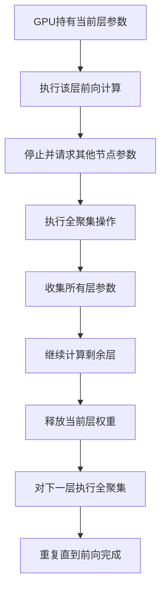

# CS336_p07

## 第 1 部分

### 多机并行：从单GPU优化到跨机器训练

本部分聚焦于为何以及如何从优化单GPU吞吐量，转向利用多机并行来训练大规模模型。

#### 核心驱动力：单GPU的物理限制

*   **计算能力瓶颈**：单个GPU的浮点运算能力（FLOPS）虽然在飞速增长，但对于训练当今顶尖的语言模型（例如拥有数十亿甚至数百亿参数）而言，**单卡算力远远不够**。必须借助世界上最快的超级计算机（由成千上万GPU构成）才能实现可行的训练时间。
*   **内存容量瓶颈**：大模型的参数量已远超单个GPU显存的容量。即便未来GPU显存增长，当前必须**严格遵守内存上限**，将模型拆分到多个GPU上。

#### 关键挑战与核心资源

*   **两大核心资源**：**计算（Compute）** 和 **内存（Memory）**。多机并行的根本目的是同时解决这两个资源在单卡上的不足。
*   **核心挑战**：**通信（Communication）**。跨机器训练的核心矛盾在于，不同GPU之间的数据传输速度存在巨大差异。

#### 硬件拓扑与通信层级

要理解并行策略，必须先理解GPU间通信的物理架构和速度差异。

*   **单机内（Intra-node）通信**：
    *   **连接方式**：通过 **NVLink** 等高速总线连接同一台机器内的多个GPU（例如8个GPU）。
    *   **速度特性**：**超高速、低延迟**。如上图示例，通过NVSwitch实现全互联，带宽极高。
*   **跨机器（Inter-node）通信**：
    *   **连接方式**：不同机器上的GPU必须通过 **网络交换机（Network Switch）** 进行连接。
    *   **速度特性**：**速度显著慢于**机内NVLink连接，存在明显的带宽和延迟差距。

#### 并行化范式概述

为了高效利用异构的通信层级（机内高速，机间低速），需要设计不同的并行化策略。

*   **核心思路**：将大模型的不同部分、不同数据或不同计算任务，分配到不同的GPU上。
*   **常见策略**（后续章节详解）：
    *   **数据并行**：每个GPU持有完整模型副本，处理不同数据切片。
    *   **模型并行**：将模型的不同层或参数拆分到不同GPU。
    *   **流水线并行**：将模型按层分段，不同GPU负责不同阶段，形成流水线。
    *   **张量并行**：将单个算子（如矩阵乘法）的计算切分到不同GPU上。
*   **最终目标**：**组合使用**多种并行策略，以平衡计算、内存和通信开销，最大化训练效率。

#### 关键公式与概念（公式化总结）

- 训练目标：在资源约束下，最大化有效吞吐量 $T_{eff}$。
- 理想吞吐量 $T_{ideal} = \sum_{i=1}^{N} T_{single\_GPU}$
- 实际吞吐量 $T_{real} = T_{ideal} - T_{overhead}$
- 通信开销是 $T_{overhead}$ 的主要组成部分，其大小取决于通信频率、数据量和通信带宽。
- **瓶颈公式**：总时间 $T_{total} = \max (T_{compute\_i} + T_{communication\_i})$，其中 $i$ 索引所有GPU。目标是最小化该最大值。
- **关键Trade-off**：增加并行度会减少单GPU的计算和内存压力，但会引入更高的通信开销。

---

## 第 2 部分

# 硬件层级与集体通信操作

## 一、硬件层次结构对性能的影响

### 核心概念：**通信速度分层**

- **单机内部（GPU间）**：通过 **NVLink** 连接，速度极快
- **跨机器（通过网络交换机）**：**紫色线** 所示路径，速度显著下降
  - **每通道慢8倍**（相对于 NVLink）
  - **吞吐量差异巨大**

### 关键洞察：**硬件拓扑决定模型性能**

> **“这种硬件层次结构将对我们的模型实际运行产生重大影响，实际上会导致我们的模型陷入瘫痪。”**

**思维模型**：
1. **单机内部**：极快连接（NVLink）
2. **跨机器**：速度下降（取决于硬件类型，如网络交换机）
3. **更慢层级**：超出某范围后（如多台机器联网）

---

## 二、集体通信操作回顾

### 1️⃣ **一致归约**（All-Reduce）
- **场景**：4台机器/进程，各自有数据片段
- **操作**：对所有输入求和 → 结果复制到所有机器
- **通信开销**：约等于 **2倍被归约数据总量**

### 2️⃣ **广播**（Broadcast）
- **场景**：从进程2获取输入
- **操作**：复制到所有其他进程
- **通信开销**：约等于 **输出数量大小**

### 3️⃣ **归约**（Reduce）
- **场景**：不同输入参与
- **操作**：结果仅发送到一台机器

### 4️⃣ **全收集**（All-Gather）⭐
- **定义**：**“将我拥有的内容复制给所有人”**
- **操作**：每个进程将其部分参数复制到所有其他等级（rank）
- **重要性**：**基础操作，许多并行算法基于此构建**

### 5️⃣ **归约散射**（Reduce-Scatter）⭐
- **定义**：处理每一行，只将结果发送给对应等级
- **示例**：对每行求和，结果仅发送到等级0
- **重要性**：**部分全归约操作，同样为基础构建块**

---

## 三、重要等价关系：**全归约 ↔ 归约散射 + 全收集**

### 核心公式（恒等式）：
```
All-Reduce  =  Reduce-Scatter  +  All-Gather
```

### 详细解释：
- **场景**：4个GPU（a, b, c, d），每个处理不同数据点
- **全归约操作**：对梯度求和 → 将结果传回所有GPU
- **替代方案**：
  1. **归约散射**：处理每一行，结果保留在对应GPU（GPU0, 1, 2, 3）
  2. **全收集**：将部分结果复制回所有GPU
  3. **结果**：每个GPU获得参数的完整总和

### 性能关键：
> **在带宽受限场景下，这就是最优解。**

- **全归约最优带宽** ≈ 通过归约散射+全收集可获得的带宽
- **验证方法**：计算两种方案的通信操作次数

## 总结记忆点

| 概念 | 本质 | 重要性 |
|------|------|--------|
| **硬件层级** | NVLink > 网络交换机 | 决定性能瓶颈 |
| **归约散射** | 部分归约，分发结果 | 基础构建块 |
| **全收集** | 收集所有部分到全体 | 基础构建块 |
| **等价关系** | All-Reduce = Reduce-Scatter + All-Gather | 带宽最优解 |

---

## 第 3 部分

### 数据中心计算：从 GPU 集群到并行算法的思维模型

#### 1. 通信带宽与运算操作的等价性

-   **核心概念**：**归约散射（Reduce-Scatter）** 与 **全收集（Allgather）** 的组合，在带宽上与 **全归约（All-Reduce）** 操作**等价**。
-   **关键术语**：
    -   **全归约 (All-Reduce)**：一种集体通信操作，所有节点上的数据通过某种运算（如求和）合并，最终每个节点都获得最终结果。
    -   **归约散射 (Reduce-Scatter)**：一种集体通信操作，将数据分散到所有节点，每个节点只持有最终结果的**一部分**。
    -   **全收集 (Allgather)**：一种集体通信操作，从所有节点收集数据，最终每个节点都持有**全部数据**。
-   **核心洞察**：从性能（特别是带宽）角度看，`全归约` 与 `归约散射 + 全收集` 这两个操作的顺序组合没有差别。这在设计和优化并行算法时非常重要，因为你可以将复杂的操作拆解为更基本、更易于分析的通信原语。

    -   **公式表达**（概念性）：
        \[
        \text{All-Reduce} \quad \approx \quad \text{Reduce-Scatter} + \text{Allgather}
        \]
        这里的“≈”指在带宽维度上的计算成本相同。

---

#### 2. 硬件网络拓扑：GPU 与 TPU 的根本差异

-   **核心概念**：并行算法的效率高度依赖底层**硬件网络拓扑结构**。GPU 集群与 TPU 集群采用了截然不同的架构，这会影响集体通信策略的选择。
-   **关键术语**：
    -   **GPU 集群典型架构**：
        -   **节点 (Node)**：通常包含 8 块 GPU。
        -   **叶交换机 (Leaf Switch) & 脊交换机 (Spine Switch)**：采用层级交换网络。在单个机架（~256 块 GPU）内通信极快，但跨机架通信延迟和带宽会显著下降。
        -   **结论**：GPU 网络是**全互联（All-to-All）** 的，但受限于交换机层级。通信速度存在“机架边界”天花板。
    -   **TPU 集群典型架构**：
        -   **单一芯片**：每个 TPU 是一个独立计算单元。
        -   **环形网格 (Ring Mesh)**：芯片只与最邻近的芯片进行**极高速**通信。
        -   **结论**：TPU 网络是高度**局部化**的，便于线性扩展，但无法像 GPU 那样进行任意节点间的快速通信。

-   **算法设计的启示**：
    -   **对于 TPU (环形网格)**：集体通信操作（如 **全归约**）可以通过精心设计的**环形算法**（Ring All-Reduce）高效实现。它完美适配 TPU 的局部连接特性。
    -   **对于 GPU (全互联)**：通常使用**树形算法**（Tree-based All-Reduce），因为它可以利用交换机提供的全互联能力。
    -   **核心结论**：在设计和优化集体通信时，必须**考虑底层的网络拓扑**。TPU 的环形结构本质上对某些集体通信模式更友好。

---

#### 3. 宏观目标：以“数据中心”为基本计算单元

-   **核心概念**：演讲者提出一种**新的计算单元思维模型**：不再是单个 GPU，而是**整个数据中心**。
-   **两个核心目标**：
    1.  **线性内存扩展 (Linear Memory Scaling)**：
        -   **定义**：随着 GPU 数量线性增加，你能训练的最大模型规模也**线性增长**。
        -   **意义**：你可以训练远超单机内存极限的巨型模型。
    2.  **线性计算标量 (Linear Compute Scaling)**：
        -   **定义**：随着 GPU 数量线性增加，用于训练模型的有用计算量也**线性增长**。
        -   **意义**：训练速度（吞吐量）与 GPU 数量成正比，而不是被通信瓶颈所拖慢。

-   **实现手段**：通过设计精巧的**分片策略（Sharding Strategy）** 和并行算法，利用上述的**集体通信原语**（All-Reduce, Reduce-Scatter, Allgather）作为主要工具，来达成线性扩展的目标。

-   **性能分析的简化模型**：
    -   不需要深入研究并行算法的每个底层细节。
    -   只需**统计和优化**你所调用的**集体通信原语**的类型、数量和通信模式。
    -   **核心思想**：并行算法的性能特性 ≈ 其内部集体通信原语的性能特性。

---

## 第 4 部分

### 并行策略：核心概念与权衡

#### 1. 三种并行性

*   **数据并行**
    *   **核心概念**：将训练数据（批次）拆分到多个GPU上，每个GPU持有完整的模型副本。
    *   **关键术语**：批次拆分、梯度同步。
    *   **工作机制**：将大小为 `B` 的批次拆分成大小为 `b` 的微批次，分发到 `m` 个GPU。每个GPU独立计算梯度，然后通过**全规约**操作同步所有梯度，最后每个GPU用平均后的梯度更新自己的参数副本。
    *   **核心公式（朴素SGD）**：
        *   原始：$\theta_{t+1} = \theta_t - \eta \cdot \frac{1}{B} \sum_{i=1}^{B} \nabla L(x_i, y_i; \theta_t)$
        *   数据并行：$\theta_{t+1} = \theta_t - \eta \cdot \frac{1}{m} \sum_{k=1}^{m} \left( \frac{1}{b} \sum_{j=1}^{b} \nabla L(x_{k,j}, y_{k,j}; \theta_t) \right)$
        *   其中，每台机器计算部分和，然后交换并平均所有梯度。

*   **模型并行**
    *   **核心概念**：将模型本身（网络层、参数）拆分到多个GPU上，每个GPU只持有模型的一部分。
    *   **关键术语**：模型分割、流水线。
    *   **动机**：当模型巨大（如GPT-4、Llama 3 405B），单个GPU显存放不下整个模型时，必须采用此策略。

*   **激活并行（激活分区）**
    *   **核心概念**：将训练过程中中间层产生的**激活值**（Activation）进行拆分，以降低显存占用。
    *   **关键术语**：激活内存、序列长度。
    *   **重要性**：虽然PyTorch等框架对激活内存的管理很透明（自动求导图会存储中间激活用于反向传播），但当**模型巨大**且**序列很长**时，激活内存会超越模型参数，成为主要的显存瓶颈。

#### 2. 性能分析：计算扩展 vs. 内存扩展

*   **计算扩展（数据并行优势明显）**
    *   **核心公式**：每个GPU处理 `b/m` 个样本（批次大小被均分）。
    *   **条件**：微批次大小 `b` 必须足够大，以充分利用每个GPU的计算能力。
    *   **通信开销**：
        *   每次梯度同步（全规约）需要传输约**两倍参数量**的数据。
        *   **关键点**：如果**批次大小非常大**，通信开销可以被计算时间完美掩盖（计算与通信重叠）。

*   **内存扩展（数据并行是灾难）**
    *   **核心问题**：每个GPU需要存储完整的模型参数副本，这**没有节省任何显存**。
    *   **更严重的问题 - 内存放大**：
        *   **理论**：模型参数本身可能只需少数字节。
        *   **实际**：为了训练，你通常需要存储：
            *   **模型权重**：1份
            *   **优化器状态**（如Adam的动量和方差）：2份
            *   **梯度**：1份
            *   **激活值**：若干份（通常是最占内存的）
        *   结论：实际存储的数据往往是**模型参数量的16倍或更多**（约5份权重数据）。
    *   **实际影响**：这是最常见的内存不足（OOM）原因。即使你的批次大小足够大，GPU显存也可能放不下这“5份”的副本。

#### 3. 核心权衡与结论

| 策略 | 计算扩展 | 内存扩展 | 通信开销 | 适用场景 |
| :--- | :--- | :--- | :--- | :--- |
| **数据并行** | **优秀** （可掩盖通信） | **糟糕** （每卡需复制完整模型及优化器状态） | 需同步梯度 | 模型可放入单卡，追求训练吞吐 |
| **模型并行** | 中等 | **优秀** （参数被拆分） | 高（层间通信） | 模型太大，单卡装不下 |
| **激活并行** | 无直接影响 | **关键** （解决训练中最大的显存消耗） | 低 | 序列长、模型大，激活成为瓶颈 |

*   **核心结论**：要扩展训练超级大模型，必须**组合使用**这三种并行性：
    1.  **数据并行**解决计算扩展（利用多卡加速）。
    2.  **模型并行**解决参数放不下的问题。
    3.  **激活并行**解决训练过程中动态产生的、最大的显存消耗。
    *   **最终目标**：优雅地扩展计算和内存，使之能随GPU数量线性增长，且不因内存瓶颈而失效。

---

## 第 5 部分

## 深度学习训练中的内存瓶颈与优化器状态分片 (ZeRO)

### 核心问题：训练大模型时的巨大内存消耗

- **关键概念：** 训练过程中，内存占用并非仅由模型参数决定，而是由**模型参数、梯度、优化器状态**三部分共同构成。
- **惊人的放大倍数：** 实际操作中，内存消耗可能是模型参数大小的 **16倍** 甚至更多。
- **一个典型案例 (7.5B 参数模型)：**
    - 模型参数本身：如果仅用bf16存储，每个参数仅需2字节。
    - 但实际上，你至少需要存储**梯度** (另一个2字节/参数，用bf16)。
    - 更大的开销来自**优化器状态** (Optimizer States)。
        - **主权重 (Master Weights):** SGD 中累积的中间值，需要32位浮点数，即4字节/参数。
        - **一阶矩估计 (First Moment):** Adam 需要记录历史梯度的均值，需要4或2字节/参数。
        - **二阶矩估计 (Second Moment):** Adam 需要记录历史梯度的方差，需要4或2字节/参数。
    - **结果：** 一个看似合理的7.5B模型，在64个加速器上进行数据并行训练时，总内存需求会高达 **120GB** 以上，随着GPU数量增加，内存需求线性增长，变得完全不可行。

### 解决方案：分片思想——ZeRO (零冗余优化器)

- **核心洞察：** 在传统数据并行中，我们强制每台机器都复制了完整的参数、梯度和优化器状态。但**并非所有数据都必须复制**。
- **简单的提问：**
    - 参数和梯度跨设备复制似乎是必要的，因为需要计算梯度。
    - 但**真的需要所有优化器状态都在每台机器上吗？**
- **关键概念：** **优化器状态分片 (Optimizer State Sharding)**。
    - 思想：将优化器状态（一阶矩、二阶矩等）打散，分布到不同的GPU上，而不是每台机器都存一份完整的。

#### 分片策略的逐步演进 (从120GB 降至 1.9GB)

1.  **Step 1: 仅优化器状态分片**
    - 操作：将一阶矩和二阶矩分布在所有GPU上。每个GPU只负责更新自己分到的那部分参数。
    - 前提：每个设备**仍然拥有完整的参数和梯度**。
    - **为什么能做到？** GPU0拥有完整的参数和梯度，计算出完整梯度后，它**无需**自己完成所有参数的原子更新步骤。它可以只更新自己负责分片的那部分参数，其他参数通过通信从其他GPU获取更新后的值。
    - **效果：** 总内存从 **120GB 降至 31.4GB**。

2.  **Step 2: 优化器状态 + 梯度分片**
    - 操作：在分片优化器状态的基础上，进一步**共享梯度**。
    - **效果：** 内存使用量降至 **16.6GB**。

3.  **Step 3: 优化器状态 + 梯度 + 参数分片 (ZeRO-Stage 3)**
    - 操作：最终，连模型**参数**也进行分片。
    - **效果：** 内存使用量降至 **1.9GB**，这是一个非常理想的状态。

### 核心机制：如何分片优化器状态并实现更新？

- **关键问题：** 在进行数据并行时，GPU0负责处理数据点1，它需要了解所有参数并计算梯度。如何又能只更新自己分片的那部分参数呢？
- **算法：** **零开销数据并行优化器 (ZeRO)**。
- **工作流程：**
    1.  **前向 + 反向传播：** 每个GPU (如 GPU0) 都拥有完整的模型参数副本，因此它可以独立完成数据点的前向计算和反向传播，计算出**完整的梯度**。
    2.  **梯度通信：** GPU0拥有完整梯度，但优化器状态（一阶/二阶矩）只分布在各个GPU上。
    3.  **局部更新：** GPU0现在只负责自己分片的那部分参数。它利用自己计算出的**完整梯度**中，对应自己分片参数的那部分梯度，结合自己本地存储的**分片优化器状态**，来更新自己分片的参数。
    4.  **参数同步：** GPU0更新完自己分片的参数后，将更新后的参数值广播给所有其他GPU。
- **小结：** 每个设备拥有完整梯度足以计算出参数更新量，但不需要自己做所有参数的原子步骤。通过巧妙的通信设计，避免了在每个设备上都存储完整的优化器状态，从而大幅降低内存。

---

## 第 6 部分

# 零开销优化器 (Zero Overhead Optimizer) 核心原理

## 核心思想：参数更新分工

- **关键洞察**：每个GPU**只更新自己负责的参数分片**，而不是所有参数
- **流程本质**：先**计算完整梯度** → 再**按参数分片归约** → 最后**分配更新任务**
- **术语**：**参数分片 (Parameter Sharding)**、**优化器状态 (Optimizer States)**

### 为什么叫“零开销”？
- 传统做法：所有GPU都要更新所有参数，通信量大
- 新思路：**谁拥有某部分参数，谁就负责更新它**
- 代价：需要额外通信来**广播/收集更新后的参数**

---

## 逐步执行流程

### 1. 前向传播：数据分配
- 每个GPU处理**不同数据点**
- 示例：4个GPU，每个处理1个样本
- 每个GPU计算各自样本的**完整梯度**

### 2. Reduce Scatter 操作（关键步骤）

- **目标**：将梯度按参数分片**分散归约**到对应GPU
- **可视化理解**：
  - Y轴：参数空间（按块划分）
  - X轴：GPU编号
  - 每个GPU只保留**自己负责的参数块**的**累积梯度**

> **具体操作**：
> - GPU0：收集所有GPU的**参数块0的梯度**，求和
> - GPU1：收集所有GPU的**参数块1的梯度**，求和
> - 以此类推...

### 3. 参数更新（本地执行）
- 每个GPU现在拥有 **完整梯度** 和 **优化器状态** 针对其负责的参数块
- 执行 **AdamW** 等优化器更新
- **重要**：无需其他GPU参与，完全本地计算

### 4. All Gather 操作
- 每个GPU只拥有**更新后的部分参数**
- 需要**收集所有参数**，使每个GPU都拥有完整参数
- 这步是**通信开销的主要来源**

---

## 通信成本分析

### 传统 All Reduce vs 分片方案

| 操作 | 通信量 | 特征 |
|------|--------|------|
| **All Reduce** | 2 × 参数量 | 梯度传播+参数广播合并 |
| **Reduce Scatter + All Gather** | 2 × 参数量 | 总通信量相同，但分配方式不同 |

### 通信细节
- **参数总量**：记作P
- **每台机器**：发送**P/4**参数到其他3台机器
- **重复4次**（每个机器负责一次）
- **总通信量**：仍为 **2P**（与All Reduce一致）

---

## 重要概念与问题讨论

### AdamW 的“对角假设”
- **传统认知**：AdamW假设参数更新是**独立对角**的
- **实际局限**：真实梯度存在**非对角相关性**
- **改进方向**：
  - **二阶优化器**（如KFAC）
  - **Kronecker因子近似**（K-FAC）
  - 能捕捉参数间的相关性

### 分片方案的“魔法”
- **Reduce Scatter** + **All Gather** 的**总通信量 = All Reduce**
- **差异**：分片方案**避免了所有GPU同步更新**，减少计算资源浪费
- **关键**：**通信假设** → 参数规模大，通信成本与批量大小无关

---

## 执行图与参数关系

```
参数空间 (Y轴)
    ┌─────────────┐
    │ 块0 (GPU0负责) │ ← 累加所有GPU的块0梯度
    ├─────────────┤
    │ 块1 (GPU1负责) │
    ├─────────────┤
    │ 块2 (GPU2负责) │
    ├─────────────┤
    │ 块3 (GPU3负责) │
    └─────────────┘
    └──→ GPU编号 (X轴)
```

---

## 总结要点

1. **零开销含义**：不增加额外通信成本，重新分配计算任务
2. **核心操作**：**Reduce Scatter** 分散梯度 → **All Gather** 收集参数
3. **优化器兼容性**：此方案适用于**任何对角优化器**
4. **瓶颈识别**：通信时间 = 2 × 参数量（与批量无关）
5. **未来方向**：将非对角方法（如KFAC）与分片策略结合

---

## 第 7 部分

## 零阶段二：优化器状态分片

### 核心概念：**计算-通信重叠**

- **核心思想**：利用 `reduce scatter` + `all gather` 的组合，将通信与计算重叠，使优化器状态分片“**近乎免费**”
- **关键洞察**：`reduce scatter` 和 `all gather` 的总开销与 `all reduce` 相同
- **魔法所在**：在两步之间插入计算步骤，使通信时间被计算时间隐藏
- **结果**：带宽受限场景下，零阶段一带来**内存收益且无性能损失**

### 关键技术细节

- **内存节省**：优化器状态按 GPU 数量分片
  - 一阶矩、二阶矩等优化器状态内存占用 $\rightarrow \frac{\text{原始大小}}{\text{GPU数量}}$
- **可扩展性收益**：
  - 可跟踪更多优化器状态
  - 可支持更复杂的优化器（如 Adam 变体）
  - 随着 GPU 增加，其他组件成为新瓶颈，但**优化器状态仍占主导**

---

## 零阶段三：梯度+优化器状态分片

### 核心挑战：**完整梯度不可实例化**

- **问题**：无法先计算完整梯度向量再通信 → 内存不足
- **目标**：**最大内存占用 = 完整参数 + 分片梯度 + 分片优化器状态**
- **解决方案**：**逐层即时通信**

### 运作流程（计算图反向传播）

1. **逐层反向计算**
   - 每层梯度计算完成后 **立即发起归约操作**
   - 将梯度发送到 **该层所属的 GPU**（参数分片的目标节点）

2. **即时释放内存**
   - 非目标 GPU（如编号 0、1、3）**不存储该层梯度**
   - 立即释放该层梯度内存

3. **参数更新**
   - 每个 GPU 拥有 **完整参数梯度**（归约后）
   - 每个 GPU 拥有 **对应参数的完整优化器状态**
   - 每个 GPU 独立更新自己的参数分片

4. **参数重收集**
   - 更新完成后，所有节点执行 `all gather` 恢复完整参数

### 通信特性

- **看似更多通信**：每层都需执行类似归约的操作
- **实际开销可控**：每层参数规模小，通信量分散
- **关键权衡**：内存节省 vs 通信复杂度

---

## 第 8 部分

## ZeRO Stage 3 (SDP) 深度解析

### 核心概念：**全模型参数分片**
- **核心理念**：所有模型参数、梯度、优化器状态全部按GPU数量均分，没有任何冗余副本
- **最大收益**：实现理论上的最大内存节省（随GPU数量线性减少）
- **代价**：通信开销增加，计算流程变得复杂

### 与ZeRO Stage 2的本质区别
- **Stage 2**：只分片**优化器状态**和**梯度**，但每个GPU仍保留完整参数副本
- **Stage 3**：**连参数本身也分片**，没有单个GPU拥有完整模型权重

### ZeRO Stage 3 的工作原理

#### **前向传播流程**


**关键步骤细化**：
1. **逐层加载**：每个GPU只持有其负责的权重分片
2. **全聚集（All-Gather）**：在计算每一层前，需要从所有其他GPU收集完整的该层参数
3. **计算完毕立即释放**：用完后丢弃权重，不保留副本
4. **存储激活值**：激活值仍需保留用于反向传播（内存瓶颈点）

#### **反向传播流程**
1. **反向遍历计算图**：从最后一层向前移动
2. **再次全聚集**：收集当前层所需的所有参数
3. **计算梯度**：使用收集到的完整参数计算梯度
4. **归约散射（Reduce-Scatter）**：更新模型参数时，计算梯度并分片更新
5. **释放权重和梯度**：更新完成后立即释放不再需要的数据

### 三种通信操作

| 操作类型 | 作用阶段 | 说明 |
|---------|---------|------|
| **全聚集（All-Gather）** | 前向+反向 | 收集所有GPU上的参数分片，得到完整参数 |
| **全聚集（All-Gather）** | 反向 | 再次收集参数用于梯度计算 |
| **归约散射（Reduce-Scatter）** | 反向更新 | 梯度和参数更新后，重新分片分散到各GPU |

### 通信开销分析

#### **总通信量对比**
- **无ZeRO**：通信量为0（无需传输参数）
- **ZeRO Stage 2**：通信量为 **2倍参数量**（梯度同步）
- **ZeRO Stage 3**：通信量为 **3倍参数量**（前向全聚集 + 反向全聚集 + 归约散射）

#### **通信模式变化**
- **Stage 2**：大部分通信**免费**（与计算重叠）
- **Stage 3**：通信成为**串行瓶颈**，需要等待全聚集完成才能继续计算

#### **实际性能表现**
- **直观直觉**：频繁的参数请求和传输会显著变慢
- **真实情况**：**开销实际上非常低**
  - 通过**精心设计的通信-计算重叠**技术
  - 逐层粒度足够细，通信延迟被计算隐藏
  - 现代GPU互连（NVLink/InfiniBand）带宽足够高

### 内存变化模式

#### **激活值内存问题**
- **前向**：激活值必须**保留存储**在内存中，用于反向传播
- **问题**：虽然参数内存大幅降低，但激活值内存**反而增长**
  - 因为没有完整参数，必须存储更长时间的激活值才能完成反向
  - 这是SDP实现中的主要内存瓶颈

### 与SDP的关系
- **SDP = ZeRO Stage 3**
- SDP就是ZeRO Stage 3的**标准化实现**
- 理解ZeRO Stage 3就能理解SDP的工作原理

### 关键公式

**内存节省倍数**：
$$Memory_{Stage3} = \frac{Memory_{baseline}}{N_{GPU}}$$
其中：
- \(Memory_{baseline}\) = 原始模型参数 + 梯度 + 优化器状态的总内存
- \(N_{GPU}\) = GPU数量

**通信开销**：
$$Comm_{total} = 3 \times \Psi$$
其中 \(\Psi\) = 模型参数量（以参数个数计）

### 实现要点

1. **按需请求**：遍历计算图时，只请求当前需要的层参数
2. **及时释放**：计算完成后立即丢弃权重，减轻内存压力
3. **通信-计算重叠**：尽可能将全聚集与当前层计算并行化
4. **激活管理**：需要仔细管理激活值的生命周期，避免内存爆炸

---

## 第 9 部分

### 通信与计算重叠的核心原理：如何实现SDP的高效性

#### **核心思想：让通信在后台“预取”**

- **关键术语**：**通信-计算重叠**、**预取（Prefetching）**、**异步流水线**
- **核心概念**：尽管分布式训练需要频繁通信（如AllGather），但可以通过**将通信操作与计算操作重叠**，使GPU在持续计算的同时，后台完成下一组参数的加载。这样当计算需要新参数时，数据已经就绪，**避免显式的等待延迟**。
- **类比**：就像CPU的**预取指令**——提前加载可能用到的内存块，从而隐藏内存访问延迟。

---

### 具体案例分析：一个简单的计算图

假设你的前向计算图如下（非常简化）：

```
y = (x × W0) × (W1 + W2)
```

即：
- 先计算 `x × W0`
- 再计算 `W1 + W2`
- 最后将两者相乘得到输出 `y`

#### **SDP下的通信与计算序列（见原始方框图）**

**阶段0：初始加载**
- **通信**：执行 `AllGather(W0)`，确保所有设备获得第0层权重。
- **等待**：必须等待`AllGather(W0)`完成才能开始计算。

**阶段1：第一次重叠（关键）**
- **计算**：开始 `x × W0`（前向一步）。
- **同时通信**：几乎在计算开始的同时，启动 `AllGather(W1)` 和 `AllGather(W2)`（因为下一层需要 `W1+W2`）。
- **效果**：在 `x×W0` 计算完成前，`W1` 和 `W2` 已经加载完毕。**计算掩盖了通信延迟**。

**阶段2：第二次计算与复用**
- **计算**：执行 `W1 + W2`。
- **通信**：无需再次加载 `W1`、`W2`，因为它们已经就绪。
- **优势**：由于快速计算（加法比矩阵乘法快），通信间隙很小。

**阶段3：反向传播**
- **预加载**：在反向传播开始前，已经提前收集了反向阶段需要的权重（如 `W0`、`W1`、`W2`）。
- **关键操作**：反向传播中涉及 **ReduceScatter**（归约散射），这是通信开销较大的部分。

---

### SDP高效性的直观理解

#### **带宽利用率：仅需3倍带宽？**
回到原始的分片示意图：
- **参数、梯度、优化器状态** 三者被完全分片。
- 但在SDP中，通过重叠机制，**实际需要的总带宽仅为3倍**，而非2倍（或更高）。
- **原因**：通信和计算完美流水线化，**“气泡”（空闲等待时间）非常小**，大部分时间GPU都在计算，通信在后台近乎无缝完成。

#### **硬件资源利用**
- **GPU计算单元**：持续满载，很少因等待数据而停滞。
- **网络带宽**：利用率高，因为通信窗口被“挤”在计算间隙中，而不是单独占用时间。

---

### 实际实现中的注意事项

- **权重存储**：需要额外的**缓冲区**来存储当前层的权重，以及预加载的下一层权重。
- **显存开销**：由于需要缓存多份权重（当前层 + 提前加载的下一层），**显存占用略高于理论最小值**。
- **图并不完美**：实际中仍存在少量读取当前层权重的开销（图中未完全体现），但整体效率极高。

---

### 总结：为什么SDP如此“出人意料”地高效？

| 传统直觉 | SDP实际表现 |
|---------|------------|
| 频繁通信 → 慢 | 通信与计算完全重叠，延迟被隐藏 |
| 分片需要大量带宽 | 通过流水线化，带宽需求仅3倍 |
| 有大量等待气泡 | 气泡极小，计算单元利用率接近100% |
| 反向传播开销大 | 同样通过预加载和重叠，最大程度缓解 |

**核心公式**（非数学公式，而是设计原则）：
> **总执行时间 ≈ 计算时间 + 极小的通信间隙**  
> 而通信间隙 ≈ `max(通信延迟 - 计算时间, 0)`，通过重叠使其趋近于0。

这解释了为何SDP能在**极致分片**下依然保持**接近线性的扩展效率**，是迈向**大规模分布式训练（如LLM）**的关键技术之一。

---

## 第 10 部分

### 分布式训练中的内存优化与并行策略

#### 核心概念：零冗余优化器（ZeRO）与数据并行

- **ZeRO的核心思想**：将模型训练中的**内存占用**（优化器状态、梯度、参数）进行**分片**（Shard），而不是完全复制到每个GPU。通过**分布式存储**和**按需通信**（All-Gather/Reduce-Scatter），大幅降低单卡内存压力。
- **关键内存组件**：
  - **模型参数**（Weights）：存储前向/反向传播所需的权重。
  - **优化器状态**（Optimizer States）：如Adam中的动量、方差等，通常占内存最大。
  - **梯度**（Gradients）：反向传播时计算的梯度。
  - **激活值**（Activations）：前向传播时中间层输出，**容量极大**，是内存瓶颈之一（原讲座指出“完全没有提及激活值”会带来大块数据）。

#### ZeRO的三个阶段（从易到难）

- **阶段一**：仅**优化器状态**分片。通信模式与标准数据并行相同（**“免费”**），仅需在更新参数时收集优化器状态。可显著节省内存，通信开销**几乎不增加**。
- **阶段二**：分片**优化器状态 + 梯度**。反向传播时逐步释放梯度（**梯度逐步释放**），总带宽消耗与阶段一相同（**两倍参数量带宽**），但增加了**额外通信开销**（因为需要先Reduce-Scatter梯度再All-Gather参数）。
- **阶段三**：分片**所有内容**（参数、梯度、优化器状态）。通信成本**增加三倍**（需在每层前向/反向前All-Gather参数，计算后丢弃）。通过**巧妙掩蔽通信**（Overlap with computation），实际性能影响较小（如原图所示开销曲线）。适用于**慢速网络**环境。

#### 模型并行 vs 数据并行（关键区别）

- **数据并行（含ZeRO）**：参数**分片**在所有设备上，但**每个GPU处理不同输入数据**。需要通信来**收集/分片参数**（All-Gather/Reduce-Scatter）。
- **模型并行（如张量/流水线并行）**：参数**完全位于单台机器内**（不跨设备传输），仅**激活值跨设备转移**。通信焦点是**激活值**而非参数（原讲座强调：“激活值通信” vs “参数通信”）。
- **术语澄清**：
  - **All-Gather**：将每个设备上的分片参数**收集**到所有设备（得到完整参数副本）。
  - **Reduce-Scatter**：求和梯度后**分片**到各设备。
  - 原讲座提问：“为何要收集权重到所有机器？”——因为ZeRO阶段三需要每层前向/反向前**收集**所有分片参数到本地，计算完再**丢弃**（避免复制存储）。广播（Broadcast）仅适用于**单源**场景，而ZeRO是**多源分片**，必须使用All-Gather。

#### 实际收益示例（基于880节点）

- **基线（标准数据并行）**：最大适配 **~6亿参数**模型（受限于单卡内存）。
- **ZeRO阶段三**：最大适配 **~50亿参数**模型（通过分片参数和优化器状态，节省大量内存）。
- **SDP（序列数据并行）**：进一步**巧妙节省内存**（如激活值重计算、混合精度等），可适配更大模型。

#### 架构无关性优势

- 数据并行（尤其是ZeRO）**对模型架构要求低**：只需实现 **并行化包装器**（如`torch.distributed.fsdp`），无需深入Transformer等具体架构细节。
- 原因：**抽象层级高**——通信原语（All-Gather, Reduce-Scatter）与模型内部计算逻辑解耦，开发者只需指定哪些张量需要分片/收集。

---

### 关键公式与算法（使用LaTeX格式）

1. **ZeRO阶段二总带宽消耗**：
   $$
   \text{Bandwidth} = 2 \times \text{Model Size} \quad (\text{与标准数据并行相同})
   $$
   （但增加**梯度同步**和**参数更新**的额外计算延迟）

2. **ZeRO阶段三通信倍增**：
   $$
   \text{Communication Cost} = 3 \times \text{Model Size} \quad (\text{前向、反向各一次All-Gather + 反向一次Reduce-Scatter})
   $$

3. **最大模型尺寸估算**（基于单卡内存 $M_{\text{GPU}}$，分片设备数 $N$）：
   - 标准数据并行：$M_{\text{model}} \approx M_{\text{GPU}} / \text{(参数+梯度+优化器)系数}$
   - ZeRO阶段三：$M_{\text{model}} \approx N \times (M_{\text{GPU}} - \text{激活值开销}) / \text{(单参数系数)}$

---

### 总结性记忆口诀

- **ZeRO阶段一**：优化器状态分片，**白送**内存。
- **ZeRO阶段二**：梯度也分片，**加倍开销**但内存更省。
- **ZeRO阶段三**：参数全分片，**三倍通信**但能跑大模型。
- **模型并行**：参数不动，**激活值动**；数据并行：参数**分片+收集**，输入数据动。
- **All-Gather vs Broadcast**：多源分片用All-Gather，单源广播用Broadcast。

---

## 第 11 部分

### 核心概念：从数据并行到模型并行的演进

**关键矛盾：** 数据并行受限于**最大批大小**的瓶颈（边际效益递减），无法独立扩展内存或减小激活内存。为了在**不改变批大小**的前提下训练超大模型，需要引入**模型并行**。

---

### 1. 数据并行的关键瓶颈：批大小（Batch Size）

-   **批大小是关键资源：** 数据并行中，**全局有效批大小**是所有GPU批大小之和。受限于单机显存，批大小存在上限。
-   **边际效益递减：** 超过“临界批大小”后，增大批大小对优化效果的提升急剧下降。直觉上，当批大小较小时，梯度噪声大，增大批大小能有效减少方差；但超过临界点后，优化主要受限于**梯度步数**，而非方差减少。
-   **根本局限性：** 数据并行（包括ZeRO-1, 2）**无法扩展内存**；ZeRO-3理论上可以，但**不减少激活内存**。无法实现“模型完全独立拆分”以降低激活内存。

**总结：** 需要一种**不依赖大批量**的并行化轴来扩展内存。

---

### 2. 模型并行（Model Parallelism）的引入

**核心思路：** 将模型参数分布到不同GPU上，并在GPU间传递**激活值（activations）**，而非像ZeRO-3那样传递参数。此时激活值通常远小于参数，非常有利。

**两大分支：** 对应两种不同的模型拆分方式。

#### 2.1 流水线并行（Pipeline Parallelism）

-   **概念直观：** 将深度神经网络的**层**按自然边界分割。每个GPU处理连续的一部分层。
-   **工作流：** 前向传播时，GPU间传递激活值；反向传播时，从最后一个GPU向第一个GPU传递梯度。
-   **核心缺点：** **严重的GPU闲置（Idle）。** 因为数据必须顺序经过各层，导致大部分时间大部分GPU处于等待状态，设备利用率极低。

#### 2.2 张量并行（Tensor Parallelism）

-   **概念不直接，但实现更优：** 不按层切分，而是将**单个层内的计算**（如矩阵乘法）拆开到多个GPU上。
-   **核心优势：** 更容易实现，且在现代硬件上更常用，**利用率更高**。

---

### 关键公式 / 概念

-   **临界批大小：** 超过此值后，每样本对优化的贡献急剧下降。
-   **模型拆分轴：**
    -   **流水线并行：** 垂直分割（沿层深度方向）。
    -   **张量并行：** 水平分割（沿层宽度方向，即隐藏层维度）。

### 总结与对比

| 并行类型 | 核心思想 | 主要优势 | 主要缺点 |
| :--- | :--- | :--- | :--- |
| **数据并行** | 复制模型，分数据 | 实现简单，适合小模型 | 受限于批大小，无法扩展内存 |
| **流水线并行** | 按层切分模型 | 概念直观 | GPU利用率极低（闲置严重） |
| **张量并行** | 在层内切分计算 | 利用率高，实际应用广泛 | 概念上需要更复杂的数学/通信支持 |

**下一步：** 将深入探讨张量并行的具体实现原理。

---

## 第 12 部分

### 流水线并行（Pipeline Parallelism）的核心机制与挑战

#### 1. **朴素并行（Naive Parallelism）的致命问题：GPU利用率极低**
- **核心概念**：按层将模型分配到不同GPU（如GPU0→GPU1→GPU2→GPU3），前向与反向传播**串行执行**。
- **关键术语**：**气泡（Bubble）**、**闲置时间（Idle Time）**。
- **现象描述**：
  - 前向传播时，GPU0先计算第一层，完成后唤醒GPU1，GPU1计算第二层，依次传递到GPU3。反向传播时，梯度从GPU3反向流回GPU0。
  - 图中显示：**大部分GPU在大部分时间处于空闲状态**，仅有1/n的时间（n为GPU数量）处于活跃状态。
- **数学视角**：假设有4个GPU，每个GPU处理1/n的计算量，但**整体吞吐量仅与单个GPU相当**（因为串行化）。
- **本质问题**：这种“简单并行”等同于**将计算改为了顺序流**，没有实现真正的并行加速。

#### 2. **流水线并行（Pipeline Parallelism）的改进：微批次（Micro-batch）与重叠**
- **核心思想**：通过**将输入数据分成多个微批次**，让不同GPU**同时处理不同的微批次**，从而重叠计算与通信。
- **关键术语**：**微批次（Micro-batch）**、**流水线阶段（Pipeline Stage）**、**通信与计算重叠（Overlap Communication with Computation）**。
- **操作流程**：
  - 每个GPU负责处理一组层，并接收微批次的数据流。
  - 例如：GPU0处理第一个微批次的前向计算后，立即将激活值发送给GPU1，同时GPU0开始处理第二个微批次。GPU1在接收后立即开始工作。
- **量化效果**：
  - **气泡时间（Bubble Time）** 与 **有效计算时间（Effective Computation Time）** 的比例为：  
    \[
    \frac{\text{Overhead}}{\text{Effective}} = \frac{N_{\text{stages}} - 1}{M_{\text{microbatches}}}
    \]
    其中 \(N_{\text{stages}}\) 是流水线阶段数，\(M_{\text{microbatches}}\) 是微批次数量。
  - **气泡大小随微批次增多而减小**，但受限于**批量大小（Batch Size）** 这一有限资源（不能无限制增大）。

#### 3. **流水线并行的取舍：为何在低效下仍被采用？**
- **核心矛盾**：气泡开销存在，但流水线比数据并行在**内存**和**通信**上有独特优势。
- **关键收益**：
  - **内存节省**：相比于数据并行（如ZeRO-3会分片参数），流水线同时分片了**模型参数**和**激活值**。每个GPU只需存储自己阶段内的激活值，**大幅减少显存占用**。
  - **通信特性优越**：依赖**点对点通信（Point-to-Point Communication）**，仅传递激活值（或梯度），无需全局All-Reduce。
- **适用场景**：**慢速网络链路**（如跨节点、不同机架甚至跨数据中心）下的首选。
  - 因为数据并行需要高带宽的全规约（All-Reduce）操作，而**流水线并行只需点对点传输**，对网络带宽要求低。
  - 实例：谷歌TPU拥有高速环形网络，**通常无需流水线**；但当网络链路变慢（如跨机架或不同集群），**应立即切换为流水线并行**。

#### 4. **总结：流水线并行的“双刃剑”属性**
- **优势清单**：
  - 内存高效（分片激活值）
  - 通信友好（点对点，适合慢网络）
  - 在**大批量**场景下气泡开销可控
- **劣势清单**：
  - 本质引入流水线气泡
  - 批量大小受限时，效率可能低于数据并行
- **工程选择铁律**：
  - **快速网络**（如TPU环状网络、NVLink等）→ **数据并行** 或 **张量并行**。
  - **慢速网络**（跨节点、跨机架）→ **流水线并行**，牺牲部分吞吐量换取可行性。

---

## 第 13 部分

### 流水线并行的高级技巧：零气泡与计算重排

#### 核心挑战：大环形网络与流水线并行
- **硬件背景**：现代GPU集群常采用**大型环形网络**，不再受限于2-6张GPU的小规模组网限制。
- **性能瓶颈**：当网络链路速度突然变慢时，**流水线并行**成为必要的切换方案。
- **关键问题——批次大小的影响**：
    - **小批次（如batch size=8）**：随着流水线规模（设备数）增加，**每张GPU的利用率显著下降**。这是由于流水线中的气泡（空闲等待时间）无法被有效隐藏。
    - **大批次（如batch size=128）**：在合理规模的流水线下，仍能保持**良好利用率**。**批次大小是隐藏延迟的关键**，否则气泡问题会严重影响性能。

---

#### 高级流水线调度：零气泡流水线（Zero Bubble Pipeline）
- **来源与别名**：来自NVIDIA的论文（后文会详讲）。在DeepSeek的术语中可能被称为**双管道**，核心思想一致。
- **核心思想**：将反向传播（Backward Pass）拆分为两个独立的计算阶段，重新编排调度，从而**填充传统流水线中的气泡**。
    - **反向传播的两部分**：
        1.  **计算激活值的导数**（图中标记为`b`部分）：例如，对残差连接、激活函数等输出的梯度计算。这部分依赖于前向传播的顺序。
        2.  **计算权重的梯度**（图中标记为`w`部分）：例如，计算`dL/dW`（损失对权重的导数）。这部分**只需激活值导数**，但**计算时机可以灵活安排**，不依赖前向传播的严格串行顺序。
- **标准流水线 vs 零气泡流水线**：
    - **传统做法**：严格按照前向 → 反向(完整)的顺序串行执行，导致大量**白色气泡**（GPU空闲）。
    - **零气泡做法**：
        - 将反向计算拆分为`b`（激活导数）和`w`（权重梯度）。
        - 将计算权重梯度的`w`部分**重新调度**到原本是气泡的位置。
        - **结果**：GPU利用率大幅提升，几乎填满了所有空闲时间。

---

#### 实现细节与复杂性
- **核心公式/图例**（参考左下图的MLP例子）：
    - **前向**：输入`x` → 乘以权重 → 非线性变换 → 输出。
    - **反向**：损失导数 → 计算`dx`（激活值导数，即`b`部分） → 计算`dW`（权重梯度，即`w`部分）。
    - **关键洞察**：计算`dW`的计算（即`w`部分）**不依赖于反向传播的严格顺序**，因此可以被灵活地移动到计算图的任意位置。
- **实际实现要求**：
    - **必须干预自动微分（AutoDiff）机制**：标准框架（如PyTorch、JAX）通常将反向计算视为一个整体。要实现零气泡，需要**手动跟踪数据流向**，将反向计算拆分为`b`和`w`两个独立的算子或阶段。
    - **极高复杂性**：这是真正的工程挑战，需要深入理解计算图、依赖关系和硬件调度。

---

#### 实用总结
- **何时使用**：当网络拓扑为大环形且链路变慢，批次大小受限时，流水线并行是必要选项。
- **如何优化**：不要只采用标准的1F1B（一个前向一个反向）调度。**将反向计算拆分为激活导数(b)和权重梯度(w)**，并将`w`部分调度到气泡位置，实现接近零气泡的高利用率。
- **关键术语**：
    - **气泡**：流水线中GPU空闲等待的时间。
    - **前向后向流水线**：优化后的调度策略，用于减小气泡。
    - **计算重排**：将不依赖严格顺序的计算（`w`）自由移动以填补空闲。

---

## 第 14 部分

### 张量并行：沿矩阵乘法宽度维度拆分

**核心概念：** 张量并行不是将网络按层（深度）切分，而是将单个大型矩阵乘法运算拆解为多个子矩阵乘法，并分配到不同GPU上并行计算。这解决了流水线并行在基础设施上的复杂性，是训练超大模型的另一种高效模型并行方式。

**关键术语：**
*   **张量并行 (Tensor Parallelism)**
*   **子矩阵分解 (Sub-matrix Decomposition)**
*   **部分求和 (Partial Summation)**
*   **集体通信 (Collective Communication) / All-reduce**
*   **同步屏障 (Synchronization Barrier)**

---

### 核心工作原理：拆分矩阵乘法

**基本思想：**
如果核心操作是矩阵乘法（例如 `y = x * A`），可以将权重矩阵 `A` 沿宽度（列）维度拆分为两块：`A1` 和 `A2`。
同时，输入 `x` 也需要沿相应的维度拆分为 `x1` 和 `x2`。
在每个GPU上，独立计算子矩阵乘积，最后将所有部分结果相加，得到完整结果。

**数学表示（标准 LaTeX）：**

假设原始矩阵乘法为：
$$ Y = X \cdot A $$

**张量并行拆分方式：**
将 `A` 按列拆分为 `[A_1, A_2]`，将 `X` 按列拆分为 `[X_1, X_2]`，则：
$$ Y = X_1 \cdot A_1 + X_2 \cdot A_2 $$

每个GPU负责计算自己的子矩阵乘积（例如 `X_1 \cdot A_1`），然后通过 **全归约 (All-reduce)** 操作将所有子结果相加，得到最终结果 `Y`。

---

### 多层感知机（MLP）中的张量并行流程

以一个有两层全连接（MLP）的块为例（包含 `A` 和 `B` 两个权重矩阵），描述其前向和反向传播过程。

#### 1. 前向传播 (Forward Pass)

*   **输入复制：** 将输入 `x` 复制到所有参与计算的GPU（本例中假设2个GPU）。
*   **第一层计算：** 每个GPU持有 `A` 的部分（`A1`, `A2`），使用完整的 `x` 计算各自的激活值 `y1` 和 `y2`。
    *   *注：* 原文提到将 `x` 也拆分，但实际常见做法是复制 `x` 并拆分 `A`。
*   **中间结果：** 每个GPU获得部分激活值 `y1` 和 `y2`。
*   **第二层计算：** 每个GPU持有 `B` 的部分（`B1`, `B2`），分别计算 `z1 = y1 * B1` 和 `z2 = y2 * B2`。
*   **同步与归约：** 在最终输出层前，执行 **全归约 (All-reduce)** 操作，将 `z1` 和 `z2` 相加，得到最终结果 `z`。

**前向传播的关键步骤（框图描述）：**

1.  **输入分发 (Scatter) 或复制 (Broadcast)**
2.  **并行计算子矩阵 (Compute Shards)**
3.  **输出聚合 (All-reduce)**

#### 2. 反向传播 (Backward Pass)

*   **梯度输入：** 损失对输出 `z` 的梯度 `g` 进入计算图。
*   **同步点反转：** 前向传播中的 **全归约 (All-reduce)** 操作在反向传播中变为 **全复制 (All-gather)** 或 **广播 (Broadcast)**（根据具体实现，本质是反向传播的梯度流）。
*   **梯度计算：** 每个GPU收到完整的梯度 `g` 后，分别计算对各自权重 `B1`, `B2`, `A1`, `A2` 的导数。
*   **梯度归约：** 在需要合并来自两条路径的梯度时（例如计算对 `x` 的导数时），再次执行 **全归约 (All-reduce)** 操作，将两个GPU上计算的梯度相加。

**反向传播的关键特点：**
*   前向传播的 **All-reduce**（归约）在反向中变成 **All-gather**（收集）。
*   反向传播中，当需要合并来自不同分叉路径的梯度时，再次执行 **All-reduce**。

#### 3. 效率与开销

*   **优势：** 在矩阵乘法层面实现了细粒度并行，计算效率高，尤其适合大模型训练。
*   **开销：** **每层都需要一次同步屏障（All-reduce）**，这在高通信成本的场景下（如跨机器）会成为瓶颈。每次矩阵乘法后都需等待全局同步，增加了通信延迟。
*   **总结：** 这种方法在**计算密集型**任务（如大矩阵乘法）上优势明显，但**通信成本**是主要瓶颈，尤其是在层数深、并行度大时。

---

## 第 15 部分

### 张量并行（Tensor Parallelism）深入解析

#### 核心思想与原理
- **核心思想**：将单个大型矩阵乘法运算拆解，分配到多个设备上**并行计算**。
- **实现方式**：对矩阵乘法进行**分块**，例如将权重矩阵按行或列切分，每个设备只负责一部分计算。
- **工作流程**：
    - 前向传播：激活值（残差）需**两次传输**到不同设备（分块前和分块后各一次）。
    - 反向传播：同样需要两次传输残差数据。
    - **关键操作**：每次计算后需要**全归约（All-Reduce）通信**，跨设备汇总部分结果。

#### 硬件要求与经验法则
- **核心要求**：**高速互连**（High-Speed Interconnect），因为单次矩阵乘法就需要**八次通信量**（每层）。
- **经验法则**：
    - **“张量并行应用于单个节点内部”** 是最优实践。
    - 例如：NVIDIA GPU 通常一个机箱内配备 **8 个 GPU**，它们之间通过 NVLink 等高速总线连接，通信延迟极低。
- **性能瓶颈**：扩展至更多设备时，**通信开销**会急剧增加，导致吞吐量大幅下降。

#### 性能与扩展性数据（示例：Hugging Face 并行化教程）
| 张量并行规模 | 吞吐量下降 (%) | 结论 |
| :--- | :--- | :--- |
| 8 节点 | 10%-12% | **可接受**，为获得并行能力付出的合理代价 |
| 16 节点 | **42%** | 超出最佳平衡点，性能严重受损 |
| 32 节点 | **65%** | 完全失去意义，通信成为瓶颈 |

- **结论**：**8 节点是张量并行的最佳平衡点**（在典型硬件架构下）。

#### 张量并行 vs. 流水线并行
| 特性 | 张量并行 | 流水线并行 |
| :--- | :--- | :--- |
| **气泡问题** | 无（无需处理气泡） | 需通过增大微批次大小来缓解 |
| **实现复杂度** | **较低** | **较高**（需处理前向/反向阶段的调度） |
| **通信开销** | **高**（每层全归约，需8x通信量） | **低**（每微批次点对点通信） |
| **通信维度** | 跨设备**分块计算**，需高频次、大量通信 | 跨设备**分阶段计算**，低频次、少量通信 |
| **适用场景** | **节点内部**，依赖**低延迟、高带宽**互连 | 跨节点，对带宽要求相对较低 |

#### 典型组合方案：分层并行
- **标准实践**：在**大规模训练**中，通常采用**分层并行策略**：
    - **节点内部**：使用 **张量并行**（利用高速互连）。
    - **跨节点**：使用 **流水线并行**（利用网络通信）。
- **灵活组合**：可以**同时使用**（称为混合并行），例如：
  - 在第一台机器内：用张量并行处理前20%的计算。
  - 然后通过流水线并行，将中间结果传输到第二台机器，继续处理后续计算。
- **特例**：**DeepSeek V3** 等模型可能因特殊架构（如MoE稀疏激活）而**不使用张量并行**，但这是少数案例。

---

## 第 16 部分

### 大型模型训练中的并行策略与激活内存管理

#### 一、混合并行策略：张量并行与流水线并行的协同

- **核心概念**：为了训练无法装入单机显存的大模型，需要**混合使用多种并行策略**。最佳实践是**在单机内部采用张量并行**，而在**跨机器之间采用数据并行与流水线并行**。
- **决策依据**：
    - **流水线并行**：当**模型无法完整装入单机内存**时，流水线并行是核心策略，它将模型的不同层分布在多台机器上。
    - **数据并行+张量并行**：如果**模型能够完整装入单机内存**，则只需数据并行（扩大量化能力）搭配张量并行（加速单层计算）即可。
    - **经验法则**：先判断显存瓶颈，再决定并行粒度。
- **关键术语**：
    - **张量并行（Tensor Parallelism）**：将单个层的矩阵运算（如注意力头或MLP）切分到多个GPU上并行计算，适合**单机内**的低延迟通信。
    - **流水线并行（Pipeline Parallelism）**：将模型按层切分成多个阶段，每个阶段部署在一台机器上，适合**跨机器**的高延迟通信。
    - **混合并行（Hybrid Parallelism）**：结合上述多种策略，平衡计算、通信与内存。

#### 二、训练中的动态内存剖析：激活值的“大头”效应

- **核心概念**：在模型训练的内存占用中，**参数、优化器状态、梯度**是**静态**的，而**激活值（Activations）** 是**动态**且**峰值极高**的组成部分。这是并行化时容易被忽略的瓶颈。
- **内存动态变化过程（以一次前向-反向迭代为例）**：
    1.  **前向传播**：每层计算出的激活值被**持续累积存储**（用于后续反向计算梯度），内存占用线性增长。
    2.  **反向传播开始**：梯度的计算需要用到之前保存的激活值。随着反向传播的进行，已使用的激活值被**逐步释放**，因此激活内存占用开始下降。
    3.  **梯度累积**：反向传播过程中，**梯度值**开始累积（存储于显存），其内存占用逐渐增加。
    4.  **内存峰值**：出现在**反向传播的中段**——此时**大部分激活值尚未完全释放**，而**部分梯度已经累积完毕**，二者叠加形成最高峰。
- **关键结论**：参数和优化器状态的静态内存可以通过并行化（如数据并行）做到不随模型规模线性增长，但**激活值的动态内存无法被完美忽略**，这是大模型训练的核心挑战。

#### 三、激活内存的“不可压缩性”与重计算策略

- **核心观点**：随着模型规模增大（从左到右），**参数和优化器状态的内存可通过更激进的并行化保持恒定**，但**每台设备上的激活内存仍在持续增长**。因为激活值的某些部分无法被并行策略（如张量并行）有效分摊。
- **解决方案——重计算（Recomputation / Checkpointing）**：
    - **原理**：在前向传播时**不保存全部激活值**，而是只保存关键节点（checkpoints）。在反向传播时，需要用到某层激活值时，**从最近的checkpoint临时重新计算**出来。
    - **效果**：这是一种**以时间换空间**的策略，能**显著降低激活内存峰值**，使得超大规模模型训练成为可能。
- **关键术语**：
    - **激活内存（Activation Memory）**：前向传播中产生的中间特征图（feature maps），是反向传播计算梯度的必需品。
    - **重计算（Recomputation）**：通过丢弃中间激活值，在需要时重新计算，从而压缩内存占用（通常计算量会增加约33%）。

#### 四、单层激活内存的定量计算：一个简便公式

- **核心概念**：对于**Transformer模型**的**每一层**，其所需的激活内存可以用一个明确公式估算。理解这个公式有助于预测显存瓶颈。
- **公式与定义**（假设为典型的自注意力+MLP结构）：
    - **输入参数**：
        - `s`：序列长度（Sequence Length）
        - `b`：批次大小（Batch Size）
        - `h`：隐藏层维度（Hidden Size）
        - `a`：注意力头数（Attention Heads）
    - **激活内存公式**（单位：元素数量，可转换为字节）：
        ````latex
        \text{Activation Memory per Layer} = \underbrace{s b h \times \frac{3}{4}}_{\text{MLP层及其他逐点操作}} + \underbrace{5 a s^2}_{\text{自注意力层}}
        ````
    - **公式分解**：
        - **左侧项**（`sbh × 3/4`）：
            - 来源于MLP层（前馈网络）及**逐点操作**（如LayerNorm、Dropout、残差连接）。
            - 其大小与**残差流（Residual Stream）** 的维度成正比（即 `sbh`），系数 `3/4` 反映了MLP层中通常会将隐层维度扩展（如一个标准Transformer中MLP内部维度为4h，再结合激活值存储的占比换算得到）。
        - **右侧项**（`5a s^2`）：
            - 来源于**自注意力层**。
            - `a s^2` 代表注意力分数的空间（每个头产生一个 `s×s` 的注意力矩阵），乘以系数 `5` 是因为需要存储查询（Q）、键（K）、值（V）、注意力输出投影前的矩阵、以及可能的dropout掩码等5种主要激活值。
            - 注意：此处的 `h` 被约去了（因为注意力头维度 `d_model / a` 与头数 `a` 相乘后正好是 `h`），所以最终形式与 `h` 无关，只与 `s^2` 相关。
- **关键洞察**：
    - **序列长度 `s` 对内存的影响是平方级的**（通过右侧的 `s^2` 项），而批次大小 `b` 和隐藏层维度 `h` 是线性影响（左侧项）。
    - 对于**长序列**任务（如文档理解、视频处理），激活内存会因 `s^2` 项而**急剧膨胀**，这是激活内存成为瓶颈的根本原因。

---

## 第 17 部分

## Transformer 内存优化：从张量并行到序列并行

### 核心挑战：无法并行化的“拖累项”

- **关键问题**: 在应用**张量并行（Tensor Parallelism, TP）**后，MLP和注意力等核心计算的内存已被大幅降低（除以设备数 \( t \)），但**激活内存**中仍存在一个**“拖累项”**：\( sbh \times 10 \) 尚未被有效缩减。
- **拖累项的组成**: 这些无法被张量并行有效缩减的组件都是**逐点操作（Point-wise Operations）**，包括：
    - **层归一化（LayerNorm）**
    - **丢弃层（Dropout）**
    - **注意力输入和MLP输入**的激活值
- **核心原因**: 这些操作本质上是**非映射的（non-projected）**，它们不涉及跨设备的矩阵乘法，因此无法被张量并行直接拆分。

### 解决方案：序列并行（Sequence Parallelism, SP）

#### 核心思想
- **思路**: 针对这些**逐点操作**，它们对序列中不同位置的计算**完全独立、互不干扰**。因此，可以沿**序列维度（Sequence Dimension）** 进行拆分。
- **操作**: 将长度为 \( s \) 的序列切分成 \( t \) 份（\( t \) 为设备数），每个设备只处理自己负责的那一部分的层归一化或丢弃层。

#### 实现机制：前向与反向的对偶
- **前向传播（Forward Pass）**:
    - **\( g \)（梯度/数值）**：需要**全收集（All Gather）**，将各设备分散处理的结果合并。
    - **\( act \)（激活值）**：需要**归约散列（Reduce Scatter）**，将并行计算出的激活值求和后重新分散。
- **反向传播（Backward Pass）**:
    - 上述操作完全**对调**：
        - **\( act \)** 使用**全收集**
        - **\( g \)** 使用**归约散列**
- **本质**: 这相当于将这些逐点操作的计算和通信进行**对称化**处理，确保前向和反向的梯度流正确。

### 最终内存模型：理想最小值

- **整合优化**: 结合**张量并行（TP）** 和**序列并行（SP）** 后，Transformer单层的**最小激活内存**可以逼近一个**易得的理论下限**。
- **内存公式**:
  \[
  \text{Minimal Activation Memory per Layer} = \frac{s \times b \times h \times 3}{4 \times t}
  \]
    - **\( s \)**: 序列长度
    - **\( b \)**：批次大小
    - **\( h \)**：隐藏层维度（残差流大小）
    - **\( t \)**：张量并行度
    - **来源**: 公式中剩余的 \( \frac{3}{4} \) 来源于**MLP层**和**其他逐点操作**在序列并行化后仍必须保留的最小激活值。
- **Flash Attention的额外贡献**:
    - Flash Attention 可以进一步**移除注意力机制中的二次项（\( s^2 \) 项）**，从而完全消除内存中对 \( sbh \) 的瓶颈依赖。
    - **结论**: 通过TP + SP + Flash Attention，激活内存的瓶颈仅剩 \( sbh \times 3/4 / t \)。

### 总结：内存优化的三步走

1.  **张量并行（TP）**: 拆分MLP、注意力中的矩阵乘法，将大部分核心计算的内存除以 \( t \)。
2.  **序列并行（SP）**: 拆分无法被TP处理的逐点操作（LayerNorm, Dropout等），将剩余的“拖累项”也除以 \( t \)。
3.  **Flash Attention**: 从算法层面消除注意力中的二次项 \( s^2 \)，进一步降低对序列长度的内存依赖。

> **关键词**: 张量并行 (TP), 序列并行 (SP), 逐点操作, 激活内存, 归约散列 (Reduce Scatter), 全收集 (All Gather), Flash Attention, 最小内存模型。

---

## 第 18 部分

### **并行策略总结：从张量并行到专家并行与注意力计算**

#### **1. 核心概念：并行策略的扩展与统一**

*   **核心思想：** 当神经网络模型（如Transformer）变得复杂（例如引入**图**、**体积**、**负类型**或**组合图**等结构），简单的**单一线性链**计算图可能不足以高效利用硬件资源。并行策略的核心是**打破依赖关系，分散计算和内存负载**。
*   **关键术语：**
    *   **计算图依赖**：在复杂的、非线性计算图中，不同分支间的依赖关系限制了并行化的机会。传统的**张量并行**（Tensor Parallelism）对层间依赖不敏感，因为它专注于单层内的操作。
    *   **流水线并行**（Pipeline Parallelism）：如果存在多个独立的分支，这为**增加并行化**提供了新机遇。通过将不同分支分配到不同设备，可以减少流水线中的气泡和同步等待。

    > **一句话总结：** 简单的并行（如张量并行）不关心图的拓扑结构，但复杂的图结构（如分支）为更智能的并行（如流水线并行）创造了条件。

#### **2. 环形注意力 (Ring Attention)**

*   **核心思想：** 解决超大序列（如长视频、长文档）的注意力计算问题。通过**分块计算**并结合**环状通信**，将巨大的 **键值对(KV)激活** 和 **计算成本** 分散到多个设备上。
*   **关键步骤：**
    1.  **分块：** 遵循**Flash Attention**的分块逻辑，将查询、键、值矩阵切分成小块。
    2.  **环形通信：** 每个设备负责一部分**查询**，而所有设备的**键和值**在设备间以环状方式循环流动。
    3.  **在线计算：** 在每个设备上，通过**分块的方式在线计算**KQ内积和 softmax，逐步累加输出结果。
*   **公式与算法：**
    *   注意力在线分块计算的核心公式不变，但整体实现变为：
    ```
    对于每个环的步骤：
        接收来自上一个设备的键值块
        计算当前块内积：S = Q @ K^T
        执行在线 softmax 并累加输出 O
        将当前键值块传递给下一个设备
    ```

    > **备注：** 你已经掌握了Flash Attention的分块原理，环形注意力是其分布式自然扩展。关键是：**计算和通信流水线化**，隐藏通信延迟。

#### **3. 专家并行 (Expert Parallelism)**

*   **核心思想：** 类比于**张量并行**，但拆分对象从单个大MLP变成了多个**专家（Expert）**。每个设备负责一组专家（一个小MLP）。
*   **关键区别：**
    *   **稀疏激活：** 并非所有专家都参与计算，只有选中的“路由”专家被激活。
    *   **路由问题：** 与张量并行的“全对全”通信不同，专家并行的通信模式由**路由决策**动态决定，可能导致**负载不均**（某个专家过热）和**复杂网络通信**。
*   **技术要点：**
    *   **负载均衡策略：** 必须处理专家负载不均衡问题，否则会导致部分设备成为瓶颈（straggler）。
    *   **通信模式：** 不再是简单的聚合参数，而是**动态的、稀疏的、点对点**通信。

    > **一句话总结：** 专家并行是稀疏版本（激活部分参数）的张量并行，但引入了动态路由带来的**负载和通信复杂性**。

#### **4. 并行策略对比表格**

| 并行策略 | 关键特征 | 批次大小影响 | 内存扩展 | 带宽需求 | 主要缺点 |
| :--- | :--- | :--- | :--- | :--- | :--- |
| **DDP / 零一阶段** | 朴素数据并行；每个批次有额外开销 | **消耗**（需大批次） | 无 | 合理 | 依赖大批次大小实现高效 |
| **SDP / 零优化** | 零的优化版本；跨层开销 | **消耗**（需大批次） | **有**（层间扩展） | **更高**（通信成本上升） | 同步屏障多，利用率低 |
| **流水线并行** | 线性内存扩展；不依赖单批次 | **消耗**（设置复杂） | **有**（线性扩展） | 中等 | **设置与使用非常麻烦**，常被规避 |
| **张量并行** | 带宽成本极高；大量同步 | **无影响**（极优） | **有**（分散化） | **极高**（瓶颈） | 设备间强同步依赖 |
| **专家并行** | 稀疏激活；动态路由 | **无影响** (通常) | **有** | 中等 (路由不稳定) | 负载不均，路由复杂 |

#### **5. 关键平衡与资源约束**

*   **三个有限资源：**
    1.  **内存 (Memory)**：可用显存大小。
    2.  **带宽/计算能力 (Bandwidth/Compute)**：数据搬运速度和计算速度。
    3.  **批次大小 (Batch Size)**：一种**非常规但必须视为有限**的资源。分配到不同并行策略上会影响整体效率和内存使用。
*   **核心约束：** 必须**权衡**这三种资源的分配，找到最优组合。例如：
    *   追求**无批次大小影响**（如张量并行）就必须承受**高带宽**和**高同步**成本。
    *   追求**低通信成本**（如DDP）就必须牺牲**大批次**。

#### **6. 结论与推荐阅读**

*   **最佳实践：** 实际中，通常**组合使用多种并行策略**（例如数据并行 + 张量并行 + 流水线并行）。
*   **推荐资源：** 谷歌的 **TPU 书籍** 和 **并行化章节**，其中包含更详细的策略对比图表，以及针对不同硬件（如TPU vs GPU）的最佳实践。

---

## 第 19 部分

### 并行策略的权衡与“三维/四维并行”经验法则

#### 通信与计算开销的权衡：关键指标是 **批量大小**
-   **核心问题**：在分布式训练中，**批量大小（Batch Size）** 与 **GPU数量** 的比例，是决定采用何种并行策略的关键指标。
-   **不同并行策略的适用区间**：
    -   **小批量 + 大量GPU**：此时系统处于 **通信受限** 状态。大部分时间都浪费在跨GPU通信上，效率极低。
    -   **中等批量**：进入 **混合并行** 状态（例如 **ZeRO Stage 3 + 张量并行**）。此时计算与通信时间相当，不再浪费FLOPs等待通信，达到较优平衡。
    -   **大批量**：进入 **计算受限** 状态。计算时间超过通信时间，可以单纯使用 **纯数据并行（SDP）** 达到最高效率。

-   **公式与图表**：使用特定公式计算通信与计算量，并以此绘制图表，直观展示了从通信受限到计算受限的转变过程。

#### “三维/四维并行” 与 经验法则
-   **核心概念**：将不同的并行维度（如数据并行、张量并行、流水线并行）组合，形成一种分层、高效的并行策略，即 **三维并行**（甚至有提及四维、五维并行）。
-   **简单有效的经验法则（2021年至今仍然适用）**：
    1.  **第一步：让模型能存进内存。** 这是训练的底线。
        -   **动作：使用张量并行**。在单机GPU数量范围内（如8个GPU），张量并行效率极高且速度快。
    2.  **第二步：进一步缩小模型内存占用。** 如果张量并行后仍无法装入，则采用 **ZeRO-3** 或 **跨机器的流水线并行**。
    3.  **第三步：用尽所有GPU & 最大化总FLOPs。**
        -   **动作：使用数据并行**。数据并行在低带宽通信通道上表现良好，且实现简单，能充分利用所有GPU的算力。

-   **处理小批量数据的技巧**：如果受限于内存，导致有效批量大小很小。
    -   **解决方案：使用梯度累积**。在设备上累积多个微批次的梯度，然后再进行一次全局同步。这有效增大了等效批量大小，减少了跨机器同步的频率，从而提升通信效率。

#### 实际案例与效果
-   **实践来源**：引用Megatron-LM团队2021年的论文，通过大量消融实验和图表演示了上述法则的有效性。
-   **结果数据**：
    -   **规模**：模型从17亿参数扩展到**万亿参数**。
    -   **效率**：理论峰值浮点运算利用率（MFU）稳定在 **40% 到 52%** 之间。
    -   **并行配置**：**张量并行** 维度从1开始，逐渐增加到8，最终稳定在8，这与经验法则中“在单机GPU范围内使用张量并行”的建议一致。

---

## 第 20 部分

### 大规模语言模型训练中的三维并行策略与性能分析

#### 一、 理论利用率与并行策略选择

*   **核心概念：理论峰值浮点运算利用率 (FLOPs Utilization)**
    *   在典型大规模训练中，该利用率范围在 **40% 到 52%** 之间，表现相当不错。
*   **并行策略启动顺序与动态调整**
    *   **张量并行 (TP)**：首先被启用，规模从1逐渐增加到8并稳定在8。这是最高效的起点。
    *   **流水线并行 (PP)**：初始保持为1。当模型巨大到无法装入单个GPU内存时，需要增加流水线并行规模来应对。
    *   **数据并行 (DP)**：一开始就尽可能大，但随着流水线并行规模增加，**数据并行规模会逐渐减小**。原因在于：增加流水线并行会消耗部分批量大小（Batch Size），导致无法为数据并行维持更大的有效批量。

#### 二、 三维并行的核心原则

*   **核心原则：谨慎的三维并行带来线性扩展**
    *   当TP、PP和DP三者被**谨慎地组合**时，每GPU实现的FLOPs基本保持平坦（不随GPU数量增加而下降）。
    *   **关键收益**：随着GPU总数增加，总吞吐量实现**线性扩展**。
*   **关键配置参数**
    *   **张量并行规模**：8 通常为最优选择。即使在批量大小较小时，仍建议保持TP=8。
    *   **批量大小**：例如，在批量大小为128时，可达到(PP=8, TP=8)的最优配置。

#### 三、 激活重计算的价值

*   **核心概念：激活重计算 (Activation Recomputation)**
    *   **作用**：通过牺牲计算（额外FLOPs）来节省显存，从而允许使用更大的批量大小。
    *   **重要关系**：**更大的批量能够帮助掩盖流水线并行的开销**（因为流水线气泡相对减少）。
    *   **结论**：尽管增加了FLOPs，但激活重计算能带来**更高的整体效率**，物有所值。这在Flash Attention等机制中已得到验证。

#### 四、 近期语言模型的并行策略实例

*   **主流策略对比**
    *   **OLMo (Dorma论文)**：使用SDP（序列数据并行）处理70亿参数模型。
    *   **DeepSeek (首篇)**：采用 Zero Stage-1，结合**张量并行 + 序列并行 + 管道并行**，这是常规方法。
    *   **DeepSeek V3**：略有不同，采用 **16路流水线并行**、**64路专家并行**（类似张量并行但作用于专家层），配合 Zero Stage-1 进行数据并行。
    *   **Chinese Model**：再次使用 Zero Stage-1，结合**张量并行 + 管道并行**。
    *   **E Lightning (MoE模型)**：使用**专家并行**来替代张量并行。
*   **前沿参考：Llama 3 报告**
    *   **推荐理由**：非常详细地介绍了网络架构和分布式训练的设计细节。
    *   **并行策略层级**：完全符合本讲座的逻辑，按带宽需求从高到低排序：
        1.  **张量并行 (TP)**：第一优先级。
        2.  **上下文并行 (CP)**：仅用于长上下文训练，是最后一步。
        3.  **流水线并行 (PP)**：中间阶段。
        4.  **数据并行 (DP)**：容忍长网络延迟（可以异步获取分片模型权重），优先级最低。
    *   **训练阶段**：存在Stage-1、Stage-2的区分，如小批量训练用于保持稳定性，因此会忽略某些并行（如PP、DP甚至DP）。

#### 五、 大规模训练的容错与硬件挑战

*   **核心问题：GPU故障是常态**
    *   Llama 3训练过程中，有 **148次因故障GPU导致的中断**，占总中断的30%。
    *   **故障来源** (三个不同因素)：
        1.  机器未计划维护。
        2.  显性故障（硬件损坏）。
        3.  **数据损坏 (Silent Data Corruption)**：GPU可能无声地产生错误结果。这是比模型故障更可怕的问题，因为它难以被立即发现。

*   **核心启示**：当训练达到此等规模时，不仅需要精妙的并行算法，还必须设计**容错架构**来应对频繁的硬件中断和数据静默损坏。

---

## 第 21 部分

# 大规模并行训练的容错架构与混合并行策略

## 一、容错架构的必要性

### 核心挑战：**显性故障 vs. 隐性数据损坏**
- **显性模型故障**：容易检测和处理的明显崩溃
- **隐性数据损坏**（更危险）：
  - GPU可能**无声地出错**，产生完全错误的数据
  - 这种错误会**彻底毁掉整个运行**，且难以追踪
- **容错架构必须应对**：不仅要处理硬件故障，更要防范**静默数据错误**

## 二、TPU案例：Gamma Two

### 核心并行策略：**Zero3 + 模型并行 + 数据并行**
- **Zero3**：大致等同于 **SDP（Sharded Data Parallelism）**
- **模型并行**：利用TPU特有架构进一步扩展
- **数据并行**：与模型并行结合使用

### TPU特殊优势
- TPU架构允许在**模型并行维度**实现更大的扩展性
- 相比通用GPU，TPU的互联结构更利于模型切片

## 三、综合并行方案

### 核心原则：**没有单一解决方案**
- 超过某个**临界点**后，必须使用：
  - **多GPU并行**
  - **多节点并行**
- **关键结论**：没有任何一种并行策略能独立解决所有规模问题

### 混合并行：三种方法结合
1. **数据并行**：复制模型，分片数据
2. **模型并行**：切分模型层或张量
3. **流水线并行**：分层级联

> **核心优势**：取长补短，最大化资源利用率

## 四、实践经验法则

### 指导原则：**简单易懂，可执行**
- 根据**模型规模**和**硬件拓扑**选择混合比例
- 典型经验：
  - 小模型：优先数据并行
  - 大模型：逐步引入模型并行和流水线并行
  - 超大模型：三者组合，按节点拓扑优化通信

### 总结公式
\[
\text{最优策略} = \alpha \cdot \text{数据并行} + \beta \cdot \text{模型并行} + \gamma \cdot \text{流水线并行}
\]
其中 \(\alpha, \beta, \gamma\) 根据**模型维度、通信带宽、内存限制**动态调整。

---

