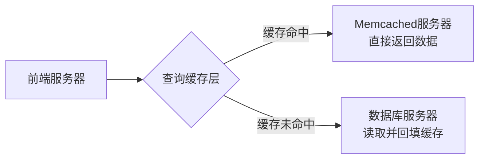

# MIT_6.824_p16


## 第 1 部分

# 大规模缓存基础设施的经验教训：Facebook的Memcache实践

## 论文定位与阅读视角

- **核心定位**：这是一篇**经验论文（Experience Paper）**，不提出新概念或新技术，而是记录真实公司在构建高容量基础设施时遇到的问题与解决方案
- **三种阅读视角**：
  - **警示故事**：如果不从一开始就重视一致性，会出什么问题
  - **成功案例**：如何主要使用**现成软件（off-the-shelf software）** 构建极高容量的系统
  - **根本矛盾**：高性能（通过复制等手段）与一致性之间的**永恒斗争**

## 典型Web服务演进模式

### 起点：单机架构

- **初始状态**：网站规模很小时，**单台机器**完全够用
- **典型配置**：
  - 客户浏览器通过互联网访问
  - 单台机器运行**Apache Web服务器**
  - 使用**PHP**、**Python**等便捷语言编写产生网页的脚本

### 核心原则：功能优先于基础设施

- **商业逻辑**：开发团队优先关注**让用户满意**或**卖更多广告**的功能，而非高性能存储基础设施
- **工程策略**：只有在**必须做**时才投入精力改进基础设施，因为这才是时间的最佳利用方式

---


## 第 2 部分

### 网络应用的经典架构演进：从单机到集群

#### 1. 初始阶段：单一服务器架构

*   **核心概念：** **全栈单机**。
    在一个服务器上运行所有组件：Web服务器 (如 Apache)、脚本语言运行时 (如 PHP, Python) 和数据库。

*   **技术栈示例：**
    *   **Web服务器:** Apache HTTP Server
    *   **后端语言:** PHP, Python (用于生成动态网页)
    *   **数据库:** MySQL (提供 **SQL 查询语言** 和 **ACID 事务** 支持，保证数据持久性和一致性)

*   **瓶颈与局限：**
    随着用户量增长，**PHP 脚本处理请求会耗尽 CPU 资源**。内存或磁盘 I/O 通常不是首要瓶颈，CPU 计算能力不足才是单机架构最先暴露的问题。

#### 2. 演进阶段：前端服务器集群 + 单一后端数据库

*   **核心概念：** **横向扩展计算层**，**保留存储层单点**。
    当单台服务器的 CPU 不足以支持大量用户的 PHP 脚本运算时，引入多台 **前端服务器 (Front-end Servers)** 来分担计算压力。所有前端服务器共享一个 **单一后端数据库服务器 (Single Database Server)**。

*   **架构组件与职责：**
    *   **用户群 (Users):** 通过互联网访问网站。
    *   **前端服务器集群 (Front-end Servers):** 运行 Web 服务器和 PHP 脚本。这一层可以根据负载增加或减少服务器数量，以提供所需的总 **CPU 算力**。
    *   **后端数据库服务器:** 运行 MySQL。**保持单点 (Single Server)** 是为了避免数据分片带来的复杂性。

*   **关键设计原则与权衡：**
    *   **避免数据库拆分 (Avoid Sharding):** 在这个阶段，维持单一数据库服务器是明智之举。一旦将数据拆分到多个数据库服务器，就会引入一系列复杂问题：
        *   **分布式事务 (Distributed Transactions):** 跨服务器的数据一致性难以保证。
        *   **路由逻辑 (Routing Logic):** PHP 脚本需要一种机制来决定连接到哪个数据库服务器。

*   **架构优点：**
    *   **计算弹性扩容:** 可以通过无限添加前端服务器来应对增长的 **CPU 处理能力** 需求。
    *   **保持简单:** 相对于分布式数据库，保存数据库单一节点极大地简化了数据管理和一致性维护。

*   **架构的极限：**
    单一数据库服务器最终会成为下一个瓶颈。当数据库无法处理来自众多前端服务器的所有读写请求时，就需要进一步演进架构。

---


## 第 3 部分

## Web 架构演进：从单数据库到数据分片

### 架构 2.0 的瓶颈：数据库服务器成为新的性能天花板

- **核心问题**：当网站持续增长，拥有**数千个前端服务器**时，**数据库服务器**会成为下一个性能瓶颈。
- **瓶颈原因**：
  - **CPU 扩展限制**：虽然可以不断添加更多前端服务器，但单个数据库的 CPU 和 I/O 处理能力有限。
  - **读写压力集中**：所有的读写请求最终都要落在一个数据库上，无法并行处理。

### 架构 3.0：数据分片（Sharding）— 分布式数据库的经典解决方案

这是大型网站发展的**标准演进路径**。

#### 核心架构组成

- **大量前端服务器**：处理 Web 请求，数量可达数千台。
- **多个数据库服务器**：每个服务器运行 **MySQL**（或其他关系型数据库），形成一个 **服务器阵列（Rack）**。

#### 关键技术：Sharding（数据分片）

- **核心概念**：将数据**水平拆分**，分布到多个数据库服务器上。
- **分片策略**：
  - **基于 Key 范围**：例如，服务器 A 存储键值 `A-G`，服务器 B 存储 `G-Q`，服务器 C 存储 `Q-Z`。
  - **其他策略**：也可基于哈希值、地理位置等。
- **前端代码职责**：
  - PHP 脚本必须**知晓数据分片规则**。
  - 根据所需数据，动态选择要连接的数据库服务器。

### 数据分片的优势与代价

#### 性能提升

- **并行读写能力**：所有数据库**并行执行**读写操作，大幅提高吞吐量。
- **负载分散**：读写负载被**均匀分摊**到多个服务器上。

#### 工程挑战与痛点

1.  **代码耦合问题**
    - PHP 代码**硬编码**了分片逻辑。
    - 当**变更分片规则**（如添加新服务器或调整 Key 范围）时，必须修改前端软件。

2.  **事务处理困难**
    - 如果单个事务涉及**跨多个数据库服务器**的数据，问题变得复杂。
    - **解决方案**：通常需要引入 **两阶段提交（2-Phase Commit）** 协议，但会带来性能开销和实现复杂度。

> **损失总结**：分片带来了性能的飞跃，但也失去了数据库透明性，增加了应用层的复杂性。

---


## 第 4 部分

## 分布式缓存层架构：突破传统数据库性能瓶颈

### 核心挑战：传统关系型数据库的可扩展性瓶颈

- **传统MySQL等数据库的性能上限**：
  - 读取能力大约在每秒**几十万次**（~几百K reads/sec）
  - 写入性能远低于读取，数量级更小（far fewer writes）
  - Web应用通常是**读密集型**（read-heavy），读取流量占主导地位

- **数据库切分（Sharding）的局限性**：
  - **热键问题（Hot Keys）**：某些key被频繁访问，但每个key只存在于单一服务器上，无论怎样分区都无法缓解热点压力
  - **成本高昂**：增加大量MySQL数据库服务器进行分片，硬件成本和运维成本非常高

### Memcached + 数据库混合架构

> **核心思路**：用相同硬件运行**Memcached**，获得远超MySQL的每秒读取次数，且成本更低。

#### 架构组成（已接近Facebook生产架构）

1. **前端服务器层（Front-End Servers）**：
   - 运行Web服务器（如Apache/Nginx）和PHP应用
   - 数量可能非常庞大（vast number）

2. **缓存层（Caching Layer）**：
   - 引入**Memcached**作为中间缓存
   - 部署**一组Memcached服务器**（a whole bunch of memcache servers）

3. **后端数据库层（Database Servers）**：
   - 仍然保留，负责：
     - **数据持久化存储**（store data safely on disk）
     - **事务支持**（transactions）
     - 数据一致性保障

#### 读取流程：缓存优先策略



1. 前端需要读取数据时，**首先查询Memcached缓存层**（"do you have..."）
2. 如果缓存命中，直接返回，**避免数据库查询**
3. 如果缓存未命中，才回源到数据库读取

### 关键补充：分布式事务

- **二阶段提交（Two-Phase Commit）**：当单个事务涉及跨多个数据库服务器的数据时，需要分布式事务方案
- **缺点**：
  - 实现复杂（a pain）
  - 性能慢（slow）

### 设计要点总结

| 层级 | 组件 | 职责 |
|------|------|------|
| 前端 | Web Server + PHP | 处理用户请求，业务逻辑 |
| 缓存 | Memcached | 高性能读缓存，减轻数据库压力 |
| 持久化 | MySQL等RDBMS | 数据持久存储，事务保障 |

> **工程师视角**：该架构的核心价值在于**用缓存层吸收读压力**，让数据库专注于写操作和持久化保障，从而用更少的硬件成本支撑更大规模的读流量。这是现代高并发Web架构的基础范式。

---


## 第 5 部分

### Memcached 缓存架构详解

#### **核心概念：旁路缓存（Look-aside Cache）模式**

*   **关键术语**：**Memcached**、**缓存命中（Cache Hit）**、**缓存未命中（Cache Miss）**、**键值存储（Key-Value Store）**。
*   **核心思想**：通过在数据库前增加一层高速缓存层，大幅提升读请求的响应速度。Memcached 是一个非常流行且极简的**分布式内存缓存系统**。
*   **工作流程**：
    1.  **前端（Front-end）** 向后端请求数据时，**首先**向 Memcached 服务器发送 `get(key)` 请求，询问：“你缓存了我需要的数据吗？”
    2.  **命中（Hit）**：
        *   Memcached 服务器内部维护一个**巨大的内存哈希表**（Hash Table），结构极其简单，甚至比某些课程实验（如Lab 3）还要简单。
        *   它会检查这个键是否在哈希表中。如果**存在**，直接将对应的值返回给前端。
        *   前端收到数据后，直接使用它来生成网页，整个过程非常快速。
    3.  **未命中（Miss）**：
        *   如果 Memcached 服务器中**没有**该键值对，前端必须**绕道**向底层的**关系型数据库（Database Server）** 发起查询请求。
        *   数据库返回所需数据后，前端**不会只使用一次**，而是会主动执行 `put(key, value)` 操作，将这份数据**回填**到 Memcached 服务器中。
        *   这样一来，**下一个**需要相同数据的前端请求就能直接从缓存中命中，从而避免再次查询缓存的数据库。

#### **性能优势与硬件权衡**

*   **为何如此高效？**
    *   对于**读操作（Reads）**，Memcached 比同硬件配置下的数据库**快至少 10 倍**，甚至更多。
    *   **原因**：Memcached 操作的是**内存中的哈希表**，而数据库需要进行复杂的磁盘 I/O、事务日志、锁管理等操作。
*   **硬件部署策略**：
    *   这种架构能显著**节省成本**。工程师会分配一部分硬件资源给 Memcached，另一部分给数据库。由于 Memcached 读性能极高，即使牺牲一部分数据库资源来部署缓存层，整体系统吞吐量也会大幅提升。
*   **写操作的处理**：
    *   **所有写操作**仍然**必须**发送到数据库。因为数据库负责**持久化（Durability）** 存储，确保即使系统崩溃，数据也不会丢失。
    *   缓存只用于加速**读操作**。

#### **关键设计决策：为何 Memcached 不做“主动回填”？**

*   **常见疑问**：“为什么不把 Memcached 设计成一个**智能代理（Smart Proxy）**？即当它收到 `get` 请求未命中时，自动转发请求到数据库，拿到结果后缓存好再返回给前端？”
*   **根本原因**：
    *   **关注点分离（Separation of Concerns）**：Memcached 是一个**通用的、与数据库无关的**缓存系统。它**不知道也不应该知道**后端具体连接的是 MySQL、PostgreSQL 还是其他数据源。
    *   **解耦设计**：如果将数据库逻辑硬编码进缓存层，会破坏系统的灵活性和通用性。Memcached 经常被用于缓存非数据库的数据（如 API 调用结果、计算结果等），因此它必须保持“傻”和“简单”。
    *   **总结**：Memcached 的设计哲学是**只做一个极快的内存哈希表**，复杂的数据回填逻辑由**上层（前端）** 业务代码负责。这保持了系统各层之间的**松耦合**和**可替换性**。

---


## 第 6 部分

### 1. Memcache 与数据库的解耦及“伪关联”本质

*   **核心概念：Memcache 对数据库“一无所知”**
    *   Memcache 的设计哲学是**纯粹的数据缓存层**，它不内建任何关于后端数据库（如 MySQL）的结构、表关系或查询逻辑的知识。
    *   **关键洞察**：Memcache 甚至**不总是**与数据库配对使用，它只是一个通用的、高速的键值存储系统。

*   **为何不能“硬编码”数据库逻辑到 Memcache？**
    *   **根本原因**：前端（通常是 PHP 代码）缓存的内容**并非数据库的原始记录**（1:1 映射）。
    *   **常见场景**：
        1.  前端从数据库获取多行、多表的数据。
        2.  对这些数据进行复杂的**处理后**（如组装成 HTML 片段、聚合计算结果）。
        3.  将**部分处理后的结果**存入 Memcache。
    *   **结论**：只有前端代码（PHP）才清楚“缓存的片段”与“数据库中的原始行”之间的**逻辑关系**。Memcache 本身无法理解这种关系。

### 2. Lookaside Cache（旁路缓存） vs. Look-through Cache（穿透缓存）

*   **核心术语：Lookaside Cache（旁路缓存）**
    *   **定义**：这是 Memcache 的核心工作模式。前端在请求数据时，**“不直接通过缓存访问数据库”**，而是先单独（旁路）去查询缓存。
    *   **工作流程**：
        1.  **查缓存**：前端询问 Memcache：“你要的数据在吗？”
        2.  **缓存命中**：直接返回。
        3.  **缓存未命中**：前端**自行负责**去数据库获取数据，然后写入缓存，最后返回给用户。
    *   **优点**：灵活性极高，缓存层与存储层完全解耦。

*   **对比：Look-through Cache（穿透缓存）**
    *   **定义**：缓存层充当代理，**直接拦截**对数据库的请求。
    *   **工作流程**：
        1.  前端的所有请求都发给缓存。
        2.  缓存未命中时，缓存层**自己**去数据库取数据并返回给前端。
    *   **缺点**：需要缓存层理解数据库协议和数据模型，破坏了 Memcache 的简单性。

### 3. Memcache 作为 Lookaside Cache 的流行原因与挑战

*   **流行原因**：
    *   **架构中立性**：Memcache 对后端是数据库、文件系统还是其他服务完全无感。
    *   **成本效益**：Memcache 的内存访问速度远快于数据库磁盘 I/O，能极大降低数据库负载。
    *   **广泛实践**：这是最被广泛采用的架构之一。

*   **核心挑战：缓存一致性（Cache Consistency）**
    *   **问题描述**：数据库中的数据被修改后，Memcache 中对应的缓存数据如果不及时更新或失效，就会变成**脏数据（Stale Data）**，导致前端读到过时信息。
    *   **必须解决的问题**：每一个使用这种架构的网站都必须有一套机制，确保**数据库更新时，同步处理 Memcache 中的对应缓存**（删除或更新）。
    *   **本讲座焦点**：这篇论文（指 Facebook 相关论文）的核心就是讲述 Facebook 如何解决这个缓存一致性问题。

*   **潜在劣势**：
    *   **复杂性**：维持一致性增加了系统复杂度（需要编写额外的代码来同步缓存）。
    *   **脆弱性**：如果逻辑处理不当（例如先更新数据库，但缓存删除失败），系统会进入不一致状态。

---


## 第 7 部分

### 快取层失效的连锁反应与 FaceBook 的实际架构权衡

#### 1. `Memcache` 失效带来的数据库雪崩风险

*   **核心问题：陈旧数据 vs. 数据库洪峰**
    *   在使用 `Memcache` 作为缓存层时，一个关键风险是缓存可能存储**陈旧数据**（Stale Data），即未能及时反映数据库的更新。这在许多论文中（以 Facebook 的经验为例）都有提及。
    *   这种架构虽然**脆弱**，但能让你支撑远超纯数据库能服务的用户量，因为 `Memcache` 速度极快。
    *   **致命后果：** 高负载下，一旦某个 `Memcache` 服务器宕机，所有本该命中缓存（Cache Hit）的请求会瞬间全部涌向数据库（Cache Miss）。
    *   **数学上的灾难：** 假设缓存命中率是 99%，数据库原本只处理 1% 的读请求。如果缓存失效，数据库需要处理的请求量会瞬间从 1% 飙升到可能 50% 甚至 100%。
        *   **公式化理解：** 数据库负载增加倍数 ≈ $\frac{\text{总请求量}}{\text{原数据库请求量}} = \frac{100\%}{1\%} = 100x$。这是数量级的剧烈增长。

*   **应对策略：分层防御与容灾设计**
    *   一旦依赖缓存层，就必须部署**严密的措施**，确保数据库层**绝不会**暴露在缓存层所承受的完整负载之下。
    *   **核心理念：** 必须设计“断路器”或“降级”机制，以防止缓存故障导致数据库被“打死”。Facebook 在此方面投入了大量思考。

#### 2. 从通用架构转向 Facebook 的实际系统蓝图

*   **应用场景驱动：社交图谱与数据展示**
    *   用户拥有：好友列表（Friends）、状态（Status）、帖子（Posts）、点赞（Likes）、照片（Photos）。
    *   **核心业务逻辑：** 高度面向**向用户展示数据**。

*   **关键特性：对**数据新鲜度**的妥协**
    *   **核心概念：最终一致性容忍（Eventual Consistency Tolerance）**
    *   **场景分析：**
        *   假设因缓存导致读取的数据是**几秒前**的旧数据。
        *   **用户感知：** 在大多数情况下（例如浏览新闻流），用户**极不可能**注意到这几秒的延迟。
        *   **例外情况：** 只有在极特殊的场景下（例如实时竞价），新鲜度才至关重要。
    *   **结论：** 相比几秒前的数据和最新的数据，用户根本不会在意。这种对“弱一致性”的容忍是 Facebook 能够规模级使用缓存的核心前提。

---


## 第 8 部分

### Facebook 的多数据中心缓存架构与一致性模型

#### **核心挑战与一致性要求**
- **绝大多数场景不需要严格线性一致性**：对于新闻推送这类数据，用户几乎察觉不到秒级或分钟级的数据延迟，因此**弱一致性**完全可接受。
- **关键禁忌：不能缓存过期数据**：Facebook 必须避免用户看到昨日甚至一小时的陈旧内容，这比“时刻最新”更重要。核心要求是**数据新鲜度**（不能无限期缓存过时数据）。
- **必须保证一致性的情况：用户自身写后读（Read-Your-Writes）**：如果用户修改了自己的数据（如发帖、改头像），修改后立即读取时，必须看到最新结果。否则人类用户会立刻发现“我刚改的怎么没变？”，导致体验极差。这是 Facebook 必须解决的核心一致性痛点。

#### **多数据中心（Region）架构**
- **Region = 数据中心**：当时 Facebook 有 **两个 Region**：
  - **主 Region（Primary）**：位于西海岸（加州），持有数据的**权威副本**。
  - **从 Region（Secondary）**：位于东海岸，也拥有完整数据副本，但**所有写入必须经过主 Region**。
- **Region 内组件**（每个 Region 内部结构相似）：
  - **MySQL 数据库服务器**：数据通过**分片（Sharding）** 分布在多台 MySQL 实例上。
  - **Memcached 服务器**：部署为**独立集群**，用于缓存加速读取。
  - **Web 前端服务器**：处理用户请求，数量众多，形成前端层。

#### **设计动机与延迟优化**
- **就近服务用户**：东海岸用户连接东海岸 Region，西海岸用户连接西海岸 Region，显著降低网络延迟（地域近）。
- **数据非跨 Region 分片**：每个 Region 都存有**全量数据副本**，而不是将数据按 Region 拆分。这简化了故障切换和读取就近性。
- **读写不对称**：所有写操作必须发送到**主 Region**，主 Region 再异步复制到从 Region。从 Region 只处理读取请求，**不接收写请求**。这是 Facebook 保持**最终一致性**但避免复杂跨 Region 写入冲突的关键设计。

---


## 第 9 部分

## 数据分区与缓存架构（Lookaside Caching）

### 跨数据中心的数据复制策略

- **核心概念**：采用 **主从复制（Primary-Secondary）** 而非 **数据分片（Sharding）**。
  - **西海岸** 作为 **主数据中心**，持有数据的 **真实副本**。
  - **东海岸** 作为 **从数据中心**，仅作为备份。
- **写入流程**：所有写操作必须发送到 **主数据中心的数据库**。
- **复制机制**：利用 **MySQL 的异步日志复制（Asynchronous Log Replication）**。
  - 主区域中的每个数据库将每次更新发送给从区域中对应的数据库。
  - 同步存在 **数秒的延迟**，但最终两个区域的数据库内容会 **完全一致**。
- **读取流程**：读操作是 **本地的**。
  - 前端服务器首先查询本地数据中心的 **Memcache**。
  - 如果未命中（cache miss），则从 **同一数据中心的数据库** 读取数据。
- **关键结论**：**数据库是完整的副本**，所有数据在两个区域中都存在。

---

## 读取操作（Read）缓存流程详解

### 步骤概览（对应 Figure 2）

1.  **发起读取**：前端代码调用 `get(key)` 库函数。
2.  **Memcache 查找**：
    - 客户端对 Key 进行 **哈希计算**（Client-side hashing），选择对应的 Memcache 服务器。
    - 发起 RPC 请求到该 Memcache 服务器。
3.  **缓存命中**：
    - 若 Memcache 返回数据（非 nil），则直接返回，流程结束。
    - **术语**：**Cache Hit**。
4.  **缓存未命中**：
    - 若 Memcache 返回 **nil**（空），表示数据未被缓存。
    - **术语**：**Cache Miss**。
5.  **回源数据库**：
    - 前端执行 **SQL 查询**，从数据库获取所需数据。
6.  **填充缓存**：
    - 前端再次发起 RPC 调用 `set(key, value)`，将获取到的数据 **安装到 Memcache** 中。
    - **术语**：**Cache Population**。

> **总结**：这是典型的 **Lookaside Caching** 模式 —— 先查缓存，未命中则查数据库并回填缓存。

---

## 写入操作（Write）流程详解

### 写入特性

- **数据结构**：写操作包含 **Key** 和 **Value**（与读取请求一致）。
- **执行流程**：
  1.  前端库函数直接 **将新数据发送到数据库**。
  2.  **注意**：数据库中存储的数据格式与 Memcache 中存储的格式 **可能不同**。
    - 数据库存储的是 **规范化、结构化的行数据**。
    - Memcache 存储的是 **经预处理、适合快速返回的最终结果**（如 JSON 或序列化对象）。
- **关键术语**：**读写格式分离（Data Format Difference）** —— 写入时需保证数据库数据正确，缓存数据需在后续读取时重新生成或显式失效。

---


## 第 10 部分

## 缓存失效机制与性能优先架构

### **写操作流程与缓存失效（Cache Invalidation）**

核心流程：前端应用将新数据写入数据库后，会通过RPC通知Memcache删除对应键。
- **核心步骤**：
  1. 前端应用将数据写入**数据库**
  2. 数据库存储完成后，写库的RPC库函数向**Memcache**发送**删除键**的请求
  3. Memcache收到请求后删除该键，后续读取返回`nil`（空值）
  4. 下一个前端从Memcache获取到空值后，会从数据库拉取**最新值**并重新写入缓存

- **关键概念**：
  - **失效（Invalidation）**：不是将新数据直接推送到Memcache，而是删除旧缓存条目，让下次读取时被动更新
  - 相比“直接推送新数据到缓存”，删除操作更轻量、更安全，能避免**并发写冲突**导致的脏数据

### **为什么Facebook方案需要双重失效？**

- **第一重：前端主动删除**  
  前端写完数据库后，立即向Memcache发送删除请求，确保**自己后续读取**不会拿到旧值（**读己之写**一致性）

- **第二重：数据库被动删除**  
  数据库服务器（MySQL）也会通过**内部机制**（论文中提到的MySQL复制机制）向Memcache发送删除。  
  - **延迟问题**：数据库的删除可能因为复制延迟而较慢到达
  - **双重保障**：前端的主动删除能避免在数据库的删除生效前读到自己刚写完但还未同步的脏数据

- **背景说明**：Facebook的MySQL **主从复制**架构中，从库也会发出删除请求，确保**跨副本的一致性**（你提到的“replicated updates from primary to secondary must also issue deletes”确实如此）

### **论文的深层洞察：性能优先，一致性为代价**

表面主题：Consistency（一致性）  
**实际核心**：**极端性能优化**导致一致性难题，Facebook团队是在**性能优化的“非破坏性”修复**中，一步步补充一致性保障。

- **设计哲学**：
  - **性能是第一优先级**，一致性是“伴随性能提升而导致的副产品”
  - 团队在**高负载压力**下，被迫追求极致性能，然后才“挣扎着”修补一致性漏洞
  - 论文结构特意先讲**性能架构**，再讲**一致性修复** —— 这是理解论文意图的关键视角

- **对学习者的启发**：
  - 不要孤立地看缓存一致性方案
  - 要理解：**正是为了支撑全球级高并发，才被迫引入这些“有偏设计”**，再通过复杂手段弥补
  - 这是**工程权衡**的经典案例：用一致性换取可扩展性，再用复杂的回退机制换回可接受的一致性水平

---


## 第 11 部分

### 主从数据库复制与缓存一致性策略

#### **核心问题：跨区域数据复制的缓存失效机制**

- **数据同步路径**：
  - 前端写入 → **主数据库**（写入本地磁盘） → 发送 **删除指令** 给本地数据中心的 Memcache 节点（使缓存失效）
  - 主数据库同时将操作日志复制到 **异地从数据库** → 从数据库 **应用写入到本地磁盘** → 通过日志读取机制识别被更新的键 → 发送 **删除指令** 给异地数据中心的 Memcache 节点
  - **关键结果**：两个数据中心的缓存都会被失效，确保缓存一致性

#### **缓存失效顺序的权衡：先删后写 vs 先写后删**

- **方案一：先删除缓存，再写入数据库（Delete-First）**
  - **风险**：在删除与写入之间的时间窗口内，可能出现 **脏读与缓存污染**：
    1. 客户端 A 删除缓存键
    2. 客户端 B 读取同一键 → 缓存未命中 → **从数据库读取旧数据** → 将旧数据写回缓存
    3. 客户端 A 完成数据库写入（新值）
    4. 结果：缓存中残留旧数据，直到下一次失效触发
  - **后果**：写入客户端如果再次读取同一键，可能看到 **自身的写操作被旧数据覆盖**（违反**读自己写**的一致性）

- **方案二：先写入数据库，再删除缓存（Delete-Second，本系统采用）**
  - **优势**：**最小化“读自己写”不一致**的概率
  - **安全性原因**：
    - 写入完成后再删除，确保任何后续读取要么命中缓存（新数据），要么触发数据库读取（新数据）
    - 虽然仍有微小概率在“已写-未删”窗口内读取到旧缓存，但 **写入客户端不会读到自身写入的过时数据**
  - **最终一致性保证**：数据库服务器在复制完成后，会自动向异地发送删除指令，**最终保证所有缓存一致性**

---


## 第 12 部分

### 缓存策略：失效（Invalidate） vs 更新（Update）

#### 核心问题：为什么写数据库后要删除缓存，而不是直接更新缓存？

**关键概念**：**缓存一致性**、**读写竞争条件（Race Condition）**

- **直观方案（Update Scheme）**：客户端在写数据库后，立即用`set` RPC将新值写入Memcache。
- **实际做法（Invalidate Scheme）**：客户端在写数据库后，发送`delete` RPC删除缓存中的旧数据。

> **问题**：为什么不直接更新缓存，而要删掉它？

#### 失效方案的优点

- **一致性保证**：客户端写数据库后立即读取，如果缓存未命中（`cache miss`），会去数据库读取最新数据，确保读到的是**新鲜数据**。
- **避免脏读**：如果不删除，Memcache中仍存有旧数据，后续读取会返回脏数据。

---

### 更新方案（Update Scheme）的陷阱

#### 场景：两个并发客户端对同一个Key进行读写

| 时间 | 客户端1（写） | 客户端2（读&写） | 数据库状态 | Memcache状态 |
|------|--------------|----------------|------------|--------------|
| T1   | 发送`SET X=1`到数据库 | | X=0 → X=1 (事务中) | X=0 |
| T2   | | 读取数据库X的当前值 | X=1 | X=0 |
| T3   | 发送`set` RPC到Memcache（X=1） | | X=1 | X=1 |
| T4   | | 发送数据库`INCREMENT X`（期望基于X=1） | X=1（但客户端2读到X=0？） | X=1 |

**关键矛盾**：
- 数据库支持**事务**，客户端1的`SET X=1`是原子操作，但客户端2的`INCREMENT`可能在事务中读到**旧值**（基于X=0计算），导致最终状态错误。
- 更新方案（直接写缓存）无法解决**读写交织**时的**时序依赖**，因为：
  - 数据库事务的**隔离性**并不能保证缓存的操作顺序。
  - 缓存更新和数据库写入是**两个独立操作**，没有原子性保证。

#### 失效方案的解决机制

- **删除缓存** → 触发下一次读取时的**缓存缺失** → 强制从数据库读取最新值。
- 利用数据库事务的**读取最新提交**特性，确保读到的是**事务完成后**的一致数据。
- **本质**：将一致性保证**委托给数据库**，而非缓存层。

> **公式化总结**：
> \[
> \text{Update Scheme: } \text{写DB} \rightarrow \text{set(Memcache, new_value)} \quad \text{(可能导致脏读)}
> \]
> \[
> \text{Invalidate Scheme: } \text{写DB} \rightarrow \text{delete(Memcache)} \quad \text{(强制一致读)}
> \]

---

### 重要启示：缓存策略的选择

- **失效方案（Invalidate）**：
  - **适用场景**：写多读少、数据更新频繁、一致性要求高。
  - **代价**：每次写操作后，第一次读会多一次数据库访问（**读穿透**）。

- **更新方案（Update）**：
  - **适用场景**：读多写少、可以容忍短暂不一致、能精确控制缓存更新顺序。
  - **风险**：需要**分布式锁**或**版本号**来避免并发错误，增加系统复杂度。

> **结论**：在分布式缓存系统中，**失效方案是最简单且最稳健的一致性保障手段**，更新方案需要额外的设计约束（如**事务内更新缓存**或**版本控制**）才能达到同等安全性。

---


## 第 13 部分

### 性能和扩展：分区（Sharding）vs 复制（Replication）

Memcache 通过**并行化（Parallelization）** 获取高性能。在存储系统中，提升性能主要有两条路径：
- **分区（Partition / Sharding）**
- **复制（Replication）**

#### 分区（Partition / Sharding）
- **核心概念**：将数据集拆分成多个分片，每个分片分布在不同服务器上。在 Memcache 中，通过对 **key 进行哈希（Hashing）** 实现，每个 key 只存在于一台 Memcache 服务器上。
- **优势**：
  - **内存高效**：同一数据只保存一份拷贝，无冗余。
  - **扩展性好**：增加服务器即可线性扩展容量，只要 key 的访问热度均匀，性能表现良好。
- **劣势**：
  - **热点 Key 问题**：如果某些 key 的访问频率远高于其他 key（**Hot Keys**），负责该 key 的服务器会成为瓶颈，无法通过分区解决。

#### 复制（Replication）
- **核心概念**：同一份数据在多个服务器上保留拷贝。在 Memcache 中，每个前端服务器会直接连接到**一个专门的 Memcache 服务器**，该后端服务器集中处理该前端的所有请求，从而分担负载。
- **优势**：
  - **应对热点**：通过多个拷贝分散热点 key 的访问压力。
  - **容错性**：单点故障影响更小。
- **劣势**：
  - **内存开销大**：所有服务器都保存全量数据，需要更多硬件资源。

#### 组合策略
Facebook 实际采用了 **分区 + 复制** 的混合方案：
- 使用 **分区** 来高效利用内存（单拷贝）。
- 结合 **复制** 来缓解热点 key 的压力，避免单点过载。

### 缓存更新策略：为什么用 Invalidate 而不是 Update？

当数据库发生写操作时，Memcache 中对应数据可能变为**脏数据（Stale Data）**。

#### 方案一：Update（更新）
- **操作**：客户端向数据库发送更新事务（例如 `SET X = 2`），同时直接修改 Memcache 中的值。
- **问题**：无法保证一致性。例如：
  - 客户端1：对数据库做 `INCREMENT X`（事务中，X 从 1 变为 2）。
  - 客户端2：在同一时间段内 `SET X = 2`（直接赋值）。
  - **结果**：数据库中 X 的值为 2，但 Memcache 中可能存的是旧值 1（由于事务顺序和并发问题），导致缓存与数据库不一致。
- **虽然能减少未来缓存未命中（cache miss），但引入了脏数据风险。**

#### 方案二：Invalidate（失效 / 删除） ✅
- **核心概念**：数据库更新后，**不直接更新缓存**，而是**删除** Memcache 中对应的条目。
- **优点**：下次读取时，缓存未命中，从数据库重新拉取最新数据并写入缓存，保证了**强一致性**。
- **结论**：这是 Facebook 及业界普遍采用的安全做法——**“先失效，再懒加载”**。

> **关键公式 / 策略 (伪代码)**  
> ```python
> def write_to_database(key, new_value):
>     db.write(key, new_value)          # 1. 更新数据库
>     memcache.delete(key)              # 2. 使缓存失效（而不是更新）
> 
> def read_from_cache(key):
>     value = memcache.get(key)
>     if value is None:                 # 缓存未命中
>         value = db.read(key)          # 从数据库获取最新值
>         memcache.set(key, value)      # 重新填充缓存
>     return value
> ```

> **严格来说：更新缓存比失效缓存更难做对，Facebook 放弃了 Update 方案，选择了更安全的 Invalidate。**

---


## 第 14 部分

## 缓存扩展策略：分区 vs. 复制

### 核心概念与权衡

**分区（Partitioning）** 和 **复制（Replication）** 是使用额外硬件提升缓存性能的两种主要策略，各有优劣。

#### 分区策略

- **核心思想**：将数据分散到不同服务器，每台服务器存储**不同的数据**。
- **关键特性**：
  - 如果 **键（key）** 的访问频率大体均匀分布，分区效果很好。
  - 总存储容量 = 所有服务器内存之和（例如10台1GB服务器，总共可存10GB不同数据）。
- **优点**：
  - **最大化数据多样性**：每字节RAM都用于不同的数据，可以缓存最多的不同数据项。
- **缺点**：
  - **热点键问题**：如果存在少数**热点键**（hot keys），分区无法解决问题——热点键仍只存在于一台服务器上，无论怎么分区都无法分散其负载。
  - **通信开销**：前端通常需要与**多个分区**通信，使用TCP等有状态协议时会有显著的开销。
  - **N² 通信问题**：在分区方案下，随着服务器数量增加，复制需要的通信呈N²增长。

#### 复制策略

- **核心思想**：将相同的数据副本存放在**每台服务器**上。
- **关键特性**：
  - 热点键效率高：对热点键创建副本，可以**并行服务**来自不同服务器的相同请求。
  - 前端开销小：每个前端可能只与**一个**memcache服务器通信，无需N²通信。
- **优点**：
  - **热点键处理**：对热门键非常有效，可以通过多个副本分担访问压力。
  - **通信简化**：减少前端与后端之间的连接数量。
- **缺点**：
  - **存储效率低**：总可存数据量 = 单台服务器容量（例如10台1GB服务器，只能存储约1GB的不同数据）。
  - **无法缓存等量数据**：与分区相比，可存储的不同数据项数量大大减少。

### 核心权衡总结

| 维度 | 分区 | 复制 |
|------|------|------|
| **总数据容量** | 所有服务器内存之和 | 单台服务器容量 |
| **热点键支持** | 差（热点键仍在一台服务器上） | 好（多个副本并行服务） |
| **通信复杂度** | 高（前端需连接多个分区） | 低（前端通常只连一台） |
| **适用场景** | 键分布均匀，追求缓存多样性 | 存在热点键，追求访问性能 |

### 为什么复制无法缓存与分区等量的数据？

**数学解释**：
- 假设有 \( N \) 台服务器，每台有 \( M \) GB 内存。
- **分区**：每台存不同的数据，总容量 = \( N \times M \) GB。
- **复制**：每台存相同的数据，总容量 = \( M \) GB（近似值）。

**结论**：复制在数据多样性上做出牺牲，换取对热点键的处理能力和简化的网络通信。

---


## 第 15 部分

## 区域级数据复制策略

### 核心概念：**RAM分区与数据复制权衡**

- **RAM分区（Partitioning）**：将RAM的每个字节分配给不同数据，使得你能利用**总RAM容量**存储更多**不同数据项**。
  - 关键结论：分区策略下，数据多样性 = 总RAM大小

- **数据复制（Replication）**：每个缓存副本大致存储相同内容
  - **容量限制**：10台机器各有10GB RAM，但每台存相同数据 → 实际只存了1GB的不同数据（10份副本）
  - **适用场景**：当用户查看的内容高度相似时，复制是有意义的
  - **核心权衡**：复制提供**更高的读取可用性**，但**降低缓存的数据多样性**

### 论文中的平衡策略：**分区与复制并用**

论文明确提及这种**张力（tension）**，但不偏向任何一方，而是**同时使用两种策略**：
- 根据数据访问模式，在不同层级分别采用分区或复制
- 这种混合设计是系统高效运行的关键

---

## 区域间数据复制：**最顶层的复制策略**

### 架构设计：**每个区域拥有完整数据副本**

- **数据库层**：每个区域部署一整套数据库服务器，对应相同的数据集
- **Memcache层**：由于用户访问内容相似，不同区域的memcache服务器也存储**大致相同的内容**
- **双层复制**：数据库服务器和memcache服务器都进行跨区域复制

### 核心目标：**地理就近性（Geographic Proximity）**

- **西海岸用户**：拥有完整的网站副本，部署在**网络距离近**的西海岸数据中心
- **东海岸用户**：同样拥有完整副本，部署在东海岸
- **延迟对比**：跨海岸网络延迟约 **50毫秒**，若用户等待多个这样的延迟间隔，体验会明显下降

### 关键性能驱动：**前端服务器必须只读本地缓存**

- **单一页面请求**：前端服务器需要获取**数十到数百个**不同的数据项（来自缓存或数据库）
- **延迟敏感性**：前端从memcache获取这些数据项的**速度/延迟**至关重要
- **核心原则**：
  - ✅ 前端**只读取本地**memcache服务器
  - ✅ 前端**只读取本地**数据库
  - ❌ 禁止跨区域读取

- **设计目的**：将数百次数据获取的延迟控制到最低，避免跨区域网络通信带来的累积延迟

---

### 公式化描述

设：
- 单个页面所需数据项数量 = $N$（通常 $N \approx 100-500$）
- 本地读取延迟 = $L_{local}$（约 1-5 毫秒）
- 跨区域读取延迟 = $L_{cross}$（约 50-100 毫秒）

则：
- **本地模式总延迟**：$T_{local} = N \times L_{local}$
- **跨区域模式总延迟**：$T_{cross} = N \times L_{cross}$
- **延迟比**：$\frac{T_{cross}}{T_{local}} \approx \frac{L_{cross}}{L_{local}} \approx 10-100\text{倍}$

结论：**跨区域读取会使页面加载时间增加10-100倍**，因此强制本地读取是系统设计的刚性约束。

---


## 第 16 部分

### 跨数据中心复制与集群架构

#### 数据复制 vs. 分区：权衡读取延迟与写入成本

*   **核心问题**：为了**降低读取延迟**，前端服务器需要**就近读取数据**。如果数据按区域分区，当用户请求涉及跨区域的好友数据时，前端必须向远距离的数据中心发送数十次请求，每次请求耗时约 `50ms`，累积的延迟会严重损害用户体验。
*   **数据复制决策**：为了解决这个问题，采取了**完全复制**策略，即每个数据中心都保存所有数据的完整副本。
*   **利弊平衡**：
    *   **优点**：**读取速度极快**，因为前端总能从本地数据中心获取所有需要的数据，无需跨网络请求。
    *   **代价**：**写入操作变慢**，因为任何写入都需要通过网络同步到另一个数据中心的副本。
    *   **核心理由**：**读操作远多于写操作**，因此用写入的小幅延迟换取读取的巨大性能提升是完全值得的。
*   **额外可能性**：完全复制也可能隐含着**灾备**的考虑，在主要站点故障时，可以将整个服务切换至备用站点。

#### 区域内部的集群架构

*   **数据库层**：在单个区域内，**数据库没有复制**，而是采用了**分区**机制。这意味着只有一套数据库服务器，但数据被分散到不同的服务器上。
*   **Memcache 层**：**同时采用复制与分区**。这是通过引入“**集群**”概念来实现的。
*   **集群结构**：一个区域包含多个独立集群。每个集群拥有自己的**前端服务器集合**和**Memcache 服务器集合**。
*   **核心隔离原则**：
    *   前端服务器**只与同集群内的 Memcache 服务器**进行通信。
    *   当发生缓存未命中时，前端会回源到**共享的数据库服务器**。

#### 多集群设计的原因

*   **问题**：为什么不把所有前端和 Memcache 服务器塞进一个巨大的集群里？
*   **答案**：**容量扩展与隔离**。当需要增加服务容量时，无需无限扩大单个集群，而是可以简单地**增加新的集群**。这种方式可以避免单一集群成为瓶颈，并允许更灵活的资源管理和故障隔离。

---


## 第 17 部分

### 集群规模限制的工程权衡

#### **核心问题**：为什么Facebook选择使用多个小型Memcache集群，而不是一个巨大的统一集群？

关键原因围绕**性能、网络拓扑和硬件局限性**展开，具体总结如下：

#### **1. 性能瓶颈：热点数据的并行服务**

*   **背景**：在一个单一的巨大集群中，所有前端服务器共享同一组Memcache服务器。
*   **问题**：对于**热门Key**（被大量用户访问的数据），单一集群会成为瓶颈。所有请求都涌向保存该数据的少数几台Memcache服务器，无法并行处理。
*   **解决方案**：采用 **分片 + 复制（Sharding + Replication）**。
    *   **分片**：将数据分散到不同集群。
    *   **复制**：在多个集群中保留热门数据的副本。
*   **效果**：多个集群可以**并行服务**对同一热门Key的请求，大幅提升吞吐量。

#### **2. 网络开销：N²通信模式的噩梦**

*   **通信模式**：在一个大型集群中，**任何一台前端服务器**最终都需要与**集群内所有的Memcache服务器**通信。
*   **数学关系**：这种通信模式是 **N² 复杂度**（前端数量 * Memcache服务器数量）。
*   **代价**：
    *   **连接状态**：每个TCP连接都占用内存和CPU资源。N²的连接数会耗尽服务器资源。
    *   **协议开销**：大量短连接或长期连接的管理本身就是沉重的负担。
*   **结论**：必须**限制单个集群的大小**，以防止N²通信的开销失控。

#### **3. 网络拥塞：Incast Congestion 的致命一击**

*   **触发场景**：一个前端服务器**几乎同时**向它所依赖的所有Memcache服务器发出数据请求。
*   **结果**：所有Memcache服务器**几乎同时**向该前端服务器发送响应数据包。
*   **问题**：这会导致**成百上千的数据包在极短时间内涌入前端服务器的网络接口**。如果网络处理不过来，就会发生**数据包丢失**，触发TCP重传，造成**严重的延迟抖动**。
*   **缓解措施**：
    *   一种技术是**控制请求发送的节奏**（Request Scheduling / Pacing）。
    *   但最根本的方法之一就是**限制集群大小**，从而减少一台前端需要同时查询的Memcache服务器数量。

#### **4. 数据中心网络复杂性与成本**

*   **现实**：构建一个同时具备**高带宽（高吞吐）** 和**低延迟**的大规模数据中心网络极其昂贵且复杂。
*   **逻辑**：集群越大，对网络基础设施（如核心交换机、光模块）的要求就越高，扩容成本呈指数级增长。使用多个更小的集群可以**适配现有的、性能更佳的、但规模有限的网络设备**。

---


## 第 18 部分

### 区域复制与分区策略：平衡性能与成本

#### 核心问题：如何避免“热点”并节省硬件成本？

- **背景**：在大型数据中心中，将**所有计算机连接到一个巨大的高速网络**非常昂贵且技术上困难（需要既快（高带宽）又能连接海量设备的网络）。
- **集群化方案**：将数据中心**拆分成多个较小的集群**，每个集群拥有自己的**高速网络**。
  - **优势**：网络规模适中，易于构建和维护，成本可控。
  - **内部通信**：绝大部分数据通信**仅发生在集群内部**，减轻了跨集群网络的压力。

#### 关键挑战：高成本与数据冗余的矛盾

- **痛点**：为每个集群都**复制所有热门数据**（如Memcached缓存）会消耗**巨额RAM**（成百上千台服务器）。
- **核心矛盾**：对于**非热门数据**（低访问频次），多副本带来的性能提升微不足道，但占用的内存成本却非常高昂。

---

### 解决方案：引入“区域级”共享缓存池

#### 架构设计：分层缓存

1.  **第一层：集群内MemCache服务器池**
    - 每个集群内部拥有独立的缓存服务器群。
    - 用于存放该集群内**高频访问的热门数据**。

2.  **第二层：区域级MemCache服务器池**
    - 在**整个区域**（Region）内共享的缓存池。
    - 所有集群的前端服务器均可访问。

#### 核心策略：基于数据“冷热度”的智能分配

- **修改前端软件逻辑**：
  - 前端服务器现在能识别出某个Key对应的数据是**“不流行”**（低频访问）的。
  - 遇到此类数据时，**不再存入本集群的缓存**，而是**直接存入区域级共享池中的特定MemCache服务器**。

- **核心概念**：**“流行度感知的缓存放置”**
  - **热门数据**：留在本地集群，享受**低延迟、高并发**的副本优势。
  - **冷门数据**：仅保留**单个副本**在区域共享池中。
  - **目的**：**节省内存成本**——只为真正需要的数据花钱买多副本，避免为冷数据浪费RAM。

---

### 新集群上线时的“冷启动”性能问题

#### 问题描述：缓存缺失风暴

- **场景**：当数据中心内部署一个**新集群**（包含新的前端服务器和MemCache服务器）时。
- **操作**：将一部分用户流量（例如50%）引导至该新集群。
- **后果**：新集群的MemCache服务器**一开始是空的**（没有任何缓存数据）。
- **症状**：所有从新集群发起的缓存请求都会**“Miss”**（缓存未命中），导致前端需要直接去后端数据库查数据，**性能急剧下降**。

#### 根本原因：**缓存预热不足**（Cache Warming）

- 新集群的缓存服务器没有历史数据，无法立即提供加速效果。
- 这是一个**临时的性能问题**，随着用户请求逐渐填充缓存，性能会慢慢恢复。但初始阶段的体验和负载压力需要考虑。

---


## 第 19 部分

### Memcache 冷启动（Cold Start）策略

当需要部署一个新集群时，直接切换流量会导致**数据库负载激增**。这是因为新集群的 Memcache 服务器是空的，没有任何缓存数据，所有请求都会穿透到数据库。

- **核心痛点：缓存未命中（Cache Miss）导致的性能灾难**
  - 旧集群的 **Memcache 命中率（Hit Rate）** 可能高达 **99%**。
  - 这意味着只有 **1%** 的读取请求会落到数据库上。
  - 如果瞬间将 **50%** 的流量切到一个空缓存的新集群，其命中率会瞬间降至 **0%**。
  - **模型计算：数据库负载变化**
    假设：
    - 旧集群数据库负载：$1\%$
    - 新集群数据库负载（空缓存）：$100\%$
    - 流量分配：旧集群 50%，新集群 50%
    新集群带来的数据库总负载为：
    $ \text{新总负载} = 0.5 \times 1\% + 0.5 \times 100\% = 50.5\% $
    相比原来的 1%，数据库负载瞬间提升了约 **50 倍**。这往往是数据库无法承受的，会导致服务崩溃。

- **解决方案：Memcache 冷启动（Cold Start）机制**

  **核心思想**：新集群不直接读取数据库，而是先向“温暖”的旧集群 Memcache 拉取数据，填充自身缓存。只有当所有缓存层都未命中时，才回源到数据库。

  - **冷启动状态标志**：新集群被标记为特殊的“冷启动（Cold Start）”状态。
  - **请求穿透流程（四层查询）**：
    1.  **前端服务器（Front End）** 收到请求。
    2.  **查询本地 Memcache**：如果命中，直接返回。否则继续。
    3.  **跨集群查询温暖 Memcache**：新集群前端向**旧集群（温暖集群）** 的对应 Memcache 服务器发出请求。如果命中，则从温暖 Memcache 获取数据，并**将其安装到本地 Memcache 中**（**Write-through** / **Read-repair**）。否则继续。
    4.  **回源数据库**：只有当**本地 Memcache** 和**温暖 Memcache** 都没有数据时，才最终读取数据库。

- **冷启动阶段的持续时间与结束条件**
  - **阶段时长**：论文中提到通常需要运行 **几小时**。
  - **结束标志**：当新集群的 Memcache 服务器中**缓存了所有热门数据（Hot Data / Popular Data）** 后，即可关闭冷启动（Cold Start）标志。
  - 之后，新集群可以独立运行，仅依靠自身的 Memcache，而不再依赖旧集群的缓存。

---


## 第 20 部分

## 惊群效应（Thundering Herd）与延迟加载（Lease）机制

### 问题场景：缓存失效导致数据库过载

- **核心概念**：**惊群效应**是Look-Aside缓存架构中一个典型的负载问题。
- **触发流程**：
    1.  某份**极其热门的数据**存储在Memcache服务器上，大量前端服务器持续发送Get请求读取该数据，命中缓存，性能良好。
    2.  **一份前端修改了该热门数据**，触发写流程：先写数据库（写入新值），再发Delete命令给Memcache（淘汰缓存）。
    3.  关键问题：**Delete导致缓存中该数据被删除**。
    4.  **所有前端服务器**同时再次发送Get请求，全部**缓存未命中（Cache Miss）**。
    5.  所有前端立即同时向**后端数据库**发送大量（可能成百上千）**并发读取请求**。
    6.  数据库负载飙升，更糟糕的是：**所有请求都请求同一个Key**，数据库为每一个请求重复做完全相同的查询工作，直到其中一个前端拿到数据并写回缓存。

- **核心痛点**：**大量的并发请求针对同一个Key，导致后端数据库做大量重复、低效的工作**，形成不必要的性能瓶颈和冲击。

### 理想解决方案：协调缓存重建

- **目标**：当缓存Miss发生后，只允许**第一个**未命中的前端去数据库拿数据并将其写回缓存。其他并发未命中的前端**等待（Take a deep breath）**，直到新数据被缓存好，再从缓存获取。
- **所需机制**：需要一种**去重**和**协调**机制，避免所有前端同时涌入数据库。

### 具体实现：Lease（租约）机制

- **核心概念**：Paper中提出的一个名为 **Lease（租约）** 的解决方案。请注意，这里的Lease与通常认知的Lease（如分布式锁租约）不同。
- **工作机制**：
    1.  当一个前端**缓存未命中**时，它不直接去数据库，而是先向Memcache服务器**请求一个Lease**。
    2.  Memcache服务器为这个特定的Key**分配一个Lease（通常是某种Token或承诺）**，并返回给第一个请求该Key的前端。
    3.  持有Lease的前端负责去数据库读取数据，并将其写回缓存。
    4.  **后续其他未命中的前端**：对于同一个Key，Memcache服务器在很短的时间内（Lease有效期内）**不再分配新的Lease**。这些前端被告知“等待”或“稍后重试”。
    5.  一旦缓存数据被重新写入，所有等待的前端就可以正常读取缓存了。

- **关键效果**：通过Lease机制，**将原本并发直达数据库的大量请求，转化为有序的、仅一次数据库访问的流程**，几乎完美消除了惊群效应。

---


## 第 21 部分

### 缓解“惊群效应”（Thundering Herd Problem）：Memcache的租约（Lease）机制

#### 核心问题：什么是“惊群效应”？
- **场景**：当某个**热点数据**（Popular Data）在 Memcache 中失效（Cache Miss）时，大量并发的客户端（Front End）会同时尝试从后端数据库（Database）重新读取该数据。
- **后果**：这会导致**单个数据库请求瞬间激增**，从原本的个位数请求膨胀到成百上千个，给数据库带来巨大的瞬时压力，甚至可能引发雪崩。

#### 关键解决方案：租约（Lease）机制
- **核心思想**：在 Memcache 服务器端引入一种**轻量级令牌**（Token），确保**只有一个**客户端能获得“写入新数据”的权限，其他客户端必须等待。
- **关键术语**：**Lease（租约）** / **Elise**（内部实现名称）

#### 工作原理（分步解析）
1.  **首问者获得租约**：第一个请求某失效数据的客户端（Front End A）收到 Memcache 服务器的**错误响应**（告知数据不存在），但同时会获得一个**唯一的 Lease 令牌**（一个唯一的数字）。服务器会在内部表中记录这个 Lease。
2.  **后续请求被阻塞**：其他客户端（Front End B, C ...）随后请求同一个 Key 时，Memcache 服务器发现**该 Key 的 Lease 已被发放**，于是告知它们**等待**（如等待0.25秒）。
3.  **唯一写入者**：只有持有 Lease 的客户端（A）被允许向数据库发起查询。数据库返回数据后，A 将新数据和 Lease 令牌一同发回给 Memcache 进行**安装（Install）**。
4.  **验证与写入**：Memcache 服务器**验证 Lease 令牌**，确认写入者是“授权者”，才真正存储新数据。
5.  **其他客户端重试**：等待中的客户端（B, C）超时后重新发起读取请求，此时 Memcache 中已有数据，直接返回缓存结果。

#### 关键设计细节
- **唯一性保证**：**Lease 是排他的**，一旦发出，在同一时间段内不会对同一个 Key 颁发第二个，从根本上防止了并发写数据库的问题。
- **超时机制（Timeout）**：如果获得 Lease 的客户端在指定时间内**失败或崩溃**（如未从数据库取回数据或安装失败），Memcache 服务器会自动**删除该 Lease**。后续请求将获得一个新的 Lease，从而保证系统不会永久阻塞。
- **目标**：将潜在的**成百上千次数据库查询**优化为**仅一次**。

---

### 应对 Memcache 服务器故障

#### 核心问题：节点失效（Cache Server Failure）
- **场景**：当某个 Memcache 服务器节点**宕机**，导致其上的所有缓存数据消失时，会发生什么？
- **默认行为**：客户端请求会因**网络超时**（Timeout）而失败，最终被迫全部转向后端数据库。

#### 风险与应对
- **风险**：如果大量客户端都指向同一个失效的 Memcache 节点，同样会引发**惊群效应**，数据库可能被打垮。
- **应对策略**：需要在系统设计中考虑**自动降级**或**缓存重建**策略，避免大量客户端同时直击数据库。通常结合**一致性哈希（Consistent Hashing）** 或**备份缓存**来处理节点故障。

---


## 第 22 部分

### 处理 Memcache 服务器故障：Gutter 机制

当 Memcache 集群中的某个服务器发生故障时，如果不做任何特殊处理，会引发严重的**雪崩效应**。故障服务器上的所有缓存数据会瞬间失效，导致所有原本指向它的请求（可能达到每秒百万次读取）全部穿透到数据库。而数据库的处理能力远不及 Memcache，这会造成数据库瞬间过载，甚至崩溃。

Facebook 虽然拥有自动化的服务器替换系统，但从故障发生到新服务器上线并接管流量需要一定时间。因此，需要一个**临时解决方案**来填补这个时间窗口，这就是 **Gutter 机制**。

#### 核心概念：Gutter 服务器

*   **定义：** **Gutter** 是一组**专用的、小规模的 Memcache 服务器**。
*   **目的：** 它们平时处于**空闲状态**，唯一的职责就是在主集群中的某台 Memcache 服务器发生故障时，**临时接管**对该故障服务器的读请求。
*   **工作原理（故障处理流程）：**
    1.  **检测故障：** 前端服务器（Front-end）向某台 Memcache 服务器发送读取请求（Get）。
    2.  **请求失败：** 由于服务器已故障，前端服务器收到一个“服务器无响应”的网络错误。
    3.  **转向 Gutter：** 前端服务器将该请求**重新发送**给 Gutter 集群中的一台特定服务器。
        *   **（推测）路由选择：** 论文中未明确说明，但合理推测，前端服务器会使用相同的**哈希算法**（对请求的Key进行哈希）来决定应该查询哪一台 Gutter 服务器。
    4.  **Gutter 命中：**
        *   **是（缓存命中）：** 如果 Gutter 服务器上有该数据，直接返回，整个过程对用户透明。
        *   **否（缓存未命中）：** 如果 Gutter 服务器上没有该数据，前端服务器会转向**数据库**读取数据。
    5.  **回填缓存：** 从数据库读取数据后，前端服务器会将该数据**安装（Install）** 到原来的那台 Gutter 服务器中。这样，后续其他对同一数据的请求，就可以直接从 Gutter 命中。

#### 关键机制与影响

*   **缓解数据库压力：** Gutter 机制的核心作用是**避免数据库直接被每秒数百万的读取请求压垮**。虽然首次对故障服务器上某个数据的请求会导致一次数据库查询（即**Gutter 未命中**），但后续的所有对该数据的请求都会被 Gutter 服务器处理，从而极大地降低了数据库的压力。
*   **与防惊群（Leases）的协作：** Gutter 服务器本身也会处理缓存未命中。当 Gutter 未命中并需要回填数据时，它也会利用 **Leases（租约）机制** 来防止对数据库的“惊群效应”（Thundering Herd），即大量对同一Key的请求同时穿透到数据库。
*   **临时性：** Gutter 机制是一个**临时方案**。它的目标是“撑过”自动替换系统修复故障服务器的这段时间。一旦新服务器上线，流量将恢复到正常的 Memcache 集群，Gutter 服务器会重新进入空闲状态。

---


## 第 23 部分

# 缓存一致性与惊群效应 (Thundering Herd)

## 一、惊群效应 (Thundering Herd)

### **核心概念**
当主缓存服务器宕机后，大量前端请求同时转向同一台备用服务器，导致该服务器瞬间负载飙升的现象。

### **工作机制**
- **正常流程**：
  - 主 Memcache 服务器失联 → 请求转向备用服务器（gutter server）
  - 备用服务器开始缓存数据，逐步分担负载
  - 最终新服务器替换宕机节点，前端更新路由表

- **关键设计决策**：
  - **备用服务器不接收删除消息**（deletes）
  - **原因**：备用服务器可能为任意主服务器（甚至多个）承担缓存任务
  - 若发送删除消息 → 每条删除需同时发往所有主服务器 + 所有备用服务器 → **删除流量翻倍**
  - 大多数时候备用服务器处于空闲状态，缓存无数据 → **发送大量无效删除浪费带宽**

### **解决方案**
- **快速过期机制**：备用服务器不等待显式删除，而是**设置极短的 TTL（生存时间）**，让缓存数据自动快速失效
- 效果：避免维护复杂的删除同步逻辑，同时降低系统开销

---

## 二、分布式系统一致性挑战

### **数据副本分布模型**
同一份数据存在**多层多副本**：

| 层级 | 副本位置 |
|------|---------|
| 持久层 | 主数据库（Primary DB） |
| 地理层 | 各区域二级数据库（Secondary Region DB） |
| 缓存层 | 本地集群 Memcache 服务器 |
| 容错层 | 本地集群备用服务器（Gutter Server） |
| 跨区域层 | 其他区域的 Memcache + 备用服务器 |

### **一致性问题的复杂性来源**

#### **1. 多副本并发写入**
- **相同 Key 可能同时被多个前端写入**
- 同一区域前端或跨区域前端都可能发起写操作
- 产生 **写-写冲突**

#### **2. 多源写入**
- 写请求来自不同地理位置的多个前端
- 各前端数据视图不同步

#### **3. 并发 + 多副本 + 多源的三重复杂性**
- **并发性**：多个操作同时发生
- **多副本**：数据状态分散在不同存储节点
- **多源**：写入发起方分布在不同区域

### **核心矛盾**
```
写入路径：
前端1 → 数据库 → Memcache1 → 备用服务器1
前端2 → 数据库 → Memcache2 → 备用服务器2
         ↓
    最终一致性 → 需要协调所有副本的状态
```

### **关键技术权衡**
- **强一致性** → 牺牲性能和可用性
- **最终一致性** → 容忍短暂不一致，但需处理读时冲突
- **因果一致性** → 保留操作顺序，但实现复杂

---

## 三、实用设计原则（总结）

### **针对惊群效应的设计原则**
1. **避免无效网络开销** → 备用服务器不接收删除消息
2. **利用 TTL 实现自动清理** → 替代复杂的显式删除逻辑
3. **接受短暂不一致** → 备用服务器的数据可能略旧，但属于可接受范围

### **针对一致性的设计原则**
1. **识别数据副本的全貌** → 不只关注主备，还包括跨区域副本
2. **区分不同一致性需求** → 关键数据用强一致，非关键数据用最终一致
3. **控制并发写入源** → 避免多源同时写入同一 Key

### **关键公式（系统复杂度评估）**
```
系统维护成本 ∝ (副本数量 × 写入源数量 × 并发度)
删除消息开销 ∝ (主服务器数 + 备用服务器数) × 删除频率
```

---


## 第 24 部分

### 共享状态系统中的数据一致性与竞态问题

#### 并发写入与数据陈旧性根源

- **核心问题**：在分布式缓存系统（如 Memcached）中，**多个前端节点**可以同时并发地读取和写入相同的数据键（Key）。
- **多写入源**：
  - 同一个键可能被 **多个前端同时写入**。
  - 写入操作还可能跨不同区域（Region）发生。
- **后果**：
  - **并发 + 多副本 + 多写入源** 的组合，不仅容易产生 **陈旧数据（Stale Data）**，更严重的是，这些陈旧数据 **可能在系统中长时间残留**，难以被自动清除。
- **关键术语**：**多源写入（Multiple Sources of Writes）**、**并发竞态（Concurrent Race）**。

---

#### 典型的更新竞态（Update Race）案例分析

- **场景背景**：之前讨论过前端为何选择“删除”而非“更新”缓存条目（避免因写入顺序错乱导致永久性脏数据）。这里展示另一个更隐蔽的 **竞态条件（Race Condition）** 例子，该问题若不处理，会导致 **陈旧数据在 Memcached 中永久滞留**。

##### 竞态发生步骤

1.  **客户端1（C1）读缺失（Read Miss）**：
    - C1 请求键 K，Memcached 未命中。
    - C1 从 **数据库** 读取数据，获得 **版本1（V1）** 值。

2.  **客户端2（C2）并发更新**：
    - 同时，C2 要更新键 K，将新值 **V2** 写入数据库。
    - 根据写入协议（先写数据库，再删缓存），C2 向 Memcached 发送 **删除（Delete）** 请求（删除键 K）。

3.  **关键隐患：延迟的 Set 操作**：
    - 为什么删除是安全的？论文指出 **删除操作是幂等的（Idempotent）**：无论缓存中是什么，删除它绝不会留下陈旧数据，删除本身是安全的。
    - 但问题在于 C1 稍慢，在 C2 完成更新后，C1 才最终执行读缺失后的 **设置（Set）** 操作，将过时的 **V1** 值写回 Memcached。

##### 问题根源与永久陈旧风险

- **时序错乱**：C1 读取数据库时看到的是旧版 V1，但数据库已经被 C2 更新为 V2。C1 的 **Set** 操作 **未被任何后续写入或删除** 撤销。
- **不良后果**：Memcached 中永久保留了 **已过时的 V1 值**。由于数据库后续可能不再有关于 K 的写操作（从而不会再次触发删除），这个陈旧值将 **一直停留** 在缓存中，导致所有后来读取 K 的客户端都拿到错误数据。
- **关键对比**：这个例子解释了为什么纯“删除”策略在并发环境下并不总能保证一致，因为 **陈旧的数据可能通过一个已完成更新的事务“后门”重新注入缓存**。

##### 解决方案思路（论文隐含）

- **版本号或时间戳校验**：在插入（Set）缓存时，携带一个从数据库读取的 **版本号或时间戳**。Memcached 只在该键当前为空，或当前版本低于插入版本时才接受写入。这可以防止旧版本覆盖新版本。
- **读后校验（Read-After-Write Check）**：在读取数据库并准备写回缓存前，再次确认数据是否为最新，或直接放弃写回（让下次读失效重新触发）。
- **核心教训**：**幂等操作（删除）并不自动解决所有并发问题**，尤其是在 **写入-读取-再写入** 这种非原子性序列中，需要额外的机制防止陈旧数据注入。

---


## 第 25 部分

## 基于租约机制的缓存一致性问题解决：防止永久性数据陈旧

### 问题背景：写入操作导致缓存永久过期

- **常规流程**：当数据库写入数据时，会同时向 **Memcached** 发送 **删除（Delete）** 指令。
- **关键冲突场景**：客户端1执行“读-改-写”流程时，可能出现以下时间线：
    1.  数据库执行写入操作，发送 **Delete** 指令。
    2.  客户端1在收到 **Delete** 之前，已读取到旧数据并准备回写。
    3.  当客户端1最终执行 **Set** 操作时，缓存服务器可能已经收到了 **Delete**。
    4.  **严重后果**：**Delete** 和 **Set** 的执行顺序不可控，导致缓存中永久存储了陈旧数据，且没有任何后续机制能自动修正这个错误。

### 核心挑战：从“暂时不一致”到“永久不一致”

-   **容忍度差异**：系统可以容忍数据短时间（毫秒级）的过期，**但绝不能接受数据永久过期**。
-   **用户感知**：用户最终会看到古老过时的数据，导致体验崩溃。
-   **根本原因**：缺乏一个机制来识别和拒绝“过期写入”，导致最终状态锁定在了一个错误版本。

### 解决方案：扩展租约机制，引入“写验证”

利用了之前解决 **惊群效应（Thundering Herd）** 的 **租约（Lease）** 机制，但针对写入冲突场景进行了扩展。

#### 租约机制的新规则

-   **Miss 响应**：当缓存发生 **Miss（未命中）** 时，Memcached 不仅返回“未命中”，还返回一个 **租约（Lease）**。
    -   租约本质是一个**唯一的大整数**。
    -   Memcached 内部会维护一个 **<Key, Lease>** 的映射表，记录“谁拥有更新这个 Key 的权限”。

-   **写入验证**：当 Memcached 收到 **Delete** 指令时（无论来自其他客户端还是数据库），它除了删除缓存项外，还会**立即将该 Key 对应的租约标记为无效**。

#### 写入冲突的解决流程

1.  **初始状态**：客户端1获得租约 L1，Memcached 记录 `Key -> L1`。
2.  **删除干扰**：数据库或其他客户端发送 **Delete** 指令。
3.  **租约失效**：Memcached 处理 Delete，删除缓存项，并从映射表中**移除 Key -> L1 的记录**。此时，L1 失效。
4.  **写入被拒**：客户端1完成计算，发送 `Set(Key, Value, L1)`。
5.  **验证检查**：Memcached 收到 Set，检查本地租约映射表，**发现 Key 没有对应的活动租约，或者记录的租约不是 L1**。
6.  **写入忽略**：Memcached 判断 L1 已被无效化，**直接忽略（Ignore）这个 Set 操作**。
7.  **最终状态**：Key 在缓存中保持**缺失状态**（未被 Set 写入）。
8.  **下游影响**：随后读取该 Key 的客户端2会发现缺失，触发一次新的 **Miss -> 新租约 -> 从数据库获取正确数据 -> 回写** 的完整流程。

### 技术要点总结

| 概念 | 说明 |
| :--- | :--- |
| **失效窗口** | 租约机制消除了“Delete 和 Set 顺序不确定”导致的永久性错误窗口期。 |
| **写验证** | Set 操作必须携带有效的租约，否则视为无效写入。 |
| **自动修复** | 确保缓存最终会处于“未命中”状态，迫使下次读取从正确的数据源重新拉取。 |
| **机制复用** | 在原有 **防惊群** 租约基础上，增加 **租约失效** 逻辑，无需引入全新系统。 |

---


## 第 26 部分

### 延期删除与写入顺序的竞态条件分析

#### **核心场景：写入（SET）与延期删除（DELETE）的先后顺序**
- **背景**：在分布式缓存（Memcache）与数据库配合的系统中，**删除操作的时机**直接影响数据一致性。延迟删除可能因网络延迟等原因晚于写入到达。
- **核心问题**：当**延迟删除**（Late DELETE）发生在**写入（SET）**之后时，系统如何保证最终一致性？

#### **情况一：删除早于写入（理想情况）**
- **流程**：
  1. 删除操作先到达，使目标key的**租约（Lease）**失效。
  2. Memcache服务器拒绝后续的SET操作（因为租约无效）。
  3. 客户端读取时触发**缓存缺失（Miss）**，从数据库获取最新数据并重新设置缓存。
  4. 第二次读取时，租约有效，数据一致。
- **结果**：**一次性一致**，无脏数据。

#### **情况二：删除晚于写入（延迟删除问题）**
- **流程**：
  1. 写入操作（SET）先到达，由于当时租约仍有效，Memcache接受并存储了**陈旧数据**。
  2. 延迟删除后到，此时Memcache会立即**删除该key**，包括刚写入的陈旧数据。
  3. 后续客户端读取时发生**缓存缺失**，从数据库拉取最新数据，最终一致。
- **关键结论**：**陈旧数据不会无限期停留在缓存**，只会短暂存在，最终被删除操作清理。
- **风险点**：在写入和删除之间，仍有短暂窗口期可读到脏数据，但不会**永久污染**。

---

### 系统设计哲学反思：集成 vs 拼凑

#### **核心痛点**：组件间缺乏协作意识
- **Memcache与数据库**：彼此独立，不了解对方状态，一致性全靠外部编排（如租约、延迟删除）。
- **理想设计**：若Memcache**原生理解数据库的事务语义**，两者可协作实现强一致（例如共享一致性协议）。

#### **对比案例：Yahoo的PNUTS系统**
- **设计出发点**：**从零构建**，集成存储、缓存、复制、一致性于一体。
- **关键优势**：
  - **多数据中心复制**：内置分区与复制机制，而非后续打补丁。
  - **一致性保证**：通过集成设计避免“拼凑系统”中的竞态条件。
- **对比结论**：虽然功能更强大，但本质上仍面临类似问题，只是处理方式更优雅、集成度更高。

---

### **关键公式与算法**

#### **延迟删除的最终一致性验证逻辑**
\[
\text{如果 } \text{Time(DELETE)} > \text{Time(SET)} \text{，则：}
\]
\[
\text{缓存状态} = \text{SET(陈旧数据)} \xrightarrow{\text{延迟DELETE}} \text{删除}
\]
\[
\text{最终结果} = \text{缓存缺失} \rightarrow \text{数据库读取最新数据}
\]

#### **竞态条件窗口期**
\[
\Delta t = \text{Time(DELETE)} - \text{Time(SET)}
\]
在 \(\Delta t\) 窗口内，系统可能提供**陈旧数据**，但随后自动恢复一致性。

---

### **总结：系统设计启示**
1. **延迟删除是必要的**：它防止了“写入后永不被删除”的死锁情况，即使以短暂脏数据为代价。
2. **集成设计 > 拼凑设计**：PNUTS等系统证明，从零构建的集成系统可减少竞态条件复杂性，但工程成本高。
3. **一致性折衷**：在分布式系统中，**最终一致性**往往比**强一致性**更容易实现，且能满足多数场景。

---


## 第 27 部分

### 核心要点：大型系统设计的三大支柱

本部分总结了从Facebook的缓存系统（可能指TAO等）设计中得出的关键经验，为大型分布式系统提供了三条核心设计原则。

#### 1. **缓存：生存之本，而非性能加速器**

*   **核心概念：** 在大型系统中，**缓存**的首要目标**不是降低延迟**，而是**隐藏数据库负载**。
*   **关键术语：** **负载隐藏**、**抗压**。
*   **深层理解：**
    *   缓存系统的真正价值在于**吸收海量请求**，避免其直接冲击相对**缓慢的存储服务器**（如关系数据库）。
    *   对于Facebook这样的规模，缓存的作用是“**几乎完全掩盖**”来自数据库服务器的负载。没有缓存，数据库会直接因过载而崩溃。

#### 2. **分区 vs. 复制：永恒的资源博弈**

*   **核心概念：** 设计大型系统时，必须始终权衡**分区**与**复制**之间的资源分配。没有一个固定答案，需要根据场景**正式或非正式地决策**。
*   **关键术语：** **分区**、**复制**、**资源分配决策**。
*   **深层理解：**
    *   **分区**：将数据分散到不同节点，提高写入扩展性，但可能增加单点故障风险和查询复杂性。
    *   **复制**：将数据拷贝到多个节点，提高读取性能和可用性，但带来一致性代价。
    *   你需要决定多少资源用于**横向分片**，多少资源用于**冗余备份**。这一决策通常没有统一公式，取决于负载模式。

#### 3. **一致性：理想目标与现实妥协**

*   **核心概念：** 理想的做法是从系统设计之初就**整合不同存储层**，以达成更好的**一致性**。
*   **关键术语：** **存储层整合**、**一致性**。
*   **深层理解：**
    *   许多系统（如论文中提到的）在**多站点复制**方面表现不错，能兼顾一致性和性能，但这通常是后期**“打补丁”**式的解决方案。
    *   一个**更优雅、更集成**的解决方案需要从一开始就**统一设计**缓存层、数据库层等不同存储层之间的关系，而不是将它们作为独立组件拼凑起来。
    *   `TAO` 就是一个例子，它通过内部化缓存与图数据的关系，在保持高性能的同时，提供了比传统 `memcached` + 数据库模式**更强的一致性保证**。

---

